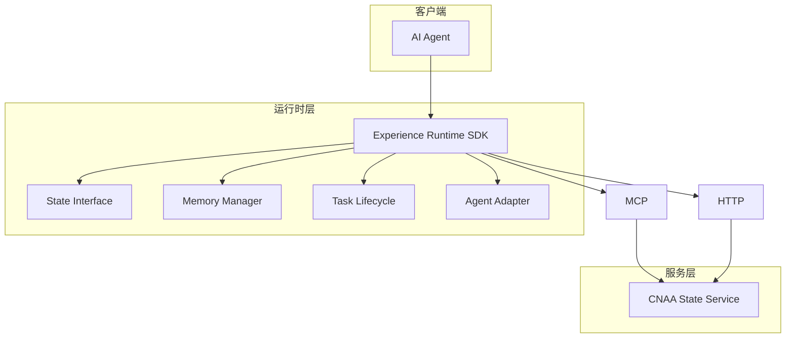
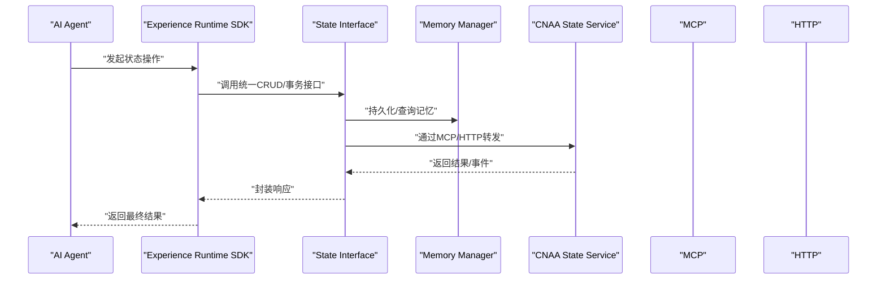
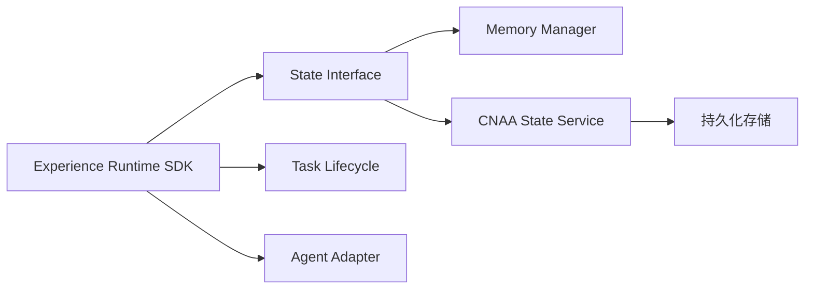

# API参考

<cite>
**本文引用的文件**   
- [README.md](file://README.md)
- [README_CN.md](file://README_CN.md)
- [docs/en/api-reference-v0.1.md](file://docs/en/api-reference-v0.1.md)
- [docs/zh/api-reference-v0.1.md](file://docs/zh/api-reference-v0.1.md)
- [docs/en/architecture.md](file://docs/en/architecture.md)
- [docs/zh/architecture.md](file://docs/zh/architecture.md)
</cite>

## 更新摘要
**已进行的更改**
- 更新了CNAA V0.1规范文档的完整内容
- 新增了MCP协议集成的详细规范
- 添加了HTTP API的RESTful端点定义
- 完善了State Interface的统一CRUD操作接口
- 增加了完整的参数定义、返回值结构和数据类型说明
- 提供了实际的API调用示例和最佳实践

## 目录
1. [简介](#简介)
2. [项目结构](#项目结构)
3. [核心组件](#核心组件)
4. [架构总览](#架构总览)
5. [详细组件分析](#详细组件分析)
6. [依赖关系分析](#依赖关系分析)
7. [性能考量](#性能考量)
8. [故障排查指南](#故障排查指南)
9. [结论](#结论)
10. [附录](#附录)

## 简介
本参考文档面向 CNAA（Cloud Native Agentic Architecture）的 API 设计与集成方式，重点覆盖以下目标：
- **CNAA V0.1规范**：定义了完整的经验记忆运行时框架接口规范
- **State Interface 的统一规范**：提供统一的 CRUD 操作接口与事务支持，确保跨 Agent 的状态一致性
- **MCP 协议集成**：详细说明消息格式、事件类型与实时交互模式，便于通过 MCP 进行状态同步与事件驱动调用
- **HTTP API 的 RESTful 端点规范**：包括请求响应模式、认证方法与错误处理，提供完整的参数定义、返回值结构与数据类型说明
- **版本管理与兼容性**：明确 API 版本策略、向后兼容性与迁移指南

当前仓库已包含完整的 v0.1 接口规范文档，涵盖数据模型、交互接口、MCP 工具定义和生命周期规则等核心内容。

**章节来源**
- [README.md:120-137](file://README.md#L120-L137)
- [README_CN.md:115-131](file://README_CN.md#L115-L131)

## 项目结构
仓库采用三层正交架构设计，包含接口契约层、运行时层和生命周期层。每个层次都有明确的职责边界和依赖关系。



**图表来源**
- [docs/en/architecture.md:89-144](file://docs/en/architecture.md#L89-L144)
- [docs/zh/architecture.md:89-138](file://docs/zh/architecture.md#L89-L138)

**章节来源**
- [docs/en/architecture.md:83-144](file://docs/en/architecture.md#L83-L144)
- [docs/zh/architecture.md:83-138](file://docs/zh/architecture.md#L83-L138)

## 核心组件
CNAA 的核心组件包括：

- **State Interface（状态接口）**：统一 CRUD 与事务语义，屏蔽底层存储差异，保证跨进程/跨 Agent 的状态一致性
- **Memory Manager（记忆管理）**：负责经验记忆的持久化、检索与生命周期管理
- **Task Lifecycle（任务生命周期）**：管理任务从创建到完成的全流程状态变更
- **Agent Adapter（Agent 适配）**：将不同 Agent 的能力与状态模型映射到统一接口
- **CNAA State Service（状态服务）**：对外暴露 MCP/HTTP 接口，承载状态读写与事件分发

这些组件遵循三层正交架构原则，每层回答不同维度的问题且可独立修改。

**章节来源**
- [docs/en/architecture.md:166-217](file://docs/en/architecture.md#L166-L217)
- [docs/zh/architecture.md:160-211](file://docs/zh/architecture.md#L160-L211)

## 架构总览
下图展示了客户端（AI Agent）通过 Experience Runtime SDK 访问 CNAA 状态服务的整体流程，并体现 MCP 与 HTTP 两种接入方式。



该序列图体现了"统一接口 + 多协议接入"的设计思想，便于在不同部署场景下灵活选择通信方式。

**图表来源**
- [docs/en/architecture.md:547-578](file://docs/en/architecture.md#L547-L578)
- [docs/zh/architecture.md:543-574](file://docs/zh/architecture.md#L543-L574)

## 详细组件分析

### CNAA V0.1 规范概览
CNAA V0.1 规范定义了完整的经验记忆运行时框架，包括：

- **数据模型**：Memory、TaskCheckpoint、State、Preference、Environment、InstantMemory
- **交互接口**：记忆操作接口和状态操作接口
- **MCP 工具**：13个标准工具定义
- **生命周期规则**：即时记忆生命周期和经验演化规则

**章节来源**
- [docs/zh/api-reference-v0.1.md:9-17](file://docs/zh/api-reference-v0.1.md#L9-L17)

### State Interface（状态接口）
State Interface 提供统一的 CRUD 与事务语义，屏蔽底层存储细节，确保跨 Agent 的一致性。

#### 核心能力：
- **读取**：按键/范围获取状态快照
- **写入**：原子更新、批量写入
- **事务**：多步操作的 ACID 语义（提交/回滚）
- **事件**：状态变更事件订阅与推送

#### 复杂度与约束：
- 读路径应支持缓存与分页，避免大对象阻塞
- 写路径需保证幂等与冲突检测
- 事务需具备超时与补偿机制

**章节来源**
- [docs/zh/api-reference-v0.1.md:188-480](file://docs/zh/api-reference-v0.1.md#L188-L480)

### MCP 协议集成
MCP（Model Context Protocol）作为状态服务与客户端之间的实时通道，适合事件驱动与流式交互。

#### 角色定位：
- 唯一通信协议：所有交互均为结构化 JSON 请求-响应对
- 无 streaming，无双向推送
- 支持 Streamable HTTP 传输

#### 消息格式：
- 请求：包含 id、method、params、timestamp
- 响应：包含 id、result/error、code、message
- 事件：包含 type、payload、source、version

#### 事件类型：
- state.created / state.updated / state.deleted
- task.started / task.completed / task.failed
- memory.compacted / memory.indexed

#### 实时交互模式：
- 订阅：客户端订阅特定资源的事件流
- 发布：服务端推送状态变更与任务进度
- 确认：客户端对关键事件进行 ACK 以保障可靠性

**章节来源**
- [docs/en/architecture.md:547-578](file://docs/en/architecture.md#L547-L578)
- [docs/zh/architecture.md:543-574](file://docs/zh/architecture.md#L543-L574)

### HTTP API（RESTful 端点）
CNAA 支持通过 HTTP 协议进行 RESTful 访问。

#### 设计原则：
- 资源导向：/states、/tasks、/memories
- 动词语义：GET/POST/PUT/DELETE
- 版本控制：URL 前缀或 Header（如 /v1/...）

#### 认证方法：
- Bearer Token（JWT）
- mTLS（服务间）
- API Key（开发/测试）

#### 错误处理：
- 标准 HTTP 状态码
- 错误体包含 code、message、details
- 重试策略与退避建议

**章节来源**
- [docs/en/architecture.md:607-643](file://docs/en/architecture.md#L607-L643)
- [docs/zh/architecture.md:603-639](file://docs/zh/architecture.md#L603-L639)

### 数据模型详解

#### Memory（记忆）
记忆是 CNAA 的核心经验单元。

```json
{
  "memory_id": "string",           // 记忆唯一标识
  "agent_id": "string",            // 所属 Agent 标识
  "type": "long_term | short_term", // 记忆类型：远期/近期
  "content": {},                    // 记忆内容（开放 JSON 结构）
  "tags": ["string"],               // 记忆标签（用于检索）
  "completion_score": 0.0,          // 任务完成度 [0.0, 1.0]
  "timestamp": "ISO-8601",          // 记忆时间戳
  "metadata": {}                    // 可选扩展元数据
}
```

#### TaskCheckpoint（任务点）
任务点代表一个已完成的任务节点，包含压缩后的完整记忆。

#### State（状态）
状态是 Agent 从经验中沉淀的知识，分为 preference、knowledge、environment 三类。

#### Preference（偏好）
偏好是 Agent 的重要记忆模式，影响决策行为。

#### Environment（环境）
环境是 Agent 运行的上下文信息。

#### InstantMemory（即时记忆）
即时记忆是本地短期记忆，包含指向云端远期记忆的引用。

**章节来源**
- [docs/zh/api-reference-v0.1.md:62-185](file://docs/zh/api-reference-v0.1.md#L62-L185)

### MCP 工具定义
CNAA Server 通过 MCP 协议暴露以下标准工具：

| 工具名 | 功能 | 输入 | 输出 |
|--------|------|------|------|
| `cnaa_store_memory` | 上传远期记忆 | Memory JSON | `{status, memory_id}` |
| `cnaa_get_memory` | 请求远期记忆 | `agent_id`, `memory_id` | Memory JSON |
| `cnaa_list_memories` | 列出记忆 | `agent_id`, `type?`, `tags?` | `{memories: []}` |
| `cnaa_tag_short_term` | 标记近期记忆标签 | `agent_id`, `tags` | `{status}` |
| `cnaa_delete_memory` | 删除记忆 | `agent_id`, `memory_id` | `{status}` |
| `cnaa_get_state` | 请求 State | `agent_id` | `{states: []}` |
| `cnaa_update_state` | 更新 State | `agent_id`, State JSON | `{status}` |
| `cnaa_delete_state` | 删除 State | `agent_id`, `state_id` | `{status}` |
| `cnaa_get_preference` | 请求 Preference | `agent_id` | `{preferences: []}` |
| `cnaa_update_preference` | 更新 Preference | `agent_id`, Preference JSON | `{status}` |
| `cnaa_delete_preference` | 删除 Preference | `agent_id`, `preference_id` | `{status}` |
| `cnaa_get_environment` | 请求 Environment | `agent_id` | Environment JSON |
| `cnaa_update_environment` | 更新 Environment | `agent_id`, Environment JSON | `{status}` |

**章节来源**
- [docs/zh/api-reference-v0.1.md:483-501](file://docs/zh/api-reference-v0.1.md#L483-L501)

### 版本管理与兼容性

#### 版本策略：
- URL 版本（/v1/...、/v2/...）
- Header 版本（X-API-Version）

#### 向后兼容：
- 新增字段默认值
- 废弃字段保留一段时间
- 错误码稳定演进

#### 迁移指南：
- 提供双写与灰度切换
- 客户端逐步升级
- 监控与回滚预案

**章节来源**
- [docs/zh/api-reference-v0.1.md:661-666](file://docs/zh/api-reference-v0.1.md#L661-L666)

## 依赖关系分析
CNAA 的依赖关系遵循严格的单向依赖原则：



**图表来源**
- [docs/en/architecture.md:146-158](file://docs/en/architecture.md#L146-L158)
- [docs/zh/architecture.md:140-152](file://docs/zh/architecture.md#L140-L152)

**章节来源**
- [docs/en/architecture.md:146-158](file://docs/en/architecture.md#L146-L158)
- [docs/zh/architecture.md:140-152](file://docs/zh/architecture.md#L140-L152)

## 性能考量
CNAA 在性能方面考虑了多个优化层面：

### 读路径优化：
- 多级缓存（本地/分布式）
- 分页与增量拉取
- 即时记忆的快速定位

### 写路径优化：
- 批量写入与合并
- 异步落盘与背压
- 任务点的压缩存储

### 事务与一致性：
- 短事务优先
- 冲突检测与重试
- 乐观锁机制

### 事件流：
- 高吞吐队列
- 消费者幂等与去重
- 死信队列处理

## 故障排查指南

### 常见问题：
- **连接失败**：检查 MCP/HTTP 端口、防火墙、证书
- **鉴权失败**：核对 Token/Key、过期时间、权限范围
- **状态不一致**：检查版本号、并发冲突、事务回滚
- **事件丢失**：确认 ACK、重试、死信队列

### 诊断手段：
- 启用调试日志与追踪 ID
- 监控关键指标（QPS、延迟、错误率）
- 使用健康检查与探针

### 设计原则保障：
- **哑服务原则**：CNAA Server 仅做 JSON 存取，不执行推理
- **接口优先原则**：所有能力先定义接口契约，再提供实现
- **可插拔原则**：存储层、检索层均通过插件接口接入
- **本地优先原则**：即时记忆留在 Agent context 中，完整数据存储在云端

**章节来源**
- [docs/zh/api-reference-v0.1.md:618-641](file://docs/zh/api-reference-v0.1.md#L618-L641)

## 结论
CNAA V0.1 规范已提供完整的 API 参考文档，包括：

- **完整的数据模型定义**：Memory、TaskCheckpoint、State、Preference、Environment、InstantMemory
- **详细的交互接口规范**：记忆操作接口和状态操作接口的完整定义
- **标准化的 MCP 工具**：13个标准工具的定义和使用示例
- **清晰的生命周期规则**：即时记忆生命周期和经验演化规则
- **架构设计原则**：哑服务、接口优先、可插拔、本地优先等核心原则

当前仓库处于 v0.1-draft 阶段，核心接口规范已完成，参考实现正在开发中。建议在实现过程中逐步完善接口定义、错误码与示例，确保与版本策略和迁移指南对齐。

## 附录

### 快速开始
- 参考 README 中的链接列表获取详细文档
- 重点关注 API Reference v0.1 文档
- 了解 MCP 工具的使用方法

### 后续实现建议：
- 先定义 State Interface 的方法契约与错误码
- 实现 MCP 最小可用集（订阅/发布/ACK）
- 搭建 HTTP 基础路由与鉴权中间件
- 引入存储与缓存，验证一致性与性能

### 术语表
- **经验记忆（Experience Memory）**：Agent 在任务执行过程中产生的可复用知识
- **任务点（Task Checkpoint）**：任务执行流中的一个可评测节点，包含完整任务快照
- **即时记忆（Instant Memory）**：任务点的轻量摘要，保留在 Agent 本地 context 中
- **伪连续记忆（Pseudo-Continuous Memory）**：通过"即时记忆索引 + 云端完整数据"模拟的记忆连续性
- **哑服务（Dumb Service）**：仅做 JSON 存取、不执行推理的服务模式

**章节来源**
- [docs/zh/api-reference-v0.1.md:642-666](file://docs/zh/api-reference-v0.1.md#L642-L666)
- [README.md:120-137](file://README.md#L120-L137)
- [README_CN.md:115-131](file://README_CN.md#L115-L131)