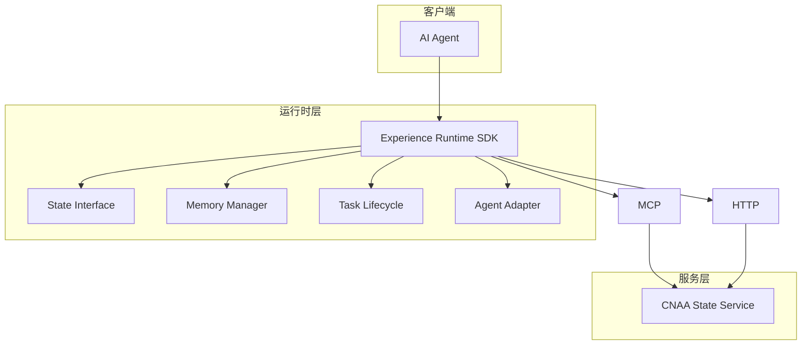
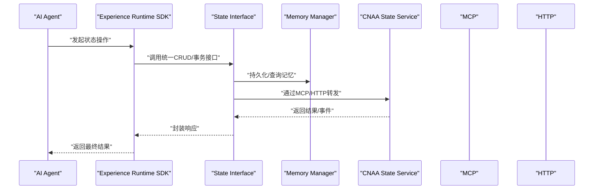
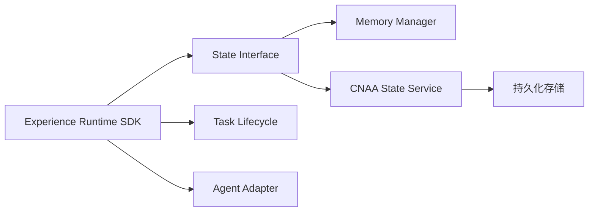

# API参考

<cite>
**本文引用的文件**   
- [README.md](file://README.md)
- [README_CN.md](file://README_CN.md)
</cite>

## 目录
1. [简介](#简介)
2. [项目结构](#项目结构)
3. [核心组件](#核心组件)
4. [架构总览](#架构总览)
5. [详细组件分析](#详细组件分析)
6. [依赖关系分析](#依赖关系分析)
7. [性能考量](#性能考量)
8. [故障排查指南](#故障排查指南)
9. [结论](#结论)
10. [附录](#附录)

## 简介
本参考文档面向 CNAA（Cloud Native Agentic Architecture）的 API 设计与集成方式，重点覆盖以下目标：
- State Interface 的统一规范：定义统一的 CRUD 操作接口与事务支持，确保跨 Agent 的状态一致性。
- MCP 协议集成：说明消息格式、事件类型与实时交互模式，便于通过 MCP 进行状态同步与事件驱动调用。
- HTTP API 的 RESTful 端点规范：包括请求/响应模式、认证方法与错误处理，提供完整的参数定义、返回值结构与数据类型说明。
- 版本管理与兼容性：明确 API 版本策略、向后兼容性与迁移指南。

当前仓库为概念与规划阶段，包含总体介绍与文档索引，尚未包含具体实现代码或接口定义文件。因此，本文档基于仓库中的架构描述与文档索引进行归纳与扩展，给出建议性的接口与集成方案，供后续实现时参考。

**章节来源**
- [README.md:1-102](file://README.md#L1-L102)
- [README_CN.md:1-110](file://README_CN.md#L1-L110)

## 项目结构
仓库目前仅包含 README 与文档目录（docs/en、docs/zh），实际代码与接口定义尚未落地。根据 README 中的架构图，系统由“AI Agent → Experience Runtime SDK → CNAA State Service”构成，并通过 MCP / HTTP 暴露能力。

**图表来源**
- [README.md:55-72](file://README.md#L55-L72)
- [README_CN.md:63-80](file://README_CN.md#L63-L80)

**章节来源**
- [README.md:55-72](file://README.md#L55-L72)
- [README_CN.md:63-80](file://README_CN.md#L63-L80)

## 核心组件
- State Interface（状态接口）：统一 CRUD 与事务语义，屏蔽底层存储差异，保证跨进程/跨 Agent 的状态一致性。
- Memory Manager（记忆管理）：负责经验记忆的持久化、检索与生命周期管理。
- Task Lifecycle（任务生命周期）：管理任务从创建到完成的全流程状态变更。
- Agent Adapter（Agent 适配）：将不同 Agent 的能力与状态模型映射到统一接口。
- CNAA State Service（状态服务）：对外暴露 MCP/HTTP 接口，承载状态读写与事件分发。

这些组件在 README 中作为架构要点列出，表明它们是 CNAA 的核心抽象与职责边界。

**章节来源**
- [README.md:55-72](file://README.md#L55-L72)
- [README_CN.md:63-80](file://README_CN.md#L63-L80)

## 架构总览
下图展示了客户端（AI Agent）通过 Experience Runtime SDK 访问 CNAA 状态服务的整体流程，并体现 MCP 与 HTTP 两种接入方式。

该序列图体现了“统一接口 + 多协议接入”的设计思想，便于在不同部署场景下灵活选择通信方式。

**图表来源**
- [README.md:55-72](file://README.md#L55-L72)
- [README_CN.md:63-80](file://README_CN.md#L63-L80)

## 详细组件分析

### State Interface（状态接口）
- 设计目标：提供统一的 CRUD 与事务语义，屏蔽底层存储细节，确保跨 Agent 的一致性。
- 典型能力：
  - 读取：按键/范围获取状态快照
  - 写入：原子更新、批量写入
  - 事务：多步操作的 ACID 语义（提交/回滚）
  - 事件：状态变更事件订阅与推送
- 复杂度与约束：
  - 读路径应支持缓存与分页，避免大对象阻塞
  - 写路径需保证幂等与冲突检测
  - 事务需具备超时与补偿机制

由于仓库未包含具体实现，本节为建议性规范，待实现时可据此细化方法签名与错误码。

**章节来源**
- [README.md:45-52](file://README.md#L45-L52)
- [README_CN.md:53-60](file://README_CN.md#L53-L60)

### MCP 协议集成
- 角色定位：作为状态服务与客户端之间的实时通道，适合事件驱动与流式交互。
- 消息格式（建议）：
  - 请求：包含 id、method、params、timestamp
  - 响应：包含 id、result/error、code、message
  - 事件：包含 type、payload、source、version
- 事件类型（建议）：
  - state.created / state.updated / state.deleted
  - task.started / task.completed / task.failed
  - memory.compacted / memory.indexed
- 实时交互模式：
  - 订阅：客户端订阅特定资源的事件流
  - 发布：服务端推送状态变更与任务进度
  - 确认：客户端对关键事件进行 ACK 以保障可靠性

**章节来源**
- [README.md:76-85](file://README.md#L76-L85)
- [README_CN.md:84-93](file://README_CN.md#L84-L93)

### HTTP API（RESTful 端点）
- 设计原则：
  - 资源导向：/states、/tasks、/memories
  - 动词语义：GET/POST/PUT/DELETE
  - 版本控制：URL 前缀或 Header（如 /v1/...）
- 认证方法（建议）：
  - Bearer Token（JWT）
  - mTLS（服务间）
  - API Key（开发/测试）
- 错误处理（建议）：
  - 标准 HTTP 状态码
  - 错误体包含 code、message、details
  - 重试策略与退避建议

**章节来源**
- [README.md:55-72](file://README.md#L55-L72)
- [README_CN.md:63-80](file://README_CN.md#L63-L80)

### 数据模型（建议）
- State（状态）：
  - id（唯一标识）
  - version（乐观锁版本号）
  - data（状态负载）
  - metadata（标签、时间戳、来源）
- Task（任务）：
  - id、agent_id、status、created_at、updated_at、payload
- Memory（记忆）：
  - id、type、content、index_key、created_at

上述模型用于支撑 CRUD 与事件推送，具体字段与约束可在实现时细化。

**章节来源**
- [README.md:45-52](file://README.md#L45-L52)
- [README_CN.md:53-60](file://README_CN.md#L53-L60)

### 版本管理与兼容性
- 版本策略：
  - URL 版本（/v1/...、/v2/...）
  - Header 版本（X-API-Version）
- 向后兼容：
  - 新增字段默认值
  - 废弃字段保留一段时间
  - 错误码稳定演进
- 迁移指南：
  - 提供双写与灰度切换
  - 客户端逐步升级
  - 监控与回滚预案

**章节来源**
- [README.md:76-85](file://README.md#L76-L85)
- [README_CN.md:84-93](file://README_CN.md#L84-L93)

## 依赖关系分析
- 组件耦合：
  - State Interface 依赖 Memory Manager 与 CNAA State Service
  - Experience Runtime SDK 聚合 State Interface、Task Lifecycle、Agent Adapter
- 外部依赖：
  - MCP 服务器/客户端库
  - HTTP 框架与鉴权中间件
  - 持久化存储（KV/时序数据库）

**图表来源**
- [README.md:55-72](file://README.md#L55-L72)
- [README_CN.md:63-80](file://README_CN.md#L63-L80)

**章节来源**
- [README.md:55-72](file://README.md#L55-L72)
- [README_CN.md:63-80](file://README_CN.md#L63-L80)

## 性能考量
- 读路径优化：
  - 多级缓存（本地/分布式）
  - 分页与增量拉取
- 写路径优化：
  - 批量写入与合并
  - 异步落盘与背压
- 事务与一致性：
  - 短事务优先
  - 冲突检测与重试
- 事件流：
  - 高吞吐队列
  - 消费者幂等与去重

[本节为通用指导，不直接分析具体文件]

## 故障排查指南
- 常见问题：
  - 连接失败：检查 MCP/HTTP 端口、防火墙、证书
  - 鉴权失败：核对 Token/Key、过期时间、权限范围
  - 状态不一致：检查版本号、并发冲突、事务回滚
  - 事件丢失：确认 ACK、重试、死信队列
- 诊断手段：
  - 启用调试日志与追踪 ID
  - 监控关键指标（QPS、延迟、错误率）
  - 使用健康检查与探针

[本节为通用指导，不直接分析具体文件]

## 结论
当前仓库处于概念与规划阶段，提供了清晰的架构方向与文档索引。本文档在此基础上给出了 State Interface、MCP 集成、HTTP API 的建议性规范与最佳实践，帮助团队在后续实现中保持一致性与可维护性。建议在实现过程中逐步完善接口定义、错误码与示例，确保与版本策略和迁移指南对齐。

[本节为总结性内容，不直接分析具体文件]

## 附录
- 快速开始与详细文档索引请参考 README 中的链接列表（英文/中文）。
- 后续实现建议：
  - 先定义 State Interface 的方法契约与错误码
  - 实现 MCP 最小可用集（订阅/发布/ACK）
  - 搭建 HTTP 基础路由与鉴权中间件
  - 引入存储与缓存，验证一致性与性能

**章节来源**
- [README.md:76-85](file://README.md#L76-L85)
- [README_CN.md:84-93](file://README_CN.md#L84-L93)