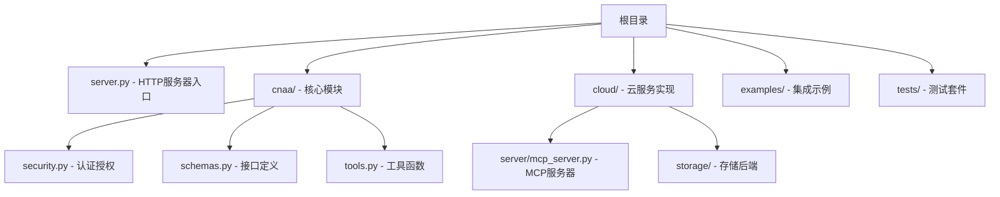
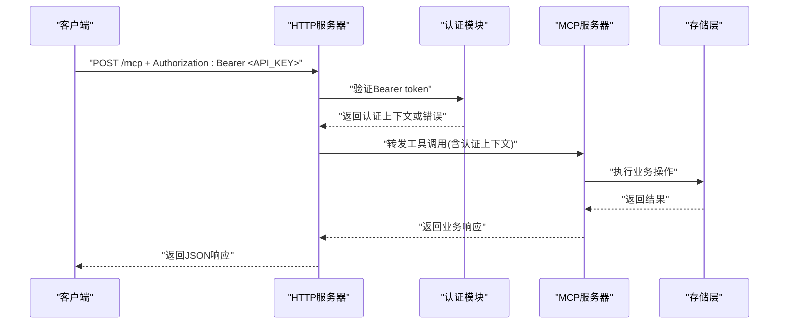

# HTTP API

<cite>
**本文档引用的文件**   
- [server.py](file://server.py)
- [cnaa/security.py](file://cnaa/security.py)
- [cloud/server/mcp_server.py](file://cloud/server/mcp_server.py)
- [cnaa/schemas.py](file://cnaa/schemas.py)
- [examples/openclaw_integration.py](file://examples/openclaw_integration.py)
- [tests/test_security.py](file://tests/test_security.py)
</cite>

## 更新摘要
**所做更改**   
- 增强了Bearer token认证机制，支持Authorization头中的Bearer令牌
- 实现了可配置的认证模式，支持启用/禁用认证和允许匿名访问
- 改进了错误响应处理，提供明确的HTTP状态码和错误消息
- 添加了完整的API密钥验证和权限检查机制
- 提供了详细的curl示例和客户端SDK使用指南

## 目录
1. [简介](#简介)
2. [项目结构](#项目结构)
3. [核心组件](#核心组件)
4. [架构总览](#架构总览)
5. [详细组件分析](#详细组件分析)
6. [认证与授权](#认证与授权)
7. [API端点参考](#api端点参考)
8. [错误处理](#错误处理)
9. [客户端SDK使用](#客户端sdk使用)
10. [配置管理](#配置管理)
11. [性能考虑](#性能考虑)
12. [故障排查指南](#故障排查指南)
13. [结论](#结论)
14. [附录](#附录) 

## 简介
CNAA（Cloud Native Agentic Architecture）是一个面向AI Agent的持久化记忆运行时框架。本仓库提供了完整的HTTP RESTful API实现，支持Bearer token认证、可配置认证模式和完善的错误处理机制。系统通过MCP协议暴露统一的状态接口，并可通过HTTP与CNAA State Service交互。

## 项目结构


**章节来源**
- [server.py:1-40](file://server.py#L1-L40)
- [cnaa/security.py:1-18](file://cnaa/security.py#L1-L18)

## 核心组件
CNAA的核心由以下部分构成：
- **HTTP服务器**: 基于Python标准库的HTTP服务器，提供RESTful API
- **认证模块**: 支持API Key和Bearer token认证，可配置权限级别
- **MCP服务器**: 处理工具调用路由和业务逻辑
- **存储层**: 内存存储后端，支持记忆、状态、偏好和环境数据
- **Schema定义**: 统一的接口格式定义和验证

**章节来源**
- [server.py:67-91](file://server.py#L67-L91)
- [cloud/server/mcp_server.py:54-82](file://cloud/server/mcp_server.py#L54-L82)

## 架构总览
下图展示了从客户端到存储层的完整请求流程，包括认证和授权机制。



**图表来源**
- [server.py:118-177](file://server.py#L118-L177)
- [cloud/server/mcp_server.py:105-168](file://cloud/server/mcp_server.py#L105-L168)

## 详细组件分析

### HTTP服务器实现
HTTP服务器基于Python标准库的`http.server`模块实现，提供三个主要端点：
- `GET /schemas`: 获取所有接口schema定义
- `POST /mcp`: 处理MCP工具调用
- `GET /health`: 健康检查端点

服务器支持JSON请求体解析、Content-Length处理和适当的错误响应。

**章节来源**
- [server.py:93-107](file://server.py#L93-L107)
- [server.py:181-206](file://server.py#L181-L206)

### 认证授权机制
认证模块支持三种权限级别：
- `READ_ONLY`: 仅允许读取操作
- `READ_WRITE`: 允许读写操作  
- `ADMIN`: 完全管理员权限

认证配置通过环境变量控制，支持启用/禁用认证和允许匿名访问。

**章节来源**
- [cnaa/security.py:31-36](file://cnaa/security.py#L31-L36)
- [cnaa/security.py:39-56](file://cnaa/security.py#L39-L56)

## 认证与授权

### Bearer Token认证
系统支持标准的Bearer token认证机制，通过`Authorization`头部传递API密钥：

```bash
Authorization: Bearer YOUR_API_KEY
```

### 认证流程
1. **请求接收**: HTTP服务器接收请求并检查Authorization头
2. **Token提取**: 从Authorization头中提取Bearer token
3. **密钥验证**: 使用`validate_api_key()`函数验证API密钥
4. **权限检查**: 根据密钥权限检查操作权限
5. **上下文注入**: 将认证上下文注入到请求参数中

### 配置选项
通过环境变量配置认证行为：
- `CNAA_AUTH_ENABLED`: 启用/禁用认证（默认：false）
- `CNAA_ALLOW_UNAUTHENTICATED`: 允许匿名访问（默认：true）
- `CNAA_API_KEYS`: JSON格式的API密钥映射

**章节来源**
- [server.py:146-165](file://server.py#L146-L165)
- [cnaa/security.py:169-207](file://cnaa/security.py#L169-L207)

## API端点参考

### GET /schemas
获取所有接口schema定义。

**请求头**
- `Authorization: Bearer <API_KEY>` (可选)

**响应体**
```json
{
  "memory": {...},
  "state": {...},
  "preference": {...},
  "environment": {...},
  "instant_memory": {...}
}
```

**curl示例**
```bash
curl -H "Authorization: Bearer sk-cnaa-001" \
     http://localhost:8080/schemas
```

### POST /mcp
处理MCP工具调用。

**请求头**
- `Content-Type: application/json`
- `Authorization: Bearer <API_KEY>` (可选)

**请求体**
```json
{
  "tool": "cnaa_store_memory",
  "arguments": {
    "agent_id": "agent-001",
    "memory_id": "mem-001",
    "type": "long_term",
    "content": {"task": "example"},
    "tags": ["example"],
    "completion_score": 0.9
  }
}
```

**可用工具**
- 记忆操作: `cnaa_store_memory`, `cnaa_get_memory`, `cnaa_list_memories`, `cnaa_delete_memory`, `cnaa_tag_short_term`
- 状态操作: `cnaa_get_state`, `cnaa_update_state`, `cnaa_delete_state`
- 偏好操作: `cnaa_get_preference`, `cnaa_update_preference`, `cnaa_delete_preference`
- 环境操作: `cnaa_get_environment`, `cnaa_update_environment`

**curl示例**
```bash
curl -X POST -H "Authorization: Bearer sk-cnaa-001" \
     -H "Content-Type: application/json" \
     -d '{"tool":"cnaa_store_memory","arguments":{"agent_id":"agent-001","memory_id":"mem-001","type":"long_term","content":{"task":"test"}}}' \
     http://localhost:8080/mcp
```

### GET /health
健康检查端点。

**响应体**
```json
{
  "status": "healthy"
}
```

**curl示例**
```bash
curl http://localhost:8080/health
```

**章节来源**
- [server.py:109-116](file://server.py#L109-L116)
- [cnaa/schemas.py:388-425](file://cnaa/schemas.py#L388-L425)

## 错误处理

### HTTP状态码
- `200 OK`: 请求成功
- `400 Bad Request`: 请求参数错误
- `401 Unauthorized`: 认证失败或缺少API密钥
- `404 Not Found`: 资源不存在
- `500 Internal Server Error`: 服务器内部错误

### 错误响应格式
```json
{
  "status": "error",
  "message": "具体错误描述"
}
```

### 常见错误场景
- **缺少API密钥**: 当认证启用且不允许匿名访问时
- **无效API密钥**: API密钥未在配置中注册
- **权限不足**: 用户权限不足以执行操作
- **Agent ID不匹配**: 请求中的agent_id与认证上下文不一致

**章节来源**
- [server.py:157-165](file://server.py#L157-L165)
- [server.py:175-179](file://server.py#L175-L179)

## 客户端SDK使用

### Python SDK示例
```python
import requests

class CNAAIntegration:
    def __init__(self, server_url="http://localhost:8080", api_key=None):
        self.server_url = server_url
        self.api_key = api_key
    
    def _call_tool(self, tool_name, arguments):
        headers = {"Content-Type": "application/json"}
        if self.api_key:
            headers["Authorization"] = f"Bearer {self.api_key}"
        
        response = requests.post(
            f"{self.server_url}/mcp",
            json={"tool": tool_name, "arguments": arguments},
            headers=headers,
            timeout=30
        )
        return response.json()
    
    def store_memory(self, agent_id, memory_id, memory_type, content, tags=None):
        return self._call_tool("cnaa_store_memory", {
            "agent_id": agent_id,
            "memory_id": memory_id,
            "type": memory_type,
            "content": content,
            "tags": tags or []
        })
```

### curl命令示例
```bash
# 存储记忆
curl -X POST -H "Authorization: Bearer sk-cnaa-001" \
     -H "Content-Type: application/json" \
     -d '{
       "tool": "cnaa_store_memory",
       "arguments": {
         "agent_id": "agent-001",
         "memory_id": "mem-001", 
         "type": "long_term",
         "content": {"task": "database migration", "result": "success"}
       }
     }' http://localhost:8080/mcp

# 获取记忆
curl -H "Authorization: Bearer sk-cnaa-001" \
     -H "Content-Type: application/json" \
     -d '{
       "tool": "cnaa_get_memory",
       "arguments": {
         "agent_id": "agent-001",
         "memory_id": "mem-001"
       }
     }' http://localhost:8080/mcp
```

**章节来源**
- [examples/openclaw_integration.py:34-66](file://examples/openclaw_integration.py#L34-L66)

## 配置管理

### 环境变量配置
```bash
# 启用认证
export CNAA_AUTH_ENABLED=true

# 允许匿名访问（开发环境）
export CNAA_ALLOW_UNAUTHENTICATED=true

# 配置API密钥
export CNAA_API_KEYS='{"sk-cnaa-001": {"agent_id": "agent-001", "permission": "read_write"}}'
```

### API密钥格式
每个API密钥包含以下信息：
- `agent_id`: 关联的Agent标识符
- `permission`: 权限级别（read_only, read_write, admin）

### 启动服务器
```bash
# 基本启动
python3 server.py --host 0.0.0.0 --port 8080

# 带认证配置启动
CNAA_AUTH_ENABLED=true CNAA_API_KEYS='{"sk-test": {"agent_id": "agent-1", "permission": "admin"}}' \
python3 server.py --host localhost --port 8080
```

**章节来源**
- [cnaa/security.py:169-207](file://cnaa/security.py#L169-L207)
- [server.py:239-266](file://server.py#L239-L266)

## 性能考虑
- **连接池**: 生产环境建议使用WSGI/ASGI服务器（如gunicorn/uvicorn）
- **异步处理**: 长耗时任务使用消息队列和异步回调
- **缓存策略**: 对只读接口启用ETag/Last-Modified，支持CDN缓存
- **速率限制**: 按用户/租户维度限流，支持滑动窗口和令牌桶算法
- **压缩传输**: 启用Gzip/Brotli压缩减少网络传输

## 故障排查指南

### 日志查看
```bash
# 查看服务器日志
tail -f /var/log/cnaa-server.log

# 查看认证相关日志
grep -i "auth\|unauthorized\|invalid.*key" /var/log/cnaa-server.log
```

### 常见问题诊断
1. **认证失败**: 检查Authorization头格式和API密钥有效性
2. **权限错误**: 确认API密钥权限级别是否足够
3. **连接超时**: 检查网络连接和服务器状态
4. **数据不一致**: 验证agent_id与认证上下文是否匹配

### 健康检查
```bash
# 检查服务状态
curl http://localhost:8080/health

# 检查API schema
curl -H "Authorization: Bearer YOUR_KEY" http://localhost:8080/schemas
```

## 结论
CNAA HTTP API提供了完整的Bearer token认证、可配置认证模式和完善的错误处理机制。系统支持多种权限级别，确保数据安全的同时保持灵活性。通过标准化的RESTful接口和丰富的客户端SDK支持，开发者可以快速集成持久化记忆功能到各种AI Agent框架中。

## 附录

### 术语表
- **Bearer Token**: 基于令牌的认证机制，通过Authorization头传递
- **API Key**: 用于身份验证的唯一密钥字符串
- **Auth Context**: 认证上下文，包含agent_id和权限信息
- **MCP**: Model Context Protocol，模型上下文协议
- **Schema**: 接口格式定义，用于请求和响应验证

### 安全最佳实践
- 使用HTTPS加密传输
- 定期轮换API密钥
- 实施最小权限原则
- 启用详细的审计日志
- 配置适当的CORS策略
- 实施请求速率限制

**章节来源**
- [cnaa/security.py:1-18](file://cnaa/security.py#L1-L18)
- [server.py:27-39](file://server.py#L27-L39)