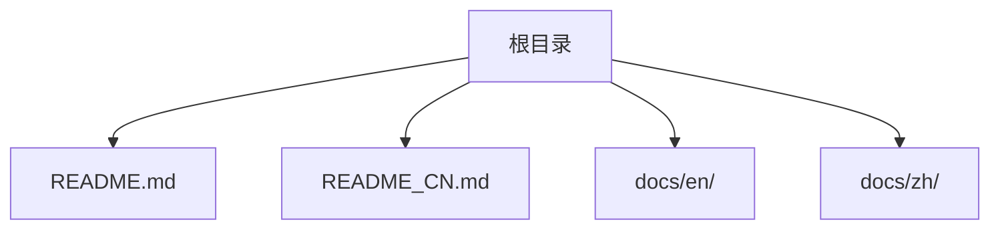
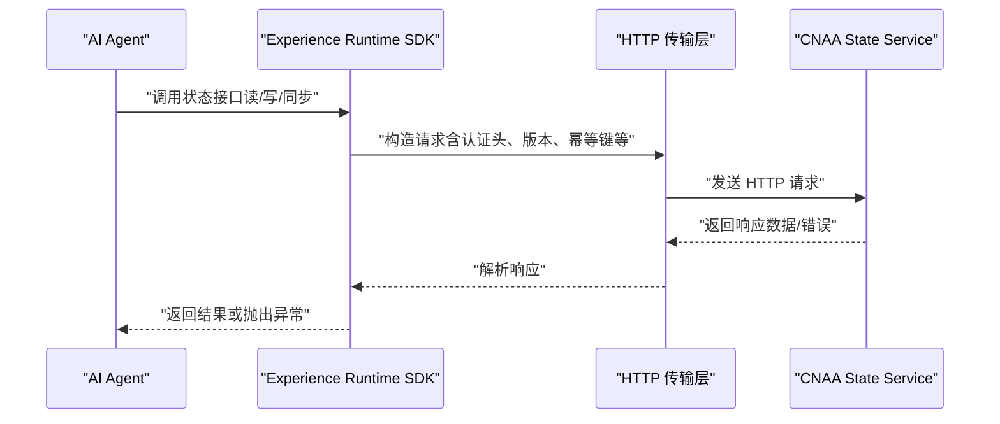

# HTTP API

<cite>
**本文档引用的文件**   
- [README.md](file://README.md)
- [README_CN.md](file://README_CN.md)
</cite>

## 目录
1. [简介](#简介)
2. [项目结构](#项目结构)
3. [核心组件](#核心组件)
4. [架构总览](#架构总览)
5. [详细组件分析](#详细组件分析)
6. [依赖分析](#依赖分析)
7. [性能考虑](#性能考虑)
8. [故障排查指南](#故障排查指南)
9. [结论](#结论)
10. [附录](#附录) 

## 简介
本仓库为 CNAA（Cloud Native Agentic Architecture）的说明性文档与规划内容，定位为“面向 AI Agent 的持久化记忆运行时框架”。当前仓库未包含可直接运行的服务端代码或已实现的 RESTful API 实现。根据仓库中的架构描述，系统通过 Experience Runtime SDK 暴露统一状态接口，并可通过 MCP/HTTP 与 CNAA State Service 交互。因此，本节提供基于仓库信息的概念性 HTTP API 设计建议与规范，便于后续实现时遵循一致的协议、认证与安全策略。

## 项目结构
仓库目前仅包含 README 与 docs 目录（英文与中文文档目录为空）。这意味着：
- 无现成可执行服务或路由定义；
- 所有 API 相关内容需依据架构与文档目标进行设计与补充。

[无需图示来源，因为该图为概念性结构示意]

## 核心组件
根据仓库信息，CNAA 的核心由以下部分构成：
- AI Agent：调用方，使用 Experience Runtime SDK 进行经验沉淀与状态同步。
- Experience Runtime SDK：封装状态接口、记忆管理、任务生命周期与 Agent 适配。
- CNAA State Service：后端服务，负责持久化经验记忆与状态同步。
- 传输通道：MCP / HTTP，用于 SDK 与服务端通信。

这些组件共同定义了未来 HTTP API 的职责边界与交互方式。

**章节来源**
- [README.md:55-86](file://README.md#L55-L86)
- [README_CN.md:63-94](file://README_CN.md#L63-L94)

## 架构总览
下图展示了从 Agent 到状态服务的整体交互流程，以及 HTTP 在其中的角色。

[无需图示来源，因为该图为概念性交互流程示意]

## 详细组件分析
由于仓库未包含具体实现代码，本节以概念性方式给出建议的 API 设计要点，供后续开发参考。

### 通用约定
- 基础路径：建议以 /api/v1 作为版本前缀，便于后续演进。
- 内容类型：JSON 为主，必要时支持 multipart/form-data。
- 字符编码：UTF-8。
- 时间格式：ISO 8601。
- 分页：使用 page、page_size 查询参数，返回 total、items。
- 排序：使用 sort、order_by 查询参数。
- 过滤：使用字段名=值 的查询参数，支持多值与布尔逻辑。

### 认证与授权
- 支持 API Key：通过请求头 Authorization: Bearer <API_KEY> 传递。
- 支持 OAuth 2.0：适用于第三方应用集成，使用 access_token 作为 Bearer Token。
- 权限模型：基于资源与角色的访问控制（RBAC），最小权限原则。
- 安全建议：强制 HTTPS、HSTS、CORS 白名单、IP 白名单（可选）、审计日志。

### 错误处理
- 标准错误体：包含 code、message、details、request_id。
- 常见状态码：
  - 2xx：成功
  - 400：请求参数错误
  - 401：未认证
  - 403：无权限
  - 404：资源不存在
  - 409：冲突（如幂等键重复）
  - 429：速率限制
  - 5xx：服务端错误
- 错误码：采用模块前缀 + 数字编码，便于定位与国际化。

### 速率限制与缓存
- 速率限制：按用户/租户维度限流，支持滑动窗口与令牌桶。
- 缓存策略：对只读接口启用 ETag/Last-Modified，支持 CDN 缓存。
- 幂等性：写操作支持 Idempotency-Key 请求头，避免重复提交。

### API 版本管理与兼容性
- 版本策略：URL 前缀 /v1、/v2，弃用周期公告与迁移期双版本并存。
- 向后兼容：新增字段非破坏性，删除字段需废弃周期。
- 迁移指南：提供变更日志、示例脚本与回滚方案。

### curl 示例（概念性）
- 获取资源列表：
  - curl -H "Authorization: Bearer YOUR_API_KEY" https://api.example.com/api/v1/experiences?page=1&page_size=20
- 创建资源：
  - curl -X POST -H "Authorization: Bearer YOUR_API_KEY" -H "Content-Type: application/json" -d '{"name":"example"}' https://api.example.com/api/v1/experiences
- 更新资源：
  - curl -X PUT -H "Authorization: Bearer YOUR_API_KEY" -H "Content-Type: application/json" -d '{"status":"active"}' https://api.example.com/api/v1/experiences/{id}
- 删除资源：
  - curl -X DELETE -H "Authorization: Bearer YOUR_API_KEY" https://api.example.com/api/v1/experiences/{id}

### 客户端 SDK 使用示例（概念性）
- 初始化：设置 base_url、api_key、timeout、retry_policy。
- 调用：使用 typed client 方法，如 get_experiences、create_experience。
- 错误处理：捕获特定异常类型，记录 request_id。
- 重试与退避：指数退避与抖动策略。

[本节为概念性设计建议，不直接分析具体文件，故无“章节来源”]

## 依赖分析
当前仓库不包含代码依赖或配置文件，因此无法生成实际的依赖图。建议在实现阶段引入：
- Web 框架：如 FastAPI、Express、Spring Boot 等。
- 认证库：JWT/OAuth2 中间件。
- 数据库：PostgreSQL/MongoDB 等。
- 缓存：Redis。
- 监控：Prometheus/Grafana。

[无需图示来源，因为该节为概念性建议]

## 性能考虑
- 连接池与超时：合理配置连接池大小与超时时间。
- 异步处理：长耗时任务使用消息队列与异步回调。
- 数据库优化：索引、分库分表、读写分离。
- 缓存命中：热点数据缓存，避免穿透与雪崩。
- 压缩与分页：Gzip/Brotli 压缩，分页与游标分页。

[无需图示来源，因为该节为通用性能建议]

## 故障排查指南
- 日志采集：集中式日志（ELK/Loki），结构化日志。
- 链路追踪：OpenTelemetry/Jaeger，关联 request_id。
- 健康检查：/health、/ready 端点，探针探测。
- 告警规则：错误率、延迟、资源使用阈值。
- 回滚策略：灰度发布、蓝绿部署、快速回滚。

[无需图示来源，因为该节为通用运维建议]

## 结论
当前仓库为 CNAA 的概念性说明与规划，尚未包含可执行的 HTTP API 实现。基于仓库提供的架构信息，建议在设计阶段遵循统一的 API 规范、认证授权机制、错误处理与性能优化策略，确保后续实现的一致性与可维护性。

[无需图示来源，因为该节为总结性内容]

## 附录
- 术语表：
  - Experience Runtime：经验运行时，负责经验沉淀与状态同步。
  - Persistent Memory：持久化记忆，独立于 Agent 推理过程的存储。
  - State Interface：统一状态接口，屏蔽底层实现差异。
- 参考链接：
  - 快速开始、持久化记忆、状态接口、运行时 SDK、状态服务、MCP 接入、Agent 接入、整体架构等文档可在 docs 目录下查阅（当前为空）。

[无需图示来源，因为该节为补充信息]