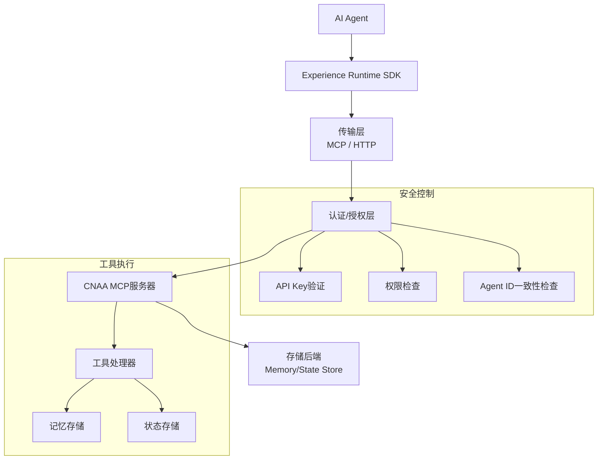
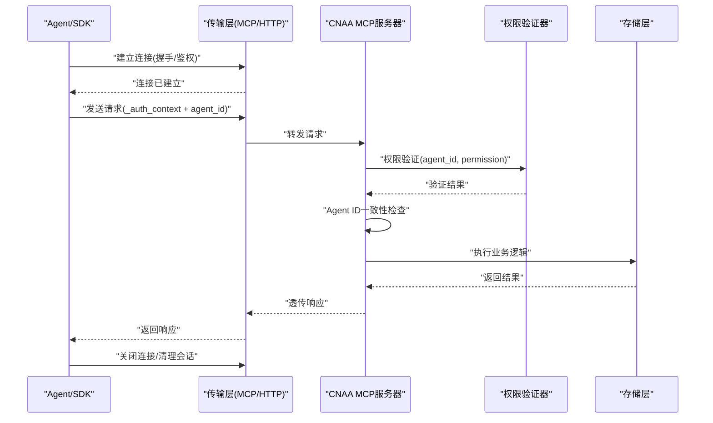
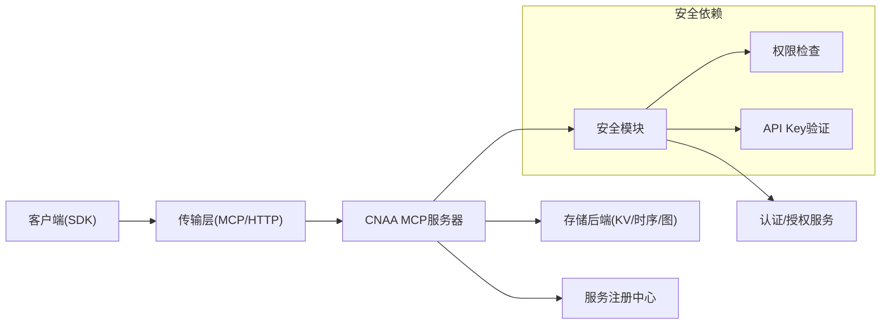

# MCP协议

<cite>
**本文档中引用的文件**
- [mcp_server.py](file://cloud/server/mcp_server.py)
- [security.py](file://cnaa/security.py)
- [tools.py](file://cnaa/tools.py)
- [memory_store.py](file://cloud/storage/memory_store.py)
- [state_store.py](file://cloud/storage/state_store.py)
- [test_security.py](file://tests/test_security.py)
</cite>

## 更新摘要
**所做更改**
- 新增权限验证机制章节，详细说明工具执行前的权限检查流程
- 更新认证上下文传播机制，说明_auth_context字段的传递方式
- 新增Agent ID一致性检查的详细说明
- 更新错误处理机制，包含权限拒绝和ID不匹配的特定错误码
- 完善安全架构图，展示完整的认证授权流程

## 目录
1. [简介](#简介)
2. [项目结构](#项目结构)
3. [核心组件](#核心组件)
4. [架构总览](#架构总览)
5. [详细组件分析](#详细组件分析)
6. [安全与权限控制](#安全与权限控制)
7. [依赖关系分析](#依赖关系分析)
8. [性能考虑](#性能考虑)
9. [故障排查指南](#故障排查指南)
10. [结论](#结论)
11. [附录](#附录)

## 简介
本文件为 CNAA 项目中 Model Context Protocol（MCP）的协议与集成规范说明。当前仓库已实现完整的MCP服务器，包含权限验证、认证上下文传播和Agent ID一致性检查等安全特性。本文档详细说明MCP协议的通信规范，包括连接建立、消息格式、事件类型、实时交互模式，以及完整的安全控制机制。

## 项目结构
仓库实现了完整的CNAA MCP服务器，包含以下核心组件：
- **MCP服务器**：处理工具调用和路由
- **安全模块**：提供认证和授权功能
- **存储层**：内存存储实现
- **工具定义**：所有MCP工具的接口定义



**图示来源**
- [mcp_server.py:54-82](file://cloud/server/mcp_server.py#L54-L82)
- [security.py:31-71](file://cnaa/security.py#L31-L71)
- [tools.py:227-246](file://cnaa/tools.py#L227-L246)

## 核心组件
- **客户端侧（Agent 或 SDK）**
  - 负责发起连接、构造请求、处理响应与事件、维护会话上下文
  - 支持携带认证信息和权限上下文
- **传输层（MCP/HTTP）**
  - 承载 MCP 消息的序列化与传输，提供可靠、可观测的通道
  - 支持认证头传递和上下文传播
- **服务端（CNAA MCP Server）**
  - 解析请求、执行权限验证、路由到相应处理器
  - 管理认证上下文、执行Agent ID一致性检查
  - 持久化状态、推送事件、返回响应

**章节来源**
- [mcp_server.py:54-82](file://cloud/server/mcp_server.py#L54-L82)
- [security.py:31-71](file://cnaa/security.py#L31-L71)

## 架构总览
下图展示从 Agent 到存储层的端到端流程，以及MCP协议中的安全控制点。



**图示来源**
- [mcp_server.py:105-168](file://cloud/server/mcp_server.py#L105-L168)
- [security.py:86-120](file://cnaa/security.py#L86-L120)

## 详细组件分析

### 连接建立与生命周期
- **连接建立**
  - 使用长连接（如 WebSocket）或短连接（HTTP/REST）两种模式
  - 握手阶段需完成身份校验、能力协商（版本、特性集）、会话初始化
  - 支持API Key认证和短期令牌轮换
- **会话管理**
  - 每个连接分配唯一 session_id，用于路由与限流
  - 支持跨重连的会话恢复（可选），需要服务端维护最小必要上下文
- **断开与清理**
  - 客户端主动关闭或异常断开时，服务端应释放资源、触发清理回调

**章节来源**
- [mcp_server.py:65-82](file://cloud/server/mcp_server.py#L65-L82)

### 消息格式与编解码
- **统一信封**
  - id: 请求标识（用于匹配响应）
  - type: 消息类型（request/response/event/ping/pong/error）
  - ts: 时间戳（毫秒）
  - sid: 会话标识
  - payload: 业务负载（按 type 区分结构）
- **请求/响应**
  - request: 包含 method、params、metadata（如 trace_id、幂等键）
  - response: 包含 code、message、data、trace_id
- **事件**
  - event: 包含 event_type、data、seq（有序号，便于排序与去重）
- **错误**
  - error: 包含 code、message、details（结构化扩展字段）

**章节来源**
- [mcp_server.py:105-168](file://cloud/server/mcp_server.py#L105-L168)

### 事件类型与实时交互
- **系统事件**
  - connection.opened/closed、session.created/destroyed、heartbeat.ping/pong
- **业务事件**
  - state.changed、task.progress、memory.updated、error.reported
- **实时模式**
  - 服务端推送：基于事件流（WebSocket）或 SSE（Server-Sent Events）
  - 客户端订阅：通过 subscribe/unsubscribe 控制事件流

**章节来源**
- [mcp_server.py:170-176](file://cloud/server/mcp_server.py#L170-L176)

### 服务发现与注册
- **本地发现**
  - 通过环境变量或配置文件指定 State Service 地址与端口
- **服务注册**
  - 启动时向注册中心（如 Consul/K8s Service）注册自身能力与版本
- **健康检查**
  - 暴露健康端点，供负载均衡与健康探针探测

**章节来源**
- [mcp_server.py:65-82](file://cloud/server/mcp_server.py#L65-L82)

### 错误码与状态码
- **传输层**
  - HTTP 状态码：2xx 成功、4xx 客户端错误、5xx 服务端错误
- **应用层**
  - 统一 code 枚举：例如 0=成功，1000+ 客户端错误，2000+ 服务端错误，3000+ 业务错误
  - message：人类可读描述
  - details：结构化错误详情（字段级错误、重试建议等）

**章节来源**
- [mcp_server.py:127-168](file://cloud/server/mcp_server.py#L127-L168)

### 与 CNAA State Service 的集成
- **接口契约**
  - 定义统一的 State Interface，屏蔽底层存储差异（KV/时序/图）
- **数据模型**
  - 经验记忆、任务状态、会话上下文等实体建模
- **一致性**
  - 读写分离、最终一致性策略、冲突解决（CRDT/版本号）

**章节来源**
- [memory_store.py:19-36](file://cloud/storage/memory_store.py#L19-L36)
- [state_store.py:18-35](file://cloud/storage/state_store.py#L18-L35)

### 实际协议调用示例（步骤式）
- **建立连接**
  - 客户端发起连接，携带认证信息与服务能力协商
- **发送请求**
  - 构造请求信封，设置 id、sid、method、params、_auth_context
- **处理响应**
  - 根据 id 匹配响应，校验 code，提取 data
- **订阅事件**
  - 订阅感兴趣的事件类型，处理服务端推送
- **断开连接**
  - 正常关闭或异常退出，确保资源释放与会话清理

**章节来源**
- [mcp_server.py:105-168](file://cloud/server/mcp_server.py#L105-L168)

## 安全与权限控制

### 认证机制
MCP协议实现了完整的认证和授权机制，支持多种权限级别和灵活的配置选项。

#### 权限级别定义
系统定义了三种权限级别：
- **READ_ONLY**：只读权限，允许读取操作
- **READ_WRITE**：读写权限，允许读取和写入操作  
- **ADMIN**：管理员权限，拥有所有操作权限

#### 认证上下文传播
认证信息通过`_auth_context`字段在整个调用链中传播：

```python
# 认证上下文结构
{
    "agent_id": "agent-001",      # 认证后的Agent标识
    "permission": "read_write",   # 授予的权限级别
    "authenticated": True         # 是否认证成功
}
```

#### 权限验证流程
1. **API Key验证**：验证请求中的API Key是否有效
2. **权限检查**：根据工具类型检查所需权限级别
3. **Agent ID一致性检查**：确保请求中的agent_id与认证上下文一致

**章节来源**
- [security.py:31-71](file://cnaa/security.py#L31-L71)
- [security.py:86-120](file://cnaa/security.py#L86-L120)
- [security.py:135-166](file://cnaa/security.py#L135-L166)

### 工具权限映射
每个MCP工具都映射到相应的权限级别：

| 工具类型 | 权限要求 | 示例工具 |
|---------|----------|----------|
| 读取操作 | read | GET_MEMORY, LIST_MEMORIES, GET_STATE |
| 写入操作 | write | STORE_MEMORY, UPDATE_STATE, DELETE_MEMORY |

#### 权限检查算法
```python
def check_permission(auth_context, required_level):
    if auth_context is None:
        return True  # 认证未启用 = 全部允许
    if auth_context.permission == ADMIN:
        return True  # 管理员拥有所有权限
    if required_level == "read":
        return permission in (READ_ONLY, READ_WRITE)
    if required_level == "write":
        return permission == READ_WRITE
    return False
```

### Agent ID一致性检查
系统确保请求中的agent_id与认证上下文中的agent_id保持一致，防止权限提升攻击：

```python
# Agent ID一致性检查
request_agent_id = arguments.get("agent_id")
if request_agent_id and request_agent_id != auth_context.agent_id:
    return {
        "status": "error",
        "message": "Agent ID mismatch: request agent_id does not match authenticated agent",
    }
```

### 存储层安全验证
存储层也实现了额外的安全验证，确保数据访问的安全性：

```python
# 存储层Agent ID验证
if auth_context and memory.agent_id != auth_context.get("agent_id"):
    return {
        "status": "error",
        "message": "Agent ID mismatch with authentication",
    }
```

**章节来源**
- [tools.py:227-246](file://cnaa/tools.py#L227-L246)
- [mcp_server.py:134-159](file://cloud/server/mcp_server.py#L134-L159)
- [memory_store.py:54-58](file://cloud/storage/memory_store.py#L54-L58)
- [state_store.py:89-93](file://cloud/storage/state_store.py#L89-L93)

### 错误处理机制
系统提供了详细的错误处理机制，包括特定的错误码和消息：

#### 权限相关错误
- **权限拒绝**：当用户权限不足以执行操作时返回
- **Agent ID不匹配**：当请求中的agent_id与认证上下文不一致时返回

#### 错误响应格式
```json
{
    "status": "error",
    "message": "Permission denied: read_only cannot perform write",
    "code": 403,
    "details": {
        "required_permission": "write",
        "current_permission": "read_only"
    }
}
```

**章节来源**
- [mcp_server.py:144-156](file://cloud/server/mcp_server.py#L144-L156)
- [test_security.py:266-317](file://tests/test_security.py#L266-L317)

## 依赖关系分析
- **组件耦合**
  - 客户端与传输层松耦合，通过统一信封解耦业务与传输
  - 服务端与存储后端通过适配器隔离，降低变更成本
  - 安全模块独立于业务逻辑，提供通用的认证授权功能
- **外部依赖**
  - 注册中心、密钥管理服务、监控与告警平台
- **潜在循环依赖**
  - 避免在服务端内部直接依赖客户端实现，采用事件驱动与接口抽象



**图示来源**
- [mcp_server.py:30-47](file://cloud/server/mcp_server.py#L30-L47)
- [security.py:1-18](file://cnaa/security.py#L1-L18)

**章节来源**
- [mcp_server.py:30-47](file://cloud/server/mcp_server.py#L30-L47)
- [security.py:1-18](file://cnaa/security.py#L1-L18)

## 性能考虑
- **连接复用与池化**
  - 连接池减少握手开销，合理设置超时与最大空闲数
- **批处理与压缩**
  - 批量写入、消息压缩（gzip/zstd）降低带宽占用
- **异步与背压**
  - 非阻塞 I/O、背压机制防止内存溢出
- **缓存与分层**
  - 热点数据缓存（本地/分布式），读多写少场景显著提速
- **可观测性**
  - 指标埋点（QPS、延迟、错误率）、链路追踪、采样策略
- **安全性能优化**
  - O(1)字典查找API Key，避免数据库查询
  - 权限检查缓存，减少重复计算
  - 批量权限验证，提高并发处理能力

## 故障排查指南
- **连接问题**
  - 检查 DNS、代理、证书链、端口可达性
- **鉴权问题**
  - 核对 token 签发方、过期时间、签名算法
  - 验证API Key配置是否正确
  - 检查权限级别配置是否符合预期
- **消息问题**
  - 校验信封字段完整性、序列号连续性、幂等键唯一性
  - 检查_auth_context字段是否正确传递
- **权限问题**
  - 确认工具权限映射是否正确
  - 验证Agent ID一致性检查逻辑
  - 检查存储层权限验证是否生效
- **性能问题**
  - 查看 CPU/内存/IO 指标，定位热点路径与瓶颈
  - 分析权限验证的性能开销
- **日志与追踪**
  - 收集服务端与客户端日志，结合 Trace ID 串联全链路
  - 重点关注权限验证失败的日志记录

**章节来源**
- [test_security.py:462-496](file://tests/test_security.py#L462-L496)

## 结论
CNAA MCP协议已实现完整的安全控制机制，包括权限验证、认证上下文传播和Agent ID一致性检查。这些特性确保了系统的安全性和可靠性，同时保持了良好的性能和可扩展性。后续可在实现阶段逐步细化接口契约与错误码表，并通过测试用例与基准测试持续完善。

## 附录

### 附录A：消息结构定义（建议）
- **信封字段**
  - id: 字符串，请求/响应唯一标识
  - type: 枚举，request/response/event/ping/pong/error
  - ts: 数字，毫秒时间戳
  - sid: 字符串，会话标识
  - payload: 对象，按 type 区分结构
- **请求 payload**
  - method: 字符串，操作名
  - params: 对象，参数集合
  - metadata: 对象，trace_id、幂等键、优先级等
  - _auth_context: 对象，认证上下文（可选）
- **响应 payload**
  - code: 数字，状态码
  - message: 字符串，描述
  - data: 任意，业务数据
  - trace_id: 字符串，链路追踪
- **事件 payload**
  - event_type: 字符串，事件类型
  - data: 任意，事件数据
  - seq: 数字，序号（可选）

**章节来源**
- [mcp_server.py:105-168](file://cloud/server/mcp_server.py#L105-L168)

### 附录B：错误码与状态码（建议）
- **传输层**
  - 200 成功、400 客户端错误、401 未认证、403 未授权、404 未找到、500 服务器错误
- **应用层**
  - 0 成功、1000+ 客户端错误、2000+ 服务端错误、3000+ 业务错误
- **安全相关错误**
  - 403 权限不足、401 认证失败、409 Agent ID不匹配
- **错误详情**
  - code: 数字
  - message: 字符串
  - details: 对象（字段级错误、重试建议、权限信息等）

**章节来源**
- [mcp_server.py:144-168](file://cloud/server/mcp_server.py#L144-L168)

### 附录C：与 CNAA State Service 集成要点
- **接口抽象**
  - 定义统一的 State Interface，屏蔽存储差异
- **数据模型**
  - 经验记忆、任务状态、会话上下文等实体建模
- **一致性策略**
  - 读写分离、最终一致性、冲突解决
- **安全集成**
  - 存储层支持auth_context参数验证
  - 确保Agent ID在所有操作中得到正确验证

**章节来源**
- [memory_store.py:42-64](file://cloud/storage/memory_store.py#L42-L64)
- [state_store.py:73-96](file://cloud/storage/state_store.py#L73-L96)

### 附录D：安全配置示例
```python
# 认证配置示例
auth_config = AuthConfig(
    enabled=True,
    api_keys={
        "sk-test-001": {"agent_id": "agent-001", "permission": "read_write"},
        "sk-test-readonly": {"agent_id": "agent-001", "permission": "read_only"},
    },
    allow_unauthenticated=False,
)

# 环境变量配置
CNAA_AUTH_ENABLED=true
CNAA_ALLOW_UNAUTHENTICATED=false
CNAA_API_KEYS='{"sk-001": {"agent_id": "a1", "permission": "read_write"}}'
```

**章节来源**
- [security.py:169-207](file://cnaa/security.py#L169-L207)
- [test_security.py:241-251](file://tests/test_security.py#L241-L251)