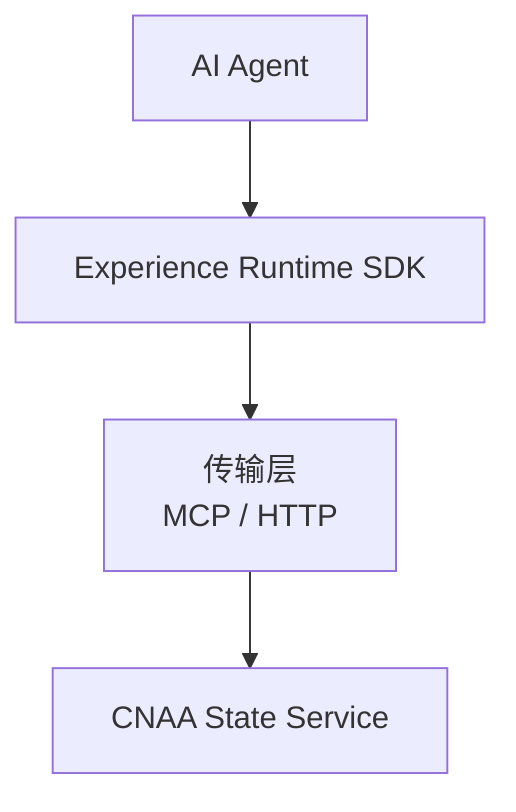
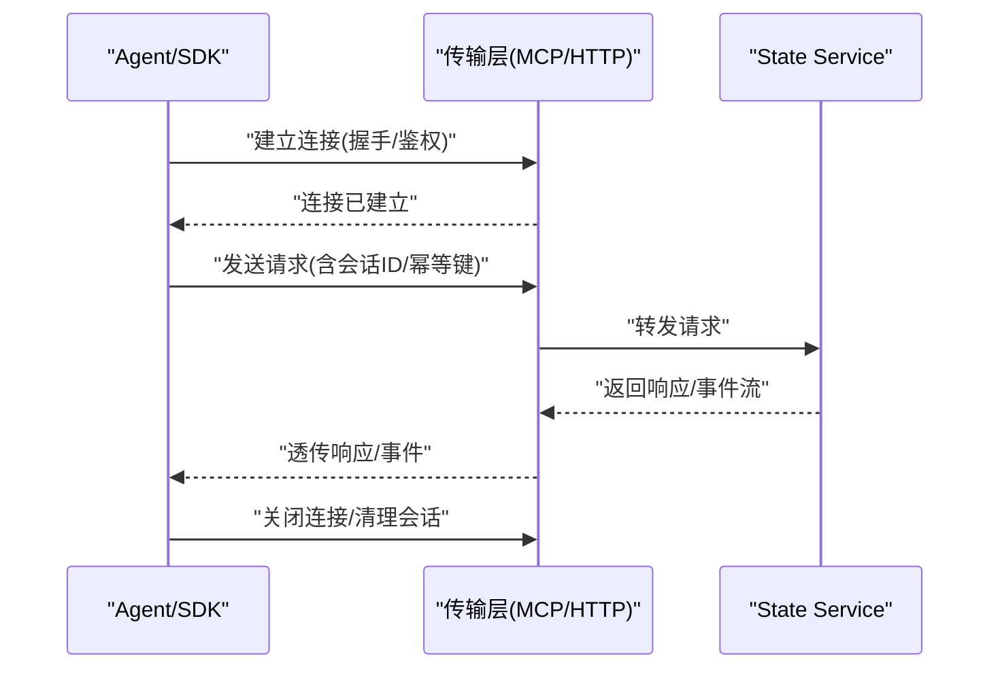
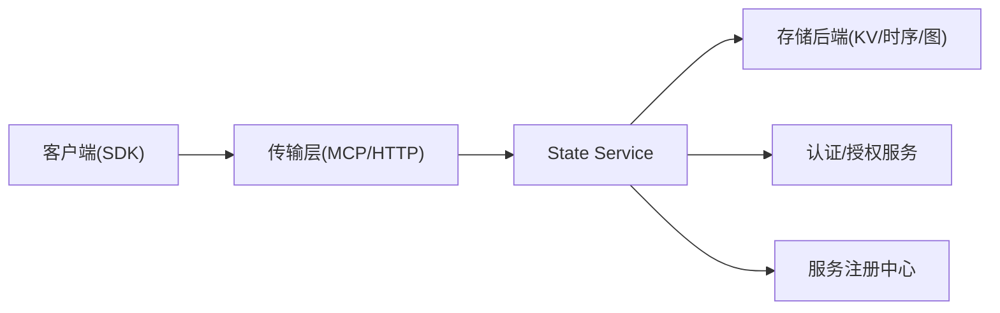

# MCP协议

<cite>
**本文档中引用的文件**
- [README.md](file://README.md)
- [README_CN.md](file://README_CN.md)
</cite>

## 目录
1. [简介](#简介)
2. [项目结构](#项目结构)
3. [核心组件](#核心组件)
4. [架构总览](#架构总览)
5. [详细组件分析](#详细组件分析)
6. [依赖关系分析](#依赖关系分析)
7. [性能考虑](#性能考虑)
8. [故障排查指南](#故障排查指南)
9. [结论](#结论)
10. [附录](#附录)

## 简介
本文件为 CNAA 项目中 Model Context Protocol（MCP）的协议与集成规范说明。当前仓库处于早期阶段，尚未包含 MCP 的具体实现代码；本文基于 README 提供的架构信息与通用 MCP 实践，给出面向“连接建立、消息格式、事件类型、实时交互模式”的完整协议设计建议，并补充服务发现、认证授权、会话管理、调用示例、调试与排错方法以及与 CNAA State Service 的集成要点与优化建议。

## 项目结构
仓库当前仅包含中英文 README 文件，MCP 相关文档与实现位于未来规划中。README 明确展示了 Experience Runtime 通过 MCP/HTTP 与 CNAA State Service 通信的整体架构方向。

图示来源
- [README.md:55-72](file://README.md#L55-L72)
- [README_CN.md:63-80](file://README_CN.md#L63-L80)

章节来源
- [README.md:55-86](file://README.md#L55-L86)
- [README_CN.md:63-94](file://README_CN.md#L63-L94)

## 核心组件
- 客户端侧（Agent 或 SDK）
  - 负责发起连接、构造请求、处理响应与事件、维护会话上下文。
- 传输层（MCP/HTTP）
  - 承载 MCP 消息的序列化与传输，提供可靠、可观测的通道。
- 服务端（CNAA State Service）
  - 解析请求、执行业务逻辑、持久化状态、推送事件、返回响应。

章节来源
- [README.md:55-72](file://README.md#L55-L72)
- [README_CN.md:63-80](file://README_CN.md#L63-L80)

## 架构总览
下图展示从 Agent 到 State Service 的端到端流程，以及 MCP 在其中的角色。

图示来源
- [README.md:55-72](file://README.md#L55-L72)
- [README_CN.md:63-80](file://README_CN.md#L63-L80)

## 详细组件分析

### 连接建立与生命周期
- 连接建立
  - 使用长连接（如 WebSocket）或短连接（HTTP/REST）两种模式。推荐以 WebSocket 作为默认，HTTP 作为兼容降级。
  - 握手阶段需完成身份校验、能力协商（版本、特性集）、会话初始化。
- 会话管理
  - 每个连接分配唯一 session_id，用于路由与限流。
  - 支持跨重连的会话恢复（可选），需要服务端维护最小必要上下文。
- 断开与清理
  - 客户端主动关闭或异常断开时，服务端应释放资源、触发清理回调。

章节来源
- [README.md:55-72](file://README.md#L55-L72)
- [README_CN.md:63-80](file://README_CN.md#L63-L80)

### 消息格式与编解码
- 统一信封
  - id: 请求标识（用于匹配响应）
  - type: 消息类型（request/response/event/ping/pong/error）
  - ts: 时间戳（毫秒）
  - sid: 会话标识
  - payload: 业务负载（按 type 区分结构）
- 请求/响应
  - request: 包含 method、params、metadata（如 trace_id、幂等键）
  - response: 包含 code、message、data、trace_id
- 事件
  - event: 包含 event_type、data、seq（有序号，便于排序与去重）
- 错误
  - error: 包含 code、message、details（结构化扩展字段）

章节来源
- [README.md:55-72](file://README.md#L55-L72)
- [README_CN.md:63-80](file://README_CN.md#L63-L80)

### 事件类型与实时交互
- 系统事件
  - connection.opened/closed、session.created/destroyed、heartbeat.ping/pong
- 业务事件
  - state.changed、task.progress、memory.updated、error.reported
- 实时模式
  - 服务端推送：基于事件流（WebSocket）或 SSE（Server-Sent Events）
  - 客户端订阅：通过 subscribe/unsubscribe 控制事件流

章节来源
- [README.md:55-72](file://README.md#L55-L72)
- [README_CN.md:63-80](file://README_CN.md#L63-L80)

### 服务发现与注册
- 本地发现
  - 通过环境变量或配置文件指定 State Service 地址与端口。
- 服务注册
  - 启动时向注册中心（如 Consul/K8s Service）注册自身能力与版本。
- 健康检查
  - 暴露健康端点，供负载均衡与健康探针探测。

章节来源
- [README.md:55-72](file://README.md#L55-L72)
- [README_CN.md:63-80](file://README_CN.md#L63-L80)

### 认证与授权
- 认证
  - 握手阶段携带 token（JWT/OAuth2 Bearer）或 mTLS 证书。
  - 支持 API Key 与短期令牌轮换。
- 授权
  - 基于角色的访问控制（RBAC）或基于资源的细粒度权限。
  - 对敏感操作进行二次确认或审计日志记录。

章节来源
- [README.md:55-72](file://README.md#L55-L72)
- [README_CN.md:63-80](file://README_CN.md#L63-L80)

### 错误码与状态码
- 传输层
  - HTTP 状态码：2xx 成功、4xx 客户端错误、5xx 服务端错误
- 应用层
  - 统一 code 枚举：例如 0=成功，1000+ 客户端错误，2000+ 服务端错误，3000+ 业务错误
  - message：人类可读描述
  - details：结构化错误详情（字段级错误、重试建议等）

章节来源
- [README.md:55-72](file://README.md#L55-L72)
- [README_CN.md:63-80](file://README_CN.md#L63-L80)

### 与 CNAA State Service 的集成
- 接口契约
  - 定义统一的 State Interface，屏蔽底层存储差异（KV/时序/图）。
- 数据模型
  - 经验记忆、任务状态、会话上下文等实体建模。
- 一致性
  - 读写分离、最终一致性策略、冲突解决（CRDT/版本号）。

章节来源
- [README.md:55-72](file://README.md#L55-L72)
- [README_CN.md:63-80](file://README_CN.md#L63-L80)

### 实际协议调用示例（步骤式）
- 建立连接
  - 客户端发起连接，携带认证信息与服务能力协商。
- 发送请求
  - 构造请求信封，设置 id、sid、method、params。
- 处理响应
  - 根据 id 匹配响应，校验 code，提取 data。
- 订阅事件
  - 订阅感兴趣的事件类型，处理服务端推送。
- 断开连接
  - 正常关闭或异常退出，确保资源释放与会话清理。

章节来源
- [README.md:55-72](file://README.md#L55-L72)
- [README_CN.md:63-80](file://README_CN.md#L63-L80)

### 调试工具与常见问题
- 调试工具
  - 抓包工具（Wireshark/tcpdump）观察传输层
  - 日志采集（结构化日志 + Trace ID）
  - 模拟客户端（CLI/脚本）快速验证接口
- 常见问题
  - 连接失败：检查网络、防火墙、证书、端口
  - 鉴权失败：核对 token 有效期、签名算法、权限范围
  - 消息丢失：检查序列号、重放保护、背压与队列容量
  - 性能抖动：定位慢查询、GC 停顿、锁竞争

章节来源
- [README.md:55-72](file://README.md#L55-L72)
- [README_CN.md:63-80](file://README_CN.md#L63-L80)

## 依赖关系分析
- 组件耦合
  - 客户端与传输层松耦合，通过统一信封解耦业务与传输。
  - 服务端与存储后端通过适配器隔离，降低变更成本。
- 外部依赖
  - 注册中心、密钥管理服务、监控与告警平台。
- 潜在循环依赖
  - 避免在服务端内部直接依赖客户端实现，采用事件驱动与接口抽象。

图示来源
- [README.md:55-72](file://README.md#L55-L72)
- [README_CN.md:63-80](file://README_CN.md#L63-L80)

章节来源
- [README.md:55-72](file://README.md#L55-L72)
- [README_CN.md:63-80](file://README_CN.md#L63-L80)

## 性能考虑
- 连接复用与池化
  - 连接池减少握手开销，合理设置超时与最大空闲数。
- 批处理与压缩
  - 批量写入、消息压缩（gzip/zstd）降低带宽占用。
- 异步与背压
  - 非阻塞 I/O、背压机制防止内存溢出。
- 缓存与分层
  - 热点数据缓存（本地/分布式），读多写少场景显著提速。
- 可观测性
  - 指标埋点（QPS、延迟、错误率）、链路追踪、采样策略。

[本节为通用指导，不直接分析具体文件]

## 故障排查指南
- 连接问题
  - 检查 DNS、代理、证书链、端口可达性
- 鉴权问题
  - 核对 token 签发方、过期时间、签名算法
- 消息问题
  - 校验信封字段完整性、序列号连续性、幂等键唯一性
- 性能问题
  - 查看 CPU/内存/IO 指标，定位热点路径与瓶颈
- 日志与追踪
  - 收集服务端与客户端日志，结合 Trace ID 串联全链路

章节来源
- [README.md:55-72](file://README.md#L55-L72)
- [README_CN.md:63-80](file://README_CN.md#L63-L80)

## 结论
当前仓库处于早期阶段，MCP 的具体实现尚未落地。本文基于 README 所示架构方向与通用 MCP 实践，给出了连接、消息、事件、认证、会话、集成与优化的完整协议设计建议。后续可在实现阶段逐步细化接口契约与错误码表，并通过测试用例与基准测试持续完善。

[本节为总结性内容，不直接分析具体文件]

## 附录

### 附录A：消息结构定义（建议）
- 信封字段
  - id: 字符串，请求/响应唯一标识
  - type: 枚举，request/response/event/ping/pong/error
  - ts: 数字，毫秒时间戳
  - sid: 字符串，会话标识
  - payload: 对象，按 type 区分结构
- 请求 payload
  - method: 字符串，操作名
  - params: 对象，参数集合
  - metadata: 对象，trace_id、幂等键、优先级等
- 响应 payload
  - code: 数字，状态码
  - message: 字符串，描述
  - data: 任意，业务数据
  - trace_id: 字符串，链路追踪
- 事件 payload
  - event_type: 字符串，事件类型
  - data: 任意，事件数据
  - seq: 数字，序号（可选）

章节来源
- [README.md:55-72](file://README.md#L55-L72)
- [README_CN.md:63-80](file://README_CN.md#L63-L80)

### 附录B：错误码与状态码（建议）
- 传输层
  - 200 成功、400 客户端错误、401 未认证、403 未授权、404 未找到、500 服务器错误
- 应用层
  - 0 成功、1000+ 客户端错误、2000+ 服务端错误、3000+ 业务错误
- 错误详情
  - code: 数字
  - message: 字符串
  - details: 对象（字段级错误、重试建议）

章节来源
- [README.md:55-72](file://README.md#L55-L72)
- [README_CN.md:63-80](file://README_CN.md#L63-L80)

### 附录C：与 CNAA State Service 集成要点
- 接口抽象
  - 定义统一的 State Interface，屏蔽存储差异
- 数据模型
  - 经验记忆、任务状态、会话上下文等实体建模
- 一致性策略
  - 读写分离、最终一致性、冲突解决

章节来源
- [README.md:55-72](file://README.md#L55-L72)
- [README_CN.md:63-80](file://README_CN.md#L63-L80)