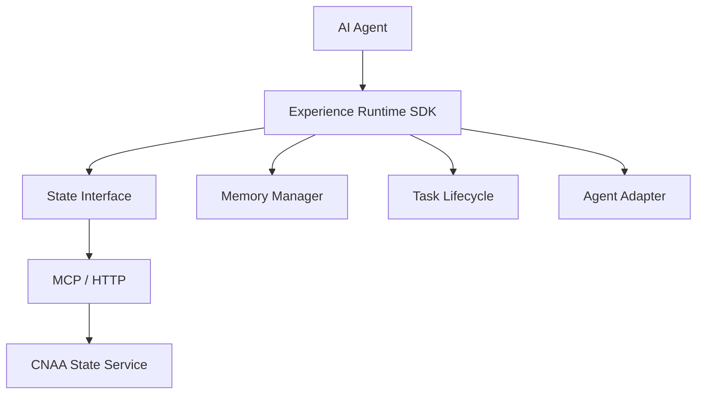
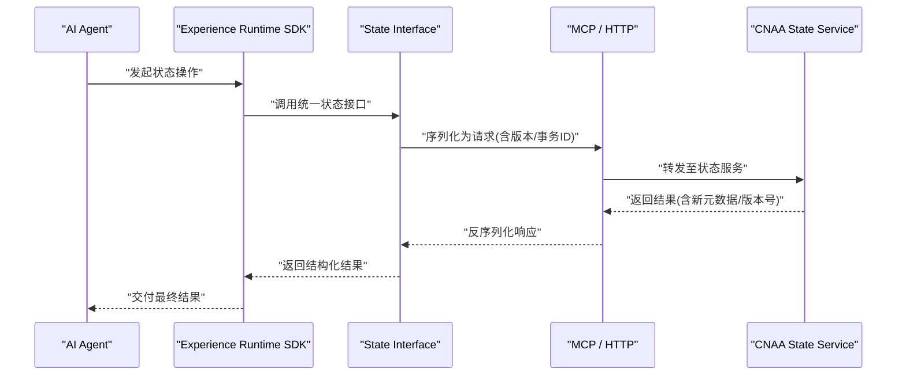
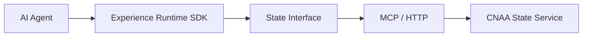

# State Interface

<cite>
**本文引用的文件**   
- [README.md](file://README.md)
- [README_CN.md](file://README_CN.md)
</cite>

## 目录
1. [简介](#简介)
2. [项目结构](#项目结构)
3. [核心组件](#核心组件)
4. [架构总览](#架构总览)
5. [详细组件分析](#详细组件分析)
6. [依赖分析](#依赖分析)
7. [性能考虑](#性能考虑)
8. [故障排查指南](#故障排查指南)
9. [结论](#结论)
10. [附录](#附录)

## 简介
本文件为 CNAA（Cloud Native Agentic Architecture）的“统一状态接口（State Interface）”提供权威 API 文档。该接口面向 AI Agent 的经验运行时，提供对持久化经验与运行态状态的统一访问能力，支持跨进程/跨服务的状态同步、事务性更新以及版本一致性控制。通过 MCP 或 HTTP 协议对外暴露，便于在云原生与本地环境中灵活部署。

## 项目结构
当前仓库以文档为主，包含英文与中文 README，并在 README 中给出体系结构与文档导航。State Interface 的具体规范与实现细节位于独立文档中（如 docs/en/state-interface.md），本仓库内未包含源码实现。

图表来源 
- [README.md:55-72](file://README.md#L55-L72)

章节来源
- [README.md:1-102](file://README.md#L1-L102)

## 核心组件
- 统一状态接口（State Interface）：定义对状态对象的 CRUD、批量操作、事务与版本控制的标准化方法集。
- 内存管理器（Memory Manager）：负责状态数据的序列化/反序列化、缓存与一致性策略。
- 任务生命周期（Task Lifecycle）：将状态变更绑定到任务上下文，确保原子性与可回滚。
- 代理适配器（Agent Adapter）：屏蔽不同 Agent 的实现差异，统一调用 State Interface。
- 状态服务（CNAA State Service）：基于 MCP/HTTP 的状态后端，提供分布式一致性与持久化。

章节来源
- [README.md:55-72](file://README.md#L55-L72)

## 架构总览
下图展示从 Agent 到状态服务的端到端交互路径，强调 State Interface 作为统一入口的作用。

图表来源 
- [README.md:55-72](file://README.md#L55-L72)

## 详细组件分析

### 统一状态接口（State Interface）API 规范
说明：以下为接口层面的契约定义，用于指导 SDK 与服务端的实现。具体实现请参考独立文档 state-interface.md。

- 命名空间与对象模型
  - 状态对象（State Object）：包含键空间标识、业务数据体、元数据（创建时间、更新时间、版本等）。
  - 键空间（Key Space）：按 Agent/会话/任务维度隔离状态。
  - 版本字段（Version）：乐观锁版本号，用于冲突检测与合并。
  - 事务标识（TxId）：事务唯一 ID，用于幂等与回滚。

- 通用参数与返回值约定
  - 输入参数：键（string）、数据体（任意 JSON 兼容结构）、可选元数据（map[string]string）、版本（int64）、事务ID（string）。
  - 返回结构：成功时返回状态对象（含最新元数据与版本），失败时返回错误码与消息。
  - 错误处理：采用标准错误码（如 NOT_FOUND、CONFLICT、INVALID_VERSION、TXN_FAILED），并附带可诊断信息。

- CRUD 操作
  - Create(key, data, meta?, version?) -> StateObject | Error
    - 语义：新增状态条目；若 key 已存在且版本不匹配则返回 CONFLICT。
  - Read(key, version?) -> StateObject | Error
    - 语义：读取指定键的状态；可选择按版本快照读取。
  - Update(key, data, meta?, version) -> StateObject | Error
    - 语义：带版本检查的更新；version 必须等于当前版本，否则返回 CONFLICT。
  - Delete(key, version?) -> bool | Error
    - 语义：删除状态条目；可选版本校验。

- 批量操作
  - BatchWrite(entries[], txId?) -> BatchResult | Error
    - entries：{op: create|update|delete, key, data?, meta?, version?}
    - 语义：在同一事务内执行多条写入；任一失败则整体回滚。
  - BatchRead(keys[]) -> map[key]StateObject | Error
    - 语义：批量读取，缺失键返回空值占位。

- 事务支持
  - Begin() -> TxId
  - Commit(txId) -> bool | Error
  - Rollback(txId) -> bool | Error
  - 语义：Begin 生成事务上下文；Commit 提交所有写入；Rollback 撤销未提交变更。

- 状态同步协议
  - 增量同步：基于版本号的增量拉取（sinceVersion）。
  - 全量同步：导出完整状态快照（含元数据与版本）。
  - 冲突解决：最后写入获胜（LWW）或自定义合并策略（由服务端配置决定）。

- 序列化/反序列化格式
  - 传输格式：JSON（推荐）或 Protocol Buffers（高性能场景）。
  - 元数据字段：created_at、updated_at、version、tx_id、owner_id、tags。
  - 兼容性：字段扩展遵循向后兼容原则，未知字段忽略。

- 版本控制与一致性
  - 乐观锁：通过 version 字段保证并发安全。
  - 幂等性：相同 txId 重复提交视为一次操作。
  - 一致性：强一致（单分区）或最终一致（多分区），由部署配置决定。

- 典型用法示例（描述性）
  - 状态查询：使用 Read(key) 获取当前状态，必要时附加 sinceVersion 进行增量同步。
  - 状态更新：先 Read 获取最新版本，再 Update(key, newData, currentVersion)。
  - 批量操作：构造 entries 列表，调用 BatchWrite(entries, txId)，成功后 Commit(txId)。
  - 事务处理：Begin() -> 多次写入 -> Commit()/Rollback()。

章节来源
- [README.md:55-72](file://README.md#L55-L72)

### 与 MCP 和 HTTP 协议的集成
- MCP 集成
  - 通道：基于 MCP 的消息总线，封装状态操作的请求/响应。
  - 路由：按操作类型映射到对应处理器（create/read/update/delete/batch/txn）。
  - 鉴权：携带 agent_id、scope、token 等头部信息。
- HTTP 集成
  - 端点设计：/state/{key}、/state/batch、/state/txn/* 等 RESTful 风格。
  - 内容协商：application/json 或 application/x-protobuf。
  - 错误码：HTTP 状态码与业务错误码映射（如 409 Conflict、412 Precondition Failed）。

章节来源
- [README.md:55-72](file://README.md#L55-L72)

### 在不同部署环境下的配置选项
- 本地开发
  - 存储后端：内存或轻量级文件存储。
  - 一致性：弱一致，提升调试效率。
- 云原生部署
  - 存储后端：分布式 KV/数据库。
  - 一致性：可配置强一致或最终一致。
  - 横向扩展：无状态网关 + 有状态状态服务分片。
- 安全与审计
  - 鉴权：JWT/OAuth2。
  - 审计：记录关键状态变更事件。

章节来源
- [README.md:55-72](file://README.md#L55-L72)

## 依赖分析
State Interface 依赖 Experience Runtime SDK 提供的上下文与工具，并通过 MCP/HTTP 与 CNAA State Service 通信。

图表来源 
- [README.md:55-72](file://README.md#L55-L72)

章节来源
- [README.md:55-72](file://README.md#L55-L72)

## 性能考虑
- 批量操作优先：减少网络往返，提高吞吐。
- 增量同步：避免全量拉取，降低带宽与延迟。
- 序列化选择：高吞吐场景使用二进制格式（如 Protobuf）。
- 缓存策略：热点键本地缓存，配合失效与一致性校验。
- 事务粒度：尽量缩小事务范围，降低锁竞争。

## 故障排查指南
- 常见错误
  - 版本冲突（CONFLICT）：检查是否使用最新 version 进行更新。
  - 事务失败（TXN_FAILED）：确认 Begin/Commit/Rollback 流程是否正确。
  - 权限不足：检查 agent_id、scope、token 是否有效。
- 诊断要点
  - 查看 txId 与 version 字段是否传递正确。
  - 核对 MCP/HTTP 请求头与内容类型。
  - 检查状态服务日志中的冲突与重试记录。

## 结论
State Interface 为 CNAA 提供了统一的、可扩展的状态管理能力，结合事务与版本控制，确保在多 Agent、多实例环境下的一致性与可靠性。通过 MCP/HTTP 协议接入，可在多种部署形态下稳定运行。建议在实际落地时严格遵循版本与事务契约，并结合批量与增量机制优化性能。

## 附录
- 术语表
  - 状态对象（State Object）：表示一个键对应的数据与元数据集合。
  - 键空间（Key Space）：逻辑上的命名空间，用于隔离不同 Agent/会话/任务的状态。
  - 事务（Transaction）：一组原子性状态变更操作。
  - 版本（Version）：用于并发控制的乐观锁字段。
- 参考文档
  - 状态接口规范详见独立文档：docs/en/state-interface.md（仓库内尚未包含该文件）。