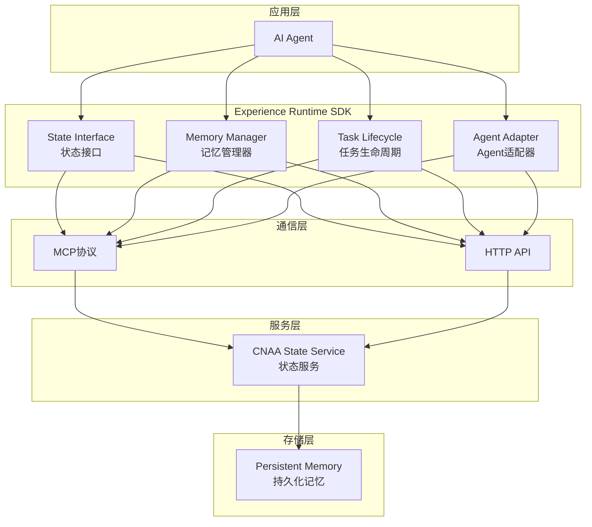
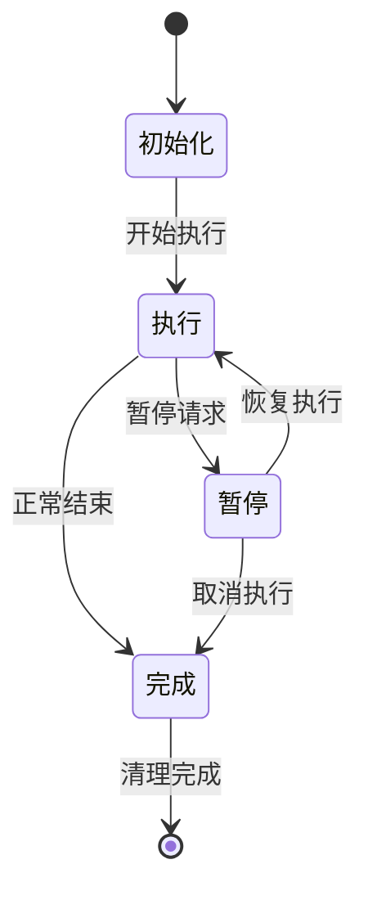
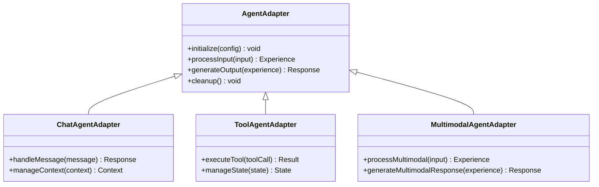

# SDK开发指南

<cite>
**本文档引用的文件**
- [README.md](file://README.md)
- [README_CN.md](file://README_CN.md)
</cite>

## 目录
1. [项目概述](#项目概述)
2. [系统架构](#系统架构)
3. [核心组件详解](#核心组件详解)
4. [SDK初始化与配置](#sdk初始化与配置)
5. [API调用方法](#api调用方法)
6. [错误处理机制](#错误处理机制)
7. [Agent集成示例](#agent集成示例)
8. [版本管理与依赖管理](#版本管理与依赖管理)
9. [部署方式](#部署方式)
10. [性能优化建议](#性能优化建议)
11. [故障排除指南](#故障排除指南)
12. [最佳实践](#最佳实践)

## 项目概述

CNAA（Cloud Native Agentic Architecture）是一个面向AI Agent的持久化记忆运行时框架。它不是Agent框架、Workflow引擎或RAG实现，而是提供一套轻量级的Experience Runtime（经验运行时），让任何AI Agent在无需修改推理逻辑的情况下，实现经验沉淀、状态同步与持续记忆。

### 核心价值主张

- **持久化经验记忆**：将经验从临时Prompt上下文转变为独立的运行时资源
- **运行时状态同步**：支持跨会话的状态保持和同步
- **统一状态接口**：为不同Agent提供一致的状态访问方式
- **Agent无关设计**：不限制具体的Agent实现方式
- **云/本地部署**：支持多种部署环境

**章节来源**
- [README.md:9-31](file://README.md#L9-L31)
- [README_CN.md:9-39](file://README_CN.md#L9-L39)

## 系统架构

CNAA采用分层架构设计，通过Experience Runtime SDK连接AI Agent和持久化存储层。



**图表来源**
- [README.md:57-72](file://README.md#L57-L72)
- [README_CN.md:65-80](file://README_CN.md#L65-L80)

### 架构特点

1. **解耦设计**：Agent与存储层完全解耦，通过SDK进行交互
2. **标准化接口**：统一的State Interface确保兼容性
3. **可扩展性**：支持多种通信协议（MCP/HTTP）
4. **持久化能力**：经验数据独立于Agent生命周期

**章节来源**
- [README.md:55-72](file://README.md#L55-L72)
- [README_CN.md:63-80](file://README_CN.md#L63-L80)

## 核心组件详解

### State Interface（状态接口）

State Interface是SDK的核心抽象层，定义了Agent与Experience Runtime交互的标准接口。

#### 主要功能
- 状态读写操作
- 事务支持
- 版本控制
- 并发安全

#### 接口设计原则
- **一致性**：所有Agent使用相同的接口规范
- **原子性**：状态操作保证原子性
- **可序列化**：支持状态序列化和反序列化

### Memory Manager（记忆管理器）

Memory Manager负责经验的存储、检索和管理。

#### 核心职责
- 经验数据的持久化存储
- 内存缓存管理
- 数据同步策略
- 垃圾回收机制

#### 存储策略
- **热数据缓存**：频繁访问的经验存储在内存中
- **温数据索引**：中等频率访问的数据建立索引
- **冷数据归档**：低频访问的数据归档到持久化存储

### Task Lifecycle（任务生命周期）

Task Lifecycle管理任务的完整生命周期，确保经验的有效积累和复用。

#### 生命周期阶段
1. **初始化**：任务创建和资源准备
2. **执行**：任务运行和经验收集
3. **暂停**：任务暂停和状态保存
4. **恢复**：任务恢复和状态重建
5. **完成**：任务结束和经验持久化
6. **清理**：资源释放和垃圾回收

#### 状态转换


**图表来源**
- [README.md:65](file://README.md#L65)
- [README_CN.md:73](file://README_CN.md#L73)

### Agent Adapter（Agent适配器）

Agent Adapter提供不同Agent类型的适配层，确保各种Agent都能无缝集成到CNAA生态系统中。

#### 支持的Agent类型
- **对话式Agent**：如聊天机器人
- **工具调用Agent**：如函数调用型Agent
- **多模态Agent**：支持文本、图像等多模态输入
- **工作流Agent**：基于流程的复杂任务处理

#### 适配器模式


**图表来源**
- [README.md:66](file://README.md#L66)
- [README_CN.md:74](file://README_CN.md#L74)

**章节来源**
- [README.md:63-66](file://README.md#L63-L66)
- [README_CN.md:71-74](file://README_CN.md#L71-L74)

## SDK初始化与配置

### 基础初始化流程

SDK初始化需要以下步骤：

1. **配置加载**：读取配置文件和环境变量
2. **服务连接**：建立与CNAA State Service的连接
3. **组件初始化**：初始化各个核心组件
4. **验证检查**：验证配置和服务连接状态

### 配置参数说明

| 参数名称 | 类型 | 默认值 | 描述 |
|---------|------|--------|------|
| service_url | string | http://localhost:8080 | CNAA状态服务地址 |
| agent_id | string | auto-generated | Agent唯一标识符 |
| memory_backend | string | local | 记忆后端类型（local/redis/mysql） |
| cache_size | int | 1000 | 内存缓存大小 |
| sync_interval | int | 5 | 状态同步间隔（秒） |
| timeout | int | 30 | 请求超时时间（秒） |

### 初始化代码示例

```go
// 基础初始化
config := &Config{
    ServiceURL: "http://localhost:8080",
    AgentID: "my-agent-001",
    MemoryBackend: "local",
    CacheSize: 1000,
}

sdk, err := NewSDK(config)
if err != nil {
    log.Fatal("SDK初始化失败:", err)
}

// 启动SDK
err = sdk.Start()
if err != nil {
    log.Fatal("SDK启动失败:", err)
}
defer sdk.Stop()
```

**章节来源**
- [README.md:55-72](file://README.md#L55-L72)
- [README_CN.md:63-80](file://README_CN.md#L63-L80)

## API调用方法

### 状态操作API

#### 读取状态
```go
// 获取指定键的状态
state, err := sdk.GetState(ctx, key)
if err != nil {
    // 处理错误
}

// 批量获取状态
states, err := sdk.GetStates(ctx, keys)
```

#### 写入状态
```go
// 设置单个状态
err := sdk.SetState(ctx, key, value)

// 批量设置状态
err := sdk.SetStates(ctx, states)

// 条件更新
err := sdk.CompareAndSet(ctx, key, expectedValue, newValue)
```

#### 删除状态
```go
// 删除单个状态
err := sdk.DeleteState(ctx, key)

// 批量删除状态
err := sdk.DeleteStates(ctx, keys)
```

### 经验管理API

#### 经验创建
```go
experience := Experience{
    Type: "task_result",
    Data: map[string]interface{}{
        "result": "success",
        "score": 0.95,
    },
    Tags: []string{"important", "high_score"},
}

err := sdk.CreateExperience(ctx, experience)
```

#### 经验查询
```go
// 按标签查询
experiences, err := sdk.QueryExperiences(ctx, Query{
    Tags: []string{"important"},
    Limit: 10,
})

// 按时间范围查询
experiences, err := sdk.QueryExperiencesByTime(ctx, Query{
    StartTime: startTime,
    EndTime: endTime,
})
```

### 任务生命周期API

#### 任务管理
```go
// 创建任务
task, err := sdk.CreateTask(ctx, TaskConfig{
    Name: "data_processing",
    Priority: High,
    Timeout: 300,
})

// 执行任务
result, err := task.Execute(ctx)

// 暂停任务
err := task.Pause(ctx)

// 恢复任务
err := task.Resume(ctx)

// 取消任务
err := task.Cancel(ctx)
```

**章节来源**
- [README.md:63-66](file://README.md#L63-L66)
- [README_CN.md:71-74](file://README_CN.md#L71-L74)

## 错误处理机制

### 错误类型定义

SDK定义了丰富的错误类型，便于开发者进行精确的错误处理：

| 错误类型 | 描述 | 常见原因 |
|---------|------|----------|
| ConnectionError | 连接错误 | 服务不可用、网络问题 |
| AuthenticationError | 认证错误 | 权限不足、令牌失效 |
| ValidationError | 验证错误 | 参数格式不正确 |
| TimeoutError | 超时错误 | 请求处理时间过长 |
| ConflictError | 冲突错误 | 数据版本冲突 |
| NotFoundError | 不存在错误 | 资源不存在 |

### 错误处理策略

```go
// 重试机制
func withRetry(ctx context.Context, operation func() error) error {
    var lastErr error
    for i := 0; i < maxRetries; i++ {
        if err := operation(); err != nil {
            lastErr = err
            if !isRetryable(err) {
                return err
            }
            time.Sleep(backoff(i))
            continue
        }
        return nil
    }
    return lastErr
}

// 降级处理
func handleWithFallback(ctx context.Context, primaryFunc, fallbackFunc func() error) error {
    if err := primaryFunc(); err != nil {
        if isDegradable(err) {
            return fallbackFunc()
        }
        return err
    }
    return nil
}
```

### 监控和日志

```go
// 错误监控
metrics.RecordError(err, map[string]string{
    "operation": "get_state",
    "agent_id": agentID,
})

// 详细日志
logger.Error("状态获取失败", 
    zap.String("key", key),
    zap.Error(err),
    zap.String("agent_id", agentID),
)
```

**章节来源**
- [README.md:55-72](file://README.md#L55-L72)
- [README_CN.md:63-80](file://README_CN.md#L63-L80)

## Agent集成示例

### 对话式Agent集成

```go
// 定义对话式Agent适配器
type ChatAgentAdapter struct {
    sdk *SDK
    contextManager *ContextManager
}

func (a *ChatAgentAdapter) HandleMessage(message string) string {
    // 获取历史上下文
    context := a.contextManager.GetContext(message.AgentID)
    
    // 构建提示词
    prompt := a.buildPrompt(message, context)
    
    // 调用LLM生成回复
    response := a.callLLM(prompt)
    
    // 更新上下文
    a.contextManager.UpdateContext(message.AgentID, message, response)
    
    return response
}

func (a *ChatAgentAdapter) buildPrompt(message string, context *Context) string {
    // 从SDK获取相关经验
    experiences := a.sdk.QueryExperiences(context.AgentID, message)
    
    // 构建包含经验的提示词
    return fmt.Sprintf("历史经验:\n%s\n\n用户消息: %s", experiences, message)
}
```

### 工具调用Agent集成

```go
// 定义工具调用Agent适配器
type ToolAgentAdapter struct {
    sdk *SDK
    toolRegistry *ToolRegistry
}

func (a *ToolAgentAdapter) ExecuteToolCall(toolCall ToolCall) Result {
    // 注册的工具查找
    tool := a.toolRegistry.Find(toolCall.ToolName)
    
    // 执行工具并记录经验
    result := tool.Execute(toolCall.Params)
    
    // 记录工具调用经验
    experience := Experience{
        Type: "tool_execution",
        Data: map[string]interface{}{
            "tool_name": toolCall.ToolName,
            "params": toolCall.Params,
            "result": result,
            "success": result.Success,
        },
        Tags: []string{"tool", toolCall.ToolName},
    }
    
    a.sdk.CreateExperience(context.Background(), experience)
    
    return result
}
```

### 多模态Agent集成

```go
// 定义多模态Agent适配器
type MultimodalAgentAdapter struct {
    sdk *SDK
    modelManager *ModelManager
}

func (a *MultimodalAgentAdapter) ProcessInput(input Input) Response {
    // 根据输入类型选择模型
    model := a.modelManager.SelectModel(input.Type)
    
    // 处理多模态输入
    processedInput := a.processMultimodalInput(input)
    
    // 生成响应
    response := model.Process(processedInput)
    
    // 记录多模态处理经验
    a.recordMultimodalExperience(input, response)
    
    return response
}
```

**章节来源**
- [README.md:66](file://README.md#L66)
- [README_CN.md:74](file://README_CN.md#L74)

## 版本管理与依赖管理

### 版本策略

CNAA SDK采用语义化版本控制（SemVer）：

- **主版本号**：不兼容的API变更
- **次版本号**：向后兼容的功能新增
- **修订号**：向后兼容的问题修正

### 依赖管理

#### Go模块依赖
```go
module github.com/cnaa/sdk

go 1.21

require (
    github.com/cnaa/state-service v1.2.0
    github.com/redis/go-redis/v9 v9.3.0
    go.uber.org/zap v1.24.0
    google.golang.org/grpc v1.56.0
)
```

#### Docker镜像版本
```dockerfile
FROM golang:1.21-alpine AS builder

WORKDIR /app
COPY go.mod go.sum ./
RUN go mod download

COPY . .
RUN go build -o cnaa-sdk ./cmd/main.go

FROM alpine:latest
COPY --from=builder /app/cnaa-sdk /usr/local/bin/
ENTRYPOINT ["cnaa-sdk"]
```

### 升级指南

#### 从v1.x升级到v2.x
1. 更新依赖版本
2. 修改API调用方式
3. 更新配置文件格式
4. 测试兼容性

#### 回滚策略
- 保持多个版本的二进制文件
- 使用蓝绿部署策略
- 实施渐进式发布

**章节来源**
- [README.md:90-96](file://README.md#L90-L96)
- [README_CN.md:97-104](file://README_CN.md#L97-L104)

## 部署方式

### 本地开发环境

#### 最小化部署
```bash
# 启动CNAA状态服务
docker run -d \
  --name cnaa-state \
  -p 8080:8080 \
  cnaa/state-service:latest

# 启动SDK应用
go run ./cmd/main.go --config config.yaml
```

#### 开发环境配置
```yaml
# config.yaml
service:
  url: http://localhost:8080
  timeout: 30s
  
memory:
  backend: local
  path: ./data
  
logging:
  level: debug
  format: json
```

### 生产环境部署

#### Kubernetes部署
```yaml
apiVersion: apps/v1
kind: Deployment
metadata:
  name: cnaa-agent
spec:
  replicas: 3
  selector:
    matchLabels:
      app: cnaa-agent
  template:
    metadata:
      labels:
        app: cnaa-agent
    spec:
      containers:
      - name: agent
        image: cnaa/agent:latest
        ports:
        - containerPort: 8080
        env:
        - name: CNAA_SERVICE_URL
          value: "http://cnaa-state-service:8080"
        resources:
          requests:
            memory: "256Mi"
            cpu: "250m"
          limits:
            memory: "512Mi"
            cpu: "500m"
```

#### 环境变量配置
```bash
# 必需的环境变量
export CNAA_SERVICE_URL=http://cnaa-state:8080
export CNAA_AGENT_ID=my-agent-001
export CNAA_MEMORY_BACKEND=redis

# 可选的环境变量
export CNAA_CACHE_SIZE=1000
export CNAA_SYNC_INTERVAL=5
export CNAA_LOG_LEVEL=info
```

### 云服务部署

#### AWS部署
```hcl
resource "aws_ecs_task_definition" "cnaa_agent" {
  family = "cnaa-agent"
  container_definitions = [{
    name = "agent"
    image = "cnaa/agent:latest"
    environment = [
      {
        name = "CNAA_SERVICE_URL"
        value = "http://cnaa-state-service:8080"
      }
    ]
    memory = 512
    cpu = 250
  }]
}
```

**章节来源**
- [README.md:51](file://README.md#L51)
- [README_CN.md:59](file://README_CN.md#L59)

## 性能优化建议

### 内存优化

#### 缓存策略
```go
// LRU缓存配置
cache := lru.NewCache(1000, lru.WithExpiration(time.Minute*5))

// 多级缓存
type MultiLevelCache struct {
    L1 *lru.Cache  // 内存缓存
    L2 *redis.Client // 分布式缓存
}
```

#### 内存池使用
```go
var bufferPool = sync.Pool{
    New: func() interface{} {
        return make([]byte, 0, 1024)
    },
}

func processData(data []byte) []byte {
    buf := bufferPool.Get().([]byte)
    defer bufferPool.Put(buf)
    
    // 处理数据
    return buf
}
```

### 并发优化

#### Goroutine池
```go
type WorkerPool struct {
    workers int
    jobs chan func()
    wg sync.WaitGroup
}

func (wp *WorkerPool) Start() {
    for i := 0; i < wp.workers; i++ {
        go func() {
            for job := range wp.jobs {
                job()
                wp.wg.Done()
            }
        }()
    }
}
```

#### 批处理优化
```go
// 批量状态操作
func BatchSetStates(states []State) error {
    const batchSize = 100
    
    for i := 0; i < len(states); i += batchSize {
        end := min(i+batchSize, len(states))
        batch := states[i:end]
        
        if err := client.BatchSet(batch); err != nil {
            return err
        }
    }
    return nil
}
```

### 网络优化

#### 连接池
```go
// HTTP客户端连接池
httpClient := &http.Client{
    Transport: &http.Transport{
        MaxIdleConns: 100,
        MaxIdleConnsPerHost: 10,
        IdleConnTimeout: 90 * time.Second,
    },
    Timeout: 30 * time.Second,
}
```

#### 压缩传输
```go
// 启用GZIP压缩
transport := &http.Transport{
    DisableCompression: false,
    CompressionLimit: 1024 * 1024, // 1MB
}
```

**章节来源**
- [README.md:55-72](file://README.md#L55-L72)
- [README_CN.md:63-80](file://README_CN.md#L63-L80)

## 故障排除指南

### 常见问题诊断

#### 连接问题
```go
// 健康检查
func HealthCheck(ctx context.Context) error {
    ctx, cancel := context.WithTimeout(ctx, 5*time.Second)
    defer cancel()
    
    resp, err := client.Get("/health")
    if err != nil {
        return fmt.Errorf("服务不可用: %w", err)
    }
    defer resp.Body.Close()
    
    if resp.StatusCode != http.StatusOK {
        return fmt.Errorf("服务状态异常: %d", resp.StatusCode)
    }
    
    return nil
}
```

#### 性能问题
```go
// 性能监控
func MonitorPerformance(operation string, start time.Time) {
    duration := time.Since(start)
    
    if duration > threshold {
        logger.Warn("性能警告",
            zap.String("operation", operation),
            zap.Duration("duration", duration),
        )
    }
}
```

### 日志分析

#### 结构化日志
```go
logger.Info("状态操作完成",
    zap.String("operation", "set_state"),
    zap.String("key", key),
    zap.Duration("duration", duration),
    zap.Int("size", size),
    zap.String("agent_id", agentID),
)
```

#### 错误追踪
```go
// 错误上下文
type ErrorWithContext struct {
    Err error
    Context map[string]interface{}
    StackTrace string
}

func WrapError(err error, ctx map[string]interface{}) error {
    return &ErrorWithContext{
        Err: err,
        Context: ctx,
        StackTrace: getStackTrace(),
    }
}
```

### 监控指标

#### 关键指标
- 请求成功率
- 平均响应时间
- 内存使用率
- 缓存命中率
- 错误率

#### 告警规则
```yaml
alerts:
  - name: high_error_rate
    condition: error_rate > 0.05
    duration: 5m
    severity: critical
    
  - name: high_latency
    condition: p99_latency > 1000ms
    duration: 10m
    severity: warning
```

**章节来源**
- [README.md:55-72](file://README.md#L55-L72)
- [README_CN.md:63-80](file://README_CN.md#L63-L80)

## 最佳实践

### 代码组织

#### 包结构
```
cmd/
  main.go           # 应用程序入口
internal/
  config/           # 配置管理
  state/            # 状态管理
  memory/           # 记忆管理
  lifecycle/        # 生命周期管理
  adapter/          # Agent适配器
pkg/
  api/              # 公共API
  utils/            # 工具函数
  errors/           # 错误定义
```

#### 命名规范
- 使用有意义的包名
- 遵循Go语言命名约定
- 常量使用全大写
- 变量使用驼峰命名

### 错误处理

#### 统一错误处理
```go
// 自定义错误类型
type AppError struct {
    Code    string
    Message string
    Details map[string]interface{}
}

func (e *AppError) Error() string {
    return e.Message
}

// 错误码定义
const (
    ErrConnectionFailed = "CONNECTION_FAILED"
    ErrAuthentication   = "AUTHENTICATION_FAILED"
    ErrValidation       = "VALIDATION_FAILED"
)
```

#### 优雅降级
```go
func WithFallback(ctx context.Context, primary, fallback func() error) error {
    if err := primary(); err != nil {
        if isDegradable(err) {
            return fallback()
        }
        return err
    }
    return nil
}
```

### 配置管理

#### 配置层次
```go
type Config struct {
    Service ServiceConfig `mapstructure:"service"`
    Memory  MemoryConfig  `mapstructure:"memory"`
    Logging LoggingConfig `mapstructure:"logging"`
}

type ServiceConfig struct {
    URL     string `mapstructure:"url"`
    Timeout int    `mapstructure:"timeout"`
}
```

#### 环境变量优先级
1. 命令行参数
2. 环境变量
3. 配置文件
4. 默认值

### 测试策略

#### 单元测试
```go
func TestStateInterface(t *testing.T) {
    mockService := NewMockStateService()
    si := NewStateInterface(mockService)
    
    tests := []struct {
        name string
        key   string
        value interface{}
    }{
        {"simple_string", "test_key", "test_value"},
        {"complex_object", "user_data", User{Name: "John"}},
    }
    
    for _, tt := range tests {
        t.Run(tt.name, func(t *testing.T) {
            err := si.SetState(context.Background(), tt.key, tt.value)
            assert.NoError(t, err)
            
            got, err := si.GetState(context.Background(), tt.key)
            assert.NoError(t, err)
            assert.Equal(t, tt.value, got)
        })
    }
}
```

#### 集成测试
```go
func TestIntegration(t *testing.T) {
    // 启动测试服务
    server := StartTestServer()
    defer server.Stop()
    
    // 创建SDK实例
    sdk := NewSDK(&Config{
        ServiceURL: server.URL,
        MemoryBackend: "test",
    })
    
    // 执行测试用例
    err := sdk.Start()
    assert.NoError(t, err)
    
    // 清理资源
    sdk.Stop()
}
```

**章节来源**
- [README.md:55-72](file://README.md#L55-L72)
- [README_CN.md:63-80](file://README_CN.md#L63-L80)

## 结论

CNAA SDK为AI Agent提供了强大的持久化记忆能力，通过其独特的Experience Runtime架构，使得Agent能够在不修改内部推理逻辑的情况下实现经验的持续积累和复用。

### 核心优势

1. **架构清晰**：分层设计确保了良好的可维护性和扩展性
2. **接口统一**：标准化的State Interface降低了集成复杂度
3. **性能优异**：多级缓存和批处理机制保证了高吞吐量
4. **部署灵活**：支持多种部署环境和云平台

### 未来发展

随着AI Agent技术的不断发展，CNAA SDK将继续演进，重点关注以下方向：

- **多Agent协作**：支持Agent间的经验共享和协作
- **智能路由**：基于Agent能力的智能任务分发
- **边缘计算**：支持边缘设备的轻量化部署
- **安全增强**：加强数据安全和隐私保护

通过遵循本指南中的最佳实践，开发者可以充分利用CNAA SDK的强大功能，构建出更加智能、可靠和高效的AI Agent应用。