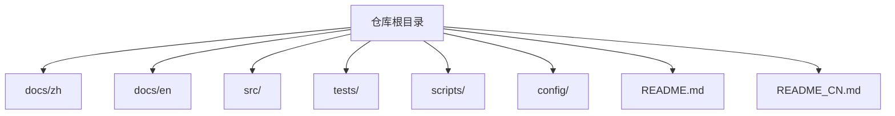
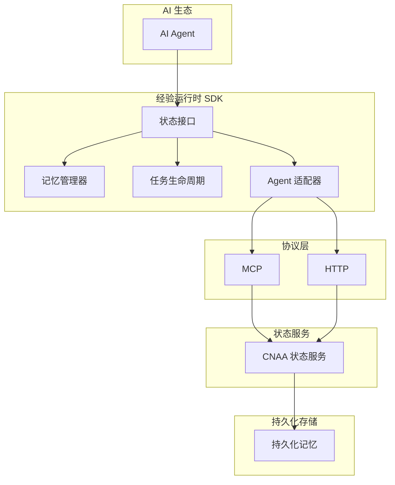
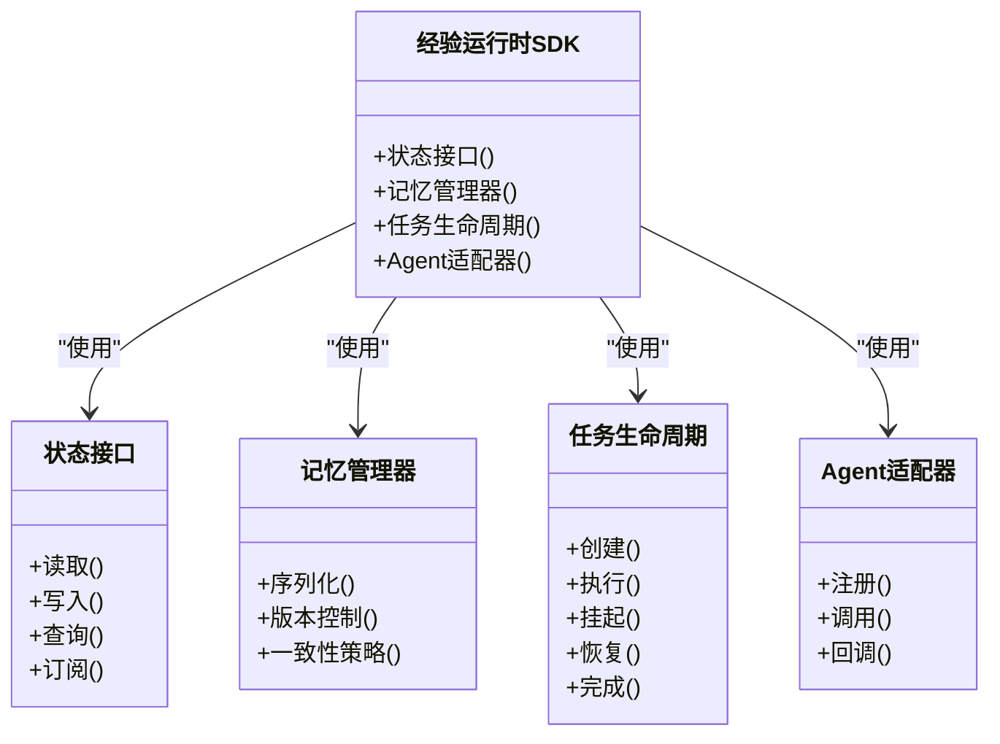
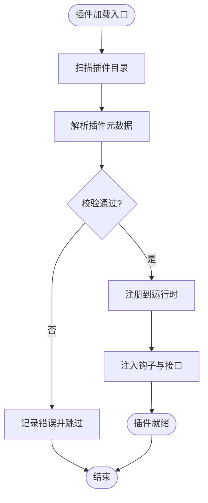
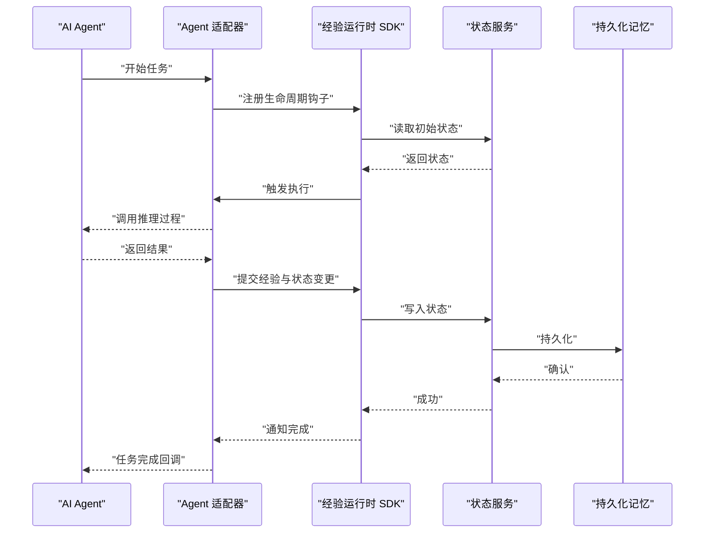
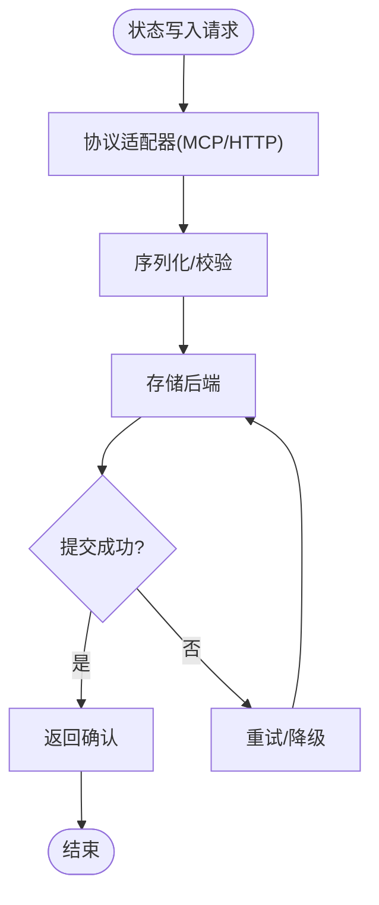
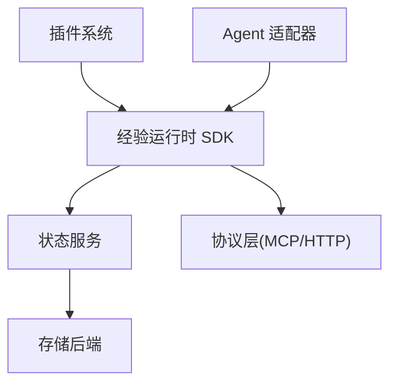

# 开发指南

<cite>
**本文引用的文件**
- [README.md](file://README.md)
- [README_CN.md](file://README_CN.md)
</cite>

## 目录
1. [简介](#简介)
2. [项目结构](#项目结构)
3. [核心组件](#核心组件)
4. [架构总览](#架构总览)
5. [详细组件分析](#详细组件分析)
6. [依赖分析](#依赖分析)
7. [性能考虑](#性能考虑)
8. [故障排查指南](#故障排查指南)
9. [结论](#结论)
10. [附录](#附录)

## 简介
本指南面向希望参与 CNAA（Cloud Native Agentic Architecture）项目的开发者，目标是帮助你在当前仓库基础上搭建开发环境、理解系统架构与扩展点，并逐步完善 SDK、插件系统与相关适配器。根据仓库现状，代码尚未实现，文档与说明集中在 README 中。因此，本指南将基于现有文档内容，给出可操作的开发路径、规范建议与后续落地计划，确保在后续实现阶段能够快速对齐目标。

CNAA 的定位是“面向 AI Agent 的持久化记忆运行时框架”，强调经验沉淀、状态同步与统一接口，而非 Agent 框架、工作流引擎或 RAG 实现。其核心价值在于通过 Experience Runtime（经验运行时）将经验从临时上下文抽离为独立资源，并与持久化存储对接。

**章节来源**
- [README.md:1-102](file://README.md#L1-L102)
- [README_CN.md:1-110](file://README_CN.md#L1-L110)

## 项目结构
当前仓库包含中英文 README 与空的 docs 目录，表明项目处于早期规划与文档先行阶段。建议按以下结构组织后续源码与文档：
- src/：源代码（SDK、State Service、适配器等）
- docs/zh 与 docs/en：中文与英文文档
- tests/：单元测试、集成测试与端到端测试
- scripts/：构建、发布与工具脚本
- config/：配置文件与示例配置

[此图为概念性结构示意，不直接映射具体源文件]

**章节来源**
- [README.md:76-86](file://README.md#L76-L86)
- [README_CN.md:84-94](file://README_CN.md#L84-L94)

## 核心组件
根据 README 中的架构描述，CNAA 的核心组件包括：
- 经验运行时 SDK：提供状态接口、记忆管理、任务生命周期与 Agent 适配能力
- 状态服务（CNAA State Service）：对外暴露状态读写与同步能力
- 协议层（MCP / HTTP）：用于跨进程或服务间通信
- 持久化记忆：作为独立资源承载经验数据

这些组件共同构成“AI Agent → 经验运行时 → 持久化记忆”的数据与控制流。

**章节来源**
- [README.md:55-73](file://README.md#L55-L73)
- [README_CN.md:63-80](file://README_CN.md#L63-L80)

## 架构总览
下图展示了 CNAA 的高层架构与交互关系，对应 README 中的架构图描述。

**图表来源**
- [README.md:55-73](file://README.md#L55-L73)
- [README_CN.md:63-80](file://README_CN.md#L63-L80)

**章节来源**
- [README.md:55-73](file://README.md#L55-L73)
- [README_CN.md:63-80](file://README_CN.md#L63-L80)

## 详细组件分析
本节围绕 SDK、插件系统、适配器与状态服务展开，结合 README 中的能力描述给出实现建议与扩展点设计。由于仓库暂无源码，以下内容以架构与流程为主，便于后续编码时对齐目标。

### 经验运行时 SDK
- 职责：封装状态接口、记忆管理与任务生命周期；屏蔽底层存储与协议差异；提供 Agent 无关的统一 API。
- 关键扩展点：
  - 状态接口：定义统一的读写、查询与事件订阅能力
  - 记忆管理器：负责经验的序列化、版本控制与一致性策略
  - 任务生命周期：定义任务的创建、执行、挂起、恢复与完成等阶段钩子
  - Agent 适配器：抽象不同 Agent 的接入方式，支持插件化扩展

[此图为概念性类图，用于指导后续实现]

### 插件系统
- 目标：允许第三方扩展状态接口、记忆管理器、任务生命周期钩子与 Agent 适配器。
- 设计要点：
  - 插件发现与加载：约定插件目录与元数据格式，启动时扫描并注册
  - 插件接口契约：明确方法签名、错误码与事件模型
  - 隔离与安全：限制权限、资源配额与沙箱机制
  - 版本兼容：语义化版本与向后兼容策略

[此图为概念性流程图，用于指导插件系统实现]

### 自定义 Agent 适配器
- 目标：让任意 Agent 接入 CNAA，无需修改其推理逻辑。
- 步骤建议：
  - 定义适配器接口：输入输出、事件回调、错误处理
  - 实现连接与认证：适配不同 Agent 的运行环境与鉴权方式
  - 绑定生命周期：将 Agent 的任务阶段映射到运行时生命周期
  - 调试与日志：输出关键指标与诊断信息

**图表来源**
- [README.md:55-73](file://README.md#L55-L73)
- [README_CN.md:63-80](file://README_CN.md#L63-L80)

### 存储后端与协议适配器
- 存储后端：支持多种持久化方案（如本地文件、KV 存储、数据库），通过统一接口抽象读写与事务。
- 协议适配器：支持 MCP 与 HTTP，提供请求编解码、重试与熔断机制。
- 扩展建议：
  - 存储后端：实现标准接口，保证幂等性与一致性
  - 协议适配器：标准化错误码与超时策略，支持链路追踪

[此图为概念性流程图，用于指导协议与存储适配实现]

**章节来源**
- [README.md:55-73](file://README.md#L55-L73)
- [README_CN.md:63-80](file://README_CN.md#L63-L80)

## 依赖分析
当前仓库无源码与依赖文件，仅包含 README。建议在后续实现中明确模块边界与依赖方向：
- SDK 依赖状态服务与协议层
- 状态服务依赖存储后端
- 插件系统依赖运行时内核与接口契约
- 避免循环依赖，采用接口解耦

[此图为概念性依赖图，用于指导模块划分]

**章节来源**
- [README.md:55-73](file://README.md#L55-L73)
- [README_CN.md:63-80](file://README_CN.md#L63-L80)

## 性能考虑
- 状态同步：采用增量更新与批量写入，减少网络与存储开销
- 记忆管理：引入缓存与索引，提升查询效率
- 任务生命周期：支持异步与并行执行，合理设置超时与重试
- 插件系统：懒加载与按需启用，降低启动时间
- 监控与度量：埋点关键指标（延迟、吞吐、错误率）

[本节为通用性能建议，不直接分析具体文件]

## 故障排查指南
- 常见问题定位：
  - 状态不一致：检查写入顺序与事务边界
  - 插件加载失败：核对元数据与接口契约
  - 协议错误：查看请求日志与错误码映射
  - 存储异常：验证连接与权限
- 调试技巧：
  - 开启详细日志与链路追踪
  - 使用模拟存储与协议进行单元测试
  - 对关键路径添加断言与快照对比

[本节为通用排查建议，不直接分析具体文件]

## 结论
当前仓库处于文档先行阶段，核心架构与能力已在 README 中明确。建议优先完善 SDK、插件系统与适配器实现，并配套测试与文档。通过统一的接口与清晰的扩展点，CNAA 可为各类 AI Agent 提供稳定、可扩展的经验运行时能力。

[本节为总结性内容，不直接分析具体文件]

## 附录
- 贡献指南（建议）：
  - 代码规范：命名、注释、模块化与错误处理
  - 测试要求：单元、集成与端到端测试覆盖关键路径
  - 提交流程：分支策略、PR 模板与审查清单
- 开发与构建（建议）：
  - 环境搭建：语言版本、依赖管理与工具链
  - 构建流程：编译、打包与镜像生成
  - 发布流程：版本标记、变更日志与分发渠道
- 测试编写指南（建议）：
  - 单元测试：Mock 外部依赖，验证边界条件
  - 集成测试：模拟状态服务与存储后端
  - 端到端测试：模拟完整任务流程与多 Agent 场景

[本节为通用建议，不直接分析具体文件]