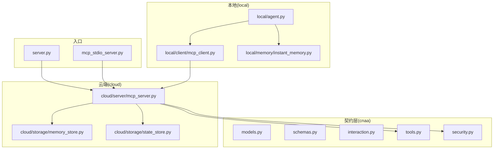
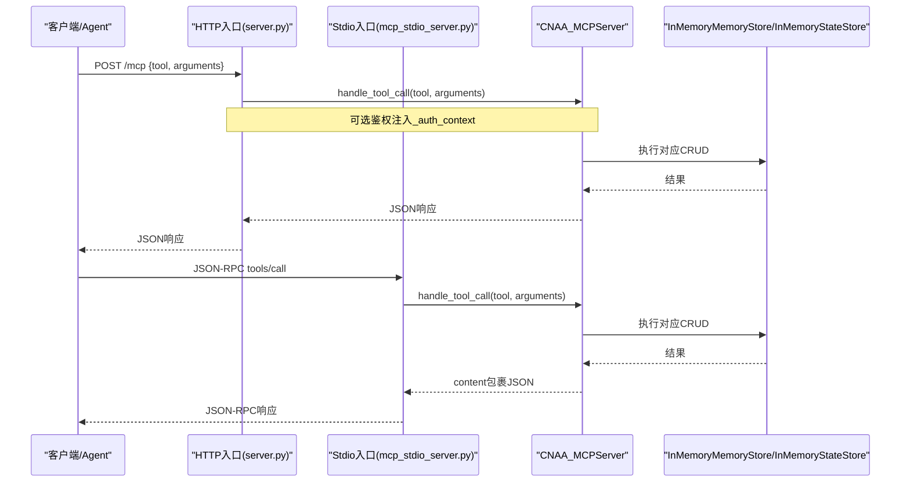
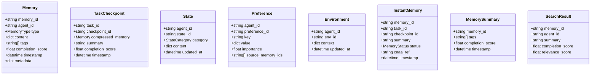
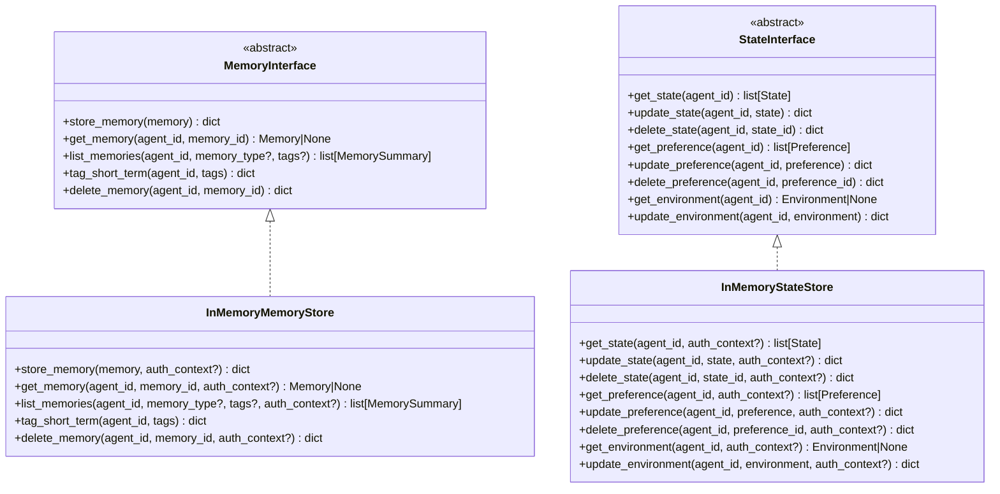
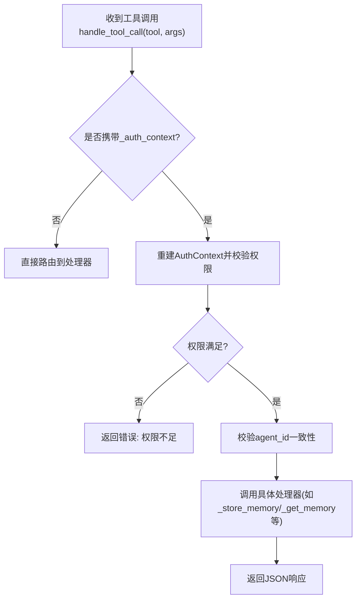
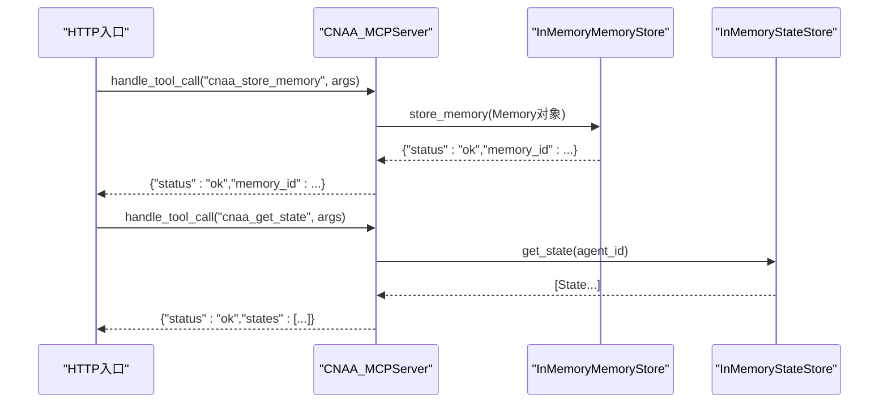
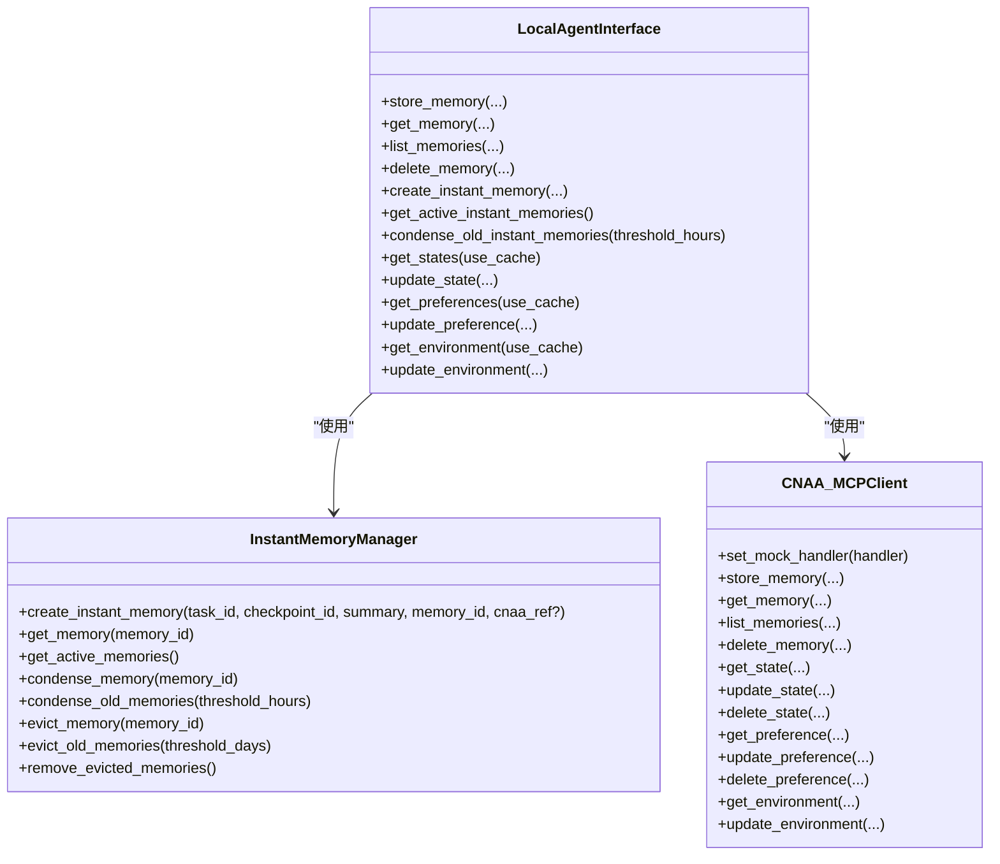
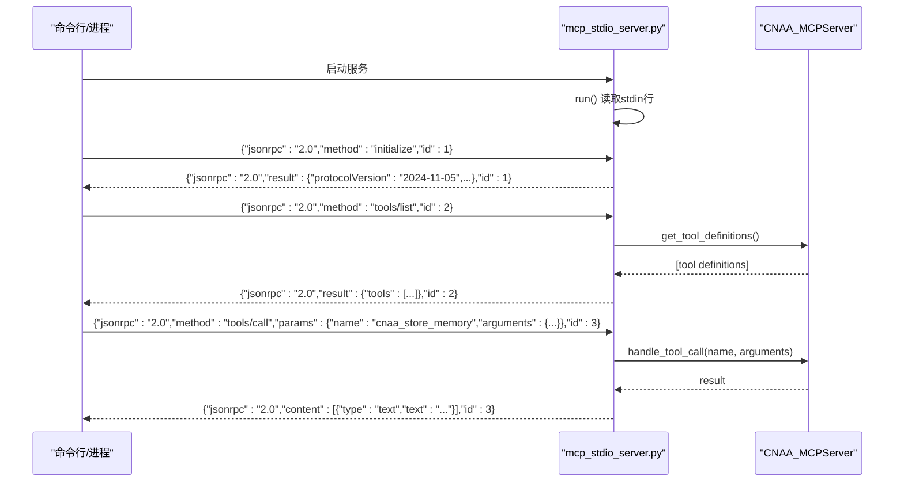
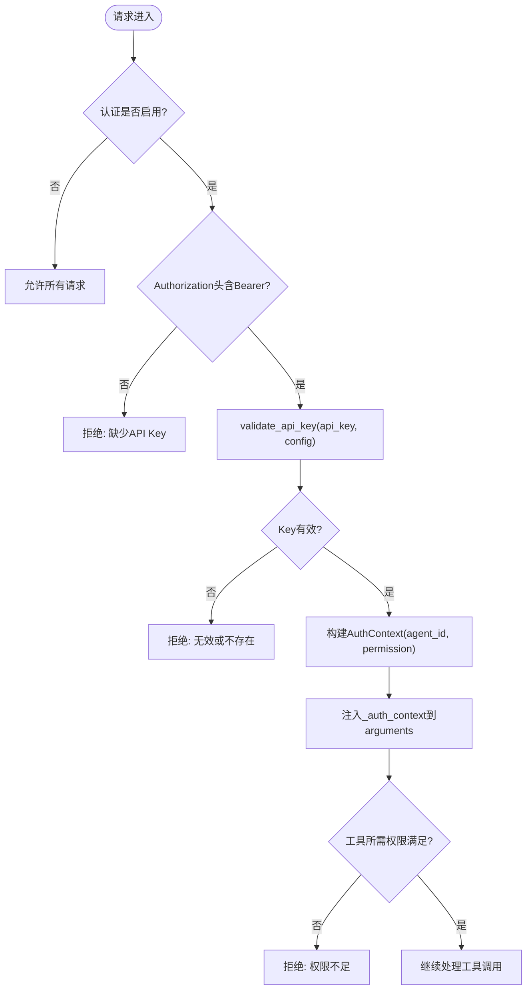
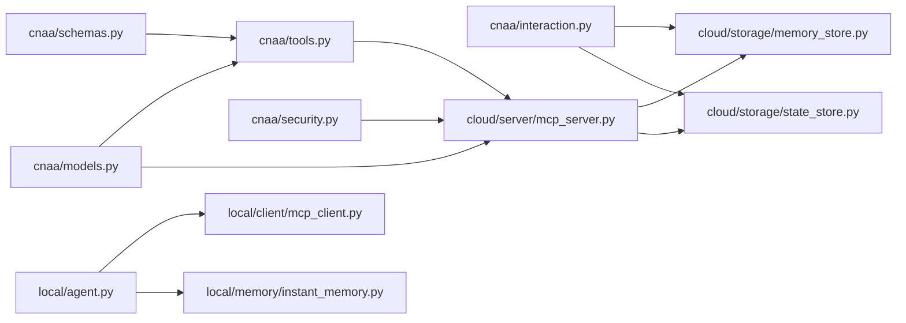

# 技术实现详解

<cite>
**本文引用的文件**   
- [README.md](file://README.md)
- [pyproject.toml](file://pyproject.toml)
- [server.py](file://server.py)
- [mcp_stdio_server.py](file://mcp_stdio_server.py)
- [cnaa/models.py](file://cnaa/models.py)
- [cnaa/schemas.py](file://cnaa/schemas.py)
- [cnaa/tools.py](file://cnaa/tools.py)
- [cloud/server/mcp_server.py](file://cloud/server/mcp_server.py)
- [cloud/storage/memory_store.py](file://cloud/storage/memory_store.py)
- [cloud/storage/state_store.py](file://cloud/storage/state_store.py)
- [local/agent.py](file://local/agent.py)
- [local/client/mcp_client.py](file://local/client/mcp_client.py)
- [local/memory/instant_memory.py](file://local/memory/instant_memory.py)
- [cnaa/security.py](file://cnaa/security.py)
- [cnaa/interaction.py](file://cnaa/interaction.py)
</cite>

## 目录
1. [简介](#简介)
2. [项目结构](#项目结构)
3. [核心组件](#核心组件)
4. [架构总览](#架构总览)
5. [详细组件分析](#详细组件分析)
6. [依赖关系分析](#依赖关系分析)
7. [性能考量](#性能考量)
8. [故障排查指南](#故障排查指南)
9. [结论](#结论)
10. [附录](#附录)

## 简介
本仓库为“云原生代理架构（CNAA）”的经验运行时框架，提供“任务检查点 + 即时记忆 + 云端持久化”的机制，使 AI Agent 能够在不修改内部推理的前提下，跨会话持久化、检索与复用经验。系统采用三层正交架构：接口契约层（What）、运行时层（How）、生命周期层（When），并通过 MCP（Model Context Protocol）进行结构化 JSON 请求-响应通信。服务端遵循“哑服务”原则（仅做 JSON 存取，不做推理或内容生成）。

## 项目结构
- cnaa：核心契约层，定义数据模型、Schema、抽象交互接口、工具定义与安全模块
- cloud：云端实现层，包含 MCP 服务端与内存存储后端（Memory/State）
- local：本地实现层，包含 MCP 客户端、即时记忆管理与状态缓存
- server.py / mcp_stdio_server.py：HTTP 与 stdio 两种服务入口
- tests：单元测试与集成测试
- docs：中英文文档与 API 参考

**图表来源** 
- [server.py:1-270](file://server.py#L1-L270)
- [mcp_stdio_server.py:1-240](file://mcp_stdio_server.py#L1-L240)
- [cloud/server/mcp_server.py:1-387](file://cloud/server/mcp_server.py#L1-L387)
- [cloud/storage/memory_store.py:1-199](file://cloud/storage/memory_store.py#L1-L199)
- [cloud/storage/state_store.py:1-276](file://cloud/storage/state_store.py#L1-L276)
- [local/agent.py:1-491](file://local/agent.py#L1-L491)
- [local/client/mcp_client.py:1-388](file://local/client/mcp_client.py#L1-L388)
- [local/memory/instant_memory.py:1-311](file://local/memory/instant_memory.py#L1-L311)
- [cnaa/tools.py:1-247](file://cnaa/tools.py#L1-L247)
- [cnaa/security.py:1-208](file://cnaa/security.py#L1-L208)

**章节来源**
- [README.md:1-187](file://README.md#L1-L187)
- [pyproject.toml:1-33](file://pyproject.toml#L1-L33)

## 核心组件
- 数据模型与 Schema：统一的数据结构与接口格式定义，作为单一事实来源
- 抽象交互接口：MemoryInterface 与 StateInterface 明确“做什么”，屏蔽“怎么做”
- MCP 工具集：13 个工具覆盖记忆、状态、偏好与环境操作
- 云端 MCP 服务器：工具路由、权限校验、序列化与存储后端调度
- 本地 Agent 接口：封装即时记忆、状态缓存与 MCP 客户端调用
- 安全认证：可选 API Key 鉴权与基于角色的权限控制

**章节来源**
- [cnaa/models.py:1-274](file://cnaa/models.py#L1-L274)
- [cnaa/schemas.py:1-479](file://cnaa/schemas.py#L1-L479)
- [cnaa/interaction.py:1-295](file://cnaa/interaction.py#L1-L295)
- [cnaa/tools.py:1-247](file://cnaa/tools.py#L1-L247)
- [cloud/server/mcp_server.py:1-387](file://cloud/server/mcp_server.py#L1-L387)
- [local/agent.py:1-491](file://local/agent.py#L1-L491)
- [cnaa/security.py:1-208](file://cnaa/security.py#L1-L208)

## 架构总览
CNAA 采用“接口契约层—运行时层—生命周期层”的正交分层，通过 MCP 协议在本地与云端之间进行结构化通信。HTTP 与 stdio 两种入口均可接入同一套工具路由与存储后端。

**图表来源** 
- [server.py:102-180](file://server.py#L102-L180)
- [mcp_stdio_server.py:107-218](file://mcp_stdio_server.py#L107-L218)
- [cloud/server/mcp_server.py:105-168](file://cloud/server/mcp_server.py#L105-L168)
- [cloud/storage/memory_store.py:42-186](file://cloud/storage/memory_store.py#L42-L186)
- [cloud/storage/state_store.py:73-245](file://cloud/storage/state_store.py#L73-L245)

## 详细组件分析

### 数据模型与 Schema
- 数据模型：Memory、TaskCheckpoint、State、Preference、Environment、InstantMemory、MemorySummary、SearchResult
- Schema：统一的 JSON 请求/响应/数据 Schema，集中管理并暴露给客户端用于理解接口格式

**图表来源** 
- [cnaa/models.py:83-274](file://cnaa/models.py#L83-L274)

**章节来源**
- [cnaa/models.py:1-274](file://cnaa/models.py#L1-L274)
- [cnaa/schemas.py:37-479](file://cnaa/schemas.py#L37-L479)

### 抽象交互接口
- MemoryInterface：记忆 CRUD、标签标记、列表查询
- StateInterface：状态、偏好、环境的获取与更新

**图表来源** 
- [cnaa/interaction.py:44-295](file://cnaa/interaction.py#L44-L295)
- [cloud/storage/memory_store.py:19-199](file://cloud/storage/memory_store.py#L19-L199)
- [cloud/storage/state_store.py:18-276](file://cloud/storage/state_store.py#L18-L276)

**章节来源**
- [cnaa/interaction.py:1-295](file://cnaa/interaction.py#L1-L295)
- [cloud/storage/memory_store.py:1-199](file://cloud/storage/memory_store.py#L1-L199)
- [cloud/storage/state_store.py:1-276](file://cloud/storage/state_store.py#L1-L276)

### MCP 工具与权限映射
- 工具定义：13 个工具名称、描述与输入 Schema
- 权限映射：读/写两类权限，结合 API Key 鉴权进行访问控制

**图表来源** 
- [cloud/server/mcp_server.py:105-168](file://cloud/server/mcp_server.py#L105-L168)
- [cnaa/tools.py:227-247](file://cnaa/tools.py#L227-L247)

**章节来源**
- [cnaa/tools.py:1-247](file://cnaa/tools.py#L1-L247)
- [cloud/server/mcp_server.py:1-387](file://cloud/server/mcp_server.py#L1-L387)

### 云端 MCP 服务器
- 职责：工具路由、参数解析、权限校验、序列化、存储后端调度
- 关键方法：handle_tool_call、_register_tool_handlers、各 _handle_* 处理器

**图表来源** 
- [cloud/server/mcp_server.py:193-387](file://cloud/server/mcp_server.py#L193-L387)
- [cloud/storage/memory_store.py:42-186](file://cloud/storage/memory_store.py#L42-L186)
- [cloud/storage/state_store.py:45-245](file://cloud/storage/state_store.py#L45-L245)

**章节来源**
- [cloud/server/mcp_server.py:1-387](file://cloud/server/mcp_server.py#L1-L387)

### 本地 Agent 接口与即时记忆
- LocalAgentInterface：统一封装记忆操作、即时记忆管理、状态缓存与 MCP 客户端调用
- InstantMemoryManager：本地短期记忆的生命周期（ACTIVE → CONDENSED → EVICTED）

**图表来源** 
- [local/agent.py:35-491](file://local/agent.py#L35-L491)
- [local/memory/instant_memory.py:21-311](file://local/memory/instant_memory.py#L21-L311)
- [local/client/mcp_client.py:24-388](file://local/client/mcp_client.py#L24-L388)

**章节来源**
- [local/agent.py:1-491](file://local/agent.py#L1-L491)
- [local/memory/instant_memory.py:1-311](file://local/memory/instant_memory.py#L1-L311)
- [local/client/mcp_client.py:1-388](file://local/client/mcp_client.py#L1-L388)

### 服务入口（HTTP 与 stdio）
- HTTP 入口：提供 /schemas、/mcp、/health 三个端点，支持可选鉴权
- stdio 入口：JSON-RPC 2.0 over stdio，支持 initialize、tools/list、tools/call

**图表来源** 
- [mcp_stdio_server.py:65-218](file://mcp_stdio_server.py#L65-L218)
- [cloud/server/mcp_server.py:170-176](file://cloud/server/mcp_server.py#L170-L176)

**章节来源**
- [server.py:67-206](file://server.py#L67-L206)
- [mcp_stdio_server.py:1-240](file://mcp_stdio_server.py#L1-L240)

### 安全认证与权限
- 默认关闭认证以兼容旧版本；可通过环境变量启用
- 支持 read_only、read_write、admin 三级权限
- 工具级权限映射，结合 AuthContext 进行校验

**图表来源** 
- [cnaa/security.py:86-166](file://cnaa/security.py#L86-L166)
- [server.py:146-179](file://server.py#L146-L179)
- [cloud/server/mcp_server.py:134-168](file://cloud/server/mcp_server.py#L134-L168)

**章节来源**
- [cnaa/security.py:1-208](file://cnaa/security.py#L1-L208)
- [server.py:102-180](file://server.py#L102-L180)
- [cloud/server/mcp_server.py:105-168](file://cloud/server/mcp_server.py#L105-L168)

## 依赖关系分析
- 契约层（cnaa）被云端与本地共同依赖，确保接口一致
- 云端 MCP 服务器依赖工具定义与安全模块，并组合两个存储后端
- 本地 Agent 接口组合即时记忆管理器与 MCP 客户端

**图表来源** 
- [cnaa/models.py:1-274](file://cnaa/models.py#L1-L274)
- [cnaa/schemas.py:1-479](file://cnaa/schemas.py#L1-L479)
- [cnaa/interaction.py:1-295](file://cnaa/interaction.py#L1-L295)
- [cnaa/tools.py:1-247](file://cnaa/tools.py#L1-L247)
- [cnaa/security.py:1-208](file://cnaa/security.py#L1-L208)
- [cloud/server/mcp_server.py:1-387](file://cloud/server/mcp_server.py#L1-L387)
- [cloud/storage/memory_store.py:1-199](file://cloud/storage/memory_store.py#L1-L199)
- [cloud/storage/state_store.py:1-276](file://cloud/storage/state_store.py#L1-L276)
- [local/agent.py:1-491](file://local/agent.py#L1-L491)
- [local/client/mcp_client.py:1-388](file://local/client/mcp_client.py#L1-L388)
- [local/memory/instant_memory.py:1-311](file://local/memory/instant_memory.py#L1-L311)

**章节来源**
- [pyproject.toml:1-33](file://pyproject.toml#L1-L33)

## 性能考量
- 路由与鉴权：O(1) 工具路由与 O(1) API Key 查找
- 存储后端：单条操作 O(1)，列表查询线性扫描 O(n)
- 即时记忆：压缩/淘汰按时间阈值线性扫描 O(n)
- 扩展点：可引入索引、分页、批量操作、连接池、限流与缓存以提升吞吐

[本节为通用指导，无需引用具体文件]

## 故障排查指南
- HTTP 端点错误：检查 Content-Length、JSON 解析、路径匹配与错误码
- MCP 工具未知：确认工具名与注册表一致
- 鉴权失败：检查 Authorization 头、API Key 配置与权限级别
- 存储未命中：确认 (agent_id, memory_id) 复合键正确性
- 本地缓存过期：调整 TTL 或强制刷新

**章节来源**
- [server.py:118-180](file://server.py#L118-L180)
- [cloud/server/mcp_server.py:127-168](file://cloud/server/mcp_server.py#L127-L168)
- [cnaa/security.py:169-208](file://cnaa/security.py#L169-L208)
- [cloud/storage/memory_store.py:87-143](file://cloud/storage/memory_store.py#L87-L143)
- [local/agent.py:261-318](file://local/agent.py#L261-L318)

## 结论
CNAA 通过清晰的契约层、可扩展的运行时与灵活的生命周期策略，实现了“小索引→大存储”的伪连续记忆模式。HTTP 与 stdio 双入口适配不同场景，内存存储便于开发与测试，未来可替换为持久化后端并增强检索与并发能力。

[本节为总结，无需引用具体文件]

## 附录
- 快速上手：运行 server.py 或 mcp_stdio_server.py，使用 pytest 执行测试
- 最小示例：直接调用 CNAA_MCPServer.handle_tool_call 完成记忆存取

**章节来源**
- [README.md:120-174](file://README.md#L120-L174)
- [docs/zh/technical-implementation.md:38-92](file://docs/zh/technical-implementation.md#L38-L92)