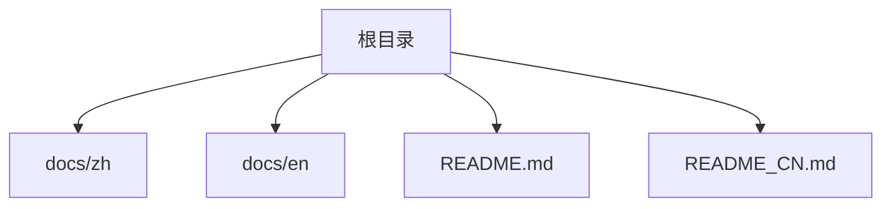
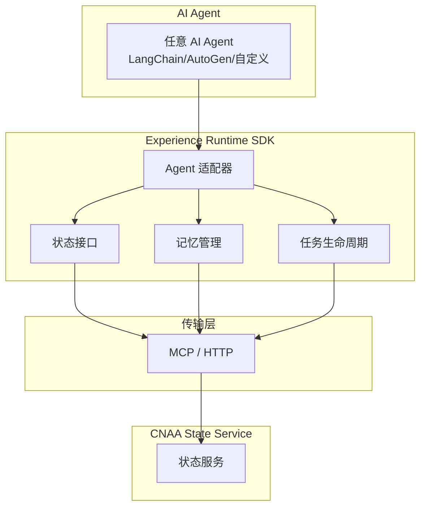
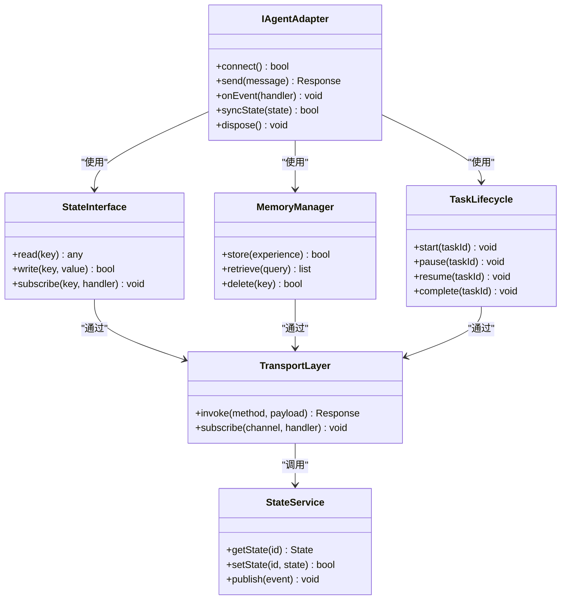

# Agent适配器开发

<cite>
**本文档引用的文件**   
- [README.md](file://README.md)
- [README_CN.md](file://README_CN.md)
</cite>

## 目录
1. [简介](#简介)
2. [项目结构](#项目结构)
3. [核心组件](#核心组件)
4. [架构总览](#架构总览)
5. [详细组件分析](#详细组件分析)
6. [依赖关系分析](#依赖关系分析)
7. [性能考虑](#性能考虑)
8. [故障排查指南](#故障排查指南)
9. [结论](#结论)
10. [附录](#附录)

## 简介
本指南面向希望在 CNAA（Cloud Native Agentic Architecture）中为不同 AI Agent（如 LangChain、AutoGen 等）开发适配器的工程师。CNAA 提供“经验运行时”与“持久化记忆”，通过统一的“状态接口”和“Agent 适配器”将任意 Agent 接入到 CNAA 的状态服务，从而实现跨生命周期的经验沉淀与状态同步。

本指南聚焦以下目标：
- 明确 Agent 适配器接口的定义与实现方法
- 说明生命周期管理、事件处理机制与状态同步策略
- 给出连接建立、消息传递、错误处理与资源清理的最佳实践
- 提供完整的适配器开发示例路径与步骤
- 说明适配器的注册机制与配置管理

重要前提：当前仓库为概念性架构与文档占位，尚未包含具体代码实现。因此本指南以架构与规范为主，结合 README 中的能力描述进行系统化说明，便于后续落地实现。

**章节来源**
- [README.md:55-85](file://README.md#L55-L85)
- [README_CN.md:63-93](file://README_CN.md#L63-L93)

## 项目结构
当前仓库主要包含中英文 README 与空文档目录。实际代码与文档尚未提交。因此本节仅概述预期结构与职责划分，便于后续扩展。

- docs/zh、docs/en：用于存放中文与英文文档（当前为空）
- README.md、README_CN.md：项目概览、特性、架构与文档索引

**图表来源**
- [README.md:76-85](file://README.md#L76-L85)
- [README_CN.md:84-93](file://README_CN.md#L84-L93)

**章节来源**
- [README.md:76-85](file://README.md#L76-L85)
- [README_CN.md:84-93](file://README_CN.md#L84-L93)

## 核心组件
根据 README 的架构描述，CNAA 的核心由“Experience Runtime SDK”组成，包括：
- 状态接口（State Interface）
- 记忆管理（Memory Manager）
- 任务生命周期（Task Lifecycle）
- Agent 适配器（Agent Adapter）

这些组件共同作用，使任意 Agent 在不修改推理逻辑的前提下，实现经验的持续积累、状态同步与复用。

- 状态接口：统一对外暴露的状态读写与订阅能力
- 记忆管理：负责经验的持久化存储与检索
- 任务生命周期：管理任务的启动、运行、完成与清理
- Agent 适配器：桥接具体 Agent 框架与 CNAA 状态接口

**章节来源**
- [README.md:55-72](file://README.md#L55-L72)
- [README_CN.md:63-80](file://README_CN.md#L63-L80)

## 架构总览
下图展示了 Agent 与 CNAA 经验运行时及状态服务的交互关系。Agent 通过适配器与运行时 SDK 通信，运行时 SDK 通过 MCP/HTTP 与 CNAA 状态服务交互，实现状态的持久化与同步。

**图表来源**
- [README.md:55-72](file://README.md#L55-L72)
- [README_CN.md:63-80](file://README_CN.md#L63-L80)

## 详细组件分析

### 适配器接口与实现要点
- 接口职责
  - 连接建立：初始化与 Agent 框架的连接（如会话、客户端、通道）
  - 消息传递：在 Agent 与 CNAA 之间转发请求与响应
  - 事件处理：捕获 Agent 生命周期事件并上报至运行时
  - 状态同步：将 Agent 内部状态映射到 CNAA 状态接口
  - 错误处理：统一异常捕获、重试与降级策略
  - 资源清理：释放连接、关闭通道、清理临时资源

- 关键抽象（建议）
  - IAgentAdapter：定义 connect、send、onEvent、syncState、dispose 等方法
  - EventSource：定义事件源与订阅机制（如 onMessage、onComplete、onError）
  - StateMapper：定义 Agent 状态到 CNAA 状态的映射规则

- 实现建议
  - 使用工厂模式按 Agent 类型创建适配器实例
  - 采用观察者模式处理事件流
  - 使用幂等写入与版本控制保证状态一致性
  - 对网络调用增加超时、重试与熔断保护

**章节来源**
- [README.md:55-72](file://README.md#L55-L72)
- [README_CN.md:63-80](file://README_CN.md#L63-L80)

### 生命周期管理
- 阶段划分
  - 初始化：加载配置、建立连接、预热资源
  - 运行：处理消息、触发事件、同步状态
  - 暂停/恢复：支持可中断与恢复执行
  - 结束：保存最终状态、释放资源、上报完成事件

- 与任务生命周期的协同
  - 任务启动时创建或复用适配器实例
  - 任务运行期间周期性同步状态
  - 任务结束时触发清理流程

**章节来源**
- [README.md:55-72](file://README.md#L55-L72)
- [README_CN.md:63-80](file://README_CN.md#L63-L80)

### 事件处理机制
- 事件类型
  - 消息事件：用户输入、工具调用结果、中间输出
  - 状态事件：任务开始、进行中、完成、失败
  - 错误事件：网络异常、解析失败、权限不足

- 处理策略
  - 事件过滤：按优先级与类型路由
  - 事件聚合：合并高频事件减少负载
  - 事件持久化：关键事件落盘以便回溯

**章节来源**
- [README.md:55-72](file://README.md#L55-L72)
- [README_CN.md:63-80](file://README_CN.md#L63-L80)

### 状态同步
- 同步策略
  - 增量同步：仅上传变更字段
  - 冲突解决：基于版本号或时间戳合并
  - 批量提交：降低网络开销

- 一致性保障
  - 幂等写入：避免重复提交导致数据不一致
  - 事务边界：确保状态更新原子性

**章节来源**
- [README.md:55-72](file://README.md#L55-L72)
- [README_CN.md:63-80](file://README_CN.md#L63-L80)

### 连接建立与消息传递
- 连接建立
  - 认证与授权：API Key、OAuth、mTLS
  - 连接池：复用连接提升吞吐
  - 健康检查：定期探测连接可用性

- 消息传递
  - 序列化格式：JSON、Protobuf 等
  - 背压控制：防止下游过载
  - 超时与重试：合理设置阈值与退避策略

**章节来源**
- [README.md:55-72](file://README.md#L55-L72)
- [README_CN.md:63-80](file://README_CN.md#L63-L80)

### 错误处理与资源清理
- 错误分类
  - 可重试错误：网络抖动、临时限流
  - 不可重试错误：参数非法、权限不足
  - 业务错误：任务失败、状态冲突

- 清理策略
  - 延迟清理：等待异步任务完成
  - 强制清理：超时或异常时立即释放
  - 资源回收：关闭连接、释放内存、删除临时文件

**章节来源**
- [README.md:55-72](file://README.md#L55-L72)
- [README_CN.md:63-80](file://README_CN.md#L63-L80)

### 适配器开发示例（LangChain）
- 步骤概览
  - 定义适配器类，实现 IAgentAdapter 接口
  - 在构造函数中初始化 LangChain 客户端与回调处理器
  - 实现 send 方法，将消息转换为 LangChain 输入格式
  - 实现 onEvent 方法，监听 LangChain 事件并上报
  - 实现 syncState 方法，将 LangChain 状态映射到 CNAA 状态
  - 在 dispose 方法中关闭客户端与释放资源

- 最佳实践
  - 使用依赖注入管理客户端实例
  - 通过配置中心动态调整超时与重试策略
  - 记录关键日志与指标便于监控

**章节来源**
- [README.md:55-72](file://README.md#L55-L72)
- [README_CN.md:63-80](file://README_CN.md#L63-L80)

### 适配器开发示例（AutoGen）
- 步骤概览
  - 定义适配器类，实现 IAgentAdapter 接口
  - 在构造函数中初始化 AutoGen 会话与事件总线
  - 实现 send 方法，将消息转换为 AutoGen 消息格式
  - 实现 onEvent 方法，订阅 AutoGen 事件并上报
  - 实现 syncState 方法，将 AutoGen 状态映射到 CNAA 状态
  - 在 dispose 方法中停止会话与清理资源

- 最佳实践
  - 使用事件驱动架构解耦消息处理
  - 实现状态快照机制便于恢复
  - 对长轮询场景使用分页与游标

**章节来源**
- [README.md:55-72](file://README.md#L55-L72)
- [README_CN.md:63-80](file://README_CN.md#L63-L80)

### 适配器注册机制与配置管理
- 注册机制
  - 静态注册：在应用启动时扫描并注册所有适配器
  - 动态注册：通过 API 或配置文件动态加载适配器
  - 版本兼容：支持多版本适配器共存

- 配置管理
  - 环境变量：敏感信息与部署相关配置
  - 配置文件：YAML/JSON 格式的适配器参数
  - 配置中心：集中化管理与热更新

- 配置项示例
  - 连接参数：端点、端口、超时、重试次数
  - 认证参数：密钥、令牌、证书路径
  - 行为参数：日志级别、采样率、缓存大小

**章节来源**
- [README.md:55-72](file://README.md#L55-L72)
- [README_CN.md:63-80](file://README_CN.md#L63-L80)

## 依赖关系分析
下图展示了适配器与运行时 SDK、状态服务之间的依赖关系。适配器依赖于状态接口、记忆管理与任务生命周期，同时通过传输层与状态服务通信。

**图表来源**
- [README.md:55-72](file://README.md#L55-L72)
- [README_CN.md:63-80](file://README_CN.md#L63-L80)

**章节来源**
- [README.md:55-72](file://README.md#L55-L72)
- [README_CN.md:63-80](file://README_CN.md#L63-L80)

## 性能考虑
- 连接复用：使用连接池减少握手开销
- 批量操作：合并多次状态更新为一次请求
- 异步处理：非阻塞 I/O 提升吞吐量
- 缓存策略：热点数据本地缓存，减少远程调用
- 限流与熔断：保护下游服务稳定性
- 监控指标：QPS、延迟、错误率、资源使用率

[本节为通用性能指导，不直接分析具体文件]

## 故障排查指南
- 常见问题
  - 连接失败：检查网络连通性与认证配置
  - 状态不同步：验证幂等性与版本控制
  - 事件丢失：确认事件队列容量与持久化
  - 内存泄漏：检查资源释放与引用计数

- 诊断工具
  - 日志收集：结构化日志与链路追踪
  - 指标采集：Prometheus/Grafana 监控
  - 调试接口：健康检查与配置热更新

- 恢复策略
  - 自动重试：指数退避与最大重试次数
  - 降级模式：禁用非核心功能
  - 快速回滚：配置与代码版本回退

[本节为通用故障排查指导，不直接分析具体文件]

## 结论
CNAA 通过“经验运行时”与“Agent 适配器”实现了任意 AI Agent 的无缝接入与状态同步。开发者只需遵循统一的适配器接口与最佳实践，即可为 LangChain、AutoGen 等不同框架快速构建适配器，实现持久化记忆与跨生命周期状态共享。随着代码库的完善，本指南将持续更新以反映最新实现细节。

[本节为总结性内容，不直接分析具体文件]

## 附录
- 术语表
  - 经验运行时：提供状态同步与记忆管理的运行时环境
  - 状态接口：统一的状态读写与订阅抽象
  - 适配器：桥接具体 Agent 框架与 CNAA 的中间层

- 参考链接
  - 快速开始、持久化记忆、状态接口、运行时 SDK、状态服务、MCP 集成、Agent 集成、整体架构

[本节为补充信息，不直接分析具体文件]