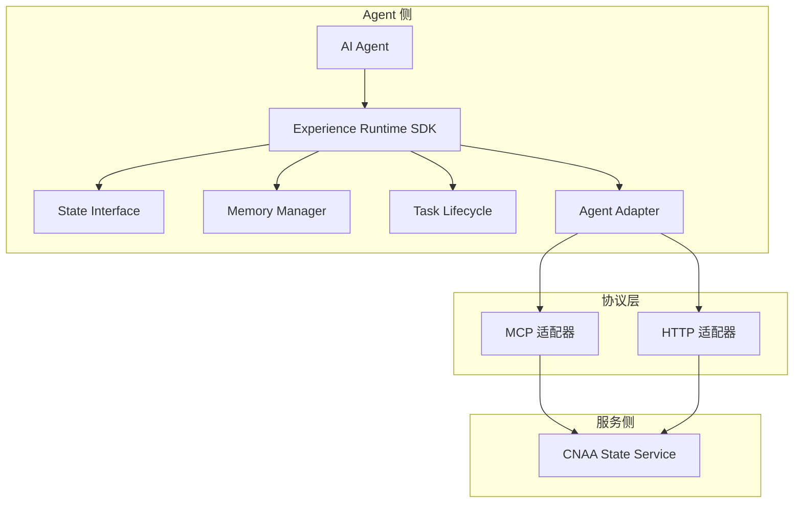
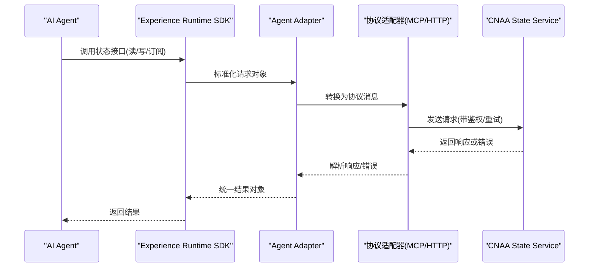
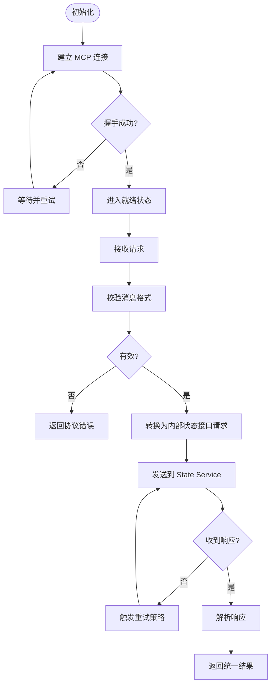
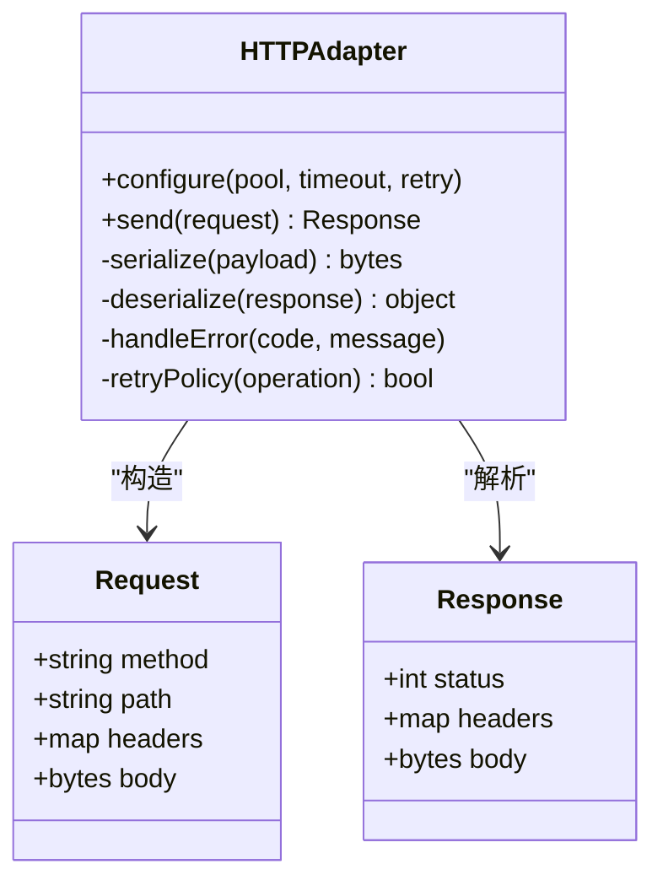
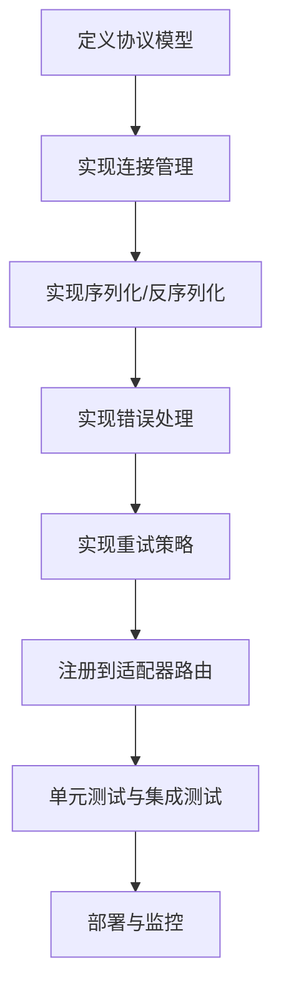
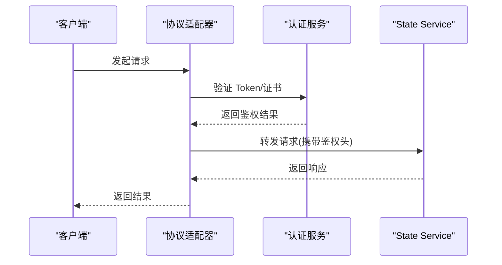
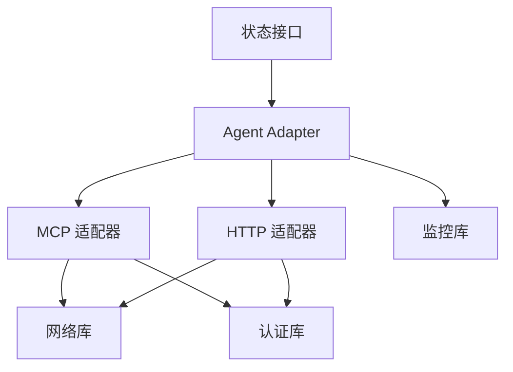

# 协议适配器开发

<cite>
**本文档引用的文件**   
- [README.md](file://README.md)
- [README_CN.md](file://README_CN.md)
</cite>

## 目录
1. [简介](#简介)
2. [项目结构](#项目结构)
3. [核心组件](#核心组件)
4. [架构总览](#架构总览)
5. [详细组件分析](#详细组件分析)
6. [依赖分析](#依赖分析)
7. [性能考虑](#性能考虑)
8. [故障排查指南](#故障排查指南)
9. [结论](#结论)
10. [附录](#附录)

## 简介
本指南面向希望在 CNAA（Cloud Native Agentic Architecture）中实现与 MCP、HTTP 等协议的适配器的开发者。CNAA 提供“经验运行时”，通过统一状态接口将 Agent 的经验沉淀为独立资源，并通过 MCP/HTTP 与 CNAA State Service 通信。本指南聚焦于：
- 如何设计与实现 MCP 和 HTTP 协议适配器
- 连接管理、消息格式转换、错误处理与重试机制
- 自定义协议适配器的扩展方法
- 安全与认证机制
- 完整示例与调试技巧

说明：当前仓库为架构与文档占位，未包含具体代码实现。本文基于 README 中的架构描述进行系统化整理，并提供可落地的实现建议与最佳实践。

## 项目结构
仓库当前包含中英文 README 与空 docs 目录，用于后续文档沉淀。从架构角度看，系统由以下层次组成：
- AI Agent：业务智能体，不直接关心底层协议细节
- Experience Runtime SDK：封装状态接口、记忆管理、任务生命周期与 Agent 适配
- 协议层：MCP / HTTP 适配器，负责与 CNAA State Service 的通信
- CNAA State Service：持久化经验与状态同步的服务端

图表来源
- [README.md:55-72](file://README.md#L55-L72)
- [README_CN.md:63-80](file://README_CN.md#L63-L80)

章节来源
- [README.md:55-72](file://README.md#L55-L72)
- [README_CN.md:63-80](file://README_CN.md#L63-L80)

## 核心组件
- 状态接口（State Interface）：对外暴露统一的读写与订阅能力，屏蔽底层协议差异
- 记忆管理器（Memory Manager）：对经验数据进行序列化、版本控制与一致性保障
- 任务生命周期（Task Lifecycle）：管理任务的创建、执行、完成与清理
- Agent 适配器（Agent Adapter）：将 Agent 内部调用转换为标准状态接口操作
- 协议适配器（MCP/HTTP）：将状态接口请求映射到具体协议的消息格式，并处理连接、重试与错误
- CNAA State Service：接收请求，持久化经验数据，维护状态一致性

章节来源
- [README.md:55-72](file://README.md#L55-L72)
- [README_CN.md:63-80](file://README_CN.md#L63-L80)

## 架构总览
下图展示了从 Agent 到 State Service 的端到端流程，包括协议适配层的职责划分与关键交互点。

图表来源
- [README.md:55-72](file://README.md#L55-L72)
- [README_CN.md:63-80](file://README_CN.md#L63-L80)

## 详细组件分析

### MCP 协议适配器
- 目标：将状态接口请求映射为 MCP 消息，建立长连接或会话，支持幂等与重试
- 关键点：
  - 连接管理：握手、心跳、断线重连、连接池
  - 消息格式：定义请求/响应/事件的结构与字段约束
  - 错误处理：区分网络错误、协议错误、业务错误；记录上下文
  - 重试机制：指数退避、最大重试次数、熔断保护

图表来源
- [README.md:55-72](file://README.md#L55-L72)
- [README_CN.md:63-80](file://README_CN.md#L63-L80)

章节来源
- [README.md:55-72](file://README.md#L55-L72)
- [README_CN.md:63-80](file://README_CN.md#L63-L80)

### HTTP 协议适配器
- 目标：使用 RESTful 或 gRPC-over-HTTP 与 State Service 通信，确保高可用与可扩展性
- 关键点：
  - 连接管理：连接池、超时配置、Keep-Alive
  - 消息格式：JSON/Protobuf 序列化，版本号兼容
  - 错误处理：HTTP 状态码映射、重试条件判断
  - 重试机制：幂等操作重试、非幂等操作保护

图表来源
- [README.md:55-72](file://README.md#L55-L72)
- [README_CN.md:63-80](file://README_CN.md#L63-L80)

章节来源
- [README.md:55-72](file://README.md#L55-L72)
- [README_CN.md:63-80](file://README_CN.md#L63-L80)

### 自定义协议适配器扩展
- 步骤：
  - 定义协议消息模型（请求/响应/事件）
  - 实现连接管理器（握手、心跳、重连）
  - 实现序列化器（编码/解码）
  - 实现错误处理器（分类与恢复）
  - 实现重试策略（退避、熔断、限流）
  - 注册到 Agent Adapter 路由表
- 注意事项：
  - 保持与状态接口的契约一致
  - 保证幂等性与事务边界
  - 提供可观测性指标（延迟、错误率、吞吐）

图表来源
- [README.md:55-72](file://README.md#L55-L72)
- [README_CN.md:63-80](file://README_CN.md#L63-L80)

章节来源
- [README.md:55-72](file://README.md#L55-L72)
- [README_CN.md:63-80](file://README_CN.md#L63-L80)

### 安全与认证机制
- 传输安全：TLS 加密、证书校验、密钥轮换
- 身份认证：Token/JWT、OAuth2、mTLS、API Key
- 授权控制：RBAC、ABAC、细粒度权限
- 审计日志：访问记录、敏感信息脱敏
- 防攻击：速率限制、IP 白名单、请求签名

图表来源
- [README.md:55-72](file://README.md#L55-L72)
- [README_CN.md:63-80](file://README_CN.md#L63-L80)

章节来源
- [README.md:55-72](file://README.md#L55-L72)
- [README_CN.md:63-80](file://README_CN.md#L63-L80)

### 调试技巧
- 日志记录：结构化日志、链路追踪 ID、敏感信息过滤
- 指标采集：QPS、延迟分位、错误率、重试次数
- 模拟测试：Mock 服务端、故障注入（延迟、丢包）
- 抓包分析：Wireshark/tcpdump、HTTP 抓包工具
- 健康检查：探针、就绪/存活检查

章节来源
- [README.md:55-72](file://README.md#L55-L72)
- [README_CN.md:63-80](file://README_CN.md#L63-L80)

## 依赖分析
- 内部依赖：
  - 协议适配器依赖状态接口契约
  - Agent Adapter 依赖协议适配器抽象
  - Memory Manager 依赖序列化与版本控制
- 外部依赖：
  - 网络库（HTTP/MCP 客户端）
  - 认证库（JWT/OAuth2/mTLS）
  - 监控库（Prometheus/OpenTelemetry）

图表来源
- [README.md:55-72](file://README.md#L55-L72)
- [README_CN.md:63-80](file://README_CN.md#L63-L80)

章节来源
- [README.md:55-72](file://README.md#L55-L72)
- [README_CN.md:63-80](file://README_CN.md#L63-L80)

## 性能考虑
- 连接复用：连接池、长连接、Keep-Alive
- 批量操作：合并请求、异步处理
- 缓存策略：本地缓存、CDN、边缘缓存
- 背压控制：队列长度限制、丢弃策略
- 资源隔离：线程池、goroutine 池、内存限制

## 故障排查指南
- 常见问题：
  - 连接失败：检查网络连通性、防火墙、证书
  - 认证失败：核对 Token 有效期、权限配置
  - 超时错误：调整超时参数、优化服务端性能
  - 重试风暴：检查重试策略、增加退避时间
- 诊断步骤：
  - 查看日志与指标
  - 抓取网络包分析
  - 模拟故障复现
  - 逐步缩小问题范围

## 结论
CNAA 的协议适配器设计以统一状态接口为核心，通过 MCP/HTTP 等适配器屏蔽底层协议差异，使 Agent 能够无缝接入不同的通信方式。实现时应重点关注连接管理、消息转换、错误处理与重试机制，同时确保安全与可观测性。通过模块化设计与良好契约，可快速扩展新的协议适配器。

## 附录
- 术语表：
  - MCP：Message Communication Protocol（消息通信协议）
  - State Interface：统一状态接口
  - Experience Runtime：经验运行时
  - CNAA State Service：状态服务
- 参考链接：
  - 快速开始、持久化记忆、状态接口、运行时 SDK、状态服务、MCP 接入、Agent 接入、整体架构