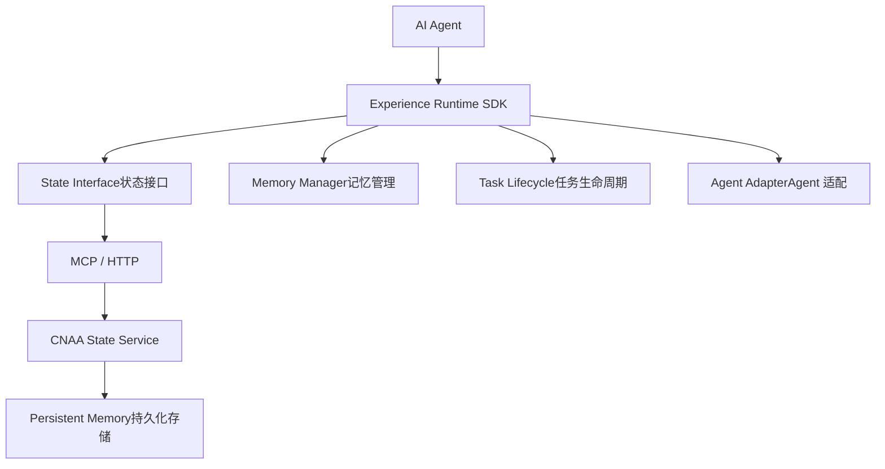
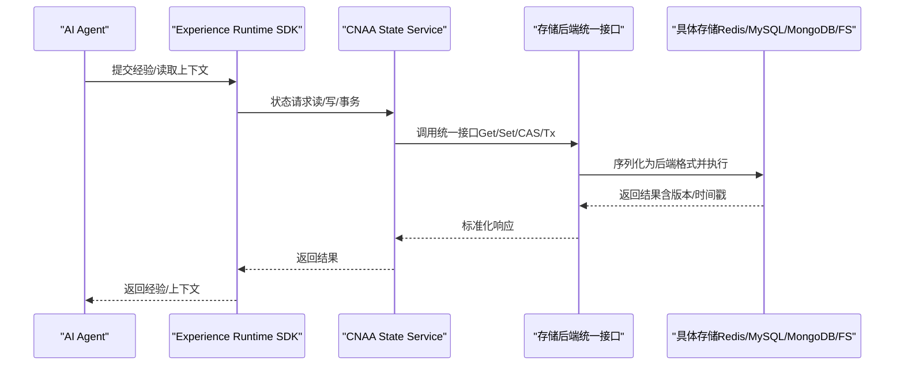
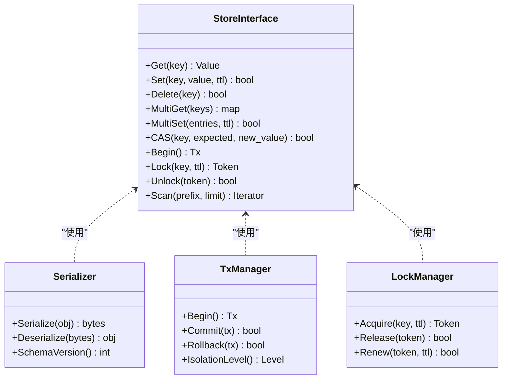
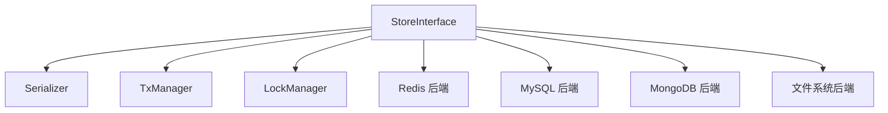

# 存储后端开发

<cite>
**本文档引用的文件**
- [README.md](file://README.md)
- [README_CN.md](file://README_CN.md)
</cite>

## 目录
1. [简介](#简介)
2. [项目结构](#项目结构)
3. [核心组件](#核心组件)
4. [架构总览](#架构总览)
5. [详细组件分析](#详细组件分析)
6. [依赖关系分析](#依赖关系分析)
7. [性能考虑](#性能考虑)
8. [故障排查指南](#故障排查指南)
9. [结论](#结论)
10. [附录](#附录)

## 简介
本指南面向希望在 CNAA（Cloud Native Agentic Architecture）中扩展“持久化经验记忆”能力的开发者，聚焦于存储后端的接口定义、实现方法、事务与并发控制、序列化/反序列化策略，以及为 Redis、MySQL、MongoDB、文件系统等不同存储系统提供统一抽象的实现路径。同时给出性能优化技巧、缓存策略、完整示例与测试方法，帮助你在不侵入 Agent 推理逻辑的前提下，构建高可用、可扩展、可观测的存储后端。

## 项目结构
当前仓库以 README 为主，定义了 CNAA 的目标与高层架构：Experience Runtime 通过统一状态接口与 Memory Manager、Task Lifecycle、Agent Adapter 等模块协作，并通过 MCP/HTTP 与 CNAA State Service 交互，最终落盘到 Persistent Memory。

图表来源
- [README.md:55-72](file://README.md#L55-L72)
- [README_CN.md:63-80](file://README_CN.md#L63-L80)

章节来源
- [README.md:1-102](file://README.md#L1-L102)
- [README_CN.md:1-110](file://README_CN.md#L1-L110)

## 核心组件
围绕“持久化经验记忆”，存储后端需要暴露一组稳定、幂等、可组合的接口，供上层 Experience Runtime 调用。建议的最小能力集如下：
- 键值读写：Get/Set/Delete/MultiGet/MultiSet
- 条件写入：CompareAndSwap（CAS）、原子递增/递减
- 事务支持：Begin/Commit/Rollback、隔离级别选择
- 并发控制：锁（分布式锁/细粒度锁）、版本控制（乐观锁）
- 序列化/反序列化：JSON、Protobuf、MessagePack 等
- 查询与索引：范围查询、标签过滤、全文检索（按存储类型可选）
- 元数据与审计：操作日志、时间戳、版本号、TTL
- 健康检查与可观测性：指标、追踪、告警

这些能力将作为“存储后端接口”的契约，确保不同存储系统可以无缝替换。

章节来源
- [README.md:55-72](file://README.md#L55-L72)
- [README_CN.md:63-80](file://README_CN.md#L63-L80)

## 架构总览
下图展示了从 Agent 到持久化存储的端到端流程，并标注了存储后端在其中的职责边界。

图表来源
- [README.md:55-72](file://README.md#L55-L72)
- [README_CN.md:63-80](file://README_CN.md#L63-L80)

## 详细组件分析

### 存储后端接口设计
- 统一接口层
  - 定义 Get/Set/Delete/MultiGet/MultiSet/CAS/Tx/Lock/Unlock/Index/Scan 等方法
  - 输入输出采用框架内标准模型（如 ExperienceRecord、VersionedValue、TxContext）
  - 错误码与异常分类：NotFound、Conflict、Timeout、Unavailable、SerializationError 等
- 序列化器
  - 提供 JSON、Protobuf、MessagePack 等插件式序列化器
  - 支持字段级压缩、增量更新、向后兼容的 schema 演进
- 事务管理器
  - 封装 Begin/Commit/Rollback，支持多后端事务或补偿事务
  - 提供隔离级别配置（读已提交、可重复读、串行化）
- 并发控制器
  - 分布式锁（基于 Redis Lua 或数据库行锁）
  - 乐观锁（版本号/时间戳冲突检测）
- 查询与索引
  - 针对 KV 存储：前缀扫描、排序键设计
  - 针对 SQL/NoSQL：二级索引、聚合视图、物化缓存
- 可观测性与健康检查
  - 指标：QPS、延迟分位、错误率、连接池使用率
  - 追踪：跨服务链路 ID、操作耗时
  - 健康检查：连通性、容量水位、慢查询

图表来源
- [README.md:55-72](file://README.md#L55-L72)
- [README_CN.md:63-80](file://README_CN.md#L63-L80)

章节来源
- [README.md:55-72](file://README.md#L55-L72)
- [README_CN.md:63-80](file://README_CN.md#L63-L80)

### 数据序列化/反序列化
- 选型建议
  - 高性能场景：MessagePack/Protobuf
  - 可读性与调试：JSON
  - 大对象：分块序列化+压缩（zstd/lz4）
- 兼容性策略
  - 版本字段与向后兼容规则
  - 字段弃用与默认值
  - 迁移工具与灰度发布
- 性能要点
  - 避免频繁 GC：复用缓冲、对象池
  - 批量序列化减少分配
  - 热点键短小紧凑

章节来源
- [README.md:55-72](file://README.md#L55-L72)
- [README_CN.md:63-80](file://README_CN.md#L63-L80)

### 事务支持与并发控制
- 事务模型
  - 两阶段提交（2PC）用于强一致场景
  - 本地事务+消息补偿用于高可用场景
  - 事件溯源模式用于不可变记录
- 并发控制
  - 悲观锁：行锁/表锁/分布式锁
  - 乐观锁：版本号/时间戳冲突重试
- 隔离级别
  - 读已提交：默认推荐
  - 可重复读：适合报表/快照
  - 串行化：严格一致性但吞吐较低

章节来源
- [README.md:55-72](file://README.md#L55-L72)
- [README_CN.md:63-80](file://README_CN.md#L63-L80)

### 为不同存储系统开发后端

#### Redis 后端
- 适用场景：低延迟、高吞吐、KV/计数器/会话/缓存
- 关键实现
  - 原子操作：Lua 脚本保证 CAS/自增
  - 过期策略：TTL 与惰性删除
  - 分布式锁：SET NX PX + 续期
  - 批量：Pipeline 与 MGET/MSET
- 注意事项
  - 内存水位监控与淘汰策略
  - 网络分区与超时重试
  - 大 Key 问题与拆分

章节来源
- [README.md:55-72](file://README.md#L55-L72)
- [README_CN.md:63-80](file://README_CN.md#L63-L80)

#### MySQL 后端
- 适用场景：强一致、复杂查询、事务、审计
- 关键实现
  - 表设计：主键、索引、分区、归档
  - 事务：InnoDB 事务与隔离级别
  - 锁：行锁、间隙锁、死锁检测
  - 读写分离与连接池
- 注意事项
  - 慢查询优化与 EXPLAIN
  - 备份恢复与 PITR
  - 扩容与分库分表

章节来源
- [README.md:55-72](file://README.md#L55-L72)
- [README_CN.md:63-80](file://README_CN.md#L63-L80)

#### MongoDB 后端
- 适用场景：半结构化数据、文档型、灵活 Schema
- 关键实现
  - 索引：复合索引、文本索引、地理索引
  - 事务：多文档 ACID（副本集/分片集群）
  - 聚合管道：复杂计算与投影
- 注意事项
  - 文档大小限制与嵌入 vs 引用
  - 分片键设计与热点
  - 复制集选举与故障转移

章节来源
- [README.md:55-72](file://README.md#L55-L72)
- [README_CN.md:63-80](file://README_CN.md#L63-L80)

#### 文件系统后端
- 适用场景：对象/文件、离线批处理、归档
- 关键实现
  - 目录组织：命名空间、哈希分桶
  - 并发：文件锁、原子写入（临时文件+重命名）
  - 校验：CRC/SHA 校验与完整性检查
- 注意事项
  - 磁盘 IO 瓶颈与 SSD/NVMe
  - 备份与快照
  - 权限与安全

章节来源
- [README.md:55-72](file://README.md#L55-L72)
- [README_CN.md:63-80](file://README_CN.md#L63-L80)

### 性能优化与缓存策略
- 缓存分层
  - L1：进程内缓存（LRU/ARC）
  - L2：本地共享缓存（Caffeine/Guava）
  - L3：分布式缓存（Redis/Memcached）
  - L4：CDN/边缘缓存（静态资源）
- 缓存一致性
  - Cache-Aside、Read/Write Through、Write Behind
  - 失效策略：TTL、懒失效、主动刷新
  - 双写一致性：先更新 DB，再删缓存；或使用订阅变更
- 热点与倾斜
  - 热点键保护：本地缓存+限流
  - 预取与预热：启动加载、定时刷新
- 批处理与合并
  - 写合并、批量提交、异步落盘
- 资源与限流
  - 连接池、线程池、令牌桶、滑动窗口

章节来源
- [README.md:55-72](file://README.md#L55-L72)
- [README_CN.md:63-80](file://README_CN.md#L63-L80)

### 完整的存储后端开发示例（步骤）
- 步骤一：定义接口与数据模型
  - 明确 Get/Set/Delete/Multi/CAS/Tx/Lock/Scan 等 API
  - 定义 ExperienceRecord、VersionedValue、TxContext 等模型
- 步骤二：实现序列化器
  - 选择 JSON/Protobuf/MessagePack
  - 实现 Schema 版本管理与迁移
- 步骤三：实现具体存储后端
  - Redis：Lua 原子、Pipeline、TTL、分布式锁
  - MySQL：表结构、索引、事务、锁
  - MongoDB：集合、索引、聚合、事务
  - FS：目录结构、原子写入、校验
- 步骤四：集成事务与并发控制
  - 封装 TxManager/LockManager
  - 选择隔离级别与重试策略
- 步骤五：接入可观测性
  - 指标、追踪、健康检查、告警
- 步骤六：编写测试
  - 单元测试：接口契约、序列化、边界条件
  - 集成测试：真实存储环境、事务、锁、并发
  - 压力测试：吞吐、延迟、稳定性
  - 混沌测试：网络抖动、节点宕机、脑裂

章节来源
- [README.md:55-72](file://README.md#L55-L72)
- [README_CN.md:63-80](file://README_CN.md#L63-L80)

### 测试方法与最佳实践
- 单元与契约测试
  - 使用 Mock 存储验证业务逻辑
  - 契约测试确保多后端行为一致
- 集成测试
  - Docker Compose 拉起 Redis/MySQL/MongoDB
  - 覆盖事务、锁、并发、失败回滚
- 压测与基准
  - 使用 wrk/locust/jmeter 模拟负载
  - 关注 P95/P99 延迟与错误率
- 回归与稳定性
  - 长期运行观察内存泄漏、句柄泄露
  - 定期演练故障恢复

章节来源
- [README.md:55-72](file://README.md#L55-L72)
- [README_CN.md:63-80](file://README_CN.md#L63-L80)

## 依赖关系分析
- 组件耦合
  - StoreInterface 对 Serializer/TxManager/LockManager 存在依赖
  - 各具体后端仅依赖统一接口，降低耦合
- 外部依赖
  - 网络存储（Redis/MySQL/MongoDB）需考虑网络分区与超时
  - 文件系统需考虑 IO 与权限
- 循环依赖
  - 通过接口解耦，避免直接循环引用
- 可替换性
  - 运行时注入具体后端实现，支持热切换

图表来源
- [README.md:55-72](file://README.md#L55-L72)
- [README_CN.md:63-80](file://README_CN.md#L63-L80)

章节来源
- [README.md:55-72](file://README.md#L55-L72)
- [README_CN.md:63-80](file://README_CN.md#L63-L80)

## 性能考虑
- 延迟与吞吐
  - 优先选择低延迟存储（Redis）用于热点路径
  - 批量操作与 Pipeline 提升吞吐
- 资源利用
  - 合理设置连接池、线程池、缓冲区大小
  - 监控 CPU/内存/IO 使用率
- 一致性权衡
  - 最终一致 vs 强一致的选择
  - 读写分离与副本延迟
- 容量规划
  - 预估增长曲线与扩容策略
  - 冷热数据分层与归档

[本节为通用指导，不直接分析具体文件]

## 故障排查指南
- 常见问题
  - 序列化失败：检查 Schema 版本与字段类型
  - 事务冲突：查看锁竞争与隔离级别
  - 连接超时：检查网络、防火墙、连接池耗尽
  - 热点键：定位大 Key 与访问倾斜
- 诊断手段
  - 指标：QPS、延迟、错误率、连接数
  - 追踪：跨服务链路、慢查询
  - 日志：关键路径与异常堆栈
- 恢复策略
  - 自动重试与退避
  - 降级与熔断
  - 快速回滚与快照恢复

章节来源
- [README.md:55-72](file://README.md#L55-L72)
- [README_CN.md:63-80](file://README_CN.md#L63-L80)

## 结论
通过统一的存储后端接口、完善的序列化与事务/并发控制机制，以及针对不同存储系统的优化策略，CNAA 能够在不侵入 Agent 推理逻辑的前提下，提供稳定、高效、可扩展的持久化经验记忆能力。建议在实施过程中坚持接口契约、充分测试与可观测性建设，逐步迭代优化性能与可靠性。

[本节为总结性内容，不直接分析具体文件]

## 附录
- 术语表
  - 经验记录（ExperienceRecord）：一次任务经验的结构化描述
  - 版本化值（VersionedValue）：带版本号的值，用于乐观锁
  - 事务上下文（TxContext）：事务边界与隔离级别信息
- 参考架构图
  - 见“架构总览”中的时序图与类图

[本节为补充信息，不直接分析具体文件]