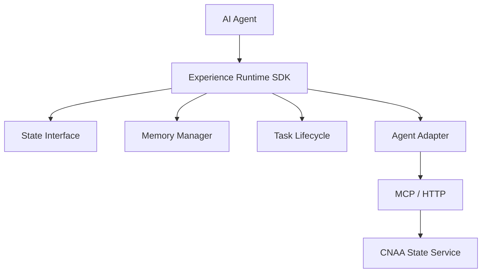
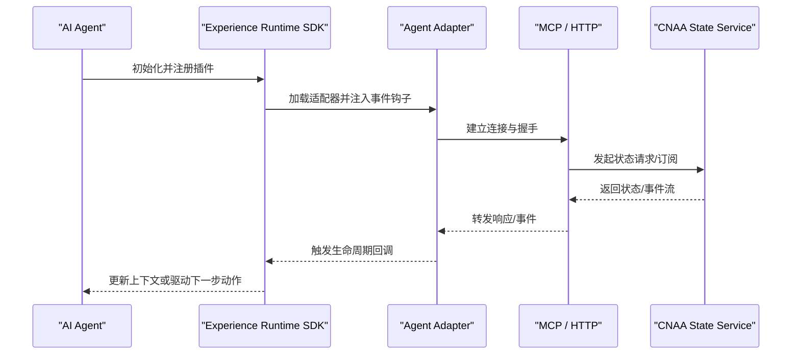
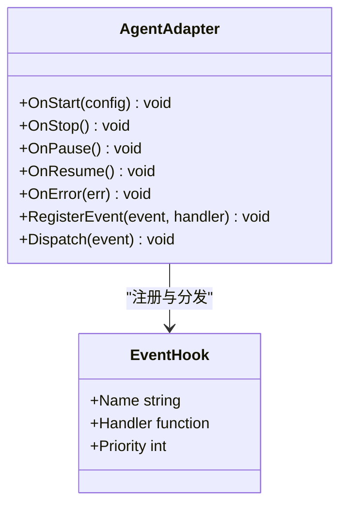
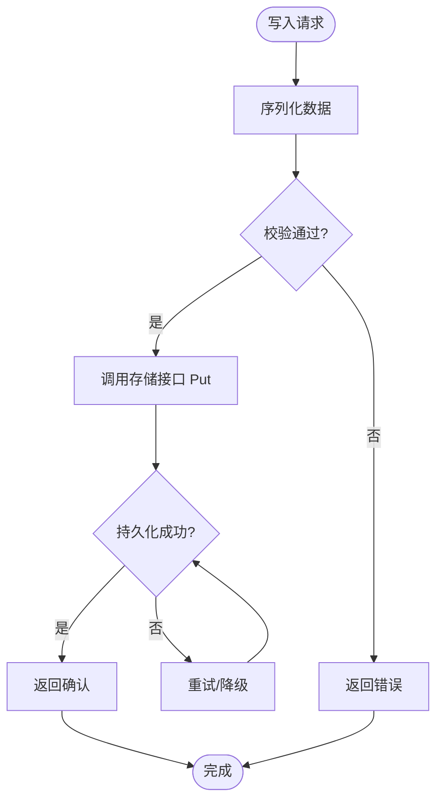
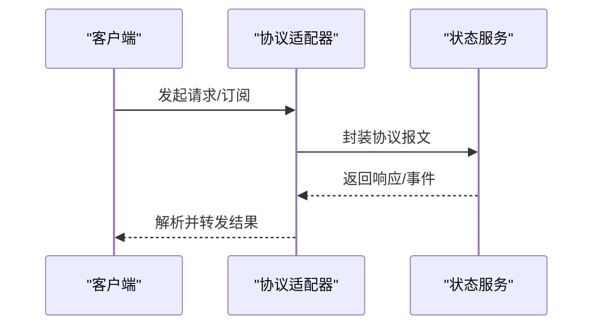
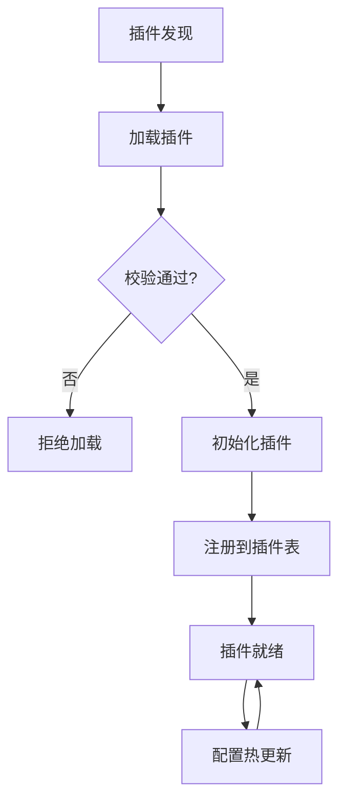
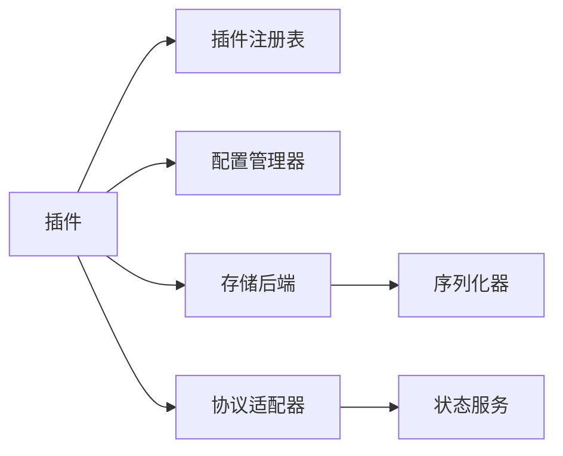

# 插件开发指南

<cite>
**本文档引用的文件**   
- [README.md](file://README.md)
- [README_CN.md](file://README_CN.md)
</cite>

## 目录
1. [简介](#简介)
2. [项目结构](#项目结构)
3. [核心组件](#核心组件)
4. [架构总览](#架构总览)
5. [详细组件分析](#详细组件分析)
6. [依赖关系分析](#依赖关系分析)
7. [性能考虑](#性能考虑)
8. [故障排查指南](#故障排查指南)
9. [结论](#结论)
10. [附录](#附录)

## 简介
本指南面向希望在 CNAA（Cloud Native Agentic Architecture）中开发插件的工程师，重点覆盖以下主题：
- Agent 适配器的接口定义、生命周期管理与事件处理机制
- 存储后端的扩展开发：持久化存储接口与数据序列化/反序列化
- 协议适配器的开发：支持 MCP 与 HTTP 协议的自定义实现
- 插件注册机制、配置管理与版本兼容性处理
- 完整的插件开发示例与调试技巧

CNAA 提供轻量级“经验运行时”，使任意 AI Agent 在不修改推理逻辑的前提下，持续沉淀、同步与复用任务经验。其核心能力包括持久化经验记忆、状态同步、统一状态接口、Agent 无关设计与云/本地部署。

## 项目结构
当前仓库为概念与文档阶段，包含中英文 README 与空 docs 目录。后续将逐步完善 SDK、State Interface、Memory Manager、Task Lifecycle、Agent Adapter、MCP/HTTP 协议层与 State Service 的实现与文档。

图表来源
- [README.md:55-72](file://README.md#L55-L72)
- [README_CN.md:63-80](file://README_CN.md#L63-L80)

章节来源
- [README.md:1-102](file://README.md#L1-L102)
- [README_CN.md:1-110](file://README_CN.md#L1-L110)

## 核心组件
- 状态接口（State Interface）：统一的读写与同步抽象，屏蔽底层存储差异
- 记忆管理（Memory Manager）：经验的增删改查、版本控制与一致性保障
- 任务生命周期（Task Lifecycle）：任务的创建、执行、挂起、恢复与终结
- Agent 适配器（Agent Adapter）：对接不同 Agent 框架的事件与回调
- 协议层（MCP / HTTP）：跨进程通信与远程服务调用
- 状态服务（State Service）：分布式状态同步与持久化后端

章节来源
- [README.md:55-72](file://README.md#L55-L72)
- [README_CN.md:63-80](file://README_CN.md#L63-L80)

## 架构总览
下图展示了从 Agent 到状态服务的整体交互流程，以及插件在其中的位置与作用点。

图表来源
- [README.md:55-72](file://README.md#L55-L72)
- [README_CN.md:63-80](file://README_CN.md#L63-L80)

## 详细组件分析

### Agent 适配器开发
目标：为不同 Agent 框架提供统一接入点，屏蔽差异，暴露标准事件与生命周期。

- 接口定义要点
  - 生命周期方法：OnStart、OnStop、OnPause、OnResume、OnError
  - 事件回调：TaskStarted、TaskCompleted、TaskFailed、StateUpdated
  - 配置注入：适配器所需参数（如 Agent 类型、端点、认证信息）
  - 错误上报：标准化错误码与消息，便于上层处理

- 生命周期管理
  - 启动阶段：校验配置、建立连接、注册事件监听
  - 运行阶段：事件分发、状态同步、超时与重试
  - 停止阶段：清理资源、断开连接、释放句柄

- 事件处理机制
  - 事件队列与背压控制，避免阻塞主循环
  - 事件去重与幂等性保证
  - 异步处理与并发安全

图表来源
- [README.md:55-72](file://README.md#L55-L72)
- [README_CN.md:63-80](file://README_CN.md#L63-L80)

章节来源
- [README.md:55-72](file://README.md#L55-L72)
- [README_CN.md:63-80](file://README_CN.md#L63-L80)

### 存储后端扩展开发
目标：实现可插拔的持久化存储，支持多种后端（内存、文件、数据库、对象存储等）。

- 持久化存储接口
  - Get(key) -> value, error
  - Put(key, value, ttl) -> error
  - Delete(key) -> error
  - List(prefix) -> []key, error
  - Exists(key) -> bool, error
  - BatchGet(keys) -> map[key]value, error
  - BatchPut(entries, ttl) -> error

- 数据序列化/反序列化
  - 选择序列化格式（JSON、Protobuf、MessagePack 等）
  - 版本兼容字段映射与迁移策略
  - 压缩与分片策略（大对象场景）

- 事务与一致性
  - 单键原子操作与多键事务
  - 冲突检测与合并策略（CRDT/LWW）
  - 快照与增量同步

图表来源
- [README.md:55-72](file://README.md#L55-L72)
- [README_CN.md:63-80](file://README_CN.md#L63-L80)

章节来源
- [README.md:55-72](file://README.md#L55-L72)
- [README_CN.md:63-80](file://README_CN.md#L63-L80)

### 协议适配器开发（MCP / HTTP）
目标：为不同通信协议提供统一抽象，支持远程状态访问与事件订阅。

- 协议抽象接口
  - Connect(endpoint, options) -> Connection
  - Request(method, path, payload) -> Response
  - Subscribe(channel, handler) -> Subscription
  - Publish(channel, message) -> error
  - Close() -> error

- MCP 协议实现要点
  - 会话管理与心跳保活
  - 消息路由与编解码
  - 错误码映射与重试策略

- HTTP 协议实现要点
  - RESTful API 设计（GET/POST/PUT/DELETE）
  - WebSocket/SSE 用于事件推送
  - 鉴权与限流（JWT、OAuth、Rate Limiting）

图表来源
- [README.md:55-72](file://README.md#L55-L72)
- [README_CN.md:63-80](file://README_CN.md#L63-L80)

章节来源
- [README.md:55-72](file://README.md#L55-L72)
- [README_CN.md:63-80](file://README_CN.md#L63-L80)

### 插件注册机制与配置管理
- 插件注册
  - 动态发现：文件系统扫描、服务发现、清单文件
  - 注册表维护：名称、版本、依赖、入口函数
  - 生命周期管理：加载、初始化、卸载

- 配置管理
  - 分层配置：默认值、环境变量、配置文件、运行时覆盖
  - 配置校验：类型检查、必填项、范围限制
  - 热更新：无需重启的动态配置生效

- 版本兼容性
  - 语义化版本控制（SemVer）
  - 向后兼容策略与弃用标记
  - 升级路径与迁移脚本

图表来源
- [README.md:55-72](file://README.md#L55-L72)
- [README_CN.md:63-80](file://README_CN.md#L63-L80)

章节来源
- [README.md:55-72](file://README.md#L55-L72)
- [README_CN.md:63-80](file://README_CN.md#L63-L80)

### 完整插件开发示例
以下为一个典型的插件开发步骤（以存储插件为例）：

1. 定义插件元数据：名称、版本、作者、描述、许可证
2. 实现存储接口：Get/Put/Delete/List/Exists/BatchGet/BatchPut
3. 实现序列化器：Marshal/Unmarshal 与版本迁移
4. 注册插件：在初始化时向插件表注册
5. 配置注入：从配置中心读取后端参数
6. 测试验证：单元测试、集成测试、压力测试
7. 发布与升级：版本号递增、变更日志、迁移脚本

章节来源
- [README.md:55-72](file://README.md#L55-L72)
- [README_CN.md:63-80](file://README_CN.md#L63-L80)

### 调试技巧
- 日志分级：DEBUG/INFO/WARN/ERROR，按模块与级别输出
- 追踪ID：贯穿请求链路，便于问题定位
- 指标采集：QPS、延迟、错误率、资源使用率
- 断点与堆栈：关键路径打点，异常捕获与上报
- 模拟环境：Mock 外部依赖，隔离测试

章节来源
- [README.md:55-72](file://README.md#L55-L72)
- [README_CN.md:63-80](file://README_CN.md#L63-L80)

## 依赖关系分析
插件系统各组件之间的依赖关系如下：

图表来源
- [README.md:55-72](file://README.md#L55-L72)
- [README_CN.md:63-80](file://README_CN.md#L63-L80)

章节来源
- [README.md:55-72](file://README.md#L55-L72)
- [README_CN.md:63-80](file://README_CN.md#L63-L80)

## 性能考虑
- 缓存策略：热点数据本地缓存，多级缓存（L1/L2）
- 批处理：批量读写减少网络与磁盘开销
- 异步化：非阻塞 I/O，事件驱动模型
- 连接池：复用连接，避免频繁建连
- 限流与熔断：保护下游服务，快速失败
- 监控告警：关键指标阈值告警，自动扩缩容

## 故障排查指南
- 常见问题
  - 插件加载失败：检查依赖、权限、路径
  - 配置错误：校验必填项、类型、范围
  - 存储异常：连接超时、权限不足、空间不足
  - 协议错误：握手失败、编码不匹配、超时
- 排查步骤
  - 查看日志：过滤 ERROR/WARN，定位时间线
  - 检查配置：对比期望与实际配置
  - 复现问题：最小化用例，隔离变量
  - 抓包分析：网络层诊断，报文内容核对
- 恢复策略
  - 回滚版本：快速恢复服务
  - 切换后端：故障转移与降级
  - 清理状态：重置脏数据，重建索引

## 结论
CNAA 插件系统通过标准化的接口与灵活的扩展点，为 Agent 生态提供了强大的能力支撑。开发者可基于本指南快速实现 Agent 适配器、存储后端与协议适配器，并通过完善的注册机制、配置管理与版本兼容性策略，构建稳定可靠的插件体系。建议在实际开发中遵循最佳实践，注重性能优化与故障排查，确保插件的高质量交付。

## 附录
- 术语表
  - Agent：智能体，执行任务的核心实体
  - 插件：可插拔的功能模块，扩展系统能力
  - 适配器：桥接不同实现的中间层
  - 序列化：数据结构转换为可存储/传输格式
  - 协议：通信规则与约定
- 参考链接
  - 快速开始、持久化记忆、状态接口、运行时 SDK、状态服务、MCP 接入、Agent 接入、整体架构（详见 README 文档列表）