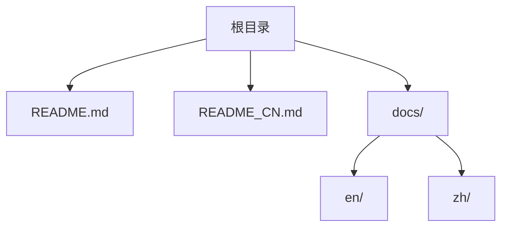
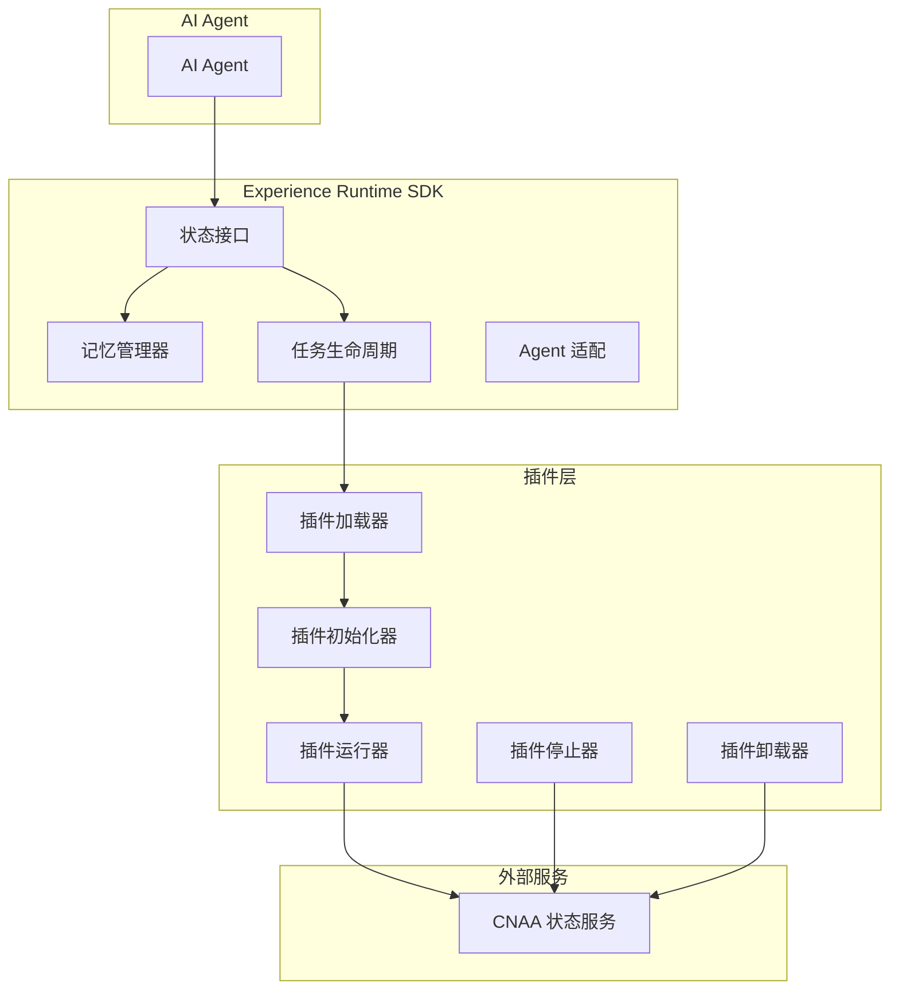
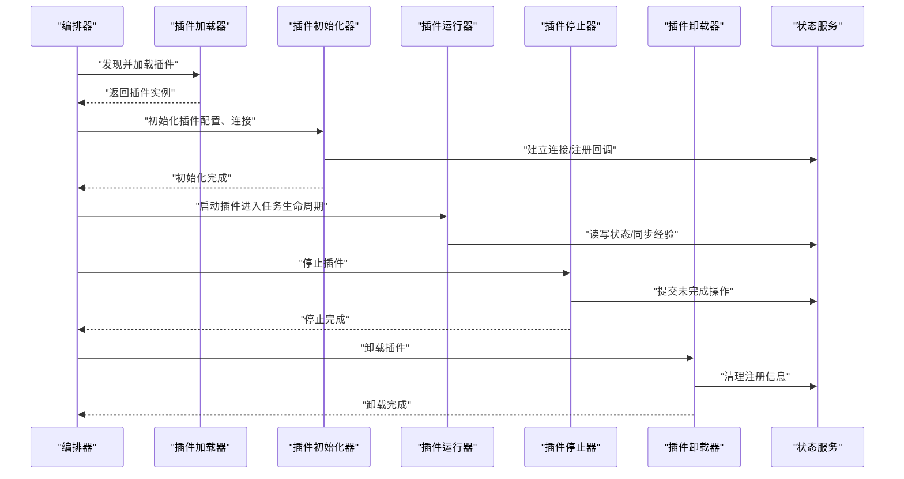
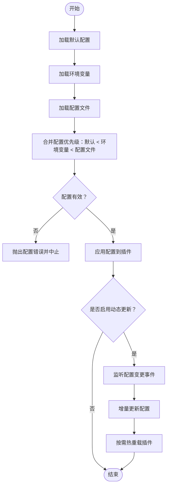
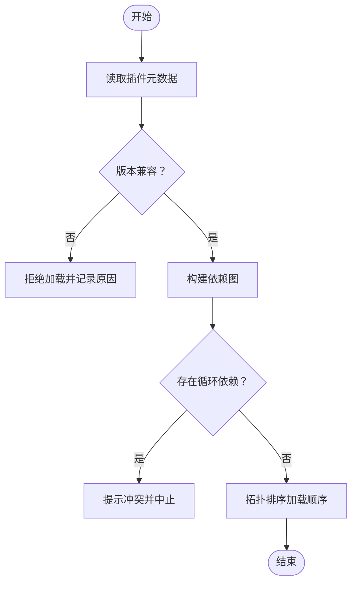
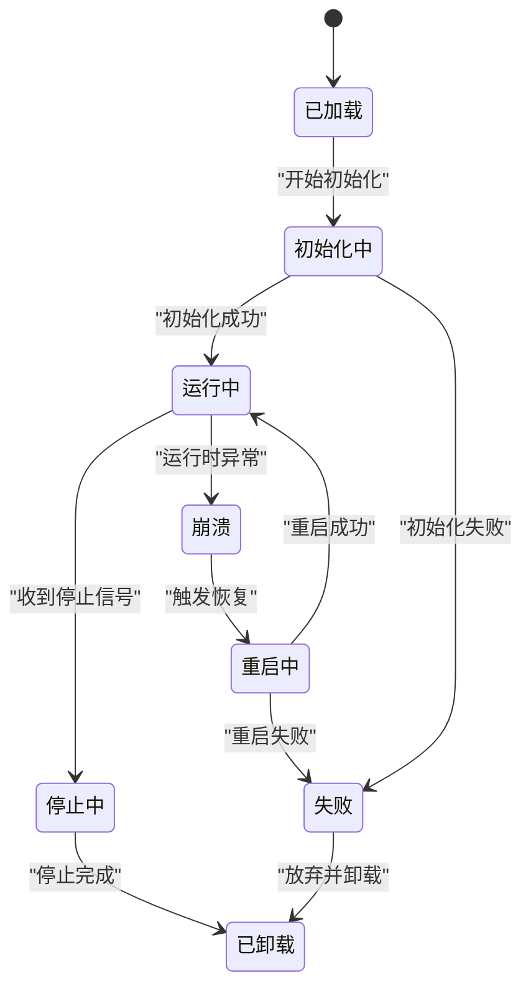
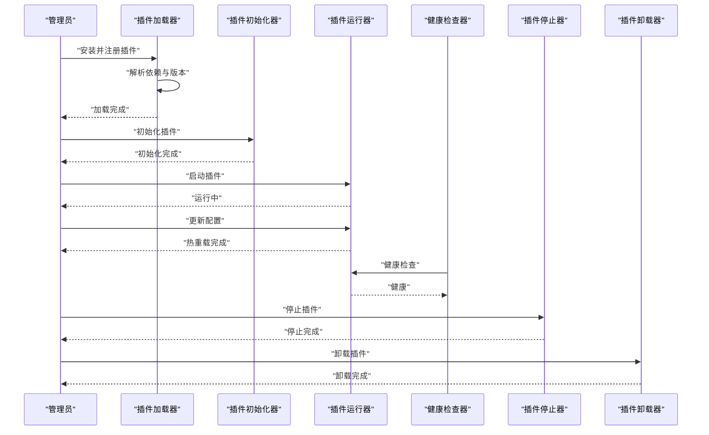
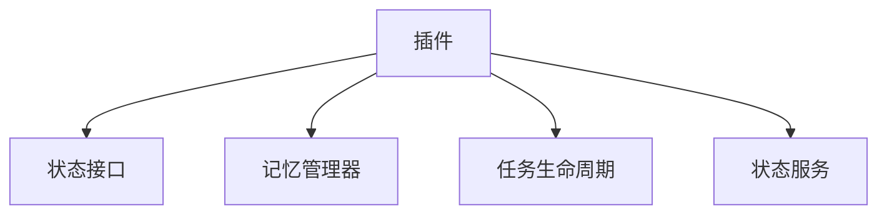

# 插件生命周期管理

<cite>
**本文引用的文件**   
- [README.md](file://README.md)
- [README_CN.md](file://README_CN.md)
</cite>

## 目录
1. [简介](#简介)
2. [项目结构](#项目结构)
3. [核心组件](#核心组件)
4. [架构总览](#架构总览)
5. [详细组件分析](#详细组件分析)
6. [依赖分析](#依赖分析)
7. [性能考虑](#性能考虑)
8. [故障排查指南](#故障排查指南)
9. [结论](#结论)
10. [附录](#附录)

## 简介
本指南面向 CNAA（Cloud Native Agentic Architecture）的插件生命周期管理，围绕插件的加载、初始化、启动、停止与卸载流程进行系统化说明。同时覆盖配置管理机制（配置文件结构、环境变量支持、动态更新）、版本兼容性与依赖管理、热重载与故障恢复机制，并提供完整的生命周期示例，帮助读者在 CNAA Experience Runtime 中安全、稳定地扩展能力。

CNAA 定位为“经验运行时”，通过统一状态接口、记忆管理与任务生命周期等模块，为任意 AI Agent 提供持久化经验与状态同步能力。插件作为扩展点，应遵循统一的接入规范，确保与运行时和状态服务之间的稳定协作。

**章节来源**
- [README.md:1-102](file://README.md#L1-L102)
- [README_CN.md:1-110](file://README_CN.md#L1-L110)

## 项目结构
当前仓库以文档为主，包含中英文 README 以及 docs 目录（英文与中文子目录）。代码实现尚未在本仓库中提供，因此本节聚焦于文档结构与概念性组织，便于后续将插件相关源码纳入时保持清晰的层次。

**图表来源**
- [README.md:1-102](file://README.md#L1-L102)
- [README_CN.md:1-110](file://README_CN.md#L1-L110)

**章节来源**
- [README.md:1-102](file://README.md#L1-L102)
- [README_CN.md:1-110](file://README_CN.md#L1-L110)

## 核心组件
根据 README 中的架构描述，CNAA 的核心由以下部分组成：
- 经验运行时 SDK：对外暴露统一状态接口、记忆管理器、任务生命周期与 Agent 适配层
- 状态服务：通过 MCP/HTTP 与外部系统交互，承载持久化经验与状态同步

插件的生命周期管理应与上述组件协同工作，确保插件在加载、初始化、启动、停止与卸载过程中与状态服务和内存管理器正确交互。

**章节来源**
- [README.md:55-72](file://README.md#L55-L72)
- [README_CN.md:63-80](file://README_CN.md#L63-L80)

## 架构总览
下图展示了插件与 CNAA 核心组件及状态服务的交互关系。插件通过统一状态接口访问记忆管理器，并在任务生命周期内被调度；状态服务负责持久化与跨实例同步。

**图表来源**
- [README.md:55-72](file://README.md#L55-L72)
- [README_CN.md:63-80](file://README_CN.md#L63-L80)

## 详细组件分析

### 插件加载器（PluginLoader）
职责：
- 发现并解析插件元数据（名称、版本、依赖、入口点）
- 校验插件签名与完整性（可选）
- 按依赖顺序构建加载图，避免循环依赖
- 将插件映射到运行时命名空间

关键行为：
- 支持从本地文件系统或远程仓库加载
- 失败回退策略（如降级到旧版本或禁用插件）

**章节来源**
- [README.md:55-72](file://README.md#L55-L72)
- [README_CN.md:63-80](file://README_CN.md#L63-L80)

### 插件初始化器（PluginInit）
职责：
- 读取插件配置（配置文件与环境变量）
- 建立与状态服务的连接（MCP/HTTP）
- 注册状态接口回调与事件监听
- 执行插件内部初始化逻辑（资源准备、缓存预热）

关键行为：
- 配置合并优先级：默认值 < 环境变量 < 配置文件
- 初始化失败时触发回滚与告警

**章节来源**
- [README.md:55-72](file://README.md#L55-L72)
- [README_CN.md:63-80](file://README_CN.md#L63-L80)

### 插件运行器（PluginRunner）
职责：
- 在任务生命周期内调度插件逻辑
- 维护插件上下文与状态快照
- 处理并发与限流，保证状态一致性
- 上报运行指标与健康检查

关键行为：
- 支持异步执行与超时控制
- 错误隔离与重试策略

**章节来源**
- [README.md:55-72](file://README.md#L55-L72)
- [README_CN.md:63-80](file://README_CN.md#L63-L80)

### 插件停止器（PluginStopper）
职责：
- 优雅关闭插件线程与协程
- 提交未完成的持久化操作
- 释放资源（文件句柄、网络连接、缓存）

关键行为：
- 支持超时强制终止
- 停止失败时的补偿机制

**章节来源**
- [README.md:55-72](file://README.md#L55-L72)
- [README_CN.md:63-80](file://README_CN.md#L63-L80)

### 插件卸载器（PluginUnloader）
职责：
- 清理插件注册表与事件订阅
- 回收内存与外部资源
- 记录卸载审计日志

关键行为：
- 卸载前进行依赖检查，防止影响其他插件
- 支持回滚卸载（保留备份）

**章节来源**
- [README.md:55-72](file://README.md#L55-L72)
- [README_CN.md:63-80](file://README_CN.md#L63-L80)

### 插件生命周期序列图
下图展示插件从加载到卸载的完整调用链，包括与状态服务的交互。

**图表来源**
- [README.md:55-72](file://README.md#L55-L72)
- [README_CN.md:63-80](file://README_CN.md#L63-L80)

### 配置管理机制
- 配置文件结构：建议采用分层结构（基础配置、环境特定配置、插件私有配置），支持 YAML/JSON
- 环境变量支持：通过环境变量覆盖配置项，便于容器化部署与密钥管理
- 动态配置更新：监听配置变更事件，热更新插件配置而不重启

流程图如下：

**图表来源**
- [README.md:55-72](file://README.md#L55-L72)
- [README_CN.md:63-80](file://README_CN.md#L63-L80)

### 版本兼容性与依赖管理
- 版本兼容性：插件声明最小/最大兼容的运行时版本，加载时进行语义化版本比对
- 依赖管理：声明插件间依赖关系，构建有向无环图（DAG），检测循环依赖
- 冲突解决：当多个插件提供相同接口时，优先选择高版本或显式指定

**图表来源**
- [README.md:55-72](file://README.md#L55-L72)
- [README_CN.md:63-80](file://README_CN.md#L63-L80)

### 热重载与故障恢复
- 热重载：在不中断服务的情况下替换插件二进制与配置，需保证状态迁移与接口稳定性
- 故障恢复：插件崩溃后自动重启，支持指数退避重试与熔断
- 健康检查：定期探测插件健康状态，异常时切换至备用实例或降级模式

**图表来源**
- [README.md:55-72](file://README.md#L55-L72)
- [README_CN.md:63-80](file://README_CN.md#L63-L80)

### 完整生命周期示例
以下示例展示一个典型插件从安装到卸载的全过程，涵盖配置、依赖、热重载与故障恢复：

1. 安装插件：上传插件包并注册元数据
2. 加载插件：解析依赖并构建加载顺序
3. 初始化插件：合并配置、连接状态服务、注册回调
4. 启动插件：进入任务生命周期，开始处理请求
5. 动态更新：监听配置变更，热更新参数
6. 健康检查：周期性探测，异常时自动重启
7. 停止插件：优雅关闭，提交未完成操作
8. 卸载插件：清理资源与注册信息

**图表来源**
- [README.md:55-72](file://README.md#L55-L72)
- [README_CN.md:63-80](file://README_CN.md#L63-L80)

## 依赖分析
插件与 CNAA 核心组件的依赖关系如下：
- 插件依赖状态接口与记忆管理器
- 插件通过任务生命周期被调度
- 插件与状态服务通过 MCP/HTTP 通信

**图表来源**
- [README.md:55-72](file://README.md#L55-L72)
- [README_CN.md:63-80](file://README_CN.md#L63-L80)

**章节来源**
- [README.md:55-72](file://README.md#L55-L72)
- [README_CN.md:63-80](file://README_CN.md#L63-L80)

## 性能考虑
- 插件加载：使用懒加载与并行加载减少启动时间
- 配置合并：增量合并避免全量重算
- 状态同步：批量写入与去重降低 I/O 压力
- 健康检查：合理设置检查间隔与超时，避免频繁抖动
- 资源隔离：为每个插件分配独立上下文与配额

[本节为通用指导，无需具体文件引用]

## 故障排查指南
常见问题与排查步骤：
- 插件加载失败：检查元数据完整性与依赖版本
- 初始化超时：确认状态服务连接与网络配置
- 运行时崩溃：查看堆栈日志与资源使用情况
- 配置不生效：验证环境变量与配置文件优先级
- 热重载失败：确保接口向后兼容与状态迁移脚本

**章节来源**
- [README.md:55-72](file://README.md#L55-L72)
- [README_CN.md:63-80](file://README_CN.md#L63-L80)

## 结论
本指南基于 CNAA 的架构描述，构建了插件生命周期管理的完整框架，涵盖加载、初始化、启动、停止、卸载、配置管理、版本兼容、依赖管理、热重载与故障恢复。在实际实现中，应严格遵循统一状态接口与任务生命周期规范，确保插件与运行时、状态服务的稳定协作。随着代码库的完善，可进一步细化各组件的实现细节与最佳实践。

[本节为总结性内容，无需具体文件引用]

## 附录
- 术语表：
  - 插件：可扩展 CNAA 能力的独立模块
  - 状态接口：统一的状态访问抽象
  - 记忆管理器：经验与状态的持久化与同步
  - 任务生命周期：插件调度的时间线
  - 状态服务：外部持久化与同步后端

[本节为补充信息，无需具体文件引用]