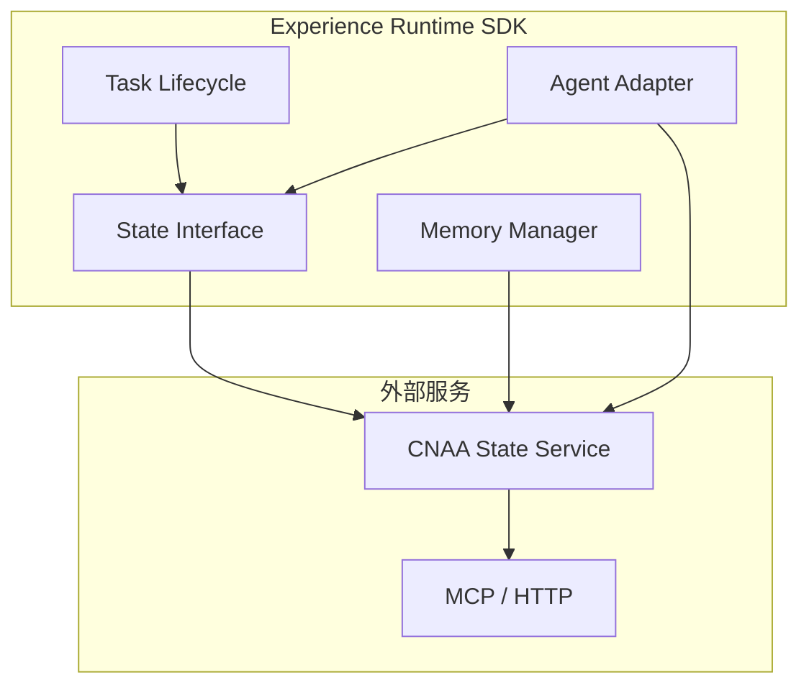
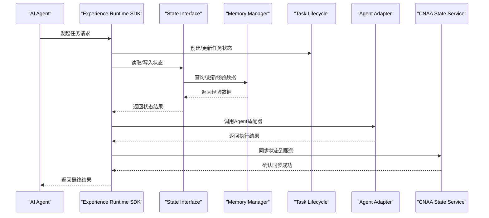
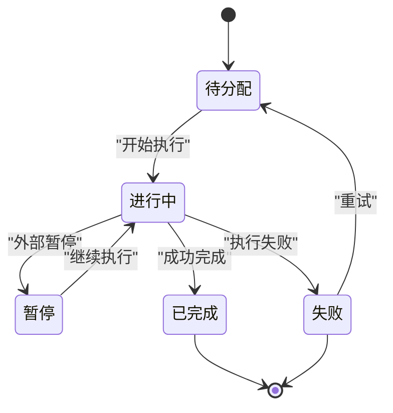
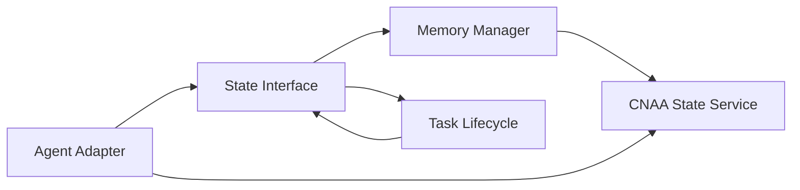

# 单元测试

<cite>
**本文档中引用的文件**
- [README.md](file://README.md)
- [README_CN.md](file://README_CN.md)
</cite>

## 目录
1. [简介](#简介)
2. [项目结构](#项目结构)
3. [核心组件](#核心组件)
4. [架构总览](#架构总览)
5. [详细组件测试指南](#详细组件测试指南)
6. [依赖关系与集成测试](#依赖关系与集成测试)
7. [性能与稳定性测试](#性能与稳定性测试)
8. [故障排查与常见问题](#故障排查与常见问题)
9. [结论与最佳实践](#结论与最佳实践)
10. [附录](#附录)

## 简介
本指南面向Experience Runtime SDK的单元测试编写，覆盖以下目标：
- Mock对象的创建与使用策略
- 异步测试的处理方法与时序控制
- 断言库的选择与用法建议
- State Interface的契约验证与错误处理测试
- Memory Manager的数据持久化与缓存逻辑测试
- Task Lifecycle的状态转换测试
- Agent Adapter的模拟与隔离测试
- 测试覆盖率要求与工程化最佳实践

该指南以CNAA的Experience Runtime为核心，围绕State Interface、Memory Manager、Task Lifecycle、Agent Adapter四大模块展开，提供可落地的测试方法与示例路径指引（以“章节来源”标注对应源码位置）。

## 项目结构
当前仓库为概念与文档阶段，未包含具体实现代码。因此，本指南将给出面向未来实现的测试蓝图与规范，确保在SDK落地时可直接套用。

图表来源
- [README.md:55-72](file://README.md#L55-L72)

章节来源
- [README.md:55-72](file://README.md#L55-L72)
- [README_CN.md:63-80](file://README_CN.md#L63-L80)

## 核心组件
- State Interface：统一状态访问接口，负责经验状态的读写、同步与一致性保障。
- Memory Manager：管理经验的持久化存储与缓存层，支持本地/云端存储与缓存策略。
- Task Lifecycle：任务生命周期管理，定义任务从创建到完成的完整状态机。
- Agent Adapter：适配不同Agent的实现细节，屏蔽差异并提供统一调用入口。

章节来源
- [README.md:55-72](file://README.md#L55-L72)
- [README_CN.md:63-80](file://README_CN.md#L63-L80)

## 架构总览
下图展示Experience Runtime SDK与外部服务的交互关系，以及各组件的职责边界。

图表来源
- [README.md:55-72](file://README.md#L55-L72)

## 详细组件测试指南

### State Interface 测试方法
- 契约验证
  - 定义接口契约测试集，覆盖所有方法的输入输出约束、异常分支与边界条件。
  - 使用属性驱动测试（Property-based Testing）对输入空间进行随机生成与校验。
- 错误处理测试
  - 构造网络超时、权限不足、数据不一致等场景，验证错误码与重试策略。
  - 验证幂等性与回滚机制，确保失败不产生副作用。
- 并发与一致性
  - 并发读写同一状态键，验证锁机制与版本冲突处理。
  - 校验最终一致性与快照恢复能力。

章节来源
- [README.md:55-72](file://README.md#L55-L72)
- [README_CN.md:63-80](file://README_CN.md#L63-L80)

### Memory Manager 测试策略
- 数据持久化测试
  - 针对本地文件系统与远程存储服务分别编写用例，覆盖写入、读取、删除、批量操作。
  - 校验数据完整性（哈希校验）、事务提交与回滚。
- 缓存逻辑测试
  - 验证缓存命中/失效策略、TTL过期、LRU淘汰与热点数据保护。
  - 缓存与持久化的双写一致性、延迟加载与预取策略。
- 性能与容量
  - 压测大对象写入与高并发读，评估吞吐与延迟指标。
  - 内存占用监控与GC压力测试。

章节来源
- [README.md:55-72](file://README.md#L55-L72)
- [README_CN.md:63-80](file://README_CN.md#L63-L80)

### Task Lifecycle 状态转换测试
- 状态机建模
  - 明确任务状态集合与合法转换规则，构建状态转移表。
  - 使用状态机测试框架验证每个转换的触发条件与副作用。
- 时序与超时
  - 模拟长时间运行任务、中断与恢复，验证状态回退与补偿。
  - 超时与心跳检测的边界用例。
- 并发与竞争
  - 多任务并发下的状态冲突与死锁避免。
  - 事件驱动的异步回调顺序性保证。

图表来源
- [README.md:55-72](file://README.md#L55-L72)

### Agent Adapter 模拟测试
- 隔离外部依赖
  - 使用Mock或Stub替代真实Agent实现，固定响应与错误模式。
  - 记录调用参数与次数，验证调用链路与参数传递正确性。
- 协议与兼容性
  - 针对不同Agent协议的适配层进行契约测试，确保向后兼容。
  - 验证序列化/反序列化的健壮性与容错。
- 异常与降级
  - 模拟Agent不可用、超时、限流等场景，验证降级策略与熔断。
  - 重试与退避策略的正确性验证。

章节来源
- [README.md:55-72](file://README.md#L55-L72)
- [README_CN.md:63-80](file://README_CN.md#L63-L80)

## 依赖关系与集成测试
- 组件耦合与内聚
  - 通过接口隔离降低耦合度，便于单测替换依赖。
  - 使用依赖注入容器管理Mock实例的生命周期。
- 端到端测试
  - 搭建最小可用环境（本地State Service、Mock Agent），验证关键路径。
  - 使用契约测试确保上下游接口一致性。
- 配置与环境
  - 测试环境隔离，避免污染生产数据。
  - 环境变量与配置文件的热切换能力验证。

图表来源
- [README.md:55-72](file://README.md#L55-L72)

## 性能与稳定性测试
- 基准测试
  - 对关键路径（状态读写、缓存命中、任务启动）建立基准用例。
  - 对比优化前后性能变化，设定回归阈值。
- 负载与弹性
  - 模拟峰值流量与突发请求，验证系统弹性与资源利用率。
  - 水平扩展能力与负载均衡效果验证。
- 稳定性与可靠性
  - 长稳运行（Soak）测试，发现内存泄漏与资源耗尽问题。
  - 混沌工程注入故障，验证自愈与恢复能力。

## 故障排查与常见问题
- 异步测试失败
  - 检查超时设置与等待策略，避免竞态条件。
  - 使用日志与追踪ID定位问题链路。
- Mock行为不符合预期
  - 核对Mock返回值与异常抛出时机。
  - 验证调用次数与参数匹配。
- 状态不一致
  - 检查并发锁与事务边界。
  - 验证快照与回滚逻辑。
- 缓存穿透与雪崩
  - 增加空值缓存与布隆过滤器。
  - 设置合理的TTL与随机抖动。

## 结论与最佳实践
- 测试分层清晰：单元、集成、端到端各司其职。
- 优先覆盖关键路径与高风险模块（State Interface、Memory Manager）。
- 使用Mock与Stub隔离外部依赖，确保测试稳定与快速。
- 建立自动化测试流水线，结合覆盖率门禁与质量门禁。
- 持续演进测试用例，随功能迭代补充边界与异常场景。

## 附录

### 覆盖率要求与度量
- 行覆盖率≥80%，分支覆盖率≥70%
- 关键模块（State Interface、Memory Manager）行覆盖率≥90%
- 禁止新增无测试覆盖的代码路径

### 工具与框架建议
- 单元测试框架：Go标准testing包或第三方框架（如testify）
- Mock框架：gomock、mockery
- 断言库：assert、require
- 基准测试：pprof、benchstat
- 覆盖率统计：go test -cover、coverage报告集成

### 测试命名与组织
- 文件名：*_test.go，按模块划分目录
- 函数名：TestXxx，子用例：BenchmarkXxx、ExampleXxx
- 用例分组：Table-driven Tests、Property-based Tests

### 异步测试要点
- 使用context控制超时与取消
- 合理设置通道缓冲与goroutine数量
- 避免硬编码sleep，使用事件或信号量同步

### 断言库使用建议
- 使用require进行强断言，失败立即终止
- 使用assert进行弱断言，收集更多失败信息
- 自定义断言封装业务语义，提升可读性