# 测试指南

<cite>
**本文档引用的文件**
- [tests/conftest.py](file://tests/conftest.py)
- [tests/pytest.ini](file://tests/pytest.ini)
- [scripts/run_tests.sh](file://scripts/run_tests.sh)
- [tests/test_large_scale_performance.py](file://tests/test_large_scale_performance.py)
- [tests/test_e2e_full_loop.py](file://tests/test_e2e_full_loop.py)
- [tests/test_micro_comprehensive.py](file://tests/test_micro_comprehensive.py)
- [tests/test_scoring_system.py](file://tests/test_scoring_system.py)
- [tests/test_memory_slicing.py](file://tests/test_memory_slicing.py)
- [tests/test_cloud_storage.py](file://tests/test_cloud_storage.py)
- [tests/test_integration.py](file://tests/test_integration.py)
- [tests/test_lifecycle.py](file://tests/test_lifecycle.py)
- [tests/test_local.py](file://tests/test_local.py)
- [tests/test_mcp_stdio_server.py](file://tests/test_mcp_stdio_server.py)
- [tests/test_models.py](file://tests/test_models.py)
- [tests/test_openclaw_integration.py](file://tests/test_openclaw_integration.py)
- [tests/test_security.py](file://tests/test_security.py)
</cite>

## 更新摘要
**已完成的变更**
- 新增了完整的性能基准测试套件（971行），包含大规模数据操作、并发访问模式和内存效率测试
- 实现了端到端全循环测试（1239行），覆盖CRUD操作、生命周期管理和多代理同步
- 添加了微测试套件（603行），提供200+细粒度单元测试覆盖边界条件和异常处理
- 新增了评分系统测试（444行），验证记忆评分算法和后端集成
- 实现了记忆切片和知识压缩测试（412行），支持时间范围查询和自动标签提取
- 建立了完整的测试运行器脚本，支持并行执行、覆盖率收集和分类测试

## 目录
1. [简介](#简介)
2. [测试架构概览](#测试架构概览)
3. [测试基础设施](#测试基础设施)
4. [单元测试实现](#单元测试实现)
5. [微测试套件](#微测试套件)
6. [集成测试搭建](#集成测试搭建)
7. [端到端测试方案](#端到端测试方案)
8. [性能基准测试](#性能基准测试)
9. [评分系统测试](#评分系统测试)
10. [记忆切片测试](#记忆切片测试)
11. [安全功能测试](#安全功能测试)
12. [生命周期管理测试](#生命周期管理测试)
13. [OpenClaw集成测试](#openclaw集成测试)
14. [测试覆盖率与报告](#测试覆盖率与报告)
15. [持续集成配置](#持续集成配置)
16. [故障排查指南](#故障排查指南)

## 简介
本指南面向 CNAA（Cloud Native Agentic Architecture）项目的测试实践，基于已实现的完整测试框架，帮助开发者理解和使用现有的测试体系。项目已包含超过4000行测试代码，涵盖单元测试、集成测试、端到端测试、性能基准测试、安全功能测试和OpenClaw集成测试，确保代码质量和系统稳定性。最新的性能基准测试套件为大规模数据处理提供了全面的性能保障。

## 测试架构概览
CNAA项目的测试架构采用分层设计，从底层数据模型到上层应用接口进行全面覆盖：

```mermaid
graph TB
subgraph "测试层次"
A["单元测试"] --> B["微测试"]
B --> C["集成测试"]
C --> D["端到端测试"]
D --> E["性能基准测试"]
E --> F["安全测试"]
end
subgraph "测试模块"
G["微测试<br/>test_micro_comprehensive.py"]
H["性能测试<br/>test_large_scale_performance.py"]
I["端到端测试<br/>test_e2e_full_loop.py"]
J["评分系统测试<br/>test_scoring_system.py"]
K["记忆切片测试<br/>test_memory_slicing.py"]
L["云存储测试<br/>test_cloud_storage.py"]
M["本地代理测试<br/>test_local.py"]
N["生命周期测试<br/>test_lifecycle.py"]
O["安全测试<br/>test_security.py"]
P["集成测试<br/>test_integration.py"]
Q["OpenClaw集成测试<br/>test_openclaw_integration.py"]
R["MCP服务器测试<br/>test_mcp_stdio_server.py"]
S["模型测试<br/>test_models.py"]
end
subgraph "被测组件"
T["核心模型<br/>cnaa/models.py"]
U["生命周期管理<br/>cnaa/lifecycle.py"]
V["安全模块<br/>cnaa/security.py"]
W["云存储实现<br/>memory_store.py"]
X["本地代理接口<br/>local/agent.py"]
Y["评分系统<br/>cnaa/scoring.py"]
Z["记忆切片<br/>local/memory/slicer.py"]
end
G --> T
H --> W
I --> X
J --> Y
K --> Z
L --> W
M --> X
N --> U
O --> V
P --> X
Q --> Y
R --> W
S --> T
```



**图表来源**
- [tests/test_micro_comprehensive.py:1-603](file://tests/test_micro_comprehensive.py#L1-L603)
- [tests/test_large_scale_performance.py:1-971](file://tests/test_large_scale_performance.py#L1-L971)
- [tests/test_e2e_full_loop.py:1-1239](file://tests/test_e2e_full_loop.py#L1-L1239)
- [tests/test_scoring_system.py:1-444](file://tests/test_scoring_system.py#L1-L444)
- [tests/test_memory_slicing.py:1-412](file://tests/test_memory_slicing.py#L1-L412)

## 测试基础设施
CNAA项目建立了完善的测试基础设施，包括pytest配置、测试标记系统和并行执行支持。

### Pytest配置和标记系统
测试框架使用pytest作为核心测试引擎，支持多种测试标记：

```python
# 自定义标记定义
markers = {
    "slow": "慢速测试",
    "integration": "集成测试", 
    "unit": "单元测试",
    "performance": "性能基准测试",
    "large": "大规模测试（>1000操作）",
    "regression": "回归预防测试"
}
```

**章节来源**
- [tests/pytest.ini:10-17](file://tests/pytest.ini#L10-L17)

### 测试统计和计时器
内置测试统计系统自动跟踪测试执行时间和结果：

```python
class TestStats:
    """跟踪测试执行统计信息"""
    def __init__(self):
        self.start_time = None
        self.test_count = 0
        self.pass_count = 0
        self.fail_count = 0
        self.skip_count = 0
    
    def summary(self):
        """生成测试统计摘要"""
        print(f"总测试数: {self.test_count}")
        print(f"通过: {self.pass_count}")
        print(f"失败: {self.fail_count}")
        print(f"跳过: {self.skip_count}")
        print(f"耗时: {self.end():.2f}s")
```

**章节来源**
- [tests/conftest.py:85-116](file://tests/conftest.py#L85-L116)

### 并行测试执行
测试框架支持并行执行以提高测试效率：

```bash
# 并行执行测试
pytest tests/ -v -n 4 -m "not (slow or large)"

# 仅运行单元测试
pytest tests/ -v -m "unit"

# 仅运行性能测试  
pytest tests/ -v -m "performance"
```

**章节来源**
- [scripts/run_tests.sh:95-110](file://scripts/run_tests.sh#L95-L110)

## 单元测试实现
CNAA项目的单元测试覆盖了核心数据模型、云存储实现和本地代理功能，使用Python标准库的unittest框架。

### 核心模型测试
模型测试验证了所有数据结构的正确性和默认值设置：

```python
class TestMemoryType(unittest.TestCase):
    """测试MemoryType枚举"""
    
    def test_values(self):
        """验证枚举值匹配预期字符串"""
        self.assertEqual(MemoryType.LONG_TERM.value, "long_term")
        self.assertEqual(MemoryType.SHORT_TERM.value, "short_term")
```

**章节来源**
- [tests/test_models.py:21-33](file://tests/test_models.py#L21-L33)

### 云存储单元测试
云存储测试覆盖了InMemoryMemoryStore和InMemoryStateStore的所有功能：

```python
class TestInMemoryMemoryStore(unittest.TestCase):
    """测试InMemoryMemoryStore实现"""
    
    def test_store_memory(self):
        """验证记忆可以存储和检索"""
        memory = Memory(
            memory_id="mem-001",
            agent_id=self.agent_id,
            type=MemoryType.LONG_TERM,
            content={"task": "test"},
        )
        result = self.store.store_memory(memory)
        self.assertEqual(result["status"], "ok")
```

**章节来源**
- [tests/test_cloud_storage.py:17-36](file://tests/test_cloud_storage.py#L17-L36)

### 本地代理单元测试
本地代理测试验证了InstantMemoryManager和StateCache的功能：

```python
class TestInstantMemoryManager(unittest.TestCase):
    """测试InstantMemoryManager实现"""
    
    def test_create_instant_memory(self):
        """验证即时记忆可以创建"""
        instant = self.manager.create_instant_memory(
            task_id="task-001",
            checkpoint_id="cp-001",
            summary="Test summary",
            memory_id="mem-001",
        )
        self.assertEqual(instant.memory_id, "mem-001")
        self.assertEqual(instant.status, MemoryStatus.ACTIVE)
```

**章节来源**
- [tests/test_local.py:17-35](file://tests/test_local.py#L17-L35)

## 微测试套件
微测试套件是CNAA项目的重要组成部分，提供200+细粒度单元测试，覆盖边界条件、异常处理和类型验证。

### 枚举边界测试
微测试套件包含大量枚举值验证测试：

```python
class TestEnumEdgeCases(unittest.TestCase):
    """测试所有枚举边界情况"""
    
    def test_memory_type_two_values_exist(self):
        MEMORY_VALUES = ["long_term", "short_term"]
        self.assertEqual(len(list(MemoryType)), 2)
        for val in MEMORY_VALUES:
            self.assertIn(val, [v.value for v in MemoryType])
    
    def test_memory_status_three_values_exist(self):
        STATUS_VALUES = ["active", "condensed", "evicted"]
        self.assertEqual(len(list(MemoryStatus)), 3)
```

**章节来源**
- [tests/test_micro_comprehensive.py:43-100](file://tests/test_micro_comprehensive.py#L43-L100)

### 内存模型创建测试
微测试覆盖内存模型的各种创建场景：

```python
class TestMemoryCreation(unittest.TestCase):
    """细粒度内存创建测试"""
    
    def test_minimal_creation(self):
        mem = make_memory()
        self.assertEqual(mem.memory_id, "test-mem")
        self.assertIsNotNone(mem.timestamp)
    
    def test_empty_content_dict(self):
        mem = make_memory(content={})
        self.assertEqual(mem.content, {})
    
    def test_none_content_raises_error(self):
        with self.assertRaises(Exception):
            Memory(memory_id="m", agent_id="a", type=MemoryType.LONG_TERM, content=None)
```

**章节来源**
- [tests/test_micro_comprehensive.py:118-166](file://tests/test_micro_comprehensive.py#L118-L166)

### 标签和元数据测试
微测试验证标签处理和元数据管理：

```python
class TestMemoryTags(unittest.TestCase):
    """细粒度记忆标签测试"""
    
    def test_unicode_tags(self):
        mem = make_memory(tags=["中文", "日本語", "한국어", "emoji 🎉"])
        self.assertEqual(len(mem.tags), 4)
    
    def test_very_long_tag(self):
        long_tag = "x" * 1000
        mem = make_memory(tags=[long_tag])
        self.assertEqual(len(mem.tags[0]), 1000)
```

**章节来源**
- [tests/test_micro_comprehensive.py:171-206](file://tests/test_micro_comprehensive.py#L171-L206)

## 集成测试搭建
集成测试验证了多个组件之间的协作，包括MCP服务器、云代理接口和本地代理接口的完整工作流。

### MCP服务器工具路由测试
测试验证了CNAA_MCPServer的工具路由功能：

```python
class TestCloudMCPServer(unittest.TestCase):
    """测试CNAA_MCPServer工具路由"""
    
    def test_store_memory_tool(self):
        """验证store_memory工具端到端工作"""
        result = self.server.handle_tool_call(
            "cnaa_store_memory",
            {
                "agent_id": "test-agent",
                "memory_id": "mem-001",
                "type": "long_term",
                "content": {"task": "test"},
                "tags": ["test"],
                "completion_score": 0.8,
            },
        )
        self.assertEqual(result["status"], "ok")
```

**章节来源**
- [tests/test_integration.py:10-32](file://tests/test_integration.py#L10-L32)

### 代理接口集成测试
测试验证了CloudAgentInterface和LocalAgentInterface的完整功能：

```python
class TestLocalAgentInterface(unittest.TestCase):
    """测试LocalAgentInterface - agentic框架的主要入口点"""
    
    def test_full_workflow(self):
        """验证从任务到长期记忆的完整工作流"""
        # 1. Agent完成任务，存储到云端
        result = self.agent.store_memory(
            memory_id="mem-001",
            memory_type="long_term",
            content={"task": "database migration", "result": "success"},
            tags=["database", "migration"],
            completion_score=0.9,
        )
        self.assertEqual(result["status"], "ok")
```

**章节来源**
- [tests/test_integration.py:311-349](file://tests/test_integration.py#L311-L349)

## 端到端测试方案
端到端测试模拟真实用户场景，验证从任务完成到经验沉淀的完整业务流程。

### OpenClow风格工作流测试
测试模拟了OpenClow Agent使用CNAA进行记忆管理的完整流程：

```python
class TestEndToEndWorkflow(unittest.TestCase):
    """模拟openclow agent使用CNAA进行记忆的完整端到端工作流"""
    
    def test_openclow_style_workflow(self):
        # 设置：创建云代理和本地接口（如openclow会做的那样）
        server = CNAA_MCPServer()
        agent = LocalAgentInterface(
            agent_id="openclow-agent-001",
            cloud_server=server,
        )
        
        # 步骤1：Agent完成任务检查点
        agent.store_memory(
            memory_id="task-mem-001",
            memory_type="long_term",
            content={
                "task": "user_authentication",
                "steps": ["validate_token", "check_permissions", "return_user"],
                "result": "success",
            },
            tags=["auth", "security"],
            completion_score=0.95,
        )
```

**章节来源**
- [tests/test_e2e_full_loop.py:242-324](file://tests/test_e2e_full_loop.py#L242-L324)

### 完整CRUD循环测试
端到端测试验证所有实体类型的完整CRUD操作：

```python
class TestFullCRUDLoop(unittest.TestCase):
    """所有实体类型的完整create → read → update → delete循环"""
    
    def test_memory_full_crud(self):
        """记忆创建→读取→更新→删除循环"""
        # CREATE
        result = self.agent.store_memory(
            memory_id="mem-crud",
            memory_type="long_term",
            content={"version": 1},
            tags=["crud-test"],
            completion_score=0.5,
        )
        self.assertEqual(result["status"], "ok")
        
        # READ
        result = self.agent.get_memory("mem-crud")
        self.assertEqual(result["status"], "ok")
        self.assertEqual(result["memory"]["content"]["version"], 1)
```

**章节来源**
- [tests/test_e2e_full_loop.py:78-117](file://tests/test_e2e_full_loop.py#L78-L117)

### 多代理同步测试
端到端测试验证多个代理实例之间的数据同步：

```python
class TestMultiAgentFullLoop(unittest.TestCase):
    """测试多个代理在完整循环场景中的行为"""
    
    def test_shared_cloud_multi_instance(self):
        """验证多个本地实例共享云状态"""
        # 设备A上的实例1
        instance_a = LocalAgentInterface(
            agent_id="shared-agent",
            cloud_server=self.server,
        )
        # 设备B上的实例2
        instance_b = LocalAgentInterface(
            agent_id="shared-agent",
            cloud_server=self.server,
        )
        
        # 设备A写入
        instance_a.store_memory(
            memory_id="cross-device-mem",
            memory_type="long_term",
            content={"device": "A"},
        )
        
        # 设备B读取
        result = instance_b.get_memory("cross-device-mem")
        self.assertEqual(result["status"], "ok")
        self.assertEqual(result["memory"]["content"]["device"], "A")
```

**章节来源**
- [tests/test_e2e_full_loop.py:509-552](file://tests/test_e2e_full_loop.py#L509-L552)

## 性能基准测试
CNAA项目包含全面的性能基准测试套件，验证系统在大规模数据和高并发场景下的表现。

### 大规模数据操作测试
性能测试覆盖千级别数据操作：

```python
class TestLargeVolumeMemoryOperations(unittest.TestCase):
    """大规模数据操作测试"""
    
    def test_store_1000_memories_batch(self):
        """性能：批量存储1000条记忆"""
        start = time.time()
        
        for i in range(1000):
            memory = Memory(
                memory_id=f"mem-{i:04d}",
                agent_id="perf-agent",
                type=MemoryType.LONG_TERM,
                content={"index": i, "data": "x" * 100},
                tags=["perf", f"type-{i % 10}"],
                completion_score=i / 1000,
            )
            result = self.store.store_memory(memory)
            self.assertEqual(result["status"], "ok")
        
        elapsed = time.time() - start
        count = self.store.count()
        self.assertEqual(count, 1000)
        
        print(f"\n在{elapsed:.3f}s内存储1000条记忆（{count/elapsed:.0f}/s）")
        self.assertLess(elapsed, 10.0)  # 应在10秒内完成
```

**章节来源**
- [tests/test_large_scale_performance.py:33-56](file://tests/test_large_scale_performance.py#L33-L56)

### 并发访问模式测试
性能测试验证并发访问模式：

```python
class TestConcurrentAccessPatterns(unittest.TestCase):
    """测试共享存储的并发访问模式"""
    
    def test_multiple_agents_concurrent_stores(self):
        """并发：10个代理各存储50条记忆"""
        server = CNAA_MCPServer()
        
        start = time.time()
        
        # 模拟并发代理
        for agent_idx in range(10):
            agent = LocalAgentInterface(
                agent_id=f"concurrent-agent-{agent_idx}",
                cloud_server=server,
            )
            
            # 每个代理存储50条记忆
            for mem_idx in range(50):
                agent.store_memory(
                    memory_id=f"ca{agent_idx}-m{mem_idx:02d}",
                    memory_type="long_term",
                    content={
                        "agent": agent_idx,
                        "memory": mem_idx,
                        "shared": True,
                    },
                )
        
        elapsed = time.time() - start
        
        # 验证隔离性
        for agent_idx in range(10):
            agent = LocalAgentInterface(
                agent_id=f"concurrent-agent-{agent_idx}",
                cloud_server=server,
            )
            memories = agent.list_memories()["memories"]
            self.assertEqual(len(memories), 50)
```

**章节来源**
- [tests/test_large_scale_performance.py:404-444](file://tests/test_large_scale_performance.py#L0404-L444)

### 性能基准指标
性能测试包含详细的基准指标：

```python
class TestPerformanceBenchmarks(unittest.TestCase):
    """带计时指标的基准测试"""
    
    def test_store_operations_per_second(self):
        """基准：测量存储操作的每秒速率"""
        server = CNAA_MCPServer()
        agent = LocalAgentInterface(agent_id="bench-agent", cloud_server=server)
        
        iterations = 1000
        start = time.perf_counter()
        
        for i in range(iterations):
            agent.store_memory(
                memory_id=f"bench-{i}",
                memory_type="long_term",
                content={},
            )
        
        elapsed = time.perf_counter() - start
        ops_per_sec = iterations / elapsed
        
        print(f"\n存储基准：")
        print(f"  迭代次数: {iterations}")
        print(f"  时间: {elapsed:.3f}s")
        print(f"  速率: {ops_per_sec:.1f} 操作/秒")
        
        # 合理性检查 - 应至少50操作/秒
        self.assertGreater(ops_per_sec, 50)
```

**章节来源**
- [tests/test_large_scale_performance.py:549-574](file://tests/test_large_scale_performance.py#L549-L574)

## 评分系统测试
评分系统测试验证记忆评分算法、复合计算和后端集成的正确性。

### 记忆评分算法测试
评分测试覆盖各种评分算法：

```python
class TestRecencyScorer(unittest.TestCase):
    """测试时效性评分算法"""
    
    def test_brand_new_memory(self):
        """全新记忆应具有1.0的评分"""
        scorer = RecencyScorer()
        timestamp = datetime.now()
        
        score = scorer.score(timestamp)
        self.assertAlmostEqual(score, 1.0, places=5)
    
    def test_half_life_decay(self):
        """在半衰期时，评分应约为0.5"""
        scorer = RecencyScorer(half_life_days=7.0)
        timestamp = datetime.now() - timedelta(days=7)
        
        score = scorer.score(timestamp)
        self.assertLess(score, 0.6)  # 应接近0.5
        self.assertGreater(score, 0.4)
```

**章节来源**
- [tests/test_scoring_system.py:89-144](file://tests/test_scoring_system.py#L89-L144)

### 复合评分计算测试
评分系统测试验证复合评分计算：

```python
class TestCompositeScorer(unittest.TestCase):
    """测试带有所有组件的组合评分"""
    
    def test_simple_scenario(self):
        """使用简单已知场景测试"""
        scorer = CompositeScorer()
        
        # 创建一个最近的、已完成的、重要的记忆
        memory = Memory(
            memory_id="mem-001",
            agent_id="agent-001",
            type=MemoryType.LONG_TERM,
            content={"task": "Completed successfully"},
            tags=["important", "success"],
            completion_score=1.0,
            timestamp=datetime.now() - timedelta(hours=1),
        )
        
        scores = scorer.score_memory(memory)
        
        # 检查各个评分是否在范围内
        self.assertGreaterEqual(scores["recency"], 0.0)
        self.assertLessEqual(scores["recency"], 1.0)
        self.assertAlmostEqual(scores["completion"], 1.0, places=5)
        self.assertAlmostEqual(scores["importance"], 1.0, places=5)
```

**章节来源**
- [tests/test_scoring_system.py:270-316](file://tests/test_scoring_system.py#L270-L316)

## 记忆切片测试
记忆切片测试验证记忆分割、时间范围查询和知识压缩功能。

### 记忆切片器测试
切片测试覆盖各种分割场景：

```python
class TestSimpleMemorySlicer(unittest.TestCase):
    """测试SimpleMemorySlicer类"""
    
    def test_slice_by_events(self):
        """按事件数组分割"""
        content = {
            "events": [
                {
                    "timestamp": datetime.now() - timedelta(minutes=10),
                    "action": "search",
                    "result": "found items"
                },
                {
                    "timestamp": datetime.now() - timedelta(minutes=5),
                    "action": "purchase",
                    "result": "completed"
                }
            ]
        }
        
        slices = self.slicer.slice_memory(
            memory_id="context-001",
            content=content,
            auto_timestamps=True
        )
        
        # 应分割成2个切片（每个事件一个）
        self.assertEqual(len(slices), 2)
        self.assertEqual(slices[0].index, 0)
        self.assertEqual(slices[1].index, 1)
```

**章节来源**
- [tests/test_memory_slicing.py:39-66](file://tests/test_memory_slicing.py#L39-L66)

### 知识压缩插件测试
压缩测试验证知识提取和偏好识别：

```python
class TestKnowledgeCondensationPlugin(unittest.TestCase):
    """测试SimpleTimeBasedCondensationPlugin类"""
    
    def test_extract_preference_from_content(self):
        """从记忆内容中提取偏好"""
        memory = Memory(
            memory_id="pref-mem-001",
            agent_id=self.agent_id,
            type=MemoryType.LONG_TERM,
            content={
                "like": ["coffee", "reading", "outdoor activities"],
                "dislike": ["crowded places", "noise"]
            },
            timestamp=self.now,
            tags=["preference", "important"]
        )
        
        pref = self.plugin._extract_preference(memory)
        
        # 应提取关于喜好的偏好
        self.assertIsNotNone(pref)
        self.assertIn("like", pref.key.lower())
        self.assertEqual(pref.agent_id, self.agent_id)
```

**章节来源**
- [tests/test_memory_slicing.py:233-254](file://tests/test_memory_slicing.py#L233-L254)

## 安全功能测试
安全功能测试套件是CNAA项目的重要组成部分，提供完整的权限验证和认证流程测试。该测试套件包含501行代码，覆盖了API密钥验证、权限级别控制、环境配置加载和MCP服务器集成等核心安全功能。

### 权限级别枚举测试
权限级别测试验证了三种权限级别的定义和行为：

```python
class TestPermissionLevel(unittest.TestCase):
    """测试PermissionLevel枚举"""
    
    def test_permission_levels_exist(self):
        """验证所有权限级别都已定义"""
        self.assertIsNotNone(PermissionLevel.READ_ONLY)
        self.assertIsNotNone(PermissionLevel.READ_WRITE)
        self.assertIsNotNone(PermissionLevel.ADMIN)
    
    def test_permission_values(self):
        """验证权限级别字符串值"""
        self.assertEqual(PermissionLevel.READ_ONLY.value, "read_only")
        self.assertEqual(PermissionLevel.READ_WRITE.value, "read_write")
        self.assertEqual(PermissionLevel.ADMIN.value, "admin")
```

**章节来源**
- [tests/test_security.py:40-54](file://tests/test_security.py#L40-L54)

### API密钥验证测试
API密钥验证测试涵盖了所有边界情况和错误处理：

```python
class TestValidateApiKey(unittest.TestCase):
    """测试validate_api_key函数"""
    
    def test_auth_disabled_returns_none(self):
        """当禁用认证时，应返回None（跳过验证）"""
        config = AuthConfig(enabled=False)
        result = validate_api_key("any-key", config)
        self.assertIsNone(result)
    
    def test_valid_key_returns_context(self):
        """有效密钥应返回具有正确agent_id和权限的AuthContext"""
        config = self._make_config()
        ctx = validate_api_key("sk-valid", config)
        self.assertIsNotNone(ctx)
        self.assertEqual(ctx.agent_id, "agent-001")
        self.assertEqual(ctx.permission, PermissionLevel.READ_WRITE)
```

**章节来源**
- [tests/test_security.py:108-153](file://tests/test_security.py#L108-L153)

## 生命周期管理测试
生命周期管理测试套件是CNAA项目的核心测试模块，涵盖了经验管理和状态演化的完整功能。该测试套件包含296行代码，验证了生命周期事件、配置管理、时间基插件和状态演化规则的正确性。

### 生命周期事件测试
生命周期事件枚举测试验证了5个核心事件的定义：

```python
class TestLifecycleEvent(unittest.TestCase):
    """测试LifecycleEvent枚举值"""
    
    def test_event_values(self):
        self.assertEqual(LifecycleEvent.TASK_COMPLETED, "task_completed")
        self.assertEqual(LifecycleEvent.MEMORY_CONDENSED, "memory_condensed")
        self.assertEqual(LifecycleEvent.MEMORY_EVICTED, "memory_evicted")
        self.assertEqual(LifecycleEvent.MEMORY_PROMOTED, "memory_promoted")
        self.assertEqual(LifecycleEvent.STATE_EVOLVED, "state_evolved")
```

**章节来源**
- [tests/test_lifecycle.py:35-47](file://tests/test_lifecycle.py#L35-L47)

### 时间基生命周期插件测试
时间基生命周期插件测试覆盖了压缩、驱逐、提升等核心逻辑：

```python
class TestTimeBasedLifecyclePlugin(unittest.TestCase):
    """测试TimeBasedLifecyclePlugin实现"""
    
    def test_should_condense_active_old_memory(self):
        mem = self._make_instant_memory(status=MemoryStatus.ACTIVE, age_minutes=120)
        self.assertTrue(self.plugin.should_condense(mem))
    
    def test_should_not_condence_active_young_memory(self):
        mem = self._make_instant_memory(status=MemoryStatus.ACTIVE, age_minutes=10)
        self.assertFalse(self.plugin.should_condense(mem))
```

**章节来源**
- [tests/test_lifecycle.py:84-198](file://tests/test_lifecycle.py#L84-L198)

## OpenClaw集成测试
OpenClaw集成测试验证了Python CNAA服务与TypeScript OpenClaw框架之间的HTTP通信。

### HTTP API调用测试
测试使用Mock对象模拟HTTP请求，验证API调用的正确性：

```python
@patch("examples.openclaw_integration.requests.post")
def test_store_memory(self, mock_post):
    """验证store_memory正确调用CNAA"""
    mock_response = Mock()
    mock_response.json.return_value = {"status": "ok", "memory_id": "mem-001"}
    mock_post.return_value = mock_response
    
    result = self.cnaa.store_memory(
        agent_id="agent-001",
        memory_id="mem-001",
        memory_type="long_term",
        content={"task": "test"},
        tags=["test"],
        completion_score=0.9,
    )
    
    self.assertEqual(result["status"], "ok")
    self.assertEqual(result["memory_id"], "mem-001")
    mock_post.assert_called_once()
```

**章节来源**
- [tests/test_openclaw_integration.py:16-35](file://tests/test_openclaw_integration.py#L16-L35)

## 测试覆盖率与报告
CNAA项目使用pytest作为测试框架，支持覆盖率收集和报告生成。

### 覆盖率目标
建议的覆盖率目标：
- 行覆盖率 ≥ 80%
- 分支覆盖率 ≥ 70%
- 关键模块（状态接口、记忆管理、任务生命周期）≥ 90%
- 生命周期管理模块 ≥ 95%
- **安全模块 ≥ 95%**
- **性能测试模块 ≥ 85%**（新增要求）

### 覆盖率收集命令
```bash
# 运行测试并生成覆盖率报告
pytest --cov=cnaa --cov=cloud --cov=local --cov=examples tests/

# 生成HTML覆盖率报告
pytest --cov=cnaa --cov=cloud --cov=local --cov=examples --cov-report=html tests/

# 生成JSON格式报告用于CI
pytest --cov=cnaa --cov=cloud --cov=local --cov=examples --cov-report=json tests/

# 专门运行安全测试
pytest tests/test_security.py -v --cov=cnaa.security --cov-report=term-missing

# 运行性能测试
pytest tests/test_large_scale_performance.py -v --cov=cnaa --cov=cloud --cov=local
```

### 测试执行命令
```bash
# 运行所有测试
python -m pytest tests/ -v

# 运行特定测试文件
python -m pytest tests/test_models.py -v

# 运行生命周期测试
python -m pytest tests/test_lifecycle.py -v

# 运行安全测试
python -m pytest tests/test_security.py -v

# 运行性能基准测试
python -m pytest tests/test_large_scale_performance.py -v

# 运行微测试套件
python -m pytest tests/test_micro_comprehensive.py -v

# 运行端到端测试
python -m pytest tests/test_e2e_full_loop.py -v

# 运行特定测试类
python -m pytest tests/test_cloud_storage.py::TestInMemoryMemoryStore -v

# 运行单个测试方法
python -m pytest tests/test_models.py::TestMemory::test_creation -v
```

**章节来源**
- [scripts/run_tests.sh:114-139](file://scripts/run_tests.sh#L114-L139)

## 持续集成配置
虽然当前仓库未包含GitHub Actions配置，但建议添加以下CI流水线：

### GitHub Actions工作流示例
```yaml
name: CNAA Test Suite

on:
  push:
    branches: [ main, develop ]
  pull_request:
    branches: [ main ]

jobs:
  test:
    runs-on: ubuntu-latest
    strategy:
      matrix:
        python-version: ['3.11', '3.12']
    
    steps:
    - uses: actions/checkout@v4
    
    - name: Set up Python ${{ matrix.python-version }}
      uses: actions/setup-python@v5
      with:
        python-version: ${{ matrix.python-version }}
    
    - name: Install dependencies
      run: |
        pip install -e ".[dev]"
        pip install pytest-cov requests
    
    - name: Run unit tests
      run: |
        pytest tests/test_models.py tests/test_cloud_storage.py tests/test_local.py tests/test_lifecycle.py -v --cov=cnaa --cov=cloud --cov=local --cov-report=xml
    
    - name: Run micro tests
      run: |
        pytest tests/test_micro_comprehensive.py -v --cov=cnaa --cov-report=xml
    
    - name: Run performance tests
      run: |
        pytest tests/test_large_scale_performance.py -v --cov=cnaa --cov=cloud --cov=local --cov-report=xml
    
    - name: Run security tests
      run: |
        pytest tests/test_security.py -v --cov=cnaa.security --cov-report=xml
    
    - name: Run integration tests
      run: |
        pytest tests/test_integration.py -v
    
    - name: Run end-to-end tests
      run: |
        pytest tests/test_e2e_full_loop.py -v
    
    - name: Run OpenClaw integration tests
      run: |
        pytest tests/test_openclaw_integration.py -v
    
    - name: Upload coverage report
      uses: codecov/codecov-action@v3
      with:
        file: ./coverage.xml
        fail_ci_if_error: true
```

## 故障排查指南
针对CNAA测试框架中常见的问题提供诊断和解决方案。

### 常见问题及解决方案

#### 异步测试超时或死锁
```python
# 问题：异步测试超时
# 解决方案：检查事件循环与回调链
import asyncio

async def test_async_operation():
    loop = asyncio.get_event_loop()
    try:
        await asyncio.wait_for(async_operation(), timeout=5.0)
    except asyncio.TimeoutError:
        print("操作超时")
```

#### 性能测试不稳定
```python
# 问题：性能测试结果波动大
# 解决方案：增加迭代次数，排除系统干扰
def test_performance_stability():
    iterations = 1000  # 增加迭代次数
    results = []
    
    for _ in range(10):  # 多次运行取平均值
        start = time.perf_counter()
        for i in range(iterations):
            perform_operation(i)
        elapsed = time.perf_counter() - start
        results.append(elapsed)
    
    avg_time = sum(results) / len(results)
    print(f"平均耗时: {avg_time:.3f}s")
```

#### 并发测试竞争条件
```python
# 问题：并发测试出现竞争条件
# 解决方案：使用适当的锁机制
import threading

class ThreadSafeStorage:
    def __init__(self):
        self.lock = threading.Lock()
        self.data = {}
    
    def store(self, key, value):
        with self.lock:
            self.data[key] = value
    
    def get(self, key):
        with self.lock:
            return self.data.get(key)
```

#### 大规模测试内存不足
```python
# 问题：大规模测试导致内存不足
# 解决方案：分批处理，及时清理
def test_large_scale_memory_efficient():
    batch_size = 100  # 分批大小
    total_items = 10000
    
    for batch_start in range(0, total_items, batch_size):
        batch_end = min(batch_start + batch_size, total_items)
        
        # 处理当前批次
        process_batch(range(batch_start, batch_end))
        
        # 清理内存
        import gc
        gc.collect()
```

#### 外部依赖不稳定
```python
# 问题：外部依赖不稳定
# 解决方案：使用Mock或服务虚拟化
from unittest.mock import Mock, patch

@patch('requests.post')
def test_with_mock(mock_post):
    mock_response = Mock()
    mock_response.json.return_value = {"status": "ok"}
    mock_post.return_value = mock_response
```

### 诊断工具
- **结构化日志**：记录详细的操作日志和追踪ID
- **测试回放**：保存测试数据和快照进行对比
- **慢查询分析**：识别性能瓶颈和热点操作
- **生命周期监控**：跟踪记忆状态转换和插件执行情况
- **安全审计**：监控认证失败和权限拒绝事件
- **内存分析**：监控内存使用和泄漏检测

**章节来源**
- [tests/test_cloud_storage.py:51-55](file://tests/test_cloud_storage.py#L51-L55)
- [tests/test_integration.py:188-196](file://tests/test_integration.py#L188-L196)
- [tests/test_lifecycle.py:187-198](file://tests/test_lifecycle.py#L187-L198)
- [tests/test_security.py:462-497](file://tests/test_security.py#L462-L497)

## 结论
CNAA项目已经建立了完善的测试体系，包含超过4000行测试代码，覆盖了从底层数据模型到上层应用接口的所有关键组件。新增的性能基准测试套件（971行）为大规模数据处理提供了全面的性能保障，微测试套件（603行）确保了边界条件和异常处理的正确性，端到端测试（1239行）验证了完整业务流程的可靠性。通过单元测试、集成测试、端到端测试、性能基准测试、安全测试和OpenClaw集成测试的组合，确保了代码质量和系统稳定性。建议继续扩展测试覆盖率，添加更多性能测试场景，并建立完整的持续集成流水线，以支持项目的长期发展和维护。

**最新更新** 性能基准测试套件的加入显著增强了CNAA项目的性能保障能力，特别是对于大规模数据处理、并发访问模式和内存效率的测试覆盖。这些测试确保了系统在生产环境下的稳定性和响应性，为高负载场景提供了重要保障。