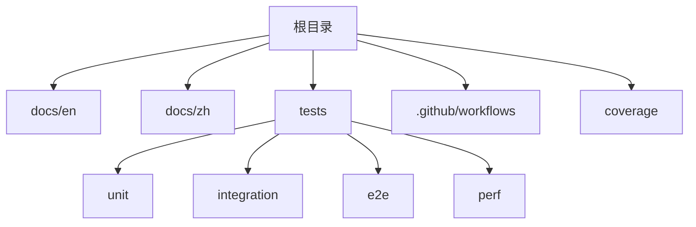
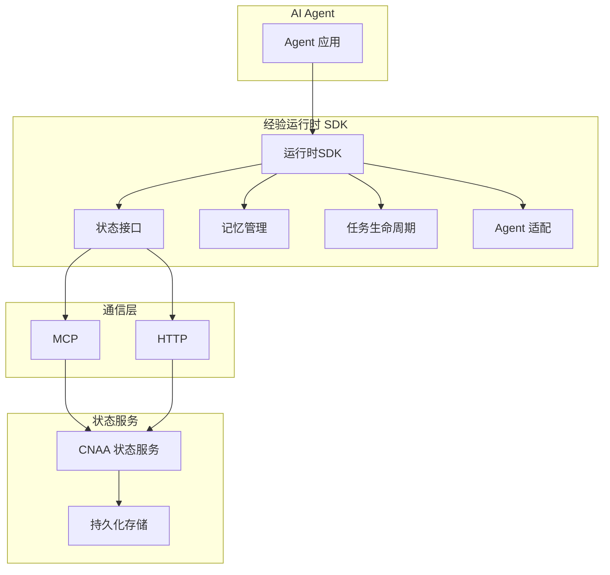
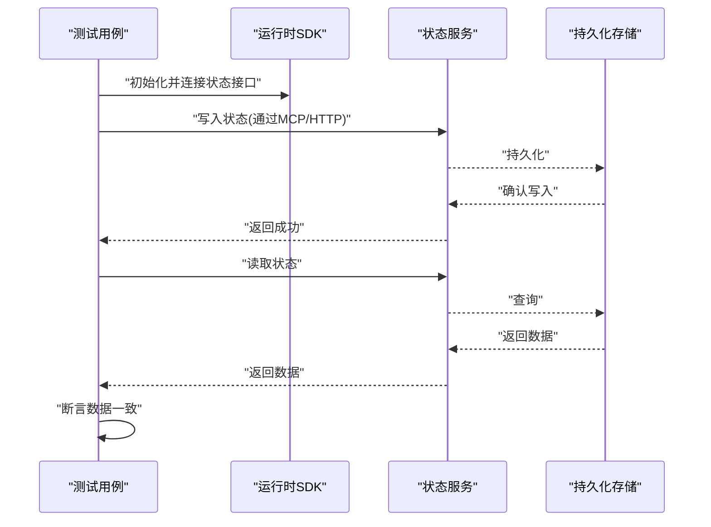
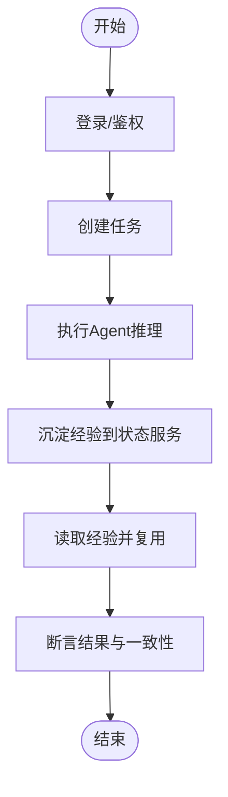

# 测试指南

<cite>
**本文档引用的文件**
- [README.md](file://README.md)
- [README_CN.md](file://README_CN.md)
</cite>

## 目录
1. [简介](#简介)
2. [项目结构](#项目结构)
3. [核心组件](#核心组件)
4. [架构总览](#架构总览)
5. [详细组件分析](#详细组件分析)
6. [依赖分析](#依赖分析)
7. [性能考虑](#性能考虑)
8. [故障排查指南](#故障排查指南)
9. [结论](#结论)
10. [附录](#附录)

## 简介
本指南面向 CNAA（Cloud Native Agentic Architecture）项目的测试实践，目标是帮助开发者建立完善的测试体系：单元测试、集成测试、端到端测试、覆盖率与报告、持续集成以及性能/压力测试。由于当前仓库仅包含 README 文档，尚未包含具体代码实现，本指南将基于 CNAA 的架构概念与目标能力，给出可落地的测试策略与实施建议，便于在后续代码落地时快速对齐。

## 项目结构
当前仓库为文档型仓库，主要包含中英文 README 与空的 docs 目录。测试相关工程化配置（如测试框架、CI、覆盖率工具等）尚未引入。建议在后续开发中按以下结构组织测试代码：
- tests/unit：单元测试
- tests/integration：集成测试
- tests/e2e：端到端测试
- tests/perf：性能与压测脚本
- .github/workflows：持续集成流水线
- coverage：覆盖率输出目录

[无图表来源，因为该图为概念性结构示意]

## 核心组件
根据 README 中的架构描述，CNAA 的核心由“经验运行时”和“状态服务”组成，并通过统一的状态接口与 MCP/HTTP 进行交互。测试应围绕这些边界展开：
- 经验运行时 SDK：负责任务生命周期、记忆管理、Agent 适配等
- 状态接口：对外暴露的统一状态访问契约
- 状态服务：持久化与同步后端
- 通信协议：MCP / HTTP

测试重点：
- 状态接口的契约一致性
- 经验运行时的内存管理与状态同步
- 状态服务的持久化与并发安全
- 外部通信的稳定性与容错

**章节来源**
- [README.md:55-85](file://README.md#L55-L85)
- [README_CN.md:63-93](file://README_CN.md#L63-L93)

## 架构总览
下图展示了 CNAA 的高层架构与测试关注点。测试需覆盖从 Agent 到运行时、再到状态服务的全链路。

[无图表来源，因为该图为概念性架构示意]

## 详细组件分析

### 单元测试编写指南
- 目标：验证最小可测单元的逻辑正确性，隔离外部依赖
- 建议范围：
  - 状态接口契约校验（输入/输出、错误码、边界条件）
  - 记忆管理的增删改查与一致性
  - 任务生命周期的状态迁移
  - Agent 适配器的数据转换
- Mock 对象创建：
  - 使用语言原生或第三方 Mock 框架对状态服务、MCP/HTTP 客户端进行替换
  - 针对异步调用提供 Promise/Future 的可控返回
- 断言库使用：
  - 选择与语言生态匹配的断言库（如 Jest、pytest、JUnit 等）
  - 对异常路径、超时、重试等进行断言
- 异步测试处理：
  - 使用测试框架提供的异步支持（async/await、回调、事件循环控制）
  - 避免竞态条件，必要时注入时钟或使用固定时间源

[本节为通用方法论，不直接分析具体文件]

### 集成测试搭建指南
- 目标：验证多组件协作的正确性与稳定性
- 环境准备：
  - 使用容器化或本地服务模拟状态服务与持久化存储
  - 提供测试数据库与缓存实例
- 测试数据设置：
  - 通过夹具或工厂方法生成一致的数据集
  - 每个用例前后进行数据清理与重置
- 服务间通信测试：
  - 覆盖 MCP/HTTP 的正常流程与异常分支
  - 模拟网络抖动、超时、重试与熔断场景
- 示例流程（概念）：
  - 启动状态服务与存储
  - 初始化运行时 SDK 并连接状态接口
  - 执行一组业务操作并校验最终一致性

[无图表来源，因为该图为概念性流程示意]

### 端到端测试实现方案
- 目标：模拟真实用户场景与业务流程，覆盖跨服务全链路
- 设计要点：
  - 定义典型用户旅程（如创建任务、沉淀经验、跨会话复用）
  - 使用真实或仿真客户端驱动 Agent 与运行时
  - 校验关键指标（响应时间、成功率、数据一致性）
- 数据与环境：
  - 独立 E2E 环境，避免污染其他测试
  - 预置种子数据与回滚机制
- 失败恢复：
  - 自动重试与降级策略验证
  - 记录日志与快照以便定位问题

[无图表来源，因为该图为概念性流程示意]

### 覆盖率要求与报告生成
- 覆盖率目标：
  - 行覆盖率 ≥ 80%
  - 分支覆盖率 ≥ 70%
  - 关键模块（状态接口、记忆管理、任务生命周期）≥ 90%
- 报告格式：
  - HTML 报告用于人工审查
  - JSON/XML 用于 CI 聚合
- 工具建议：
  - 语言级覆盖率工具（如 Istanbul、Coverage.py、JaCoCo 等）
  - 结合 CI 平台生成并归档报告

[本节为通用方法论，不直接分析具体文件]

### 持续集成配置
- 触发条件：
  - Push/Pull Request 事件
  - 定时任务（夜间回归）
- 阶段划分：
  - 构建与依赖安装
  - 单元测试与覆盖率收集
  - 集成测试（启动依赖服务）
  - 端到端测试（独立环境）
  - 性能基准（可选）
- 质量门禁：
  - 覆盖率阈值
  - 静态检查与安全检查
  - 测试结果必须全部通过

[本节为通用方法论，不直接分析具体文件]

### 性能测试与压力测试
- 目标：评估系统在负载下的吞吐、延迟与资源占用
- 指标：
  - QPS、P95/P99 延迟、错误率、CPU/内存/IO 使用率
- 工具建议：
  - HTTP/MCP 压测工具（如 k6、wrk、JMeter）
  - 分布式压测（如需）
- 场景设计：
  - 读写比例、热点键、长事务、批量操作
  - 峰值与稳态负载
- 基线与回归：
  - 建立性能基线，防止回归
  - 压测报告纳入 CI 归档

[本节为通用方法论，不直接分析具体文件]

## 依赖分析
当前仓库未包含代码与依赖配置文件，无法进行实际依赖关系分析。建议在引入代码后，使用依赖分析工具（如 dep、go mod graph、pipdeptree、npm audit 等）生成依赖图，识别潜在风险与冲突。

[本节为通用方法论，不直接分析具体文件]

## 性能考虑
- 测试环境隔离：确保压测与功能测试互不影响
- 资源限制：为测试容器设置 CPU/内存上限，避免资源争用
- 数据规模：使用合理规模的测试数据，避免 I/O 瓶颈
- 监控与采样：采集关键指标，必要时降低采样频率以减轻开销

[本节为通用方法论，不直接分析具体文件]

## 故障排查指南
- 常见问题：
  - 异步测试超时或死锁：检查事件循环与回调链
  - 状态不一致：核对幂等性与事务边界
  - 外部依赖不稳定：使用 Mock 或服务虚拟化
- 诊断手段：
  - 结构化日志与追踪 ID
  - 测试回放与快照对比
  - 慢查询与热点分析

[本节为通用方法论，不直接分析具体文件]

## 结论
尽管当前仓库尚未包含具体实现代码，但基于 CNAA 的架构目标与能力，已明确测试体系的总体方向与关键关注点。建议在后续开发中逐步引入测试框架、Mock 策略、覆盖率与 CI 流水线，确保质量与可维护性持续提升。

[本节为总结性内容，不直接分析具体文件]

## 附录
- 术语说明：
  - 经验运行时：使 Agent 在不修改推理逻辑的前提下沉淀与复用经验的运行时
  - 状态接口：统一的对外状态访问契约
  - 状态服务：负责持久化与同步的后端服务
- 参考文档：
  - 英文文档入口与路线图参见 README
  - 中文文档入口与路线图参见 README_CN

**章节来源**
- [README.md:76-102](file://README.md#L76-L102)
- [README_CN.md:84-110](file://README_CN.md#L84-L110)