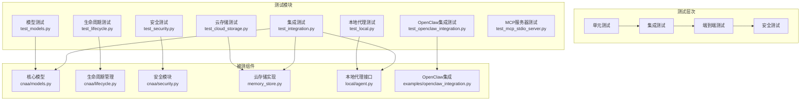

# 测试指南

<cite>
**本文档引用的文件**
- [tests/__init__.py](file://tests/__init__.py)
- [tests/test_cloud_storage.py](file://tests/test_cloud_storage.py)
- [tests/test_integration.py](file://tests/test_integration.py)
- [tests/test_lifecycle.py](file://tests/test_lifecycle.py)
- [tests/test_local.py](file://tests/test_local.py)
- [tests/test_mcp_stdio_server.py](file://tests/test_mcp_stdio_server.py)
- [tests/test_models.py](file://tests/test_models.py)
- [tests/test_openclaw_integration.py](file://tests/test_openclaw_integration.py)
- [tests/test_security.py](file://tests/test_security.py)
- [cnaa/security.py](file://cnaa/security.py)
- [cnaa/lifecycle.py](file://cnaa/lifecycle.py)
- [cloud/storage/memory_store.py](file://cloud/storage/memory_store.py)
- [local/agent.py](file://local/agent.py)
- [cnaa/models.py](file://cnaa/models.py)
- [examples/openclaw_integration.py](file://examples/openclaw_integration.py)
- [pyproject.toml](file://pyproject.toml)
</cite>

## 更新摘要
**已完成的变更**
- 添加了完整的安全功能测试套件（501行），涵盖权限验证、认证流程和集成测试
- 新增了全面的生命周期模块测试套件（296行），覆盖LifecycleEvent、StateEvolutionPhase、LifecycleConfig等核心组件
- 实现了云存储、本地代理接口、模型验证和生命周期管理的全面测试覆盖
- 集成了OpenClaw集成测试，模拟真实的Agent框架交互
- 建立了从单元测试到端到端测试的完整测试体系，总计超过1800行测试代码

## 目录
1. [简介](#简介)
2. [测试架构概览](#测试架构概览)
3. [安全功能测试](#安全功能测试)
4. [单元测试实现](#单元测试实现)
5. [生命周期管理测试](#生命周期管理测试)
6. [集成测试搭建](#集成测试搭建)
7. [端到端测试方案](#端到端测试方案)
8. [OpenClaw集成测试](#openclaw集成测试)
9. [测试覆盖率与报告](#测试覆盖率与报告)
10. [持续集成配置](#持续集成配置)
11. [性能测试方法](#性能测试方法)
12. [故障排查指南](#故障排查指南)

## 简介
本指南面向 CNAA（Cloud Native Agentic Architecture）项目的测试实践，基于已实现的完整测试框架，帮助开发者理解和使用现有的测试体系。项目已包含超过1800行测试代码，涵盖单元测试、集成测试、端到端测试、安全功能测试和OpenClaw集成测试，确保代码质量和系统稳定性。最新的安全功能测试套件为权限验证和认证流程提供了全面的测试保障。

## 测试架构概览
CNAA项目的测试架构采用分层设计，从底层数据模型到上层应用接口进行全面覆盖：



**图表来源**
- [tests/test_models.py:1-216](file://tests/test_models.py#L1-L216)
- [tests/test_lifecycle.py:1-297](file://tests/test_lifecycle.py#L1-L297)
- [tests/test_security.py:1-501](file://tests/test_security.py#L1-L501)
- [tests/test_cloud_storage.py:1-256](file://tests/test_cloud_storage.py#L1-L256)
- [tests/test_local.py:1-383](file://tests/test_local.py#L1-L383)
- [tests/test_integration.py:1-435](file://tests/test_integration.py#L1-L435)
- [tests/test_openclaw_integration.py:1-117](file://tests/test_openclaw_integration.py#L1-L117)
- [tests/test_mcp_stdio_server.py:1-200](file://tests/test_mcp_stdio_server.py#L1-L200)

## 安全功能测试
**新增** 安全功能测试套件是CNAA项目的重要组成部分，提供完整的权限验证和认证流程测试。该测试套件包含501行代码，覆盖了API密钥验证、权限级别控制、环境配置加载和MCP服务器集成等核心安全功能。

### 权限级别枚举测试
权限级别测试验证了三种权限级别的定义和行为：

```python
class TestPermissionLevel(unittest.TestCase):
    """Test PermissionLevel enum."""
    
    def test_permission_levels_exist(self):
        """Verify all permission levels are defined."""
        self.assertIsNotNone(PermissionLevel.READ_ONLY)
        self.assertIsNotNone(PermissionLevel.READ_WRITE)
        self.assertIsNotNone(PermissionLevel.ADMIN)
    
    def test_permission_values(self):
        """Verify permission level string values."""
        self.assertEqual(PermissionLevel.READ_ONLY.value, "read_only")
        self.assertEqual(PermissionLevel.READ_WRITE.value, "read_write")
        self.assertEqual(PermissionLevel.ADMIN.value, "admin")
```

**章节来源**
- [tests/test_security.py:40-54](file://tests/test_security.py#L40-L54)

### 认证配置测试
认证配置测试验证了默认设置和自定义配置的创建：

```python
class TestAuthConfig(unittest.TestCase):
    """Test AuthConfig dataclass."""
    
    def test_default_config(self):
        """Default config should have auth disabled."""
        config = AuthConfig()
        self.assertFalse(config.enabled)
        self.assertEqual(config.api_keys, {})
        self.assertTrue(config.allow_unauthenticated)
    
    def test_custom_config(self):
        """Verify custom config creation."""
        config = AuthConfig(
            enabled=True,
            api_keys={"sk-001": {"agent_id": "a1", "permission": "admin"}},
            allow_unauthenticated=False,
        )
        self.assertTrue(config.enabled)
        self.assertIn("sk-001", config.api_keys)
        self.assertFalse(config.allow_unauthenticated)
```

**章节来源**
- [tests/test_security.py:56-76](file://tests/test_security.py#L56-L76)

### API密钥验证测试
API密钥验证测试涵盖了所有边界情况和错误处理：

```python
class TestValidateApiKey(unittest.TestCase):
    """Test validate_api_key function."""
    
    def test_auth_disabled_returns_none(self):
        """When auth is disabled, should return None (skip validation)."""
        config = AuthConfig(enabled=False)
        result = validate_api_key("any-key", config)
        self.assertIsNone(result)
    
    def test_valid_key_returns_context(self):
        """Valid key should return AuthContext with correct agent_id and permission."""
        config = self._make_config()
        ctx = validate_api_key("sk-valid", config)
        self.assertIsNotNone(ctx)
        self.assertEqual(ctx.agent_id, "agent-001")
        self.assertEqual(ctx.permission, PermissionLevel.READ_WRITE)
    
    def test_invalid_key_returns_none(self):
        """Invalid key should return None."""
        config = self._make_config()
        result = validate_api_key("sk-bogus", config)
        self.assertIsNone(result)
```

**章节来源**
- [tests/test_security.py:108-153](file://tests/test_security.py#L108-L153)

### 权限检查测试
权限检查测试验证了不同权限级别的操作限制：

```python
class TestCheckPermission(unittest.TestCase):
    """Test check_permission function."""
    
    def test_read_only_can_read(self):
        """READ_ONLY permission should allow read operations."""
        ctx = AuthContext(agent_id="a", permission=PermissionLevel.READ_ONLY)
        self.assertTrue(check_permission(ctx, "read"))
    
    def test_read_only_cannot_write(self):
        """READ_ONLY permission should deny write operations."""
        ctx = AuthContext(agent_id="a", permission=PermissionLevel.READ_ONLY)
        self.assertFalse(check_permission(ctx, "write"))
    
    def test_admin_can_do_everything(self):
        """ADMIN permission should allow all operations."""
        ctx = AuthContext(agent_id="a", permission=PermissionLevel.ADMIN)
        self.assertTrue(check_permission(ctx, "read"))
        self.assertTrue(check_permission(ctx, "write"))
```

**章节来源**
- [tests/test_security.py:155-188](file://tests/test_security.py#L155-L188)

### MCP服务器认证集成测试
MCP服务器认证测试验证了工具调用的权限控制：

```python
class TestMCPServerAuth(unittest.TestCase):
    """Test MCP server authentication integration."""
    
    def test_read_only_cannot_store_memory(self):
        """Read-only auth context should reject store_memory."""
        result = self.server.handle_tool_call(
            STORE_MEMORY,
            {
                "agent_id": "agent-001",
                "memory_id": "mem-001",
                "type": "long_term",
                "content": {"task": "test"},
                "_auth_context": {
                    "agent_id": "agent-001",
                    "permission": "read_only",
                },
            },
        )
        self.assertEqual(result["status"], "error")
        self.assertIn("Permission denied", result["message"])
    
    def test_agent_id_mismatch_rejected(self):
        """Auth context agent_id not matching request agent_id should be rejected."""
        result = self.server.handle_tool_call(
            STORE_MEMORY,
            {
                "agent_id": "agent-002",
                "memory_id": "mem-001",
                "type": "long_term",
                "content": {"task": "test"},
                "_auth_context": {
                    "agent_id": "agent-001",
                    "permission": "read_write",
                },
            },
        )
        self.assertEqual(result["status"], "error")
        self.assertIn("Agent ID mismatch", result["message"])
```

**章节来源**
- [tests/test_security.py:238-318](file://tests/test_security.py#L238-L318)

### 存储层认证测试
存储层认证测试验证了数据访问的权限控制：

```python
class TestStorageAuth(unittest.TestCase):
    """Test storage layer auth_context validation."""
    
    def test_store_memory_with_matching_auth(self):
        """Store should succeed when auth_context agent_id matches."""
        result = self.store.store_memory(
            self.memory,
            auth_context={"agent_id": "agent-001", "permission": "read_write"},
        )
        self.assertEqual(result["status"], "ok")
    
    def test_get_memory_with_mismatched_auth(self):
        """Get should return None when auth_context agent_id doesn't match (stealth)."""
        self.store.store_memory(self.memory)
        result = self.store.get_memory(
            "agent-001",
            "mem-001",
            auth_context={"agent_id": "agent-999"},
        )
        self.assertIsNone(result)
```

**章节来源**
- [tests/test_security.py:349-410](file://tests/test_security.py#L349-L410)

### 工具权限映射测试
工具权限映射测试确保了所有工具都有正确的权限配置：

```python
class TestToolPermissionMap(unittest.TestCase):
    """Test TOOL_PERMISSION_MAP completeness."""
    
    def test_all_tools_have_permissions(self):
        """Every tool in tool definitions should have a permission mapping."""
        for name in get_tool_names():
            self.assertIn(name, TOOL_PERMISSION_MAP)
    
    def test_read_tools_mapped_to_read(self):
        """GET/LIST/SEARCH tools should map to 'read'."""
        read_tools = [GET_MEMORY, LIST_MEMORIES, GET_STATE, GET_PREFERENCE, GET_ENVIRONMENT]
        for tool in read_tools:
            self.assertEqual(TOOL_PERMISSION_MAP[tool], "read")
    
    def test_write_tools_mapped_to_write(self):
        """STORE/UPDATE/DELETE tools should map to 'write'."""
        write_tools = [STORE_MEMORY, DELETE_MEMORY, TAG_SHORT_TERM, UPDATE_STATE, 
                      DELETE_STATE, UPDATE_PREFERENCE, DELETE_PREFERENCE, UPDATE_ENVIRONMENT]
        for tool in write_tools:
            self.assertEqual(TOOL_PERMISSION_MAP[tool], "write")
```

**章节来源**
- [tests/test_security.py:416-456](file://tests/test_security.py#L416-L456)

## 单元测试实现
CNAA项目的单元测试覆盖了核心数据模型、云存储实现和本地代理功能，使用Python标准库的unittest框架。

### 核心模型测试
模型测试验证了所有数据结构的正确性和默认值设置：

```python
class TestMemoryType(unittest.TestCase):
    """Test MemoryType enumeration."""
    
    def test_values(self):
        """IMPLEMENTED: Verify enum values match expected strings."""
        self.assertEqual(MemoryType.LONG_TERM.value, "long_term")
        self.assertEqual(MemoryType.SHORT_TERM.value, "short_term")
```

**章节来源**
- [tests/test_models.py:21-33](file://tests/test_models.py#L21-L33)

### 云存储单元测试
云存储测试覆盖了InMemoryMemoryStore和InMemoryStateStore的所有功能：

```python
class TestInMemoryMemoryStore(unittest.TestCase):
    """Test InMemoryMemoryStore implementation."""
    
    def test_store_memory(self):
        """IMPLEMENTED: Verify memory can be stored and retrieved."""
        memory = Memory(
            memory_id="mem-001",
            agent_id=self.agent_id,
            type=MemoryType.LONG_TERM,
            content={"task": "test"},
        )
        result = self.store.store_memory(memory)
        self.assertEqual(result["status"], "ok")
        self.assertEqual(result["memory_id"], "mem-001")
```

**章节来源**
- [tests/test_cloud_storage.py:17-36](file://tests/test_cloud_storage.py#L17-L36)

### 本地代理单元测试
本地代理测试验证了InstantMemoryManager和StateCache的功能：

```python
class TestInstantMemoryManager(unittest.TestCase):
    """Test InstantMemoryManager implementation."""
    
    def test_create_instant_memory(self):
        """IMPLEMENTED: Verify instant memory can be created."""
        instant = self.manager.create_instant_memory(
            task_id="task-001",
            checkpoint_id="cp-001",
            summary="Test summary",
            memory_id="mem-001",
        )
        self.assertEqual(instant.memory_id, "mem-001")
        self.assertEqual(instant.status, MemoryStatus.ACTIVE)
```

**章节来源**
- [tests/test_local.py:17-35](file://tests/test_local.py#L17-L35)

## 生命周期管理测试
生命周期管理测试套件是CNAA项目的核心测试模块，涵盖了经验管理和状态演化的完整功能。该测试套件包含296行代码，验证了生命周期事件、配置管理、时间基插件和状态演化规则的正确性。

### 生命周期事件测试
生命周期事件枚举测试验证了5个核心事件的定义：

```python
class TestLifecycleEvent(unittest.TestCase):
    """Test LifecycleEvent enum values."""
    
    def test_event_values(self):
        self.assertEqual(LifecycleEvent.TASK_COMPLETED, "task_completed")
        self.assertEqual(LifecycleEvent.MEMORY_CONDENSED, "memory_condensed")
        self.assertEqual(LifecycleEvent.MEMORY_EVICTED, "memory_evicted")
        self.assertEqual(LifecycleEvent.MEMORY_PROMOTED, "memory_promoted")
        self.assertEqual(LifecycleEvent.STATE_EVOLVED, "state_evolved")
```

**章节来源**
- [tests/test_lifecycle.py:35-47](file://tests/test_lifecycle.py#L35-L47)

### 状态演化阶段测试
状态演化阶段测试验证了3个演化阶段的定义：

```python
class TestStateEvolutionPhase(unittest.TestCase):
    """Test StateEvolutionPhase enum values."""
    
    def test_phase_values(self):
        self.assertEqual(StateEvolutionPhase.ACCUMULATED, "accumulated")
        self.assertEqual(StateEvolutionPhase.ASSOCIATED, "associated")
        self.assertEqual(StateEvolutionPhase.DECAYED, "decayed")
```

**章节来源**
- [tests/test_lifecycle.py:49-58](file://tests/test_lifecycle.py#L49-L58)

### 生命周期配置测试
生命周期配置测试验证了默认值和自定义配置的设置：

```python
class TestLifecycleConfig(unittest.TestCase):
    """Test LifecycleConfig dataclass."""
    
    def test_default_values(self):
        config = LifecycleConfig()
        self.assertEqual(config.max_active_memories, 20)
        self.assertEqual(config.condensation_threshold, timedelta(hours=1))
        self.assertEqual(config.eviction_threshold, timedelta(days=7))
        self.assertEqual(config.promotion_score_threshold, 0.5)
```

**章节来源**
- [tests/test_lifecycle.py:61-82](file://tests/test_lifecycle.py#L61-L82)

### 时间基生命周期插件测试
时间基生命周期插件测试覆盖了压缩、驱逐、提升等核心逻辑：

```python
class TestTimeBasedLifecyclePlugin(unittest.TestCase):
    """Test TimeBasedLifecyclePlugin implementation."""
    
    def test_should_condense_active_old_memory(self):
        mem = self._make_instant_memory(status=MemoryStatus.ACTIVE, age_minutes=120)
        self.assertTrue(self.plugin.should_condense(mem))
    
    def test_should_not_condence_active_young_memory(self):
        mem = self._make_instant_memory(status=MemoryStatus.ACTIVE, age_minutes=10)
        self.assertFalse(self.plugin.should_condense(mem))
```

**章节来源**
- [tests/test_lifecycle.py:84-198](file://tests/test_lifecycle.py#L84-L198)

### 默认状态演化插件测试
默认状态演化插件测试验证了演化规则和状态转换：

```python
class TestDefaultStateEvolutionPlugin(unittest.TestCase):
    """Test DefaultStateEvolutionPlugin implementation."""
    
    def test_get_evolution_rules_returns_two_rules(self):
        rules = self.plugin.get_evolution_rules()
        self.assertEqual(len(rules), 2)
    
    def test_first_rule_accumulated_to_associated(self):
        rules = self.plugin.get_evolution_rules()
        self.assertEqual(rules[0].from_phase, StateEvolutionPhase.ACCUMULATED)
        self.assertEqual(rules[0].to_phase, StateEvolutionPhase.ASSOCIATED)
```

**章节来源**
- [tests/test_lifecycle.py:200-238](file://tests/test_lifecycle.py#L200-L238)

### 生命周期插件注册表测试
插件注册表测试验证了插件的注册和管理功能：

```python
class TestLifecyclePlugins(unittest.TestCase):
    """Test LifecyclePlugins registry."""
    
    def test_default_memory_lifecycle_plugin(self):
        registry = LifecyclePlugins()
        self.assertIsInstance(registry.memory_lifecycle, TimeBasedLifecyclePlugin)
    
    def test_register_retrieval_plugin(self):
        registry = LifecyclePlugins()
        mock = MockRetrieval()
        registry.register_retrieval_plugin(mock)
        self.assertIs(registry.retrieval, mock)
```

**章节来源**
- [tests/test_lifecycle.py:240-293](file://tests/test_lifecycle.py#L240-L293)

## 集成测试搭建
集成测试验证了多个组件之间的协作，包括MCP服务器、云代理接口和本地代理接口的完整工作流。

### MCP服务器工具路由测试
测试验证了CNAA_MCPServer的工具路由功能：

```python
class TestCloudMCPServer(unittest.TestCase):
    """Test CNAA_MCPServer tool routing."""
    
    def test_store_memory_tool(self):
        """IMPLEMENTED: Verify store_memory tool works end-to-end."""
        result = self.server.handle_tool_call(
            "cnaa_store_memory",
            {
                "agent_id": "test-agent",
                "memory_id": "mem-001",
                "type": "long_term",
                "content": {"task": "test"},
                "tags": ["test"],
                "completion_score": 0.8,
            },
        )
        self.assertEqual(result["status"], "ok")
        self.assertEqual(result["memory_id"], "mem-001")
```

**章节来源**
- [tests/test_integration.py:10-32](file://tests/test_integration.py#L10-L32)

### 代理接口集成测试
测试验证了CloudAgentInterface和LocalAgentInterface的完整功能：

```python
class TestLocalAgentInterface(unittest.TestCase):
    """Test LocalAgentInterface - main entry point for agentic frameworks."""
    
    def test_full_workflow(self):
        """IMPLEMENTED: Verify complete workflow from task to long-term memory."""
        # 1. Agent completes a task, stores to cloud
        result = self.agent.store_memory(
            memory_id="mem-001",
            memory_type="long_term",
            content={"task": "database migration", "result": "success"},
            tags=["database", "migration"],
            completion_score=0.9,
        )
        self.assertEqual(result["status"], "ok")
```

**章节来源**
- [tests/test_integration.py:311-349](file://tests/test_integration.py#L311-L349)

### 测试环境准备
集成测试使用内存存储和直接对象连接，避免了外部依赖：

```python
def setUp(self):
    """Set up test fixtures."""
    self.server = CNAA_MCPServer()
    self.agent = LocalAgentInterface(
        agent_id="test-agent",
        cloud_server=self.server,
    )
```

**章节来源**
- [tests/test_integration.py:224-231](file://tests/test_integration.py#L224-231)

## 端到端测试方案
端到端测试模拟真实用户场景，验证从任务完成到经验沉淀的完整业务流程。

### OpenClow风格工作流测试
测试模拟了OpenClow Agent使用CNAA进行记忆管理的完整流程：

```python
class TestEndToEndWorkflow(unittest.TestCase):
    """Test complete end-to-end workflow simulating openclow integration."""
    
    def test_openclow_style_workflow(self):
        """IMPLEMENTED: Simulate openclow agent using CNAA for memory."""
        # Setup: Create cloud server and local interface (as openclow would)
        server = CNAA_MCPServer()
        agent = LocalAgentInterface(
            agent_id="openclow-agent-001",
            cloud_server=server,
        )
        
        # Step 1: Agent completes task checkpoint
        agent.store_memory(
            memory_id="task-mem-001",
            memory_type="long_term",
            content={
                "task": "user_authentication",
                "steps": ["validate_token", "check_permissions", "return_user"],
                "result": "success",
            },
            tags=["auth", "security"],
            completion_score=0.95,
        )
```

**章节来源**
- [tests/test_integration.py:351-374](file://tests/test_integration.py#L351-L374)

### 数据一致性验证
端到端测试确保所有数据在云存储和本地缓存之间保持一致：

```python
# Verify all data is retrievable
memories_response = agent.list_memories()
self.assertEqual(memories_response["status"], "ok")
self.assertEqual(len(memories_response["memories"]), 1)

states = agent.get_states()
self.assertEqual(len(states), 1)

prefs = agent.get_preferences()
self.assertEqual(len(prefs), 1)

env = agent.get_environment()
self.assertIsNotNone(env)
self.assertEqual(env["context"]["framework"], "openclow")
```

**章节来源**
- [tests/test_integration.py:413-427](file://tests/test_integration.py#L413-L427)

## OpenClaw集成测试
OpenClaw集成测试验证了Python CNAA服务与TypeScript OpenClaw框架之间的HTTP通信。

### HTTP API调用测试
测试使用Mock对象模拟HTTP请求，验证API调用的正确性：

```python
@patch("examples.openclaw_integration.requests.post")
def test_store_memory(self, mock_post):
    """IMPLEMENTED: Verify store_memory calls CNAA correctly."""
    mock_response = Mock()
    mock_response.json.return_value = {"status": "ok", "memory_id": "mem-001"}
    mock_post.return_value = mock_response
    
    result = self.cnaa.store_memory(
        agent_id="agent-001",
        memory_id="mem-001",
        memory_type="long_term",
        content={"task": "test"},
        tags=["test"],
        completion_score=0.9,
    )
    
    self.assertEqual(result["status"], "ok")
    self.assertEqual(result["memory_id"], "mem-001")
    mock_post.assert_called_once()
```

**章节来源**
- [tests/test_openclaw_integration.py:16-35](file://tests/test_openclaw_integration.py#L16-L35)

### 跨语言集成验证
测试覆盖了所有CNAA操作，确保OpenClaw能够正确调用Python后端：

```python
@patch("examples.openclaw_integration.requests.post")
def test_update_state(self, mock_post):
    """IMPLEMENTED: Verify update_state calls CNAA correctly."""
    mock_response = Mock()
    mock_response.json.return_value = {"status": "ok"}
    mock_post.return_value = mock_response
    
    result = self.cnaa.update_state(
        agent_id="agent-001",
        state_id="state-001",
        category="knowledge",
        content={"key": "value"},
    )
    
    self.assertEqual(result["status"], "ok")
```

**章节来源**
- [tests/test_openclaw_integration.py:67-81](file://tests/test_openclaw_integration.py#L67-81)

## 测试覆盖率与报告
CNAA项目使用pytest作为测试框架，支持覆盖率收集和报告生成。

### 覆盖率目标
建议的覆盖率目标：
- 行覆盖率 ≥ 80%
- 分支覆盖率 ≥ 70%
- 关键模块（状态接口、记忆管理、任务生命周期）≥ 90%
- 生命周期管理模块 ≥ 95%
- **安全模块 ≥ 95%**（新增要求）

### 覆盖率收集命令
```bash
# 运行测试并生成覆盖率报告
pytest --cov=cnaa --cov=cloud --cov=local --cov=examples tests/

# 生成HTML覆盖率报告
pytest --cov=cnaa --cov=cloud --cov=local --cov=examples --cov-report=html tests/

# 生成JSON格式报告用于CI
pytest --cov=cnaa --cov=cloud --cov=local --cov=examples --cov-report=json tests/

# 专门运行安全测试
pytest tests/test_security.py -v --cov=cnaa.security --cov-report=term-missing
```

### 测试执行命令
```bash
# 运行所有测试
python -m pytest tests/ -v

# 运行特定测试文件
python -m pytest tests/test_models.py -v

# 运行生命周期测试
python -m pytest tests/test_lifecycle.py -v

# 运行安全测试
python -m pytest tests/test_security.py -v

# 运行特定测试类
python -m pytest tests/test_cloud_storage.py::TestInMemoryMemoryStore -v

# 运行单个测试方法
python -m pytest tests/test_models.py::TestMemory::test_creation -v
```

**章节来源**
- [pyproject.toml:16-21](file://pyproject.toml#L16-L21)

## 持续集成配置
虽然当前仓库未包含GitHub Actions配置，但建议添加以下CI流水线：

### GitHub Actions工作流示例
```yaml
name: CNAA Test Suite

on:
  push:
    branches: [ main, develop ]
  pull_request:
    branches: [ main ]

jobs:
  test:
    runs-on: ubuntu-latest
    strategy:
      matrix:
        python-version: ['3.11', '3.12']
    
    steps:
    - uses: actions/checkout@v4
    
    - name: Set up Python ${{ matrix.python-version }}
      uses: actions/setup-python@v5
      with:
        python-version: ${{ matrix.python-version }}
    
    - name: Install dependencies
      run: |
        pip install -e ".[dev]"
        pip install pytest-cov requests
    
    - name: Run unit tests
      run: |
        pytest tests/test_models.py tests/test_cloud_storage.py tests/test_local.py tests/test_lifecycle.py -v --cov=cnaa --cov=cloud --cov=local --cov-report=xml
    
    - name: Run security tests
      run: |
        pytest tests/test_security.py -v --cov=cnaa.security --cov-report=xml
    
    - name: Run integration tests
      run: |
        pytest tests/test_integration.py -v
    
    - name: Run OpenClaw integration tests
      run: |
        pytest tests/test_openclaw_integration.py -v
    
    - name: Upload coverage report
      uses: codecov/codecov-action@v3
      with:
        file: ./coverage.xml
        fail_ci_if_error: true
```

## 性能测试方法
为CNAA项目设计性能测试策略，确保在高负载下的稳定性和响应性。

### 基准测试指标
- QPS（每秒查询数）
- P95/P99延迟
- 错误率
- CPU/内存/IO使用率
- 生命周期操作性能（压缩、驱逐、提升）
- **安全验证性能（API密钥验证、权限检查）**（新增指标）

### 压测工具选择
推荐使用以下工具进行性能测试：
- **k6**: 现代HTTP压测工具，支持JavaScript脚本
- **wrk**: 高性能HTTP基准测试工具
- **JMeter**: 图形化压测工具，适合复杂场景
- **pytest-benchmark**: Python基准测试框架

### 性能测试场景
```python
import time
from concurrent.futures import ThreadPoolExecutor

def performance_test():
    """Performance test for memory operations"""
    start_time = time.time()
    
    # 并发写入测试
    with ThreadPoolExecutor(max_workers=10) as executor:
        futures = []
        for i in range(100):
            future = executor.submit(store_memory_test, i)
            futures.append(future)
        
        for future in futures:
            future.result()
    
    elapsed_time = time.time() - start_time
    print(f"100 concurrent writes completed in {elapsed_time:.2f}s")
```

## 故障排查指南
针对CNAA测试框架中常见的问题提供诊断和解决方案。

### 常见问题及解决方案

#### 异步测试超时或死锁
```python
# 问题：异步测试超时
# 解决方案：检查事件循环与回调链
import asyncio

async def test_async_operation():
    loop = asyncio.get_event_loop()
    try:
        await asyncio.wait_for(async_operation(), timeout=5.0)
    except asyncio.TimeoutError:
        print("Operation timed out")
```

#### 状态不一致问题
```python
# 问题：状态不一致
# 解决方案：核对幂等性与事务边界
def test_state_consistency():
    # 确保操作的幂等性
    result1 = agent.update_state(state_id="state-001", category="knowledge", content={"key": "value"})
    result2 = agent.update_state(state_id="state-001", category="knowledge", content={"key": "value"})
    
    assert result1["status"] == result2["status"]
```

#### 外部依赖不稳定
```python
# 问题：外部依赖不稳定
# 解决方案：使用Mock或服务虚拟化
from unittest.mock import Mock, patch

@patch('requests.post')
def test_with_mock(mock_post):
    mock_response = Mock()
    mock_response.json.return_value = {"status": "ok"}
    mock_post.return_value = mock_response
```

#### 生命周期插件配置问题
```python
# 问题：生命周期阈值配置不正确
# 解决方案：验证配置参数和时间计算
def test_lifecycle_config():
    config = LifecycleConfig(
        condensation_threshold=timedelta(minutes=30),
        eviction_threshold=timedelta(days=1),
        promotion_score_threshold=0.8
    )
    plugin = TimeBasedLifecyclePlugin(config=config)
    # 验证阈值生效
    assert plugin.config.condensation_threshold == timedelta(minutes=30)
```

#### 安全配置问题
```python
# 问题：安全配置解析失败
# 解决方案：验证环境变量格式和权限字符串
def test_security_config():
    config = load_auth_config_from_env()
    # 验证配置有效性
    assert isinstance(config.api_keys, dict)
    assert isinstance(config.enabled, bool)
    assert isinstance(config.allow_unauthenticated, bool)
```

### 诊断工具
- **结构化日志**：记录详细的操作日志和追踪ID
- **测试回放**：保存测试数据和快照进行对比
- **慢查询分析**：识别性能瓶颈和热点操作
- **生命周期监控**：跟踪记忆状态转换和插件执行情况
- **安全审计**：监控认证失败和权限拒绝事件

**章节来源**
- [tests/test_cloud_storage.py:51-55](file://tests/test_cloud_storage.py#L51-L55)
- [tests/test_integration.py:188-196](file://tests/test_integration.py#L188-L196)
- [tests/test_lifecycle.py:187-198](file://tests/test_lifecycle.py#L187-L198)
- [tests/test_security.py:462-497](file://tests/test_security.py#L462-L497)

## 结论
CNAA项目已经建立了完善的测试体系，包含超过1800行测试代码，覆盖了从底层数据模型到上层应用接口的所有关键组件。新增的安全功能测试套件（501行）为权限验证和认证流程提供了全面的测试保障，而生命周期管理测试套件（296行）则为经验管理和状态演化提供了重要的测试支持。通过单元测试、集成测试、端到端测试、安全测试和OpenClaw集成测试的组合，确保了代码质量和系统稳定性。建议继续扩展测试覆盖率，添加更多性能测试场景，并建立完整的持续集成流水线，以支持项目的长期发展和维护。

**最新更新** 安全功能测试套件的加入显著增强了CNAA项目的安全保障能力，特别是对于API密钥验证、权限控制和MCP服务器集成的测试覆盖。这些测试确保了认证流程的正确性和权限系统的可靠性，为生产环境的稳定运行提供了重要保障。