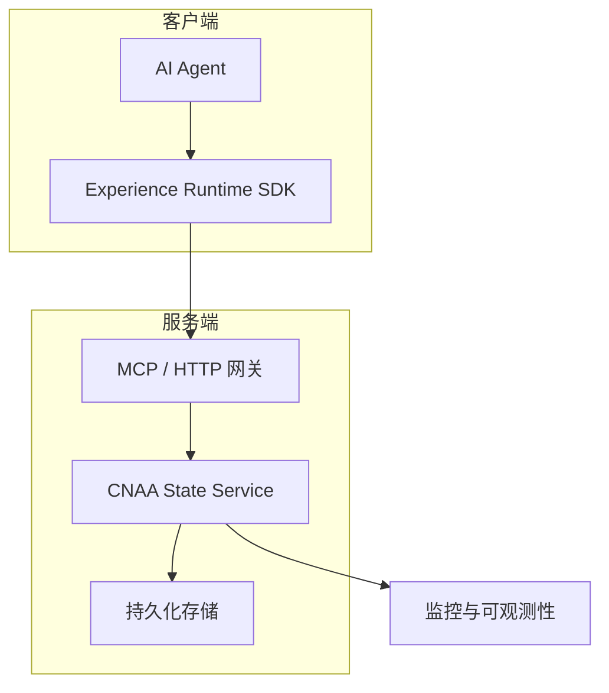
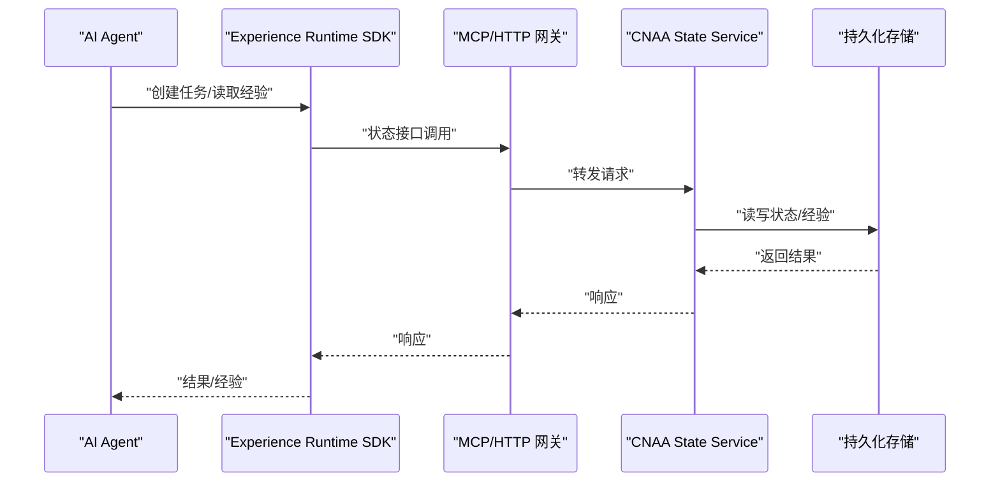
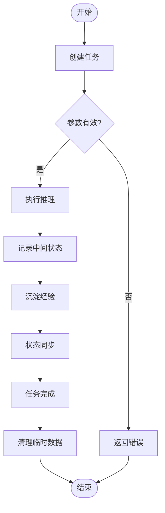
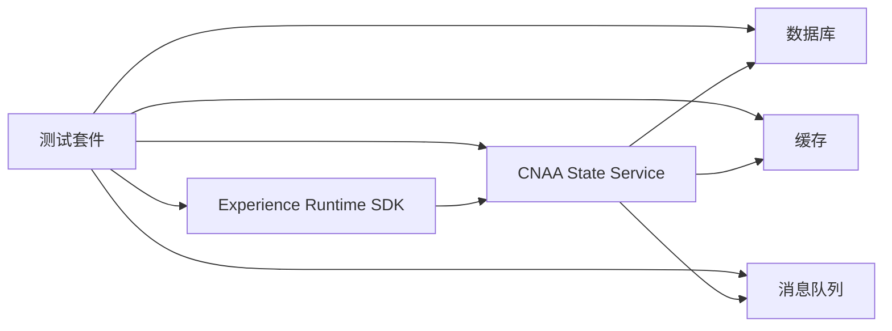

# 端到端测试

<cite>
**本文档中引用的文件**
- [README.md](file://README.md)
- [README_CN.md](file://README_CN.md)
</cite>

## 目录
1. [简介](#简介)
2. [项目结构](#项目结构)
3. [核心组件](#核心组件)
4. [架构总览](#架构总览)
5. [详细组件分析](#详细组件分析)
6. [依赖分析](#依赖分析)
7. [性能考虑](#性能考虑)
8. [故障注入与恢复测试](#故障注入与恢复测试)
9. [持续集成与报告](#持续集成与报告)
10. [结论](#结论)
11. [附录](#附录)

## 简介
本指南面向CNAA项目的端到端测试设计与实施，目标是：
- 模拟真实用户场景与业务流程，覆盖AI Agent的完整生命周期
- 自动化用户体验流程，从任务创建到经验保存的全链路验证
- 提供性能基准测试方法，测量响应时间与吞吐量
- 进行故障注入与恢复测试，验证系统容错能力
- 生成测试报告并配置持续集成，确保测试自动化执行

CNAA是一个面向AI Agent的持久化记忆运行时框架，强调“经验沉淀、状态同步与持续记忆”，并提供统一的State接口、Memory Manager、Task Lifecycle与Agent Adapter等能力，通过MCP/HTTP与CNAA State Service交互。

## 项目结构
当前仓库包含中英文README与文档目录占位，尚未包含具体实现代码。因此，端到端测试将围绕以下预期组件展开：
- Experience Runtime SDK（客户端SDK）
- CNAA State Service（服务端状态服务）
- MCP/HTTP通信层
- 持久化存储（后端数据库或对象存储）
- 监控与可观测性（日志、指标、追踪）

[无图表来源：该图为概念性架构图，不直接映射具体源码文件]

## 核心组件
端到端测试需要覆盖的核心组件与职责：
- AI Agent：发起任务请求、消费经验结果
- Experience Runtime SDK：封装状态接口、记忆管理、任务生命周期、Agent适配
- CNAA State Service：提供统一状态接口、状态同步、经验持久化
- 存储层：持久化经验与状态数据
- 可观测性：日志、指标、分布式追踪

测试关注点：
- 状态一致性：读写一致、跨节点同步正确性
- 任务生命周期：创建、执行、完成、清理全链路
- 经验沉淀：经验写入、检索、复用、版本控制
- 容错与恢复：网络抖动、服务重启、存储异常
- 性能与容量：响应时间、吞吐、延迟分布、资源使用

**章节来源**
- [README.md:55-72](file://README.md#L55-L72)
- [README_CN.md:63-80](file://README_CN.md#L63-L80)

## 架构总览
端到端测试需覆盖如下调用链：
- Agent通过SDK调用State接口
- SDK经MCP/HTTP转发至State Service
- State Service处理状态与经验持久化
- 返回结果并更新本地缓存与追踪

[无图表来源：该图为概念性序列图，不直接映射具体源码文件]

## 详细组件分析

### 任务生命周期端到端测试
目标：验证从任务创建到经验保存的完整路径，包括状态变更、错误恢复与最终一致性。

关键步骤：
- 创建任务：校验任务ID、初始状态、权限
- 执行阶段：模拟Agent推理过程，记录中间状态
- 经验沉淀：将推理结果转化为经验条目，写入持久化存储
- 状态同步：多实例间状态一致性检查
- 清理与归档：任务完成后清理临时数据，归档经验

[无图表来源：该图为概念性流程图，不直接映射具体源码文件]

### 用户体验流程自动化测试
目标：模拟真实用户从登录、任务创建、执行到经验查看的完整流程。

测试用例设计：
- 用户注册与登录
- 任务创建与参数校验
- 任务执行与进度跟踪
- 经验检索与复用
- 历史任务与经验回顾

自动化策略：
- 使用浏览器自动化或API自动化脚本
- 数据准备与清理
- 断言与可视化报告

### AI Agent完整生命周期测试
目标：验证Agent在CNAA中的接入、运行与经验复用。

关键场景：
- Agent注册与认证
- 首次运行：无经验时的冷启动
- 多次运行：经验命中与增量更新
- 并发访问：多Agent共享经验的竞争条件
- 降级与回退：经验不可用时的行为

### 性能基准测试
目标：测量响应时间、吞吐量、资源利用率与稳定性。

测试维度：
- 单接口压测：QPS、P95/P99延迟、错误率
- 混合负载：读多写少、突发流量
- 长稳测试：长时间运行内存泄漏检测
- 容量规划：不同规模下的性能表现

工具建议：
- 压测工具：k6、JMeter、Locust
- 指标采集：Prometheus、Grafana
- 分布式追踪：OpenTelemetry、Jaeger

### 故障注入与恢复测试
目标：验证系统在异常条件下的容错与自愈能力。

注入场景：
- 网络分区与延迟
- 服务宕机与重启
- 存储不可用与限流
- 数据损坏与不一致

恢复验证：
- 自动重试与熔断
- 数据修复与一致性重建
- 降级模式与只读保护

### 测试报告与持续集成
目标：自动化执行测试、生成报告并集成到CI流水线。

报告内容：
- 用例通过率、失败详情
- 性能指标趋势
- 覆盖率统计
- 风险与建议

CI配置要点：
- 环境准备与依赖安装
- 并行执行与分片
- 失败告警与回滚策略
- 报告归档与可视化

**章节来源**
- [README.md:45-52](file://README.md#L45-L52)
- [README_CN.md:53-60](file://README_CN.md#L53-L60)

## 依赖分析
端到端测试涉及的依赖关系：
- 外部服务：数据库、消息队列、对象存储
- 第三方库：压测工具、监控组件、测试框架
- 环境变量：配置项、密钥、端点地址

依赖管理策略：
- 使用Mock与Stub隔离外部依赖
- 容器化测试环境
- 配置中心化管理

[无图表来源：该图为概念性依赖图，不直接映射具体源码文件]

## 性能考虑
- 测试数据量级：模拟生产数据规模
- 并发模型：线程池、协程、异步IO
- 资源限制：CPU、内存、I/O瓶颈识别
- 热点优化：缓存命中率、索引优化
- 监控指标：延迟分布、错误率、饱和度

## 故障注入与恢复测试
- 混沌工程：随机故障注入
- 故障演练：预定义场景执行
- 恢复验证：SLA达成度评估
- 预案验证：应急预案有效性

## 持续集成与报告
- 流水线设计：构建、测试、部署、验收
- 质量门禁：覆盖率、性能阈值、安全扫描
- 报告生成：JUnit、HTML、PDF格式
- 通知机制：邮件、钉钉、Slack

## 结论
本指南为CNAA项目提供了端到端测试的完整方法论，涵盖功能、性能、可靠性与自动化等方面。由于当前仓库仅包含文档占位，实际测试实现需根据后续代码开发逐步落地。建议优先实现核心接口的单元测试与集成测试，再逐步扩展到端到端与性能测试。

## 附录
- 术语表：Experience Runtime、State Interface、Persistent Memory等
- 参考链接：官方文档、最佳实践、开源工具
- 模板与脚本：测试用例模板、CI配置文件、报告样式