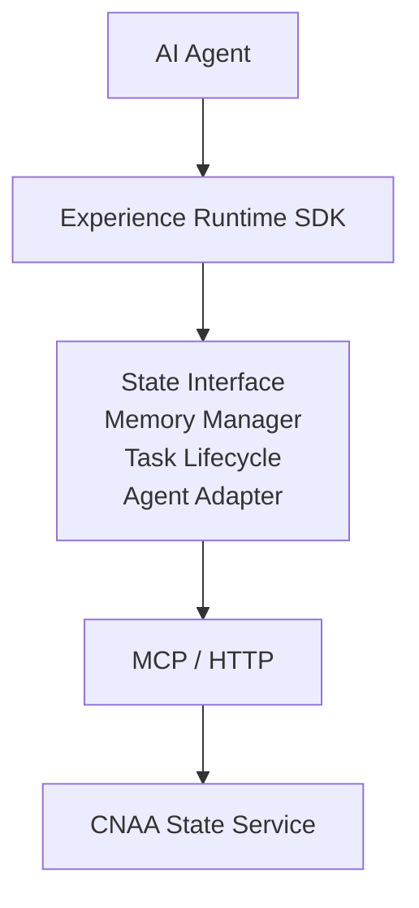
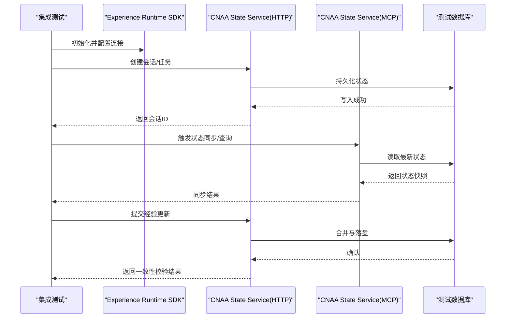
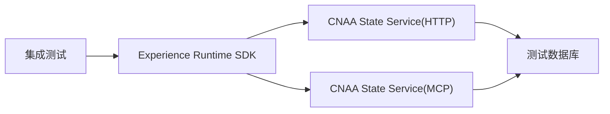

# 集成测试

<cite>
**本文引用的文件**   
- [README.md](file://README.md)
- [README_CN.md](file://README_CN.md)
</cite>

## 目录
1. [简介](#简介)
2. [项目结构](#项目结构)
3. [核心组件](#核心组件)
4. [架构总览](#架构总览)
5. [详细组件分析](#详细组件分析)
6. [依赖分析](#依赖分析)
7. [性能考虑](#性能考虑)
8. [故障排查指南](#故障排查指南)
9. [结论](#结论)
10. [附录](#附录)

## 简介
本指南面向 CNAA（Cloud Native Agentic Architecture）项目的集成测试，目标是帮助读者搭建可复用的集成测试环境，覆盖以下关键场景：
- 测试数据库的初始化与清理
- MCP 服务的模拟与契约验证
- HTTP API 的端到端调用与断言
- CNAA State Service 的状态同步与数据一致性验证
- 多 Agent 场景下的经验共享与冲突解决策略验证
- 分布式系统集成的挑战与应对方案

CNAA 提供“经验运行时”，使任何 AI Agent 在不修改推理逻辑的前提下实现经验的沉淀、同步与复用。其核心由 Experience Runtime SDK、统一状态接口、记忆管理、任务生命周期、Agent 适配层以及通过 MCP/HTTP 访问的 CNAA State Service 组成。

**章节来源**
- [README.md:9-21](file://README.md#L9-L21)
- [README_CN.md:9-21](file://README_CN.md#L9-L21)

## 项目结构
当前仓库以文档为主，包含中英文 README 与空的 docs 目录。集成测试指南将基于 README 中描述的架构进行设计，后续可在实际代码落地后补充具体实现细节。

**图表来源**
- [README.md:55-72](file://README.md#L55-L72)
- [README_CN.md:63-80](file://README_CN.md#L63-L80)

**章节来源**
- [README.md:55-72](file://README.md#L55-L72)
- [README_CN.md:63-80](file://README_CN.md#L63-L80)

## 核心组件
- 经验运行时 SDK：封装状态接口、记忆管理、任务生命周期与 Agent 适配，屏蔽底层差异。
- 统一状态接口：对外暴露一致的状态读写能力，便于不同 Agent 接入。
- CNAA State Service：作为持久化与同步的后端服务，支持通过 MCP 或 HTTP 访问。
- 持久化记忆：将经验从临时上下文抽离为独立资源，跨会话与跨 Agent 复用。

这些组件共同构成“Agent → 运行时 → 状态服务”的链路，集成测试需围绕该链路进行端到端验证。

**章节来源**
- [README.md:55-72](file://README.md#L55-L72)
- [README_CN.md:63-80](file://README_CN.md#L63-L80)

## 架构总览
下图展示了集成测试在架构中的位置与交互路径：测试驱动通过 HTTP/MCP 调用 State Service，验证状态写入、同步与一致性；同时模拟多个 Agent 并发访问，验证经验共享与冲突处理。

[本图为概念性流程示意，不直接映射到具体源码文件]

## 详细组件分析

### 测试数据库设置与管理
- 目标：为每次集成测试提供隔离、可回滚的数据环境。
- 建议实践：
  - 使用容器化数据库实例，按测试套件动态分配端口与命名空间。
  - 在测试前执行迁移脚本，确保 schema 与种子数据就绪。
  - 每个用例结束后执行清理或事务回滚，保证无副作用。
  - 对关键表建立索引，提升状态查询与同步的性能。
- 验证点：
  - 写入后可读、幂等写入不重复、删除级联正确。
  - 并发写入时锁机制与冲突检测生效。

[本节为通用指导，不直接分析具体文件]

### MCP 服务模拟与契约验证
- 目标：在无真实 MCP 服务端的情况下，验证客户端行为与服务契约。
- 建议实践：
  - 使用内存或轻量进程模拟 MCP 协议，记录请求与响应。
  - 定义最小可用契约（方法名、参数结构、错误码），并在测试中严格断言。
  - 注入异常场景（超时、部分失败、版本不兼容）验证容错。
- 验证点：
  - 重试与退避策略有效。
  - 错误码与消息语义符合规范。
  - 日志与追踪信息完整。

[本节为通用指导，不直接分析具体文件]

### HTTP API 测试
- 目标：端到端验证 CNAA State Service 的 HTTP 接口。
- 建议实践：
  - 针对关键接口编写正向与反向用例（成功、参数缺失、权限不足、限流）。
  - 使用固定时间源与随机种子，保证结果可重现。
  - 对分页、排序、过滤等边界条件进行覆盖。
- 验证点：
  - 状态码与响应体结构稳定。
  - 幂等性与一致性约束满足。
  - 性能指标（延迟、吞吐）达到基线。

[本节为通用指导，不直接分析具体文件]

### CNAA State Service 集成测试：状态同步与一致性
- 目标：验证状态在服务端的同步机制与数据一致性。
- 建议实践：
  - 构造多写场景，观察合并策略与冲突解决。
  - 引入网络抖动与分区，验证最终一致性。
  - 使用快照与增量同步对比，确保无丢失。
- 验证点：
  - 版本号/时间戳单调递增。
  - 冲突检测与恢复路径可达。
  - 审计日志可追溯。

[本节为通用指导，不直接分析具体文件]

### 多 Agent 场景：经验共享与冲突解决
- 目标：验证多个 Agent 并发访问时的经验共享与冲突处理。
- 建议实践：
  - 启动多个 Agent 实例，分别写入相同键的经验。
  - 验证合并策略（如最后写入胜出、加权投票、领域专家优先）。
  - 检查冲突日志与告警是否准确。
- 验证点：
  - 共享经验可见性符合预期。
  - 冲突解决策略可配置且可观测。
  - 性能随规模线性扩展或具备弹性。

[本节为通用指导，不直接分析具体文件]

### 测试数据准备与管理
- 目标：为各类场景提供稳定、可控的测试数据。
- 建议实践：
  - 使用工厂方法生成结构化数据，避免硬编码。
  - 分层管理基础数据、业务数据与边界数据。
  - 对敏感数据进行脱敏或替换。
- 验证点：
  - 数据导入导出幂等。
  - 数据关系完整性约束生效。

[本节为通用指导，不直接分析具体文件]

### 测试环境隔离与清理
- 目标：确保测试之间互不影响，运行后可快速恢复。
- 建议实践：
  - 使用独立命名空间/租户隔离。
  - 测试前后钩子负责资源创建与销毁。
  - 失败用例自动收集日志与快照。
- 验证点：
  - 资源释放彻底，无泄漏。
  - 清理耗时可控。

[本节为通用指导，不直接分析具体文件]

### 分布式系统集成测试的挑战与解决方案
- 挑战：
  - 时钟漂移、网络分区、节点重启导致的不一致。
  - 并发冲突与死锁风险。
  - 性能退化与资源竞争。
- 解决方案：
  - 引入混沌工程手段注入故障，验证鲁棒性。
  - 使用确定性调度与回放工具定位问题。
  - 建立容量规划与压测基线，持续监控。

[本节为通用指导，不直接分析具体文件]

## 依赖分析
集成测试涉及的依赖包括：
- Experience Runtime SDK：封装状态接口与记忆管理。
- CNAA State Service：提供 MCP/HTTP 访问。
- 测试数据库：存储状态与元数据。
- 外部模拟服务：MCP 模拟器、时序/随机源。

[本图为概念性依赖示意，不直接映射到具体源码文件]

## 性能考虑
- 控制并发度，避免测试风暴影响稳定性。
- 使用连接池与批量操作减少开销。
- 对热点路径进行采样与基准测试。
- 关注 GC、I/O 与锁竞争等瓶颈。

[本节为通用指导，不直接分析具体文件]

## 故障排查指南
- 常见问题：
  - 连接超时：检查网络、端口与防火墙。
  - 数据不一致：核对版本号、时间戳与合并策略。
  - 冲突未解决：查看冲突日志与告警规则。
  - 性能不达标：采集慢查询与热点路径。
- 排查步骤：
  - 启用详细日志与追踪 ID。
  - 复现最小用例，逐步缩小范围。
  - 使用快照与回放工具定位根因。

[本节为通用指导，不直接分析具体文件]

## 结论
本指南基于 CNAA 的架构描述，提供了集成测试的整体思路与实践建议。随着代码落地，可进一步细化各组件的测试用例与自动化流水线，确保系统在多 Agent、分布式环境下具备高可靠与高性能。

[本节为总结性内容，不直接分析具体文件]

## 附录
- 参考文档入口（英文）：
  - [Getting Started](docs/en/getting-started.md)
  - [Persistent Memory](docs/en/memory.md)
  - [State Interface](docs/en/state-interface.md)
  - [Experience Runtime SDK](docs/en/runtime.md)
  - [CNAA State Service](docs/en/state-service.md)
  - [MCP Integration](docs/en/mcp.md)
  - [Agent Integration](docs/en/integration.md)
  - [Architecture](docs/en/architecture.md)
- 参考文档入口（中文）：
  - [快速开始](docs/zh/getting-started.md)
  - [持久化记忆](docs/zh/memory.md)
  - [State Interface](docs/zh/state-interface.md)
  - [Experience Runtime SDK](docs/zh/runtime.md)
  - [CNAA State Service](docs/zh/state-service.md)
  - [MCP 接入](docs/zh/mcp.md)
  - [Agent 接入](docs/zh/integration.md)
  - [整体架构](docs/zh/architecture.md)

**章节来源**
- [README.md:76-85](file://README.md#L76-L85)
- [README_CN.md:84-93](file://README_CN.md#L84-L93)