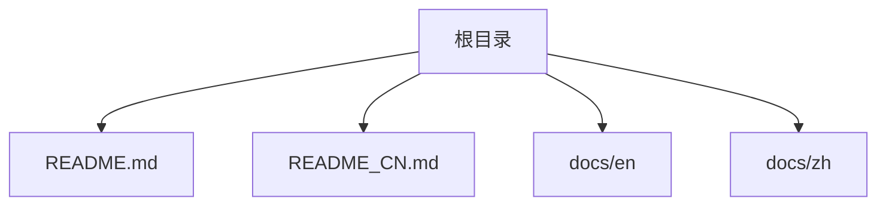
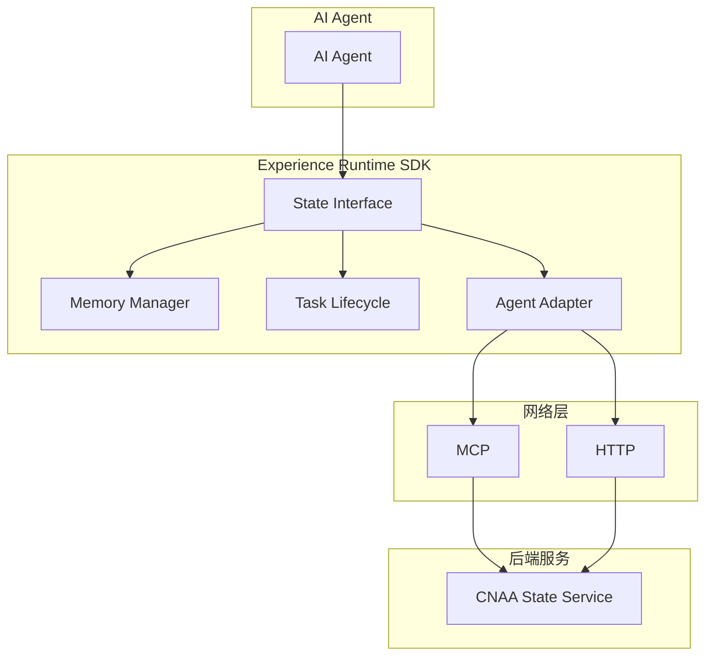
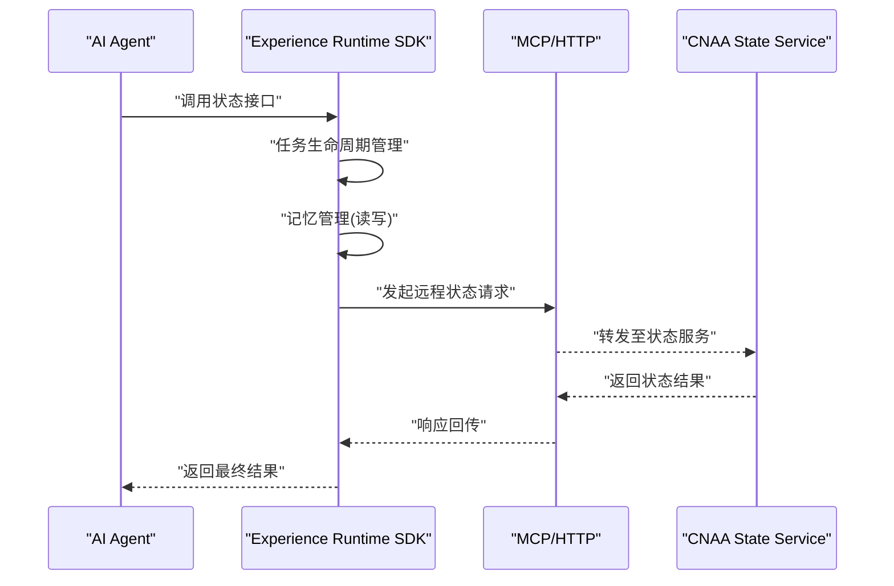

# 调试与故障排除

<cite>
**本文档引用的文件**   
- [README.md](file://README.md)
- [README_CN.md](file://README_CN.md)
</cite>

## 目录
1. [简介](#简介)
2. [项目结构](#项目结构)
3. [核心组件](#核心组件)
4. [架构总览](#架构总览)
5. [详细组件分析](#详细组件分析)
6. [依赖关系分析](#依赖关系分析)
7. [性能考虑](#性能考虑)
8. [故障排除指南](#故障排除指南)
9. [结论](#结论)
10. [附录](#附录)

## 简介
本指南面向 CNAA（Cloud Native Agentic Architecture）项目的开发与运维人员，聚焦于调试与故障排除。CNAA 提供轻量级“经验运行时”，使 AI Agent 在不修改推理逻辑的前提下实现经验的沉淀、状态同步与持续记忆。当前仓库为文档与说明阶段，尚未包含可执行代码或配置文件，因此本指南基于仓库中的架构描述与文档索引进行方法论性说明，帮助读者在后续实现中建立完善的调试与排障体系。

## 项目结构
仓库目前包含中英文 README 以及 docs 目录（en/zh），但文档内容尚未填充。整体结构简洁，便于后续扩展：
- README.md / README_CN.md：项目定位、能力、架构概览与文档索引
- docs/en、docs/zh：计划存放各主题文档（快速开始、持久化记忆、状态接口、运行时 SDK、状态服务、MCP 集成、Agent 集成、架构等）

图表来源 
- [README.md:1-102](file://README.md#L1-L102)
- [README_CN.md:1-110](file://README_CN.md#L1-L110)

章节来源
- [README.md:1-102](file://README.md#L1-L102)
- [README_CN.md:1-110](file://README_CN.md#L1-L110)

## 核心组件
根据 README 的架构描述，CNAA 的核心由以下部分构成：
- Experience Runtime SDK：封装状态接口、记忆管理、任务生命周期与 Agent 适配
- State Interface：统一的状态访问抽象
- Memory Manager：负责经验的持久化与检索
- Task Lifecycle：任务从创建到完成的生命周期管理
- Agent Adapter：将不同 Agent 接入统一的运行时
- CNAA State Service：通过 MCP/HTTP 暴露状态服务

图表来源 
- [README.md:55-73](file://README.md#L55-L73)
- [README_CN.md:63-80](file://README_CN.md#L63-L80)

章节来源
- [README.md:55-73](file://README.md#L55-L73)
- [README_CN.md:63-80](file://README_CN.md#L63-L80)

## 架构总览
下图展示了从 Agent 调用到状态服务的端到端流程，适用于调试时追踪请求路径与状态同步过程。

图表来源 
- [README.md:55-73](file://README.md#L55-L73)
- [README_CN.md:63-80](file://README_CN.md#L63-L80)

## 详细组件分析
由于当前仓库未包含具体源码，本节以方法论形式给出各组件在调试与排障中的关注点与实践建议。

### Experience Runtime SDK
- 调试要点
  - 状态接口调用链路是否按预期进入记忆管理与任务生命周期模块
  - 异常是否在入口处被捕获并记录上下文（任务ID、时间戳、输入摘要）
  - 日志级别与采样策略是否合理，避免生产环境过度输出
- 常见症状
  - 状态写入成功但读取失败：检查幂等性与一致性策略
  - 任务卡住：检查生命周期状态机转换条件与超时配置

### State Interface
- 调试要点
  - 接口契约是否稳定（方法签名、错误码、字段语义）
  - 跨语言/跨进程调用时的序列化/反序列化问题
- 常见症状
  - 字段缺失或类型不匹配：检查版本兼容与迁移脚本

### Memory Manager
- 调试要点
  - 持久化存储的可用性（磁盘空间、权限、备份恢复）
  - 缓存命中率与过期策略
- 常见症状
  - 内存增长过快：排查对象引用未及时释放或缓存无上限
  - 数据不一致：检查并发写入锁与事务边界

### Task Lifecycle
- 调试要点
  - 状态机定义清晰（新建、运行、完成、失败、重试）
  - 超时与重试退避策略
- 常见症状
  - 任务堆积：监控队列长度与消费者吞吐
  - 重复执行：去重键与幂等处理

### Agent Adapter
- 调试要点
  - 不同 Agent 的协议差异与适配层兼容性
  - 输入校验与输出规范化
- 常见症状
  - 适配失败：检查适配器注册表与版本映射

### CNAA State Service
- 调试要点
  - 服务健康检查与就绪探针
  - 连接池、限流、熔断与降级
- 常见症状
  - 高延迟：分析慢查询与热点键
  - 连接失败：检查网络连通性与认证凭据

章节来源
- [README.md:55-73](file://README.md#L55-L73)
- [README_CN.md:63-80](file://README_CN.md#L63-L80)

## 依赖关系分析
当前仓库不包含依赖清单或源码，无法生成精确的依赖图。建议在后续实现中引入依赖管理工具（如包管理器与依赖树可视化），并在 CI 中检测循环依赖与过时依赖。

[本节为概念性说明，不涉及具体文件]

## 性能考虑
- 指标采集
  - 请求延迟分布（P50/P95/P99）、吞吐、错误率
  - 资源使用（CPU、内存、I/O、网络）
  - 业务指标（任务成功率、状态同步延迟、缓存命中率）
- 优化方向
  - 减少不必要的序列化与网络往返
  - 合理设置超时与重试退避
  - 对热点数据进行本地缓存与预取
  - 异步化非关键路径操作

[本节为通用指导，不涉及具体文件]

## 故障排除指南
以下为针对 CNAA 典型问题的系统化排查步骤与方法论。

### 开发环境与调试器配置
- IDE 设置
  - 启用断点与变量监视
  - 配置日志输出格式（包含时间、线程、任务ID、TraceId）
- 调试器配置
  - 本地启动时附加调试器
  - 远程调试端口开放与安全限制
- 日志输出配置
  - 分级日志（DEBUG/INFO/WARN/ERROR）
  - 结构化日志（JSON）便于聚合与分析
  - 敏感信息脱敏

### 常见问题诊断
- 连接问题
  - 检查网络连通性（DNS、防火墙、代理）
  - 验证认证凭据与证书有效性
  - 查看连接池状态与最大连接数
- 状态同步问题
  - 对比客户端与服务端状态快照
  - 检查幂等性与冲突解决策略
  - 确认事件顺序与一致性模型
- 性能瓶颈
  - 使用 CPU/内存 Profiler 定位热点函数
  - 分析数据库慢查询与索引命中
  - 评估 GC 行为与堆外内存使用

### 日志分析与监控指标
- 日志分析技巧
  - 基于 TraceId 串联全链路日志
  - 过滤关键错误码与异常堆栈
  - 统计错误趋势与峰值时段
- 监控指标设置
  - 服务健康与存活探针
  - 业务 KPI（任务完成率、状态同步延迟）
  - 基础设施指标（CPU、内存、磁盘、网络）

### 高级排障方法
- 内存泄漏检测
  - 使用堆转储与对象引用分析工具
  - 识别未释放的资源与长生命周期对象
- 线程死锁分析
  - 抓取线程快照与锁持有关系
  - 检查锁粒度与等待链
- 网络请求调试
  - 抓包分析（TCP/HTTP/MCP）
  - 检查重试与超时策略
  - 验证服务端负载与限流

[本节为方法论说明，不涉及具体文件]

## 结论
尽管当前仓库处于文档与规划阶段，但通过明确的架构设计与组件职责划分，可以为后续实现奠定良好的调试与排障基础。建议在编码阶段即引入结构化日志、分布式追踪、性能剖析与监控告警，形成闭环的观测体系，从而快速定位与解决问题。

[本节为总结性说明，不涉及具体文件]

## 附录
- 相关文档索引（待填充）
  - 快速开始、持久化记忆、状态接口、运行时 SDK、状态服务、MCP 集成、Agent 集成、架构等
- 建议的工具与平台
  - 日志聚合（ELK/Loki）
  - 指标采集（Prometheus/Grafana）
  - 分布式追踪（Jaeger/Zipkin）
  - 性能剖析（pprof/VisualVM/YourKit）
  - 网络抓包（Wireshark/tcpdump）

[本节为补充信息，不涉及具体文件]