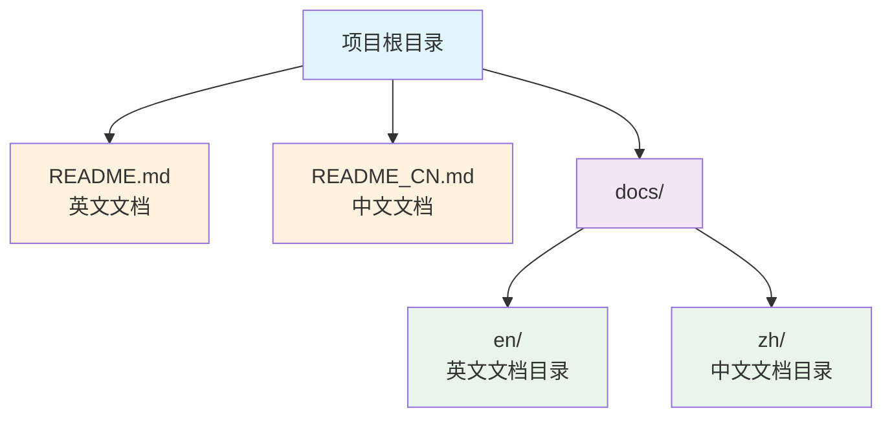
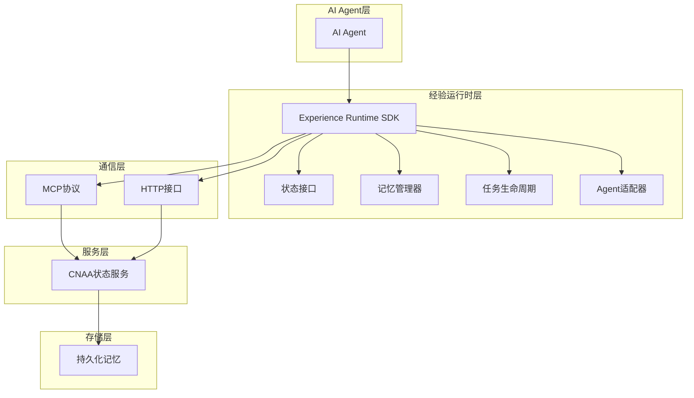
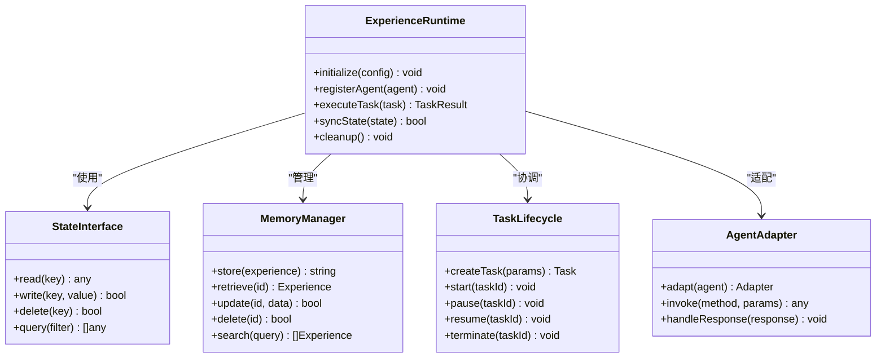
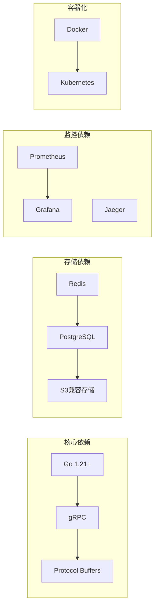

# 贡献指南

<cite>
**本文档中引用的文件**   
- [README.md](file://README.md)
- [README_CN.md](file://README_CN.md)
</cite>

## 目录
1. [简介](#简介)
2. [项目结构](#项目结构)
3. [核心组件](#核心组件)
4. [架构概览](#架构概览)
5. [详细组件分析](#详细组件分析)
6. [依赖分析](#依赖分析)
7. [性能考虑](#性能考虑)
8. [故障排除指南](#故障排除指南)
9. [结论](#结论)
10. [附录](#附录)

## 简介

CNAA（Cloud Native Agentic Architecture）是一个面向AI Agent的持久化记忆运行时框架。该项目旨在为任何AI Agent提供轻量级的经验运行时，使其能够在无需修改内部推理过程的情况下，实现经验的持续积累、同步和重用。

### 项目目标

- **持久化经验记忆**：让经验成为独立于Agent生命周期的运行时资源
- **状态同步**：支持跨Agent的状态共享和同步
- **统一接口**：提供标准化的状态接口
- **Agent无关设计**：不绑定特定类型的Agent
- **云原生部署**：支持云端和本地部署

### 许可证

本项目采用MIT许可证，允许自由使用、修改和分发。

**章节来源**
- [README.md:1-102](file://README.md#L1-L102)
- [README_CN.md:1-110](file://README_CN.md#L1-L110)

## 项目结构

当前项目采用简洁的文档驱动结构：



### 文件组织原则

- **多语言支持**：英文和中文文档分离存储
- **模块化文档**：按功能模块组织文档内容
- **版本化管理**：所有文档纳入Git版本控制

**章节来源**
- [README.md:76-86](file://README.md#L76-L86)
- [README_CN.md:84-94](file://README_CN.md#L84-L94)

## 核心组件

CNAA项目包含以下核心组件：

### 经验运行时SDK
- **状态接口**：统一的Agent状态访问API
- **记忆管理器**：负责经验的持久化和检索
- **任务生命周期**：管理任务的创建、执行和清理
- **Agent适配器**：适配不同类型的Agent

### CNAA状态服务
- **MCP协议支持**：通过Model Context Protocol进行通信
- **HTTP接口**：标准的RESTful API
- **状态同步**：确保分布式环境下的数据一致性

### 持久化记忆系统
- **经验存储**：长期保存Agent的运行经验
- **状态同步**：跨实例的状态一致性保证
- **数据备份**：自动化的数据备份和恢复机制

**章节来源**
- [README.md:55-73](file://README.md#L55-L73)
- [README_CN.md:63-80](file://README_CN.md#L63-L80)

## 架构概览

CNAA采用分层架构设计，实现了松耦合和高内聚：



### 架构特点

- **解耦设计**：各层之间通过明确定义的接口通信
- **可扩展性**：支持插件式的Agent适配器和存储后端
- **高可用性**：状态服务的集群部署和数据冗余
- **安全性**：完善的权限控制和数据加密机制

**图表来源**
- [README.md:55-73](file://README.md#L55-L73)
- [README_CN.md:63-80](file://README_CN.md#L63-L80)

## 详细组件分析

### 经验运行时SDK

经验运行时SDK是CNAA的核心组件，负责协调Agent与持久化记忆之间的交互。

#### 主要功能模块



**图表来源**
- [README.md:55-73](file://README.md#L55-L73)

### CNAA状态服务

状态服务作为中央协调器，处理来自多个Agent实例的状态请求。

#### 服务特性

- **高并发处理**：支持数千个并发连接
- **数据一致性**：基于分布式共识算法保证数据一致性
- **故障恢复**：自动检测和恢复服务节点故障
- **负载均衡**：智能分配请求到最优服务节点

### 持久化记忆系统

持久化记忆系统提供可靠的数据存储服务。

#### 存储策略

- **热数据缓存**：频繁访问的经验数据存储在内存中
- **温数据存储**：中等频率访问的数据存储在SSD上
- **冷数据归档**：历史经验数据压缩存储到对象存储

**章节来源**
- [README.md:45-52](file://README.md#L45-L52)
- [README_CN.md:53-60](file://README_CN.md#L53-L60)

## 依赖分析

CNAA项目采用最小依赖原则，确保系统的稳定性和可维护性。

### 外部依赖



### 依赖管理策略

- **版本锁定**：使用go.mod精确控制依赖版本
- **安全更新**：定期扫描依赖包的安全漏洞
- **最小化原则**：只引入必要的依赖包
- **本地缓存**：构建时缓存依赖以提高构建速度

**图表来源**
- [README.md:100-102](file://README.md#L100-L102)

## 性能考虑

### 优化策略

1. **内存管理**
   - 使用对象池减少GC压力
   - 实现智能缓存淘汰策略
   - 支持内存使用监控和告警

2. **I/O优化**
   - 异步I/O操作提高吞吐量
   - 批量操作减少网络往返
   - 连接池复用数据库连接

3. **并发控制**
   - 细粒度锁避免竞争条件
   - 无锁数据结构提升性能
   - 协程调度优化CPU利用率

### 监控指标

- **响应时间**：P50、P95、P99延迟
- **吞吐量**：每秒请求数(RPS)
- **错误率**：失败请求占比
- **资源使用**：CPU、内存、磁盘I/O

## 故障排除指南

### 常见问题诊断

1. **连接问题**
   - 检查网络连接和防火墙设置
   - 验证服务地址和端口配置
   - 查看SSL证书有效性

2. **性能问题**
   - 分析慢查询日志
   - 监控资源使用峰值
   - 检查垃圾回收频率

3. **数据一致性问题**
   - 验证分布式事务状态
   - 检查数据同步延迟
   - 确认副本一致性

### 调试工具

- **日志分析**：结构化日志便于问题定位
- **性能剖析**：CPU和内存使用分析
- **链路追踪**：分布式调用链跟踪
- **健康检查**：服务状态实时监控

## 结论

CNAA项目为AI Agent提供了强大的持久化记忆能力，通过其独特的架构设计和丰富的功能特性，解决了当前Agent系统中经验无法有效沉淀的问题。

### 项目优势

- **技术创新**：首创持久化经验记忆概念
- **架构先进**：云原生微服务架构设计
- **生态友好**：支持多种Agent框架集成
- **社区活跃**：开源协作开发模式

### 未来规划

根据项目路线图，CNAA将继续完善以下功能：
- 完整的Experience Runtime SDK
- 标准化的State Interface规范
- 增强的Multi-Agent经验共享
- 更丰富的部署选项和运维工具

## 附录

### 快速开始

1. **环境准备**
   ```bash
   # 安装Go语言环境
   go version
   
   # 克隆项目代码
   git clone https://github.com/CNAA-CNAA-Cloud-Native-Agent-Architecture.git
   cd CNAA-Cloud-Native-Agent-Architecture
   ```

2. **构建项目**
   ```bash
   # 下载依赖
   go mod download
   
   # 编译项目
   go build -o cnaa-server ./cmd/server
   
   # 运行测试
   go test ./...
   ```

3. **启动服务**
   ```bash
   # 启动主服务
   ./cnaa-server --config config.yaml
   
   # 启动开发环境
   make dev
   ```

### 文档索引

- **英文文档**：[docs/en/](docs/en/)
- **中文文档**：[docs/zh/](docs/zh/)
- **API文档**：自动生成OpenAPI规范
- **架构图**：详细的系统设计文档

### 社区资源

- **GitHub仓库**：源代码和问题跟踪
- **讨论论坛**：技术交流和经验分享
- **邮件列表**：重要通知和公告
- **社交媒体**：项目动态和更新

**章节来源**
- [README.md:89-97](file://README.md#L89-L97)
- [README_CN.md:97-105](file://README_CN.md#L97-L105)