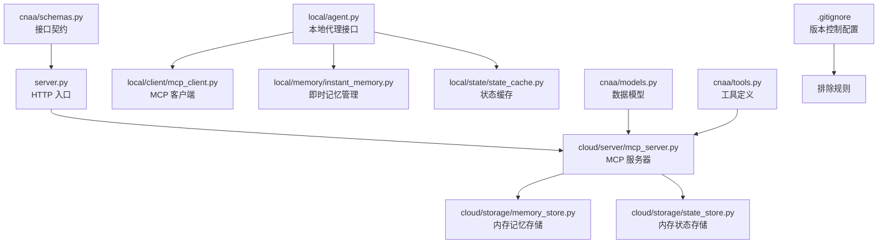
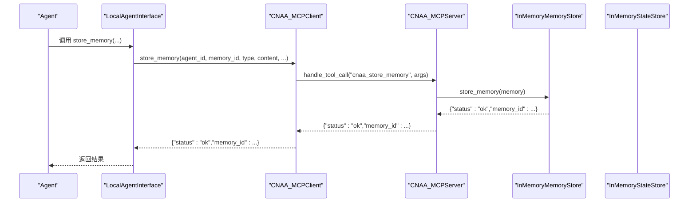
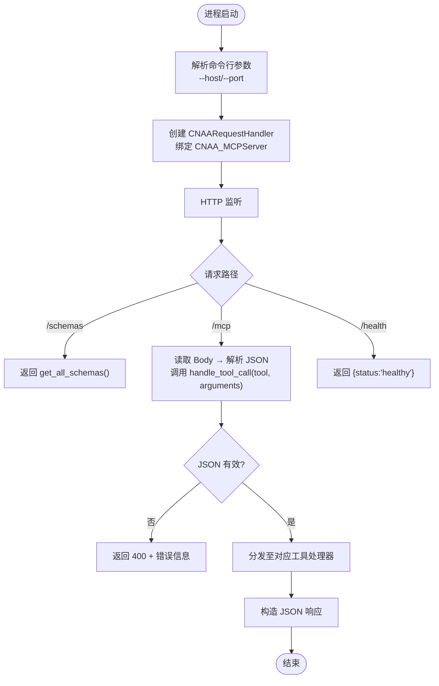
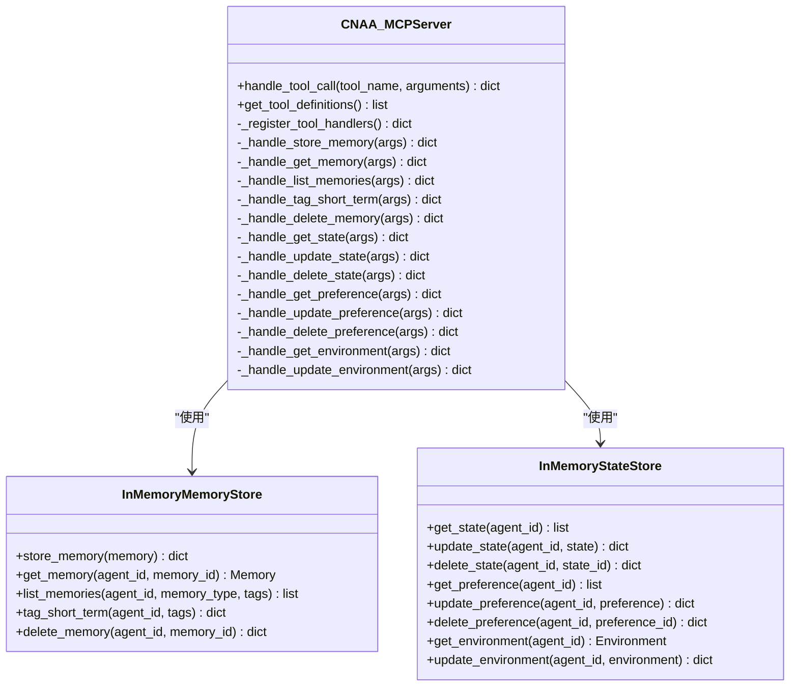
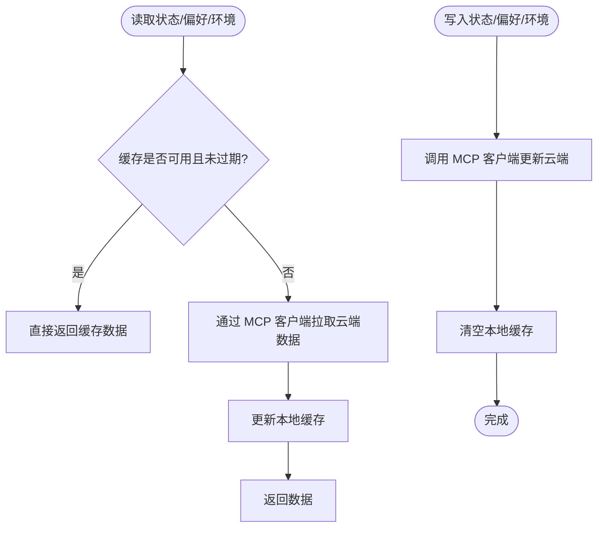
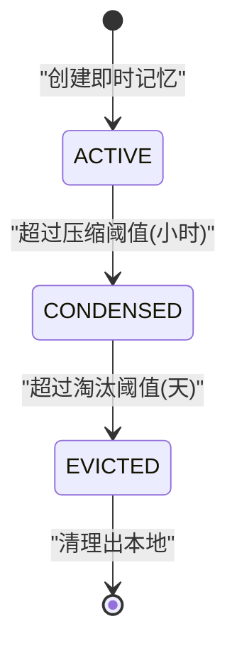
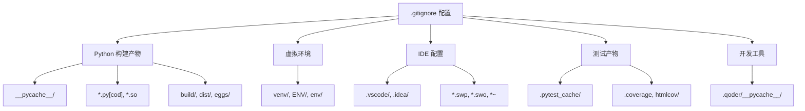
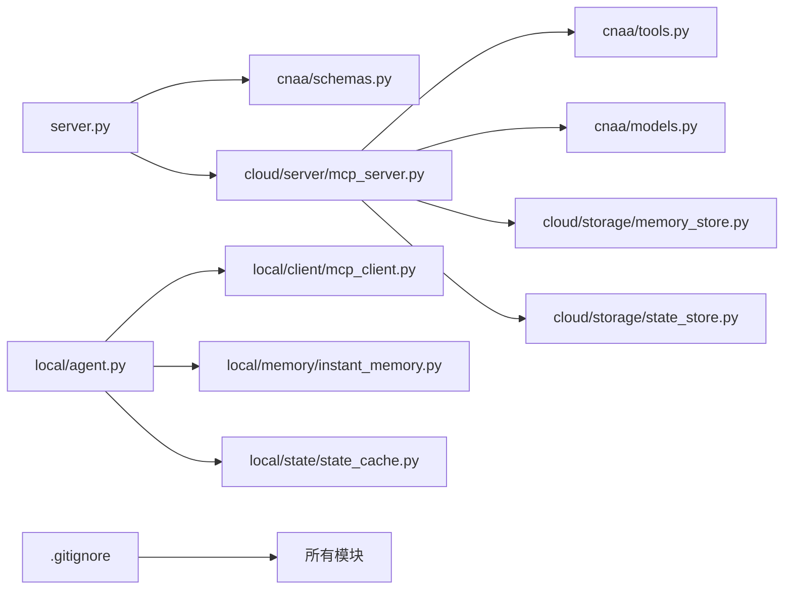

# 项目配置

<cite>
**本文引用的文件**   
- [README.md](file://README.md)
- [README_CN.md](file://README_CN.md)
- [pyproject.toml](file://pyproject.toml)
- [.gitignore](file://.gitignore)
- [server.py](file://server.py)
- [cnaa/schemas.py](file://cnaa/schemas.py)
- [cnaa/models.py](file://cnaa/models.py)
- [cnaa/tools.py](file://cnaa/tools.py)
- [cloud/server/mcp_server.py](file://cloud/server/mcp_server.py)
- [cloud/storage/memory_store.py](file://cloud/storage/memory_store.py)
- [cloud/storage/state_store.py](file://cloud/storage/state_store.py)
- [local/client/mcp_client.py](file://local/client/mcp_client.py)
- [local/agent.py](file://local/agent.py)
- [cloud/agent.py](file://cloud/agent.py)
- [local/memory/instant_memory.py](file://local/memory/instant_memory.py)
- [local/state/state_cache.py](file://local/state/state_cache.py)
</cite>

## 更新摘要
**变更内容**   
- 增强了 .gitignore 配置文件，包含全面的 Python 构建产物、虚拟环境、IDE 配置和测试产物的排除规则
- 新增了 Qoder 开发工具的兼容性支持
- 完善了版本控制忽略规则，确保代码库的整洁性

## 目录
1. [简介](#简介)
2. [项目结构](#项目结构)
3. [核心组件](#核心组件)
4. [架构总览](#架构总览)
5. [详细组件分析](#详细组件分析)
6. [依赖关系分析](#依赖关系分析)
7. [性能与扩展性](#性能与扩展性)
8. [故障排查指南](#故障排查指南)
9. [结论](#结论)
10. [附录：配置清单与最佳实践](#附录配置清单与最佳实践)

## 简介
本文件聚焦 CNAA（Cloud Native Agentic Architecture）项目的"配置"主题，围绕运行环境、服务启动参数、接口契约、工具定义、存储后端、本地缓存策略以及客户端连接等关键配置点进行系统化说明。CNAA 通过 MCP（Model Context Protocol）实现 Agent 与云端的结构化 JSON 通信，采用"小索引→大存储"的伪连续记忆模式，将即时记忆保留在本地上下文，完整数据持久化到云端。

**更新** 项目配置现已包含增强的 .gitignore 规则，全面排除 Python 构建产物、虚拟环境、IDE 配置和测试产物，确保代码库的整洁性和可维护性。

## 项目结构
本项目采用分层与职责分离的组织方式：
- 顶层入口 server.py 提供 HTTP 服务与路由
- cnaa 层定义数据模型、接口契约与工具定义
- cloud 层实现服务端逻辑与内存存储
- local 层提供本地 SDK、MCP 客户端、即时记忆管理与状态缓存

图表来源 
- [server.py:1-181](file://server.py#L1-L181)
- [cloud/server/mcp_server.py:1-313](file://cloud/server/mcp_server.py#L1-L313)
- [cloud/storage/memory_store.py:1-156](file://cloud/storage/memory_store.py#L1-L156)
- [cloud/storage/state_store.py:1-176](file://cloud/storage/state_store.py#L1-L176)
- [local/agent.py:1-452](file://local/agent.py#L1-L452)
- [local/client/mcp_client.py:1-351](file://local/client/mcp_client.py#L1-L351)
- [local/memory/instant_memory.py:1-298](file://local/memory/instant_memory.py#L1-L298)
- [local/state/state_cache.py:1-195](file://local/state/state_cache.py#L1-L195)
- [cnaa/models.py:1-225](file://cnaa/models.py#L1-L225)
- [cnaa/schemas.py:1-465](file://cnaa/schemas.py#L1-L465)
- [cnaa/tools.py:1-210](file://cnaa/tools.py#L1-L210)
- [.gitignore:1-42](file://.gitignore#L1-L42)

章节来源
- [README.md:1-174](file://README.md#L1-L174)
- [README_CN.md:1-164](file://README_CN.md#L1-L164)

## 核心组件
- 服务入口与路由：server.py 暴露 /schemas、/mcp、/health 三个端点，负责请求解析与错误处理。
- MCP 服务器：cloud/server/mcp_server.py 注册并调度所有工具调用，对接存储后端。
- 存储后端：memory_store.py 与 state_store.py 提供基于字典的内存实现，便于开发与测试。
- 本地代理接口：local/agent.py 统一封装即时记忆、状态缓存与 MCP 客户端调用。
- 数据模型与契约：cnaa/models.py 定义 Memory、State、Preference、Environment、InstantMemory 等；cnaa/schemas.py 集中管理接口 JSON Schema。
- 工具定义：cnaa/tools.py 声明所有 MCP 工具名称、描述与输入 Schema。
- MCP 客户端：local/client/mcp_client.py 模拟或对接真实 MCP 传输。
- **版本控制配置**：.gitignore 提供全面的排除规则，确保代码库整洁。

章节来源
- [server.py:1-181](file://server.py#L1-L181)
- [cloud/server/mcp_server.py:1-313](file://cloud/server/mcp_server.py#L1-L313)
- [cloud/storage/memory_store.py:1-156](file://cloud/storage/memory_store.py#L1-L156)
- [cloud/storage/state_store.py:1-176](file://cloud/storage/state_store.py#L1-L176)
- [local/agent.py:1-452](file://local/agent.py#L1-L452)
- [cnaa/models.py:1-225](file://cnaa/models.py#L1-L225)
- [cnaa/schemas.py:1-465](file://cnaa/schemas.py#L1-L465)
- [cnaa/tools.py:1-210](file://cnaa/tools.py#L1-L210)
- [local/client/mcp_client.py:1-351](file://local/client/mcp_client.py#L1-L351)
- [.gitignore:1-42](file://.gitignore#L1-L42)

## 架构总览
CNAA 采用三层正交架构：接口契约层（What）、运行时层（How）、生命周期层（When）。Agent 通过 MCP Client 与 CNAA Server 进行结构化 JSON 交互，服务端遵循"哑服务"原则，仅做存取与路由。

图表来源 
- [local/agent.py:94-124](file://local/agent.py#L94-L124)
- [local/client/mcp_client.py:103-138](file://local/client/mcp_client.py#L103-L138)
- [cloud/server/mcp_server.py:148-159](file://cloud/server/mcp_server.py#L148-L159)
- [cloud/storage/memory_store.py:30-44](file://cloud/storage/memory_store.py#L30-L44)

章节来源
- [README.md:52-117](file://README.md#L52-L117)
- [README_CN.md:52-112](file://README_CN.md#L52-L112)

## 详细组件分析

### 服务入口与 HTTP 配置（server.py）
- 启动参数：支持 --host 与 --port 配置监听地址与端口。
- 路由：GET /schemas 返回全部接口 Schema；POST /mcp 处理 MCP 工具调用；GET /health 健康检查。
- 错误处理：JSON 解析失败返回 400；其他异常返回 500 并记录日志。
- 响应格式：统一 JSON 响应，包含 status 与 message 字段。

图表来源 
- [server.py:129-177](file://server.py#L129-L177)
- [server.py:68-100](file://server.py#L68-L100)
- [cnaa/schemas.py:374-411](file://cnaa/schemas.py#L374-L411)

章节来源
- [server.py:1-181](file://server.py#L1-L181)

### MCP 服务器与工具调度（cloud/server/mcp_server.py）
- 工具注册：集中映射工具名到处理器函数。
- 调度流程：handle_tool_call 按名称查找处理器，捕获异常并返回标准错误结构。
- 存储解耦：通过 InMemoryMemoryStore 与 InMemoryStateStore 抽象存储后端。

图表来源 
- [cloud/server/mcp_server.py:52-144](file://cloud/server/mcp_server.py#L52-L144)
- [cloud/storage/memory_store.py:19-156](file://cloud/storage/memory_store.py#L19-L156)
- [cloud/storage/state_store.py:13-176](file://cloud/storage/state_store.py#L13-L176)

章节来源
- [cloud/server/mcp_server.py:1-313](file://cloud/server/mcp_server.py#L1-L313)

### 本地代理接口与缓存策略（local/agent.py）
- 组合能力：集成 InstantMemoryManager、StateCache、CNAA_MCPClient。
- 缓存策略：读操作优先使用本地缓存，过期则回源；写操作后清空缓存保证一致性。
- 即时记忆：创建轻量摘要并引用云端 ID，支持压缩与淘汰。

图表来源 
- [local/agent.py:234-287](file://local/agent.py#L234-L287)
- [local/agent.py:289-351](file://local/agent.py#L289-L351)
- [local/state/state_cache.py:114-133](file://local/state/state_cache.py#L114-L133)

章节来源
- [local/agent.py:1-452](file://local/agent.py#L1-L452)

### 即时记忆管理（local/memory/instant_memory.py）
- 生命周期：ACTIVE → CONDENSED → EVICTED。
- 时间阈值：按小时阈值压缩旧记忆，按天阈值淘汰已压缩记忆。
- 统计与清理：支持按状态计数与清理已淘汰项。

图表来源 
- [local/memory/instant_memory.py:137-190](file://local/memory/instant_memory.py#L137-L190)
- [local/memory/instant_memory.py:209-244](file://local/memory/instant_memory.py#L209-L244)

章节来源
- [local/memory/instant_memory.py:1-298](file://local/memory/instant_memory.py#L1-L298)

### 状态缓存（local/state/state_cache.py）
- TTL 控制：全局 TTL 控制缓存有效期。
- 数据结构：分别维护 states、preferences、environment。
- 查询辅助：按 ID 或类别检索，统计缓存条目数量。

章节来源
- [local/state/state_cache.py:1-195](file://local/state/state_cache.py#L1-L195)

### 数据模型与接口契约（cnaa/models.py、cnaa/schemas.py）
- 数据模型：Memory、TaskCheckpoint、State、Preference、Environment、InstantMemory、MemorySummary、SearchResult。
- 接口契约：集中定义请求/响应 Schema，确保前后端一致。
- 枚举类型：MemoryType、MemoryStatus、StateCategory 规范取值范围。

章节来源
- [cnaa/models.py:1-225](file://cnaa/models.py#L1-L225)
- [cnaa/schemas.py:1-465](file://cnaa/schemas.py#L1-L465)

### 工具定义（cnaa/tools.py）
- 工具分类：记忆、状态、偏好、环境四类。
- 工具元数据：name、description、inputSchema。
- 工具查询：提供按名称获取定义的便捷方法。

章节来源
- [cnaa/tools.py:1-210](file://cnaa/tools.py#L1-L210)

### MCP 客户端（local/client/mcp_client.py）
- 传输适配：当前为参考实现，支持设置 mock handler 用于测试。
- 工具封装：对每个工具提供独立方法，统一组装参数与调用。
- 超时配置：支持 timeout 参数。

章节来源
- [local/client/mcp_client.py:1-351](file://local/client/mcp_client.py#L1-L351)

### 云端代理接口（cloud/agent.py）
- Python 便捷接口：封装 CNAA_MCPServer 的方法式访问。
- 典型用法：store_memory、get_memory、list_memories、get/update state/preference/environment。

章节来源
- [cloud/agent.py:1-267](file://cloud/agent.py#L1-L267)

### 版本控制配置（.gitignore）
**新增** 项目配置了全面的 .gitignore 规则，确保代码库的整洁性和可维护性：

- **Python 构建产物排除**：
  - 编译文件：`__pycache__/`, `*.py[cod]`, `*.so`, `.Python`
  - 构建目录：`build/`, `develop-eggs/`, `dist/`, `downloads/`, `eggs/`, `.eggs/`, `lib/`, `lib64/`, `parts/`, `sdist/`, `var/`, `wheels/`
  - Egg 文件：`*.egg-info/`, `.installed.cfg`, `*.egg`

- **虚拟环境排除**：
  - 常见虚拟环境目录：`venv/`, `ENV/`, `env/`

- **IDE 配置排除**：
  - 主流 IDE 配置：`.vscode/`, `.idea/`
  - 编辑器临时文件：`*.swp`, `*.swo`, `*~`

- **测试产物排除**：
  - 测试缓存：`.pytest_cache/`
  - 覆盖率文件：`.coverage`, `htmlcov/`

- **开发工具支持**：
  - Qoder 工具兼容：`.qoder/__pycache__/`

图表来源 
- [.gitignore:1-42](file://.gitignore#L1-L42)

章节来源
- [.gitignore:1-42](file://.gitignore#L1-L42)

## 依赖关系分析
- 模块耦合：server.py 依赖 schemas 与 mcp_server；mcp_server 依赖 tools、models 与两个存储后端；local/agent 依赖 client、instant_memory、state_cache。
- 外部依赖：pyproject.toml 指定 mcp>=1.0.0，Python>=3.11。
- 潜在循环：未发现循环导入；各层职责清晰。

图表来源 
- [server.py:1-181](file://server.py#L1-L181)
- [cloud/server/mcp_server.py:1-313](file://cloud/server/mcp_server.py#L1-L313)
- [cnaa/tools.py:1-210](file://cnaa/tools.py#L1-L210)
- [cnaa/models.py:1-225](file://cnaa/models.py#L1-L225)
- [cloud/storage/memory_store.py:1-156](file://cloud/storage/memory_store.py#L1-L156)
- [cloud/storage/state_store.py:1-176](file://cloud/storage/state_store.py#L1-L176)
- [local/agent.py:1-452](file://local/agent.py#L1-L452)
- [local/client/mcp_client.py:1-351](file://local/client/mcp_client.py#L1-L351)
- [local/memory/instant_memory.py:1-298](file://local/memory/instant_memory.py#L1-L298)
- [local/state/state_cache.py:1-195](file://local/state/state_cache.py#L1-L195)
- [.gitignore:1-42](file://.gitignore#L1-L42)

章节来源
- [pyproject.toml:1-33](file://pyproject.toml#L1-L33)

## 性能与扩展性
- 存储后端：当前为内存字典实现，适合开发测试；生产应替换为持久化后端（SQLite/PostgreSQL），并增加索引优化查询。
- 缓存策略：TTL 简单有效；可引入 LRU/LFU、按热度与重要性加权、预取与 stale-while-revalidate。
- 即时记忆：时间阈值策略简单直观；可扩展为基于重要性与使用频率的策略。
- 网络开销：通过本地缓存减少频繁网络调用；写操作后主动失效缓存保证一致性。
- **版本控制优化**：完善的 .gitignore 配置减少了不必要的文件提交，提升 Git 仓库性能和协作效率。

[本节为通用指导，不直接分析具体文件]

## 故障排查指南
- HTTP 错误码：
  - 400：JSON 解析失败或缺少必要字段（如 tool 字段）。
  - 404：路径不存在。
  - 500：内部异常（记录日志并返回消息）。
- 常见原因：
  - 请求体非 JSON 或字段缺失。
  - 工具名不存在或未注册。
  - 存储后端异常（内存键冲突、空值等）。
- 定位建议：
  - 查看 server.py 日志输出。
  - 检查 cnaa/schemas.py 中的必填字段。
  - 确认 local/client/mcp_client.py 的 mock_handler 或真实服务端可达性。
- **版本控制问题**：
  - 如果某些文件被意外提交，检查 .gitignore 配置是否正确。
  - 使用 `git status` 查看未跟踪的文件是否符合预期。

章节来源
- [server.py:77-100](file://server.py#L77-L100)
- [cloud/server/mcp_server.py:100-136](file://cloud/server/mcp_server.py#L100-L136)
- [cnaa/schemas.py:374-411](file://cnaa/schemas.py#L374-L411)
- [.gitignore:1-42](file://.gitignore#L1-L42)

## 结论
CNAA 的配置体系以清晰的接口契约与工具定义为基石，结合本地缓存与即时记忆机制，实现了高效、可扩展的经验记忆运行时。通过模块化设计与插件化存储后端，可在保持"哑服务"原则的同时，灵活适配不同部署环境与业务需求。**增强的 .gitignore 配置确保了代码库的整洁性和团队协作的效率，为项目的长期发展奠定了良好的基础。**

[本节为总结，不直接分析具体文件]

## 附录：配置清单与最佳实践
- 运行环境
  - Python 版本：>=3.11
  - 依赖：mcp>=1.0.0
  - 构建系统：setuptools>=68.0, wheel
- 服务启动参数
  - --host：默认 localhost
  - --port：默认 8080
- 接口与工具
  - 接口 Schema：集中在 cnaa/schemas.py，修改此处即可统一变更接口格式。
  - 工具定义：集中在 cnaa/tools.py，新增工具需在此注册并补充 Schema。
- 存储后端
  - 开发/测试：InMemoryMemoryStore、InMemoryStateStore。
  - 生产：替换为持久化后端，并考虑索引与分页。
- 本地缓存
  - TTL：默认 5 分钟，可按场景调整。
  - 失效策略：写操作后主动清空缓存。
- 客户端连接
  - server_url：生产环境需配置真实 MCP 服务端地址。
  - timeout：根据网络状况调整。
- **版本控制配置**
  - .gitignore：全面的排除规则，涵盖 Python 构建产物、虚拟环境、IDE 配置和测试产物。
  - 开发工具：支持 VS Code、PyCharm、Qoder 等主流开发环境。
- 最佳实践
  - 严格遵循 Schema 必填字段，避免 400 错误。
  - 合理设置 TTL 与即时记忆阈值，平衡性能与一致性。
  - 使用工具定义与 Schema 生成文档与校验，提升稳定性。
  - **利用 .gitignore 规则保持代码库整洁，避免提交不必要的文件。**

章节来源
- [pyproject.toml:1-33](file://pyproject.toml#L1-L33)
- [server.py:150-177](file://server.py#L150-L177)
- [cnaa/schemas.py:374-411](file://cnaa/schemas.py#L374-L411)
- [cnaa/tools.py:57-171](file://cnaa/tools.py#L57-L171)
- [local/state/state_cache.py:43-61](file://local/state/state_cache.py#L43-L61)
- [local/client/mcp_client.py:49-66](file://local/client/mcp_client.py#L49-L66)
- [.gitignore:1-42](file://.gitignore#L1-L42)