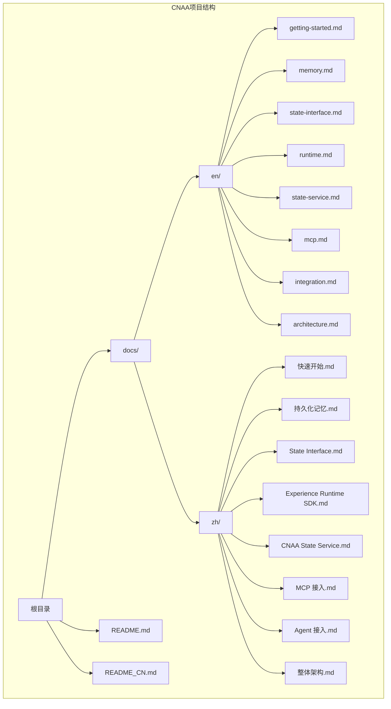
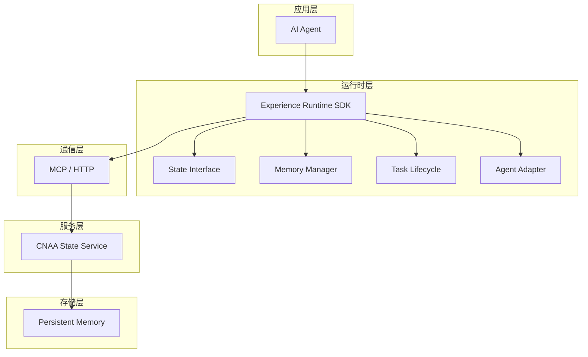
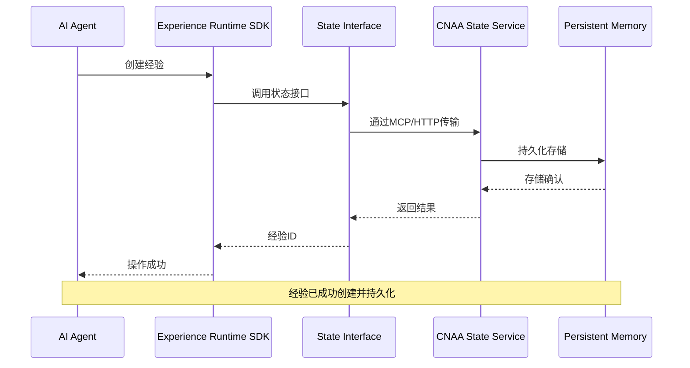
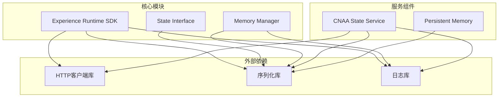

# 快速开始

<cite>
**本文档中引用的文件**
- [README.md](file://README.md)
- [README_CN.md](file://README_CN.md)
</cite>

## 目录
1. [简介](#简介)
2. [项目结构](#项目结构)
3. [核心组件](#核心组件)
4. [架构概览](#架构概览)
5. [详细组件分析](#详细组件分析)
6. [依赖分析](#依赖分析)
7. [性能考虑](#性能考虑)
8. [故障排除指南](#故障排除指南)
9. [结论](#结论)
10. [附录](#附录)

## 简介

CNAA（Cloud Native Agentic Architecture）是一个面向AI Agent的持久化记忆运行时框架。它不是Agent框架、工作流引擎或RAG实现，而是提供一套轻量级的**经验运行时（Experience Runtime）**，让任何AI Agent在无需修改推理逻辑的情况下，实现经验沉淀、状态同步与持续记忆。

### 为什么需要CNAA？

当前AI Agent已经具备完成任务的能力，但绝大多数Agent不会持续记住任务经验。目前主流的Memory方案通常只是延长Prompt上下文窗口。CNAA提出**持久化经验记忆（Persistent Experience Memory）**的概念，让经验不再属于Prompt，而成为Agent生命周期之外的一种独立资源。

### 核心特性

- 🧠 **持久化经验记忆**：将任务经验持久化存储，支持跨会话复用
- 🔄 **运行时状态同步**：确保多个Agent实例间的状态一致性
- 🔌 **统一状态接口**：提供标准化的状态管理API
- 🤖 **Agent无关设计**：兼容各种类型的AI Agent
- ☁️ **云端/本地部署**：支持灵活的部署方式

**章节来源**
- [README_CN.md:9-19](file://README_CN.md#L9-L19)
- [README_CN.md:53-59](file://README_CN.md#L53-L59)

## 项目结构

CNAA项目采用简洁的文档驱动架构，主要包含以下组成部分：



**图表来源**
- [README.md:76-85](file://README.md#L76-L85)
- [README_CN.md:84-93](file://README_CN.md#L84-L93)

**章节来源**
- [README.md:76-85](file://README.md#L76-L85)
- [README_CN.md:84-93](file://README_CN.md#L84-L93)

## 核心组件

CNAA的核心由以下几个关键组件构成：

### 1. Experience Runtime SDK（经验运行时SDK）
这是Agent集成的核心SDK，提供统一的API接口来管理经验的创建、保存和检索。

### 2. State Interface（状态接口）
定义标准化的状态管理接口，确保不同Agent之间的兼容性。

### 3. Memory Manager（记忆管理器）
负责经验的持久化存储和生命周期管理。

### 4. Task Lifecycle（任务生命周期）
管理任务的完整生命周期，包括创建、执行、完成和清理。

### 5. Agent Adapter（Agent适配器）
适配不同类型的AI Agent，使其能够无缝集成到CNAA生态系统中。

### 6. CNAA State Service（状态服务）
提供分布式状态管理能力，支持多Agent实例的状态同步。

**章节来源**
- [README.md:61-72](file://README.md#L61-L72)
- [README_CN.md:69-79](file://README_CN.md#L69-L79)

## 架构概览

CNAA采用分层架构设计，实现了Agent与持久化存储的解耦：



**图表来源**
- [README.md:55-72](file://README.md#L55-L72)
- [README_CN.md:63-79](file://README_CN.md#L63-L79)

### 数据流向



**图表来源**
- [README.md:33-41](file://README.md#L33-L41)
- [README_CN.md:41-49](file://README_CN.md#L41-L49)

## 详细组件分析

### Experience Runtime SDK

Experience Runtime SDK是Agent与CNAA生态系统交互的核心组件。它提供了以下关键功能：

#### 主要职责
- 封装状态管理的复杂性
- 提供统一的API接口
- 处理网络通信和错误重试
- 管理经验的元数据和内容

#### 核心接口
- `createExperience()`: 创建新的经验记录
- `saveExperience()`: 保存经验内容
- `getExperience()`: 检索已存在的经验
- `deleteExperience()`: 删除不需要的经验

### State Interface

State Interface定义了标准化的状态管理协议，确保不同实现之间的互操作性。

#### 接口规范
- 统一的请求/响应格式
- 标准的错误码和处理机制
- 版本兼容性保证

### Memory Manager

Memory Manager负责经验的持久化存储策略和生命周期管理。

#### 存储策略
- 支持多种后端存储（文件系统、数据库等）
- 自动压缩和索引优化
- 备份和恢复机制

**章节来源**
- [README.md:61-72](file://README.md#L61-L72)
- [README_CN.md:69-79](file://README_CN.md#L69-L79)

## 依赖分析

CNAA项目的依赖关系相对简单，主要包含以下层次：



### 依赖说明

- **HTTP客户端库**: 用于与服务端进行网络通信
- **序列化库**: 处理数据的序列化和反序列化
- **日志库**: 提供调试和监控能力
- **存储服务**: 支持多种持久化存储后端

**图表来源**
- [README.md:55-72](file://README.md#L55-L72)
- [README_CN.md:63-79](file://README_CN.md#L63-L79)

**章节来源**
- [README.md:55-72](file://README.md#L55-L72)
- [README_CN.md:63-79](file://README_CN.md#L63-L79)

## 性能考虑

### 内存管理
- 使用惰性加载策略，避免一次性加载大量经验数据
- 实现连接池和缓存机制，减少重复计算
- 支持异步操作，提高并发处理能力

### 网络优化
- 实现请求批处理和合并
- 支持增量更新，减少数据传输量
- 提供超时和重试机制

### 存储优化
- 自动索引构建和优化
- 支持分片和负载均衡
- 提供数据压缩和去重功能

## 故障排除指南

### 常见问题及解决方案

#### 1. 连接失败
**问题描述**: SDK无法连接到CNAA State Service
**可能原因**: 
- 服务地址配置错误
- 网络连接问题
- 防火墙限制

**解决方案**:
- 检查服务地址和端口配置
- 验证网络连接状态
- 确认防火墙规则允许通信

#### 2. 状态同步失败
**问题描述**: 多Agent实例间状态不一致
**可能原因**:
- 网络分区导致的数据不一致
- 并发写入冲突
- 版本不兼容

**解决方案**:
- 启用冲突检测和解决机制
- 实现乐观锁或悲观锁
- 升级所有节点到相同版本

#### 3. 性能问题
**问题描述**: 系统响应时间过长
**可能原因**:
- 数据库查询效率低
- 内存不足
- 网络延迟高

**解决方案**:
- 优化数据库查询和索引
- 增加内存分配
- 使用CDN或就近部署

### 调试技巧

#### 启用详细日志
```
设置日志级别为DEBUG
查看完整的请求/响应日志
监控内存使用情况
```

#### 性能分析
```
使用性能分析工具识别瓶颈
监控关键指标（QPS、延迟、错误率）
进行压力测试验证稳定性
```

## 结论

CNAA提供了一个强大的持久化经验记忆框架，使AI Agent能够获得持续学习和记忆的能力。通过其简洁的架构设计和丰富的功能特性，开发者可以快速集成到现有系统中，提升Agent的智能水平和用户体验。

### 主要优势

1. **非侵入式集成**: 无需修改Agent内部逻辑即可添加记忆能力
2. **高度可扩展**: 支持自定义存储后端和通信协议
3. **生产就绪**: 提供完善的监控、日志和错误处理机制
4. **社区活跃**: 持续的功能改进和bug修复

### 未来发展方向

- 支持更多类型的AI Agent框架
- 增强分布式协调能力
- 提供更丰富的分析和可视化工具
- 优化性能和资源利用率

## 附录

### 环境准备要求

#### 系统要求
- **操作系统**: Linux (推荐Ubuntu 20.04+), macOS 10.15+, Windows 10+
- **内存**: 至少4GB RAM（建议8GB以上）
- **磁盘空间**: 至少10GB可用空间
- **网络**: 稳定的互联网连接

#### 软件依赖
- **Python**: 3.8+ 版本
- **Node.js**: 16+ 版本（可选，用于开发工具）
- **Docker**: 20.10+ 版本（可选，用于容器化部署）

### 安装步骤

#### 方法一：从源码安装
1. 克隆项目仓库
2. 进入项目目录
3. 安装依赖包
4. 运行初始化脚本

#### 方法二：使用包管理器
1. 配置包源
2. 安装CNAA核心包
3. 验证安装结果

#### 方法三：容器化部署
1. 拉取官方镜像
2. 配置环境变量
3. 启动容器服务

### 基本配置说明

#### 配置文件位置
```
/etc/cnna/config.yaml          # 主配置文件
/var/log/cnna/                 # 日志目录
/var/lib/cnna/data/            # 数据存储目录
```

#### 核心配置项
- `service.host`: 服务监听地址
- `service.port`: 服务监听端口
- `storage.backend`: 存储后端类型
- `storage.path`: 存储路径
- `log.level`: 日志级别

### 第一个示例：集成Experience Runtime SDK

#### 步骤1：初始化SDK
```python
# 导入必要的模块
from cnna import ExperienceRuntime

# 创建SDK实例
runtime = ExperienceRuntime(config={
    'service_url': 'http://localhost:8080',
    'agent_id': 'my_agent_001'
})
```

#### 步骤2：创建经验
```python
# 创建新的经验记录
experience = runtime.create_experience({
    'task_type': 'data_analysis',
    'context': '用户询问数据分析相关问题',
    'solution': '使用Pandas库进行数据处理',
    'success_score': 0.95
})
```

#### 步骤3：保存经验
```python
# 保存详细的解决方案
runtime.save_experience(experience.id, {
    'detailed_steps': ['数据加载', '数据清洗', '统计分析'],
    'code_snippets': ['# 示例代码片段'],
    'lessons_learned': '注意处理缺失值'
})
```

#### 步骤4：检索经验
```python
# 根据任务类型检索相关经验
experiences = runtime.get_experience(
    task_type='data_analysis',
    limit=5
)

# 使用最相关的经验
best_experience = experiences[0]
```

### 常见配置选项

#### 连接配置
| 配置项 | 默认值 | 描述 |
|--------|--------|------|
| `service_url` | `http://localhost:8080` | CNAA服务地址 |
| `timeout` | `30` | 请求超时时间（秒） |
| `retry_count` | `3` | 重试次数 |
| `agent_id` | `auto_generated` | Agent唯一标识符 |

#### 存储配置
| 配置项 | 默认值 | 描述 |
|--------|--------|------|
| `backend` | `sqlite` | 存储后端类型 |
| `path` | `./cnna_data` | 数据存储路径 |
| `max_size` | `1GB` | 最大存储空间 |
| `compression` | `true` | 是否启用压缩 |

#### 性能配置
| 配置项 | 默认值 | 描述 |
|--------|--------|------|
| `cache_size` | `100` | 缓存条目数量 |
| `batch_size` | `10` | 批量操作大小 |
| `async_mode` | `false` | 是否启用异步模式 |
| `log_level` | `INFO` | 日志级别 |

### 故障排除提示

#### 连接问题诊断
1. 检查服务是否正常运行
2. 验证网络连接状态
3. 查看防火墙配置
4. 检查SSL证书设置

#### 性能问题排查
1. 监控CPU和内存使用率
2. 分析数据库查询性能
3. 检查网络延迟情况
4. 优化缓存策略

#### 数据一致性问题
1. 启用事务日志
2. 检查并发访问控制
3. 验证数据完整性
4. 定期备份重要数据

**章节来源**
- [README.md:1-102](file://README.md#L1-L102)
- [README_CN.md:1-110](file://README_CN.md#L1-L110)