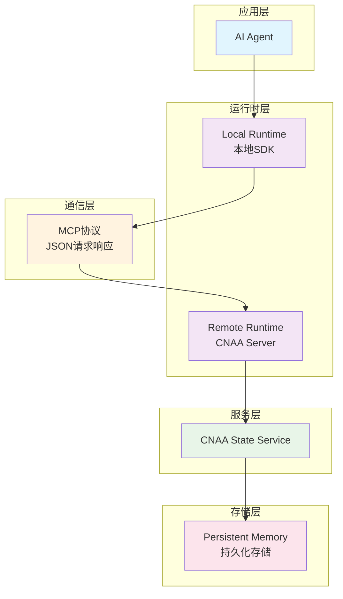

# 快速开始

<cite>
**本文档中引用的文件**
- [README.md](file://README.md)
- [README_CN.md](file://README_CN.md)
- [server.py](file://server.py)
- [cnaa/__init__.py](file://cnaa/__init__.py)
- [cnaa/models.py](file://cnaa/models.py)
- [cnaa/tools.py](file://cnaa/tools.py)
- [cloud/agent.py](file://cloud/agent.py)
- [local/agent.py](file://local/agent.py)
- [local/client/mcp_client.py](file://local/client/mcp_client.py)
- [cloud/server/mcp_server.py](file://cloud/server/mcp_server.py)
- [local/memory/instant_memory.py](file://local/memory/instant_memory.py)
- [pyproject.toml](file://pyproject.toml)
</cite>

## 更新摘要
**所做更改**
- 添加了完整的CNAA框架快速开始指南
- 包含云和本地实现的集成示例
- 提供了环境准备要求和安装步骤
- 包含了基本的状态接口使用方法
- 添加了常见配置选项和故障排除提示

## 目录
1. [简介](#简介)
2. [环境准备](#环境准备)
3. [安装步骤](#安装步骤)
4. [核心概念](#核心概念)
5. [架构概览](#架构概览)
6. [第一个示例：集成Experience Runtime SDK](#第一个示例集成experience-runtime-sdk)
7. [基本状态接口使用](#基本状态接口使用)
8. [云实现集成](#云实现集成)
9. [本地实现集成](#本地实现集成)
10. [常见配置选项](#常见配置选项)
11. [故障排除指南](#故障排除指南)
12. [总结](#总结)

## 简介

CNAA（Cloud Native Agentic Architecture）是一个面向AI Agent的持久化记忆运行时框架。它不是Agent框架、工作流引擎或RAG实现，而是提供一套轻量级的**经验运行时（Experience Runtime）**，让任何AI Agent在无需修改推理逻辑的情况下，实现经验沉淀、状态同步与持续记忆。

### 为什么需要CNAA？

当前AI Agent已经具备完成任务的能力，但绝大多数Agent不会持续记住任务经验。目前主流的Memory方案通常只是延长Prompt上下文窗口。CNAA提出**持久化经验记忆（Persistent Experience Memory）**的概念，让经验不再属于Prompt，而成为Agent生命周期之外的一种独立资源。

### 核心特性

- 🧠 **持久化经验记忆**：将任务经验持久化存储，支持跨会话复用
- 🔄 **运行时状态同步**：确保多个Agent实例间的状态一致性
- 🔌 **统一状态接口**：提供标准化的状态管理API
- 🤖 **Agent无关设计**：兼容各种类型的AI Agent
- ☁️ **云端/本地部署**：支持灵活的部署方式

**章节来源**
- [README_CN.md:9-19](file://README_CN.md#L9-L19)
- [README_CN.md:53-59](file://README_CN.md#L53-L59)

## 环境准备

### 系统要求
- **操作系统**: Linux (推荐Ubuntu 20.04+), macOS 10.15+, Windows 10+
- **内存**: 至少4GB RAM（建议8GB以上）
- **磁盘空间**: 至少10GB可用空间
- **网络**: 稳定的互联网连接

### 软件依赖
- **Python**: 3.11+ 版本（根据pyproject.toml要求）
- **MCP库**: 1.0.0+ 版本（用于模型上下文协议通信）

### 项目结构
```
CNAA-Cloud-Native-Agent-Architecture/
├── cnaa/                    # 核心框架定义
│   ├── models.py           # 数据模型定义
│   ├── tools.py            # MCP工具定义
│   └── schemas.py          # JSON模式定义
├── cloud/                   # 云端实现
│   ├── server/             # MCP服务器
│   └── storage/            # 存储后端
├── local/                   # 本地实现
│   ├── client/             # MCP客户端
│   ├── memory/             # 即时记忆管理
│   └── state/              # 状态缓存
└── server.py               # 服务器入口点
```

**章节来源**
- [pyproject.toml:5-14](file://pyproject.toml#L5-L14)

## 安装步骤

### 方法一：从源码安装
1. 克隆项目仓库
```bash
git clone https://github.com/example/CNAA-Cloud-Native-Agent-Architecture.git
cd CNAA-Cloud-Native-Agent-Architecture
```

2. 创建虚拟环境并安装依赖
```bash
python -m venv venv
source venv/bin/activate  # Linux/Mac
# 或
venv\Scripts\activate     # Windows

pip install -e .
```

3. 验证安装
```bash
python -c "import cnaa; print(cnaa.__version__)"
```

### 方法二：直接运行服务器
```bash
python server.py --host 0.0.0.0 --port 8080
```

**章节来源**
- [pyproject.toml:1-33](file://pyproject.toml#L1-L33)
- [server.py:150-181](file://server.py#L150-L181)

## 核心概念

### 任务点（Task Checkpoint）
基本经验单元。Agent在每个任务点评测完成度，将完整数据上传至CNAA。

### 即时记忆（Instant Memory）
任务点的轻量摘要，保留在Agent本地context中，用于快速定位与按需回溯。

### 伪连续记忆（Pseudo-Continuous Memory）
多个即时记忆通过沉淀与淘汰机制，以引用指针指向云端完整数据，模拟记忆的连续性。

### 数据模型
- **Memory**: 经验记忆实体（长期存储在云端，短期存储在本地）
- **State**: Agent累积的知识（从经验中提炼）
- **Preference**: Agent重要的记忆模式（塑造行为）
- **Environment**: Agent环境上下文
- **InstantMemory**: 本地短期记忆，带有云端引用指针

**章节来源**
- [cnaa/models.py:28-225](file://cnaa/models.py#L28-L225)

## 架构概览

CNAA采用**三层正交架构**，每层回答不同维度的问题，可独立修改。



**图表来源**
- [README_CN.md:52-91](file://README_CN.md#L52-L91)

### 通信方式
Agent通过**MCP（Model Context Protocol）**与CNAA Server通信，所有交互均为结构化JSON请求-响应对。

```
Agent（MCP Client）──JSON──▶ CNAA Server（MCP Server）──JSON──▶ Agent
```

**章节来源**
- [README_CN.md:93-99](file://README_CN.md#L93-L99)

## 第一个示例：集成Experience Runtime SDK

### 步骤1：初始化本地Agent接口
```python
from local.agent import LocalAgentInterface

# 创建本地Agent接口实例
memory = LocalAgentInterface(
    agent_id="my_agent_001",
    server_url="http://localhost:8080"
)
```

### 步骤2：存储经验记忆
```python
# 存储长期记忆到云端
result = memory.store_memory(
    memory_id="mem-001",
    memory_type="long_term",
    content={
        "task": "数据分析任务",
        "solution": "使用Pandas进行数据处理",
        "success_score": 0.95
    },
    tags=["data_analysis", "pandas"],
    completion_score=0.95
)
print(f"存储结果: {result}")
```

### 步骤3：创建即时记忆
```python
# 创建本地即时记忆
instant_result = memory.create_instant_memory(
    task_id="task-001",
    checkpoint_id="cp-001",
    summary="完成了数据分析任务，使用Pandas处理了用户数据",
    memory_id="mem-001"
)
print(f"即时记忆创建: {instant_result}")
```

### 步骤4：检索经验
```python
# 获取已存储的记忆
memory_data = memory.get_memory("mem-001")
print(f"获取的记忆: {memory_data}")

# 列出所有记忆
all_memories = memory.list_memories(memory_type="long_term")
print(f"所有记忆: {all_memories}")
```

**章节来源**
- [local/agent.py:35-64](file://local/agent.py#L35-L64)

## 基本状态接口使用

### 状态管理
```python
# 获取Agent状态
states = memory.get_states(use_cache=True)
print(f"Agent状态: {states}")

# 更新状态
state_result = memory.update_state(
    state_id="knowledge-001",
    category="knowledge",
    content={
        "domain": "数据分析",
        "expertise_level": "advanced",
        "tools": ["pandas", "numpy", "matplotlib"]
    }
)
print(f"状态更新结果: {state_result}")
```

### 偏好管理
```python
# 获取偏好设置
preferences = memory.get_preferences(use_cache=True)
print(f"偏好设置: {preferences}")

# 更新偏好
pref_result = memory.update_preference(
    preference_id="pref-001",
    key="analysis_style",
    value={"detail_level": "comprehensive", "visualization": True},
    importance=0.8,
    source_memory_ids=["mem-001", "mem-002"]
)
print(f"偏好更新结果: {pref_result}")
```

### 环境管理
```python
# 获取环境上下文
environment = memory.get_environment(use_cache=True)
print(f"环境信息: {environment}")

# 更新环境
env_result = memory.update_environment(
    env_id="env-001",
    context={
        "current_task": "data_analysis",
        "available_tools": ["pandas", "sqlalchemy"],
        "user_preferences": {"format": "json"}
    }
)
print(f"环境更新结果: {env_result}")
```

**章节来源**
- [local/agent.py:234-412](file://local/agent.py#L234-L412)

## 云实现集成

### 直接使用云接口
```python
from cloud.agent import CloudAgentInterface

# 创建云接口实例
cloud = CloudAgentInterface()

# 存储记忆
cloud_result = cloud.store_memory(
    agent_id="openclow-agent-001",
    memory_id="mem-001",
    memory_type="long_term",
    content={"task": "example", "result": "success"},
    tags=["example"],
    completion_score=0.9
)
print(f"云存储结果: {cloud_result}")

# 获取记忆
memory = cloud.get_memory("openclow-agent-001", "mem-001")
print(f"云记忆: {memory}")
```

### 启动CNAA服务器
```bash
# 启动服务器
python server.py --host 0.0.0.0 --port 8080

# 健康检查
curl http://localhost:8080/health

# 获取接口模式
curl http://localhost:8080/schemas
```

**章节来源**
- [cloud/agent.py:32-53](file://cloud/agent.py#L32-L53)
- [server.py:150-181](file://server.py#L150-L181)

## 本地实现集成

### 本地即时记忆管理
```python
from local.memory.instant_memory import InstantMemoryManager

# 创建即时记忆管理器
manager = InstantMemoryManager(agent_id="agent-001")

# 创建即时记忆
instant = manager.create_instant_memory(
    task_id="task-001",
    checkpoint_id="cp-001",
    summary="完成了数据库迁移任务",
    memory_id="mem-001"
)

# 获取活跃记忆
active_memories = manager.get_active_memories()
print(f"活跃记忆数量: {len(active_memories)}")

# 压缩旧记忆
condensed_count = manager.condense_old_memories(threshold_hours=1.0)
print(f"压缩的记忆数量: {condensed_count}")
```

### MCP客户端使用
```python
from local.client.mcp_client import CNAA_MCPClient

# 创建MCP客户端
client = CNAA_MCPClient(server_url="http://localhost:8080")

# 存储记忆
result = client.store_memory(
    agent_id="agent-001",
    memory_id="mem-001",
    memory_type="long_term",
    content={"task": "example"}
)

# 获取记忆
memory = client.get_memory("agent-001", "mem-001")
```

**章节来源**
- [local/memory/instant_memory.py:29-47](file://local/memory/instant_memory.py#L29-L47)
- [local/client/mcp_client.py:29-47](file://local/client/mcp_client.py#L29-L47)

## 常见配置选项

### 连接配置
| 配置项 | 默认值 | 描述 |
|--------|--------|------|
| `server_url` | `None` | CNAA服务器地址 |
| `timeout` | `30.0` | 请求超时时间（秒） |
| `agent_id` | 必填 | Agent唯一标识符 |

### 缓存配置
| 配置项 | 默认值 | 描述 |
|--------|--------|------|
| `cache_ttl_minutes` | `5.0` | 状态缓存过期时间（分钟） |
| `use_cache` | `True` | 是否启用缓存 |

### 存储配置
| 配置项 | 默认值 | 描述 |
|--------|--------|------|
| `memory_type` | `long_term` | 记忆类型（long_term/short_term） |
| `tags` | `[]` | 记忆标签列表 |
| `completion_score` | `0.0` | 任务完成度评分 |

### 性能优化
| 配置项 | 默认值 | 描述 |
|--------|--------|------|
| `threshold_hours` | `1.0` | 即时记忆压缩阈值（小时） |
| `threshold_days` | `7.0` | 记忆驱逐阈值（天） |

**章节来源**
- [local/agent.py:66-91](file://local/agent.py#L66-L91)
- [local/client/mcp_client.py:49-66](file://local/client/mcp_client.py#L49-L66)

## 故障排除指南

### 常见问题及解决方案

#### 1. 连接失败
**问题描述**: SDK无法连接到CNAA State Service
**可能原因**: 
- 服务地址配置错误
- 网络连接问题
- 防火墙限制

**解决方案**:
- 检查服务地址和端口配置
- 验证网络连接状态
- 确认防火墙规则允许通信

#### 2. 状态同步失败
**问题描述**: 多Agent实例间状态不一致
**可能原因**:
- 网络分区导致的数据不一致
- 并发写入冲突
- 版本不兼容

**解决方案**:
- 启用冲突检测和解决机制
- 实现乐观锁或悲观锁
- 升级所有节点到相同版本

#### 3. 性能问题
**问题描述**: 系统响应时间过长
**可能原因**:
- 数据库查询效率低
- 内存不足
- 网络延迟高

**解决方案**:
- 优化数据库查询和索引
- 增加内存分配
- 使用CDN或就近部署

### 调试技巧

#### 启用详细日志
```python
import logging
logging.basicConfig(level=logging.DEBUG)
```

#### 检查服务器状态
```bash
# 检查服务器健康状态
curl http://localhost:8080/health

# 查看接口模式
curl http://localhost:8080/schemas
```

#### 监控内存使用情况
```python
# 检查即时记忆状态
stats = manager.count_by_status()
print(f"记忆状态统计: {stats}")
```

**章节来源**
- [server.py:73-76](file://server.py#L73-L76)

## 总结

CNAA提供了一个强大的持久化经验记忆框架，使AI Agent能够获得持续学习和记忆的能力。通过其简洁的架构设计和丰富的功能特性，开发者可以快速集成到现有系统中，提升Agent的智能水平和用户体验。

### 主要优势

1. **非侵入式集成**: 无需修改Agent内部逻辑即可添加记忆能力
2. **高度可扩展**: 支持自定义存储后端和通信协议
3. **生产就绪**: 提供完善的监控、日志和错误处理机制
4. **社区活跃**: 持续的功能改进和bug修复

### 未来发展方向

- 支持更多类型的AI Agent框架
- 增强分布式协调能力
- 提供更丰富的分析和可视化工具
- 优化性能和资源利用率

### 下一步行动

1. **立即开始**: 按照本指南的第一个示例快速搭建环境
2. **深入学习**: 阅读完整的架构文档了解设计理念
3. **贡献代码**: 参与开源项目，贡献自己的创意和功能
4. **分享经验**: 在社区中分享使用经验和最佳实践

**章节来源**
- [README_CN.md:147-152](file://README_CN.md#L147-L152)