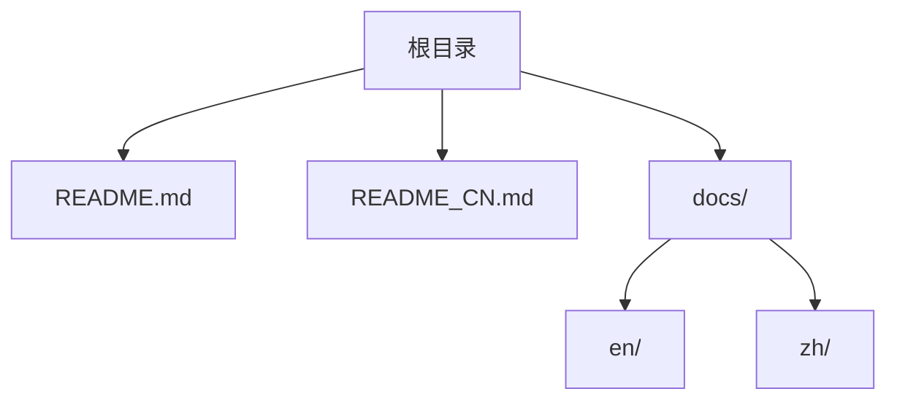
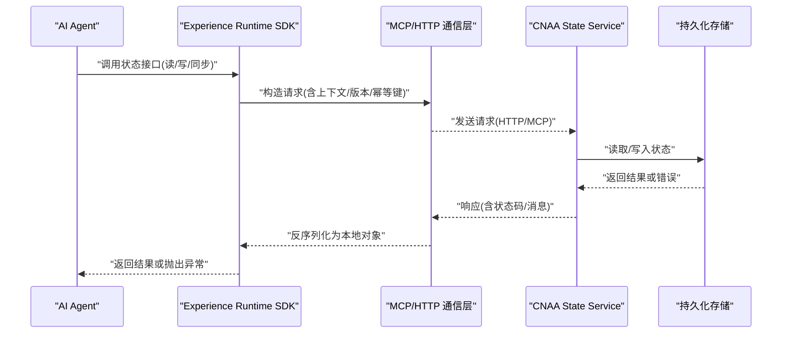
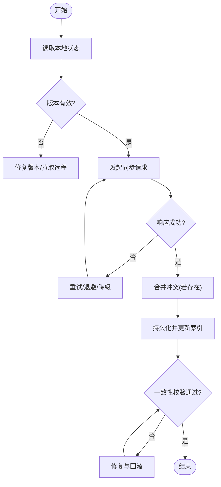

# 故障排除

<cite>
**本文档中引用的文件**   
- [README.md](file://README.md)
- [README_CN.md](file://README_CN.md)
</cite>

## 目录
1. [简介](#简介)
2. [项目结构](#项目结构)
3. [核心组件](#核心组件)
4. [架构总览](#架构总览)
5. [详细组件分析](#详细组件分析)
6. [依赖关系分析](#依赖关系分析)
7. [性能考虑](#性能考虑)
8. [故障排除指南](#故障排除指南)
9. [结论](#结论)
10. [附录](#附录)

## 简介
本指南面向部署与使用 CNAA（Cloud Native Agentic Architecture）的工程师与运维人员，聚焦于常见问题定位与解决，包括连接问题、状态同步异常、性能瓶颈等；提供调试技巧、日志分析方法、性能优化策略以及监控告警建议，并给出错误代码参考与处置步骤。CNAA 定位为“经验运行时”，为任意 AI Agent 提供持久化记忆、运行时状态同步与统一状态接口，通过 MCP/HTTP 与 CNAA State Service 交互。

## 项目结构
仓库当前以文档为主，包含中英文 README 与 docs 目录（示例文档占位）。整体结构简洁，便于扩展后续实现与文档。

图表来源
- [README.md:1-102](file://README.md#L1-L102)
- [README_CN.md:1-110](file://README_CN.md#L1-L110)

章节来源
- [README.md:1-102](file://README.md#L1-L102)
- [README_CN.md:1-110](file://README_CN.md#L1-L110)

## 核心组件
根据 README 描述，系统由以下关键部分组成：
- Experience Runtime SDK：封装状态接口、记忆管理、任务生命周期与 Agent 适配
- 状态接口（State Interface）：统一的读写与同步抽象
- 记忆管理器（Memory Manager）：负责经验的持久化与检索
- 任务生命周期（Task Lifecycle）：编排任务的创建、执行、完成与清理
- Agent 适配器（Agent Adapter）：对接不同 Agent 的实现
- 通信层（MCP / HTTP）：客户端与服务端之间的协议通道
- CNAA State Service：服务端状态管理与持久化存储

章节来源
- [README.md:55-72](file://README.md#L55-L72)
- [README_CN.md:63-80](file://README_CN.md#L63-L80)

## 架构总览
下图展示从 Agent 到状态服务的关键交互路径，突出易出问题的边界点（网络、序列化、幂等性、一致性）。

图表来源
- [README.md:55-72](file://README.md#L55-L72)
- [README_CN.md:63-80](file://README_CN.md#L63-L80)

## 详细组件分析
- 状态接口（State Interface）
  - 职责：定义统一的读、写、增量同步、版本控制与冲突解决能力
  - 常见问题：字段缺失、类型不匹配、版本号不一致导致同步失败
  - 排查要点：校验请求体结构与字段约束；检查版本字段是否递增；确认幂等键唯一性
- 记忆管理器（Memory Manager）
  - 职责：经验数据的增删改查、压缩与归档
  - 常见问题：内存占用过高、写入放大、索引失效
  - 排查要点：观察缓存命中率与落盘频率；评估数据分片策略；检查索引重建触发条件
- 任务生命周期（Task Lifecycle）
  - 职责：任务调度、重试、超时与回滚
  - 常见问题：任务堆积、重复执行、死锁
  - 排查要点：核对队列长度与消费者并发；检查幂等性与去重逻辑；关注事务边界与补偿机制
- Agent 适配器（Agent Adapter）
  - 职责：适配不同 Agent 的状态模型与协议差异
  - 常见问题：序列化失败、协议版本不兼容
  - 排查要点：对齐 schema 版本；启用严格模式校验；记录原始报文用于比对
- 通信层（MCP/HTTP）
  - 职责：可靠传输、重试、熔断与限流
  - 常见问题：连接池耗尽、超时、TLS 握手失败
  - 排查要点：检查连接池参数、超时配置、证书链与域名解析；启用抓包与链路追踪
- CNAA State Service
  - 职责：状态一致性、持久化、备份与恢复
  - 常见问题：主从延迟、写放大、磁盘 IO 瓶颈
  - 排查要点：监控 QPS/RT/P99；关注 WAL/索引大小；评估分片与副本策略

章节来源
- [README.md:55-72](file://README.md#L55-L72)
- [README_CN.md:63-80](file://README_CN.md#L63-L80)

## 依赖关系分析
- 外部依赖
  - 网络协议：HTTP/MCP
  - 存储后端：KV/时序/文档数据库（按实现选择）
  - 可观测性：指标、日志、链路追踪
- 内部耦合
  - SDK 与 State Service 强依赖状态接口契约
  - Memory Manager 与存储后端存在 I/O 耦合
  - Task Lifecycle 与队列/调度器存在资源竞争风险

图表来源
- [README.md:55-72](file://README.md#L55-L72)
- [README_CN.md:63-80](file://README_CN.md#L63-L80)

## 性能考虑
- 缓存策略
  - 热点键本地缓存 + 远端缓存分层；设置合理的 TTL 与失效策略
  - 写扩散 vs 读扩散：按访问模式选择
- 数据库优化
  - 合理分片与索引；避免大值字段频繁更新
  - 批量写入与合并提交；减少 WAL 压力
- 并发处理
  - 限制生产者速率与消费者并发；背压与退避
  - 幂等键与去重表；分布式锁粒度最小化
- 网络优化
  - 连接池复用、Keep-Alive、压缩；合理超时与重试退避
- 资源隔离
  - 多租户隔离；CPU/内存配额与限流

[本节为通用指导，无需特定文件引用]

## 故障排除指南

### 一、连接问题诊断与解决
- 症状
  - 无法建立连接、频繁超时、TLS 握手失败、DNS 解析失败
- 可能原因
  - 目标地址/端口错误、防火墙/安全组拦截、证书过期、代理配置不当、连接池耗尽
- 诊断步骤
  - 基础连通性：ping/traceroute/nslookup/curl
  - TLS 检查：openssl s_client 验证证书链与主机名
  - 连接池：查看活跃连接数、等待队列、最大连接数
  - 代理与路由：确认环境变量与实际出口一致
- 解决方案
  - 修正地址/端口与路由规则；更新证书与信任链
  - 调整连接池参数（最大连接、空闲回收、超时）
  - 增加重试与指数退避；对不可用节点快速剔除
- 相关参考
  - 通信层在 SDK 与 State Service 之间承载所有状态操作，需确保稳定可靠

章节来源
- [README.md:55-72](file://README.md#L55-L72)
- [README_CN.md:63-80](file://README_CN.md#L63-L80)

### 二、状态同步异常
- 症状
  - 读写不一致、版本冲突、增量同步丢失、幂等键重复
- 可能原因
  - 时钟漂移导致时间戳比较异常；弱一致性模型下的脏读；并发写未加锁或锁粒度不当
- 诊断步骤
  - 对比客户端与服务器端状态快照；检查版本号单调递增
  - 开启详细日志与链路追踪，定位具体请求 ID
  - 复现场景下抓取请求/响应报文，核对字段与类型
- 解决方案
  - 引入向量时钟或因果顺序；冲突时采用合并策略（如 LWW/自定义合并）
  - 强制幂等键唯一；对写路径加细粒度分布式锁
  - 定期一致性校验与修复任务
- 相关参考
  - 状态接口与记忆管理器是同步的核心环节

章节来源
- [README.md:55-72](file://README.md#L55-L72)
- [README_CN.md:63-80](file://README_CN.md#L63-L80)

### 三、性能瓶颈定位与优化
- 症状
  - P99 延迟升高、吞吐下降、CPU/内存飙升、GC 频繁、IO 等待高
- 诊断步骤
  - 指标采集：QPS、RT、错误率、饱和度（CPU/内存/IO/网络）
  - 火焰图与堆栈：定位热点函数与 GC 停顿
  - 链路追踪：识别慢调用链路与下游瓶颈
  - 存储侧：WAL/索引大小、查询计划、锁等待
- 优化策略
  - 应用层：批量化、异步化、缓存命中提升、减少序列化开销
  - 存储层：索引优化、分区/分片、冷热分离、压缩
  - 网络层：连接复用、压缩、合理超时与重试
- 相关参考
  - 任务生命周期与记忆管理器直接影响吞吐与延迟

章节来源
- [README.md:55-72](file://README.md#L55-L72)
- [README_CN.md:63-80](file://README_CN.md#L63-L80)

### 四、日志分析与排障流程
- 日志级别与内容
  - 建议分级：ERROR/WARN/INFO/DEBUG；包含请求 ID、用户/租户 ID、操作类型、耗时、状态码
- 采集与集中
  - 结构化 JSON 输出；统一收集至日志平台；保留必要上下文
- 分析技巧
  - 按请求 ID 聚合全链路日志；过滤慢请求与错误码
  - 关联指标与日志，定位时间窗口内的异常峰值
- 工具建议
  - 日志检索：关键词/正则/字段过滤
  - 可视化：趋势图、分布图、TopN 错误
- 最佳实践
  - 脱敏敏感信息；控制日志量与采样率；避免阻塞式打印

[本节为通用指导，无需特定文件引用]

### 五、监控与告警配置建议
- 指标体系
  - 业务指标：状态读写成功率、同步延迟、任务完成时长
  - 系统指标：CPU/内存/IO/网络、连接池、线程池、GC
  - 存储指标：QPS、延迟、错误率、容量、复制延迟
- 告警策略
  - 阈值+趋势双轨；多级别告警（提示/警告/严重）
  - 抑制抖动与风暴；明确责任人及升级路径
- 看板设计
  - 全局健康度、核心链路 RT/P99、错误 TopN、容量水位
- 可观测性集成
  - 指标（Prometheus）、日志（ELK/Loki）、链路（Jaeger/Zipkin）

[本节为通用指导，无需特定文件引用]

### 六、错误代码参考与处置步骤
以下为常见错误分类与处理建议（示例，实际以实现为准）：
- 连接类
  - E1001 连接超时：检查网络连通、代理、超时配置；启用重试与熔断
  - E1002 TLS 握手失败：校验证书链、主机名、时间同步
  - E1003 DNS 解析失败：检查域名解析、缓存、内网 DNS
- 状态同步类
  - E2001 版本冲突：拉取最新状态，合并后重试；必要时人工介入
  - E2002 幂等键重复：生成唯一键；去重表校验
  - E2003 数据不一致：启动一致性校验与修复任务
- 性能类
  - E3001 连接池耗尽：扩容连接池、降低并发、优化下游
  - E3002 内存溢出：排查大对象与泄漏；调整 JVM/运行时参数
  - E3003 磁盘 IO 饱和：优化写入路径、批量提交、扩容磁盘
- 任务类
  - E4001 任务堆积：扩容消费者、限流上游、优化处理逻辑
  - E4002 重复执行：幂等键与去重；分布式锁
  - E4003 死锁：缩小锁粒度、避免循环依赖

[本节为通用指导，无需特定文件引用]

### 七、调试技巧与工具使用方法
- 本地调试
  - 断点与单步；Mock 下游服务；注入异常与延迟
- 线上调试
  - 动态日志级别调整；采样链路追踪；只读副本回放
- 抓包与分析
  - tcpdump/wireshark 抓包；HTTP/MCP 报文解码
- 压测与回归
  - 基准测试与混沌工程；验证稳定性与弹性

[本节为通用指导，无需特定文件引用]

### 八、典型问题流程图（状态同步）

[本图为概念流程，无需特定文件引用]

## 结论
CNAA 将经验沉淀与状态同步从 Agent 推理过程中解耦，形成独立运行时与状态服务。排障的关键在于：明确边界（SDK/通信/服务/存储）、完善可观测性（指标/日志/链路）、强化可靠性（幂等/重试/熔断/一致性）与持续优化（缓存/索引/并发）。遵循本指南的诊断流程与优化策略，可显著提升问题定位效率与系统稳定性。

[本节为总结性内容，无需特定文件引用]

## 附录
- 术语
  - 经验运行时：在不修改 Agent 推理逻辑的前提下，提供经验沉淀与状态同步的能力
  - 状态接口：统一的读/写/同步抽象
  - 幂等键：保证同一操作多次执行结果一致的标识
- 参考链接
  - 架构与功能说明见 README 中的架构与特性描述

章节来源
- [README.md:1-102](file://README.md#L1-L102)
- [README_CN.md:1-110](file://README_CN.md#L1-L110)