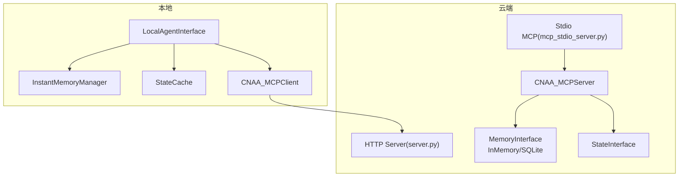
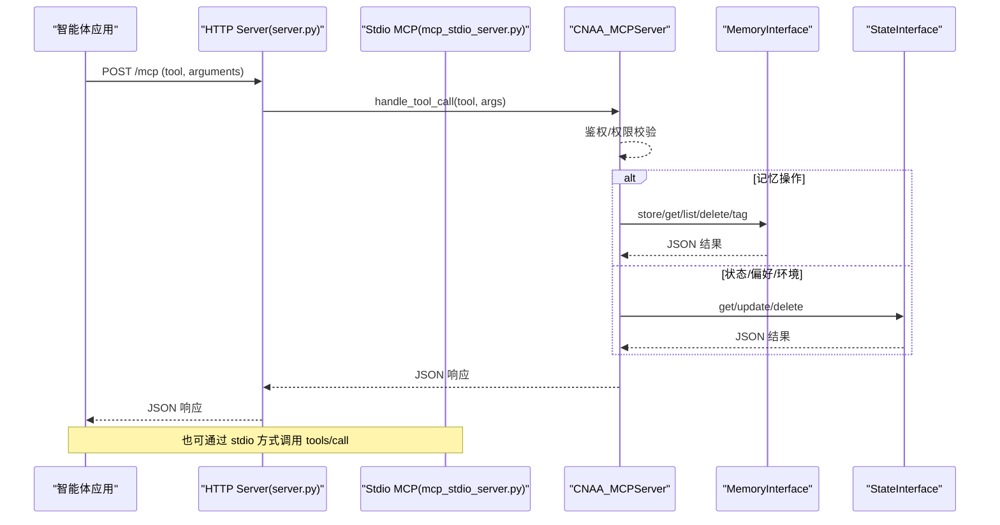
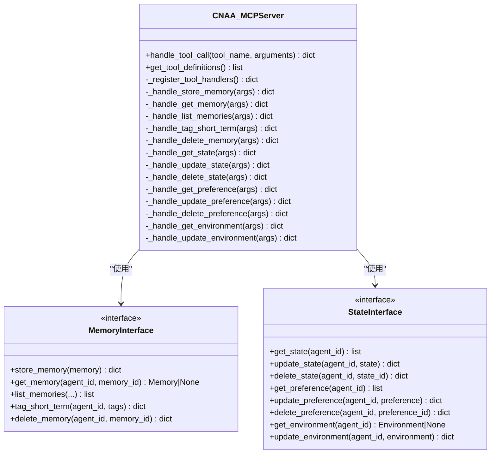
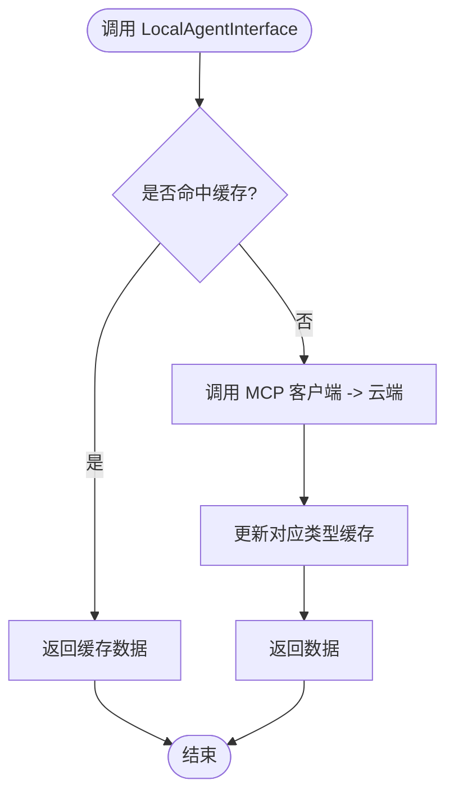
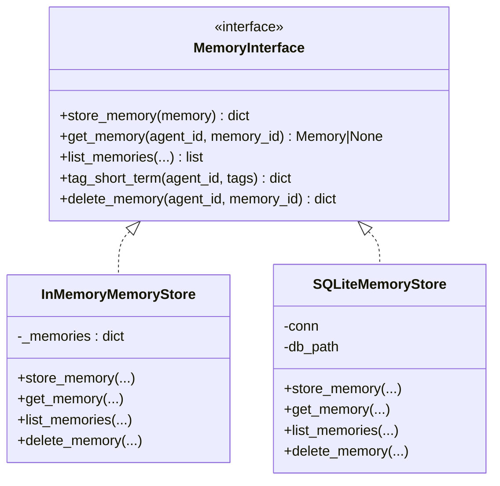
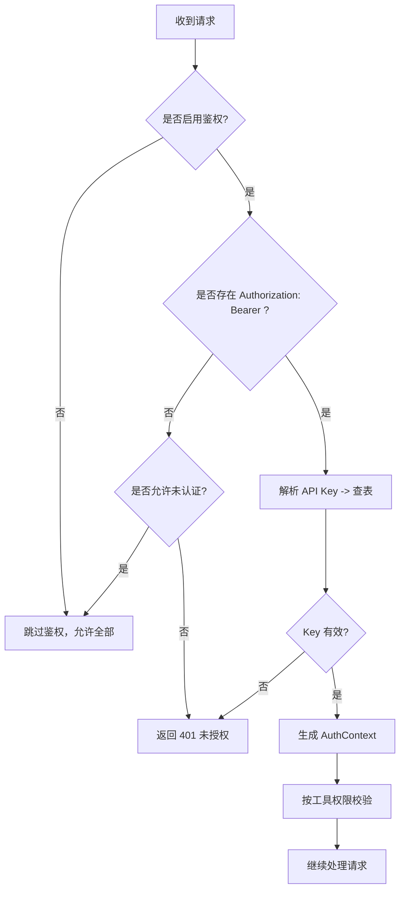
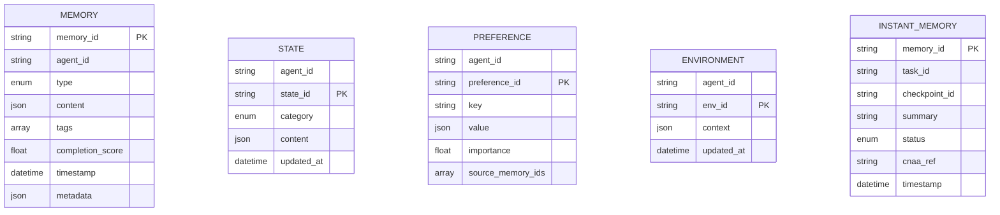
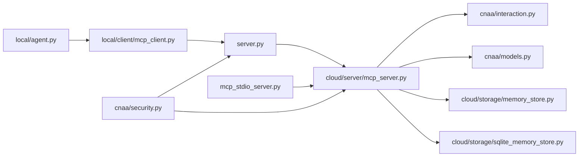

# 云本地分布式部署

<cite>
**本文引用的文件**   
- [README.md](file://README.md)
- [pyproject.toml](file://pyproject.toml)
- [server.py](file://server.py)
- [mcp_stdio_server.py](file://mcp_stdio_server.py)
- [cloud/server/mcp_server.py](file://cloud/server/mcp_server.py)
- [cloud/agent.py](file://cloud/agent.py)
- [local/agent.py](file://local/agent.py)
- [local/client/mcp_client.py](file://local/client/mcp_client.py)
- [cnaa/models.py](file://cnaa/models.py)
- [cnaa/interaction.py](file://cnaa/interaction.py)
- [cloud/storage/memory_store.py](file://cloud/storage/memory_store.py)
- [cloud/storage/sqlite_memory_store.py](file://cloud/storage/sqlite_memory_store.py)
- [cnaa/security.py](file://cnaa/security.py)
- [QUICK_DEPLOY.md](file://QUICK_DEPLOY.md)
</cite>

## 目录
1. [简介](#简介)
2. [项目结构](#项目结构)
3. [核心组件](#核心组件)
4. [架构总览](#架构总览)
5. [详细组件分析](#详细组件分析)
6. [依赖关系分析](#依赖关系分析)
7. [性能与扩展性](#性能与扩展性)
8. [故障排查指南](#故障排查指南)
9. [结论](#结论)
10. [附录：快速部署与配置](#附录快速部署与配置)

## 简介
本仓库为“云原生智能体架构（CNAA）”的参考实现，聚焦于跨会话的经验记忆持久化、状态管理与环境上下文。系统通过 MCP 协议暴露工具接口，提供纯 JSON 输入输出的“哑服务”，不包含推理逻辑，便于与各类智能体框架集成。

- 目标：为智能体提供长期记忆、短期记忆、状态（知识/偏好）、环境上下文等能力
- 通信：HTTP 与 stdio 两种 MCP 模式
- 存储：内存与 SQLite 双后端，支持替换自定义后端
- 安全：可选 API Key 鉴权与权限控制

**章节来源**
- [README.md:1-120](file://README.md#L1-L120)

## 项目结构
整体采用分层正交架构：
- cnaa：接口契约层（数据模型、抽象接口、安全）
- cloud：云端参考实现（MCP 服务器 + 存储后端）
- local：本地运行时（即时记忆、状态缓存、MCP 客户端）
- server.py / mcp_stdio_server.py：HTTP 与 stdio 入口

**图表来源**
- [server.py:1-120](file://server.py#L1-L120)
- [mcp_stdio_server.py:1-120](file://mcp_stdio_server.py#L1-L120)
- [cloud/server/mcp_server.py:1-120](file://cloud/server/mcp_server.py#L1-L120)
- [cloud/storage/memory_store.py:1-120](file://cloud/storage/memory_store.py#L1-L120)
- [cloud/storage/sqlite_memory_store.py:1-120](file://cloud/storage/sqlite_memory_store.py#L1-L120)
- [local/agent.py:1-120](file://local/agent.py#L1-L120)
- [local/client/mcp_client.py:1-120](file://local/client/mcp_client.py#L1-L120)

**章节来源**
- [README.md:75-112](file://README.md#L75-L112)
- [pyproject.toml:1-33](file://pyproject.toml#L1-L33)

## 核心组件
- 数据模型：Memory、State、Preference、Environment、InstantMemory 等，定义经验与状态的统一结构
- 交互接口：MemoryInterface、StateInterface 定义云/本地操作契约
- 云端服务：CNAA_MCPServer 路由 MCP 工具调用至存储后端
- 本地接口：LocalAgentInterface 组合即时记忆、状态缓存与 MCP 客户端
- 存储后端：InMemoryMemoryStore（测试/开发）、SQLiteMemoryStore（生产就绪）
- 安全模块：API Key 鉴权与权限检查

**章节来源**
- [cnaa/models.py:1-120](file://cnaa/models.py#L1-L120)
- [cnaa/interaction.py:1-120](file://cnaa/interaction.py#L1-L120)
- [cloud/server/mcp_server.py:1-120](file://cloud/server/mcp_server.py#L1-L120)
- [local/agent.py:1-120](file://local/agent.py#L1-L120)
- [cloud/storage/memory_store.py:1-120](file://cloud/storage/memory_store.py#L1-L120)
- [cloud/storage/sqlite_memory_store.py:1-120](file://cloud/storage/sqlite_memory_store.py#L1-L120)
- [cnaa/security.py:1-120](file://cnaa/security.py#L1-L120)

## 架构总览
系统遵循“JSON 入、JSON 出”的哑服务原则，HTTP/stdio 作为传输层，MCPServer 负责工具路由与鉴权，存储后端负责持久化。

**图表来源**
- [server.py:100-200](file://server.py#L100-L200)
- [mcp_stdio_server.py:120-220](file://mcp_stdio_server.py#L120-L220)
- [cloud/server/mcp_server.py:130-220](file://cloud/server/mcp_server.py#L130-L220)

## 详细组件分析

### 云端 MCP 服务器（CNAA_MCPServer）
- 职责：注册并路由 13 个 MCP 工具；注入鉴权上下文；将请求委派给 MemoryInterface/StateInterface
- 默认存储：优先使用 SQLiteMemoryStore，失败回退到 InMemoryMemoryStore
- 鉴权：从 HTTP 层注入 _auth_context，按 TOOL_PERMISSION_MAP 进行权限校验

**图表来源**
- [cloud/server/mcp_server.py:56-220](file://cloud/server/mcp_server.py#L56-L220)
- [cnaa/interaction.py:44-146](file://cnaa/interaction.py#L44-L146)
- [cnaa/interaction.py:178-321](file://cnaa/interaction.py#L178-L321)

**章节来源**
- [cloud/server/mcp_server.py:1-220](file://cloud/server/mcp_server.py#L1-L220)

### 本地代理接口（LocalAgentInterface）
- 职责：聚合即时记忆管理、状态缓存与 MCP 客户端，屏蔽底层细节
- 缓存策略：按类型 TTL 缓存（states/preferences/environment），更新时失效
- 云同步：所有写操作通过 MCP 客户端发送到云端

**图表来源**
- [local/agent.py:260-350](file://local/agent.py#L260-L350)

**章节来源**
- [local/agent.py:1-120](file://local/agent.py#L1-L120)
- [local/agent.py:260-450](file://local/agent.py#L260-L450)

### 存储后端（MemoryInterface 实现）
- InMemoryMemoryStore：字典存储，适合开发与测试，O(1) 查找，O(n) 列表过滤
- SQLiteMemoryStore：单文件持久化，WAL 模式，索引优化常见查询

**图表来源**
- [cloud/storage/memory_store.py:17-120](file://cloud/storage/memory_store.py#L17-L120)
- [cloud/storage/sqlite_memory_store.py:22-120](file://cloud/storage/sqlite_memory_store.py#L22-L120)

**章节来源**
- [cloud/storage/memory_store.py:1-233](file://cloud/storage/memory_store.py#L1-L233)
- [cloud/storage/sqlite_memory_store.py:1-289](file://cloud/storage/sqlite_memory_store.py#L1-L289)

### 安全与鉴权
- AuthConfig：控制是否启用鉴权、是否允许未认证访问、API Keys 映射
- validate_api_key：O(1) 查表验证 API Key
- check_permission：基于 PermissionLevel 的读/写/管理员权限判断

**图表来源**
- [cnaa/security.py:86-166](file://cnaa/security.py#L86-L166)
- [server.py:150-186](file://server.py#L150-L186)

**章节来源**
- [cnaa/security.py:1-208](file://cnaa/security.py#L1-L208)
- [server.py:120-200](file://server.py#L120-L200)

### 数据模型（cnaa.models）
- Memory：经验记忆实体，包含 agent_id、memory_id、type、content、tags、completion_score、timestamp、metadata
- State/Preference/Environment：状态、偏好与环境上下文
- InstantMemory：本地短期记忆摘要，指向云端完整数据

**图表来源**
- [cnaa/models.py:83-274](file://cnaa/models.py#L83-L274)

**章节来源**
- [cnaa/models.py:1-274](file://cnaa/models.py#L1-L274)

## 依赖关系分析
- 入口：server.py（HTTP）、mcp_stdio_server.py（stdio）
- 核心：cloud/server/mcp_server.py（工具路由与鉴权）
- 接口：cnaa/interaction.py（MemoryInterface、StateInterface）
- 模型：cnaa/models.py（数据结构）
- 存储：cloud/storage/*（内存/SQLite）
- 本地：local/agent.py、local/client/mcp_client.py（客户端封装与缓存）
- 安全：cnaa/security.py（鉴权与权限）

**图表来源**
- [server.py:1-120](file://server.py#L1-L120)
- [mcp_stdio_server.py:1-120](file://mcp_stdio_server.py#L1-L120)
- [cloud/server/mcp_server.py:1-120](file://cloud/server/mcp_server.py#L1-L120)
- [cnaa/interaction.py:1-120](file://cnaa/interaction.py#L1-L120)
- [cnaa/models.py:1-120](file://cnaa/models.py#L1-L120)
- [cloud/storage/memory_store.py:1-120](file://cloud/storage/memory_store.py#L1-L120)
- [cloud/storage/sqlite_memory_store.py:1-120](file://cloud/storage/sqlite_memory_store.py#L1-L120)
- [local/agent.py:1-120](file://local/agent.py#L1-L120)
- [local/client/mcp_client.py:1-120](file://local/client/mcp_client.py#L1-L120)
- [cnaa/security.py:1-120](file://cnaa/security.py#L1-L120)

**章节来源**
- [pyproject.toml:1-33](file://pyproject.toml#L1-L33)

## 性能与扩展性
- 存储选择：开发阶段用 InMemoryMemoryStore（O(1) 读写，O(n) 列表扫描）；生产建议 SQLiteMemoryStore（WAL、索引）
- 列表查询：当前为客户端过滤，时间复杂度 O(n)，可通过数据库侧过滤与分页优化
- 鉴权开销：O(1) 字典查找，可忽略
- 扩展点：
  - 自定义存储后端：实现 MemoryInterface/StateInterface
  - 批量操作：在 MCP 层增加批处理工具
  - 缓存层：在 MCP 层或客户端增加只读缓存
  - 异步：引入异步 IO 与连接池

[本节为通用指导，不直接分析具体文件]

## 故障排查指南
- 无法连接服务端：检查端口监听与防火墙规则，使用健康端点验证
- 鉴权失败：确认 Authorization 头与 API Key 匹配，检查 CNAA_AUTH_ENABLED 与 CNAA_API_KEYS
- 数据库错误：检查文件权限与锁占用，必要时清理 WAL 文件
- 日志定位：查看 cnaa.log 与服务进程日志

**章节来源**
- [server.py:210-276](file://server.py#L210-L276)
- [QUICK_DEPLOY.md:190-243](file://QUICK_DEPLOY.md#L190-L243)

## 结论
CNAA 以清晰的接口契约与“哑服务”设计，实现了云本地协同的记忆与状态管理。通过 MCP 协议解耦传输与业务，结合灵活的存储后端与可选鉴权机制，既满足开发调试的便捷性，也具备生产部署的可扩展性。

[本节为总结性内容，不直接分析具体文件]

## 附录：快速部署与配置
- 单机开发：启动 server.py，使用脚本测试连通性
- 远程生产：配置 .env、开放端口、设置数据库路径与日志路径
- 多智能体：多个本地实例通过同一云端服务同步

**章节来源**
- [QUICK_DEPLOY.md:1-120](file://QUICK_DEPLOY.md#L1-L120)
- [QUICK_DEPLOY.md:120-200](file://QUICK_DEPLOY.md#L120-L200)
- [README.md:22-74](file://README.md#L22-L74)