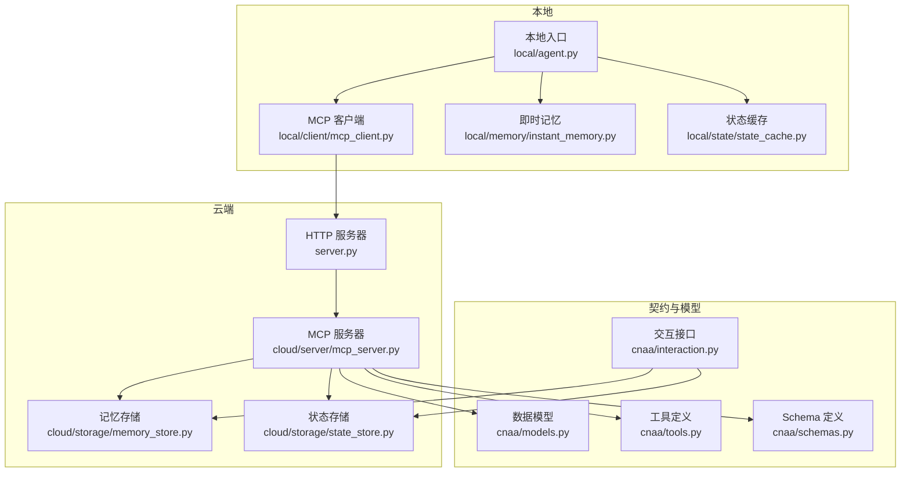
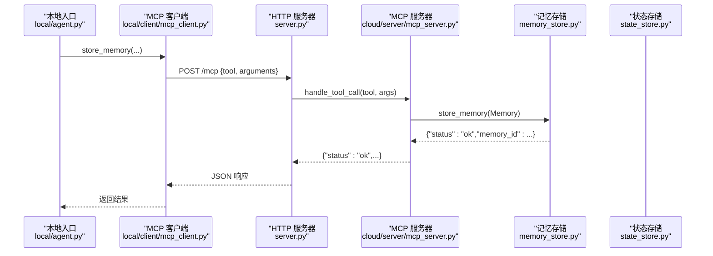
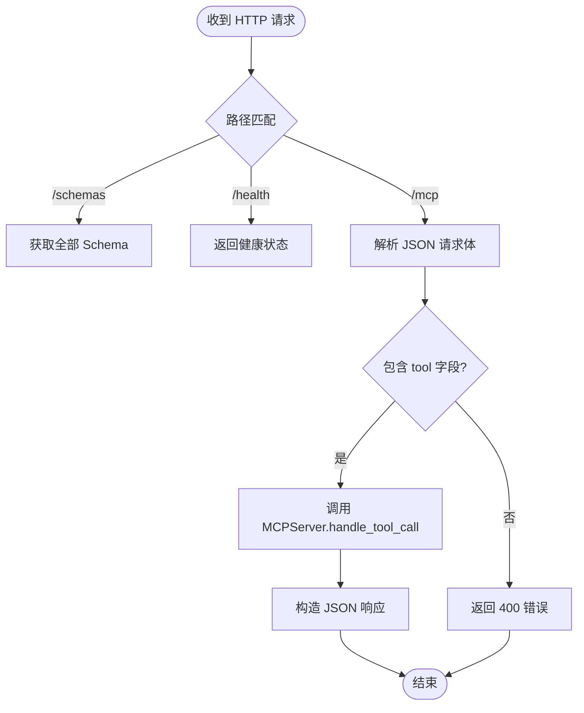
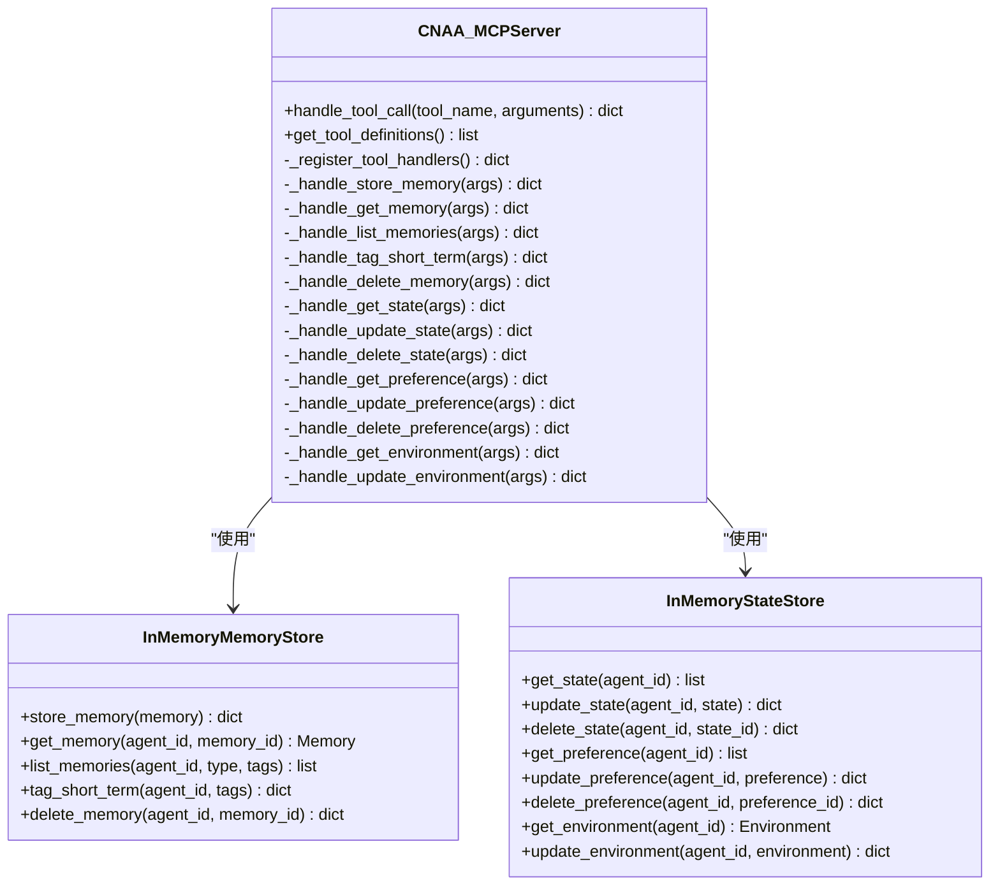
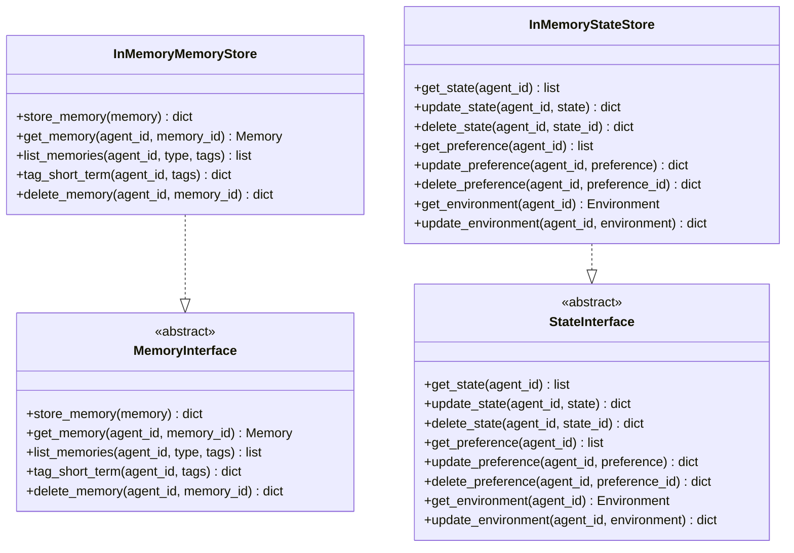
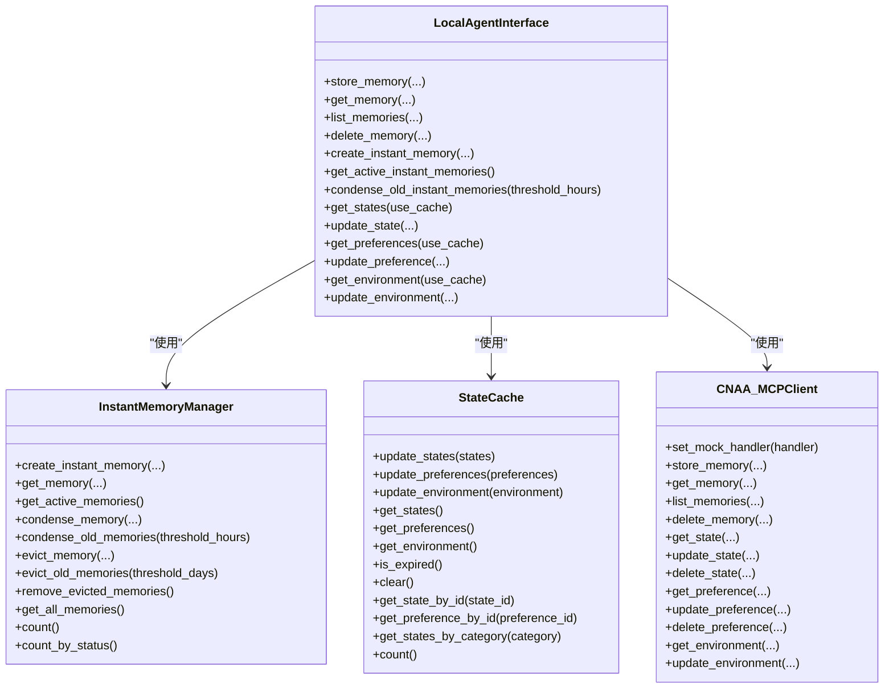
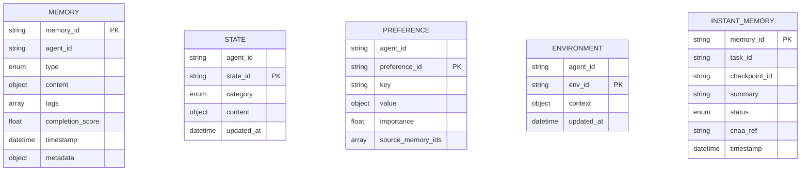
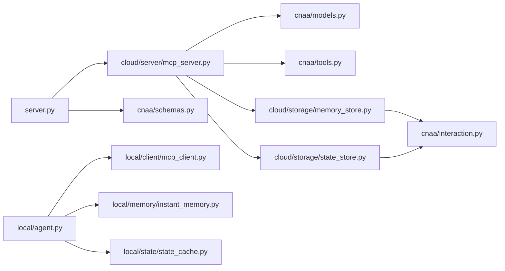

# 云端参考实现

<cite>
**本文引用的文件**   
- [README.md](file://README.md)
- [server.py](file://server.py)
- [cloud/agent.py](file://cloud/agent.py)
- [cloud/server/mcp_server.py](file://cloud/server/mcp_server.py)
- [cnaa/models.py](file://cnaa/models.py)
- [cnaa/tools.py](file://cnaa/tools.py)
- [cnaa/schemas.py](file://cnaa/schemas.py)
- [cnaa/interaction.py](file://cnaa/interaction.py)
- [cloud/storage/memory_store.py](file://cloud/storage/memory_store.py)
- [cloud/storage/state_store.py](file://cloud/storage/state_store.py)
- [local/agent.py](file://local/agent.py)
- [local/client/mcp_client.py](file://local/client/mcp_client.py)
- [local/memory/instant_memory.py](file://local/memory/instant_memory.py)
- [local/state/state_cache.py](file://local/state/state_cache.py)
</cite>

## 目录
1. [简介](#简介)
2. [项目结构](#项目结构)
3. [核心组件](#核心组件)
4. [架构总览](#架构总览)
5. [详细组件分析](#详细组件分析)
6. [依赖关系分析](#依赖关系分析)
7. [性能考量](#性能考量)
8. [故障排查指南](#故障排查指南)
9. [结论](#结论)
10. [附录](#附录)

## 简介
本仓库提供 CNAA（Cloud Native Agentic Architecture）的云端参考实现，目标是为任意 AI Agent 提供“经验持久化、跨会话复用”的能力。CNAA 不是 Agent 框架或工作流引擎，而是“经验运行时框架”，通过“任务检查点 + 即时记忆 + 云端持久化”的模式，将经验作为独立运行时资源管理。

云端侧采用“哑服务”原则：仅做 JSON 入出与存储/检索，不包含推理或内容生成能力。本地侧通过 MCP（Model Context Protocol）与云端通信，形成“小索引 → 大存储”的伪连续记忆模式。

**章节来源**
- [README.md:1-174](file://README.md#L1-L174)

## 项目结构
整体分为三层：
- 接口契约层（What）：数据模型、操作契约、协议格式、插件接口
- 运行层（How）：本地运行时（Local SDK）与远程运行时（CNAA Server）
- 生命周期层（When）：检查点状态机、即时记忆生命周期、经验演化规则

关键目录与职责：
- cloud：云端服务与 Python 接口封装
  - server/mcp_server.py：MCP 工具路由与处理
  - storage/*：内存式存储后端（可扩展为持久化）
  - agent.py：面向 Agent 框架的 Python 便捷接口
- cnaa：核心契约与模型
  - models.py：数据模型定义
  - tools.py：MCP 工具清单与描述
  - schemas.py：统一的请求/响应/数据 Schema
  - interaction.py：抽象交互接口（MemoryInterface、StateInterface）
- local：本地客户端与缓存
  - client/mcp_client.py：MCP 客户端（引用实现）
  - memory/instant_memory.py：即时记忆管理器
  - state/state_cache.py：状态缓存（TTL）
  - agent.py：本地统一入口（组合即时记忆、状态缓存、MCP 客户端）

**图表来源**
- [server.py:1-181](file://server.py#L1-L181)
- [cloud/server/mcp_server.py:1-299](file://cloud/server/mcp_server.py#L1-L299)
- [cloud/storage/memory_store.py:1-139](file://cloud/storage/memory_store.py#L1-L139)
- [cloud/storage/state_store.py:1-176](file://cloud/storage/state_store.py#L1-L176)
- [local/agent.py:1-452](file://local/agent.py#L1-L452)
- [local/client/mcp_client.py:1-351](file://local/client/mcp_client.py#L1-L351)
- [local/memory/instant_memory.py:1-263](file://local/memory/instant_memory.py#L1-L263)
- [local/state/state_cache.py:1-180](file://local/state/state_cache.py#L1-L180)
- [cnaa/models.py:1-225](file://cnaa/models.py#L1-L225)
- [cnaa/tools.py:1-210](file://cnaa/tools.py#L1-L210)
- [cnaa/schemas.py:1-465](file://cnaa/schemas.py#L1-L465)
- [cnaa/interaction.py:1-255](file://cnaa/interaction.py#L1-L255)

**章节来源**
- [README.md:52-104](file://README.md#L52-L104)

## 核心组件
- HTTP 服务器入口：暴露 /schemas、/mcp、/health 三个端点，负责解析请求并委派给 MCP 服务器。
- MCP 服务器：注册所有工具处理器，按工具名路由到对应方法，调用存储后端完成 CRUD。
- 存储后端：当前为内存实现，遵循 MemoryInterface 与 StateInterface 抽象，便于替换为持久化后端。
- 本地入口：组合即时记忆、状态缓存与 MCP 客户端，提供统一 API 供 Agent 框架使用。
- 契约与模型：集中定义数据模型、工具清单与 Schema，确保云-本地一致性。

**章节来源**
- [server.py:40-127](file://server.py#L40-L127)
- [cloud/server/mcp_server.py:47-131](file://cloud/server/mcp_server.py#L47-L131)
- [cloud/storage/memory_store.py:14-139](file://cloud/storage/memory_store.py#L14-L139)
- [cloud/storage/state_store.py:13-176](file://cloud/storage/state_store.py#L13-L176)
- [local/agent.py:21-91](file://local/agent.py#L21-L91)
- [cnaa/models.py:69-225](file://cnaa/models.py#L69-L225)
- [cnaa/tools.py:57-171](file://cnaa/tools.py#L57-L171)
- [cnaa/schemas.py:374-465](file://cnaa/schemas.py#L374-L465)
- [cnaa/interaction.py:31-255](file://cnaa/interaction.py#L31-L255)

## 架构总览
系统采用三层正交架构：
- 接口契约层：定义 WHAT（数据模型、操作契约、协议格式、插件接口）
- 运行层：HOW（本地 SDK 与云端 MCP 服务器）
- 生命周期层：WHEN（检查点状态机、即时记忆生命周期、经验演化规则）

通信方式：Agent 与 CNAA Server 通过 MCP 协议以结构化 JSON 请求-响应对进行通信。

**图表来源**
- [server.py:77-127](file://server.py#L77-L127)
- [cloud/server/mcp_server.py:95-123](file://cloud/server/mcp_server.py#L95-L123)
- [cloud/storage/memory_store.py:25-39](file://cloud/storage/memory_store.py#L25-L39)
- [local/client/mcp_client.py:103-138](file://local/client/mcp_client.py#L103-L138)
- [local/agent.py:94-124](file://local/agent.py#L94-L124)

## 详细组件分析

### HTTP 服务器与请求路由
- 提供 GET /schemas（返回所有 Schema）、POST /mcp（处理 MCP 工具调用）、GET /health（健康检查）。
- 解析 JSON 请求体，校验必要字段，错误时返回标准错误结构。
- 将工具调用委派给 CNAA_MCPServer.handle_tool_call。

**图表来源**
- [server.py:52-127](file://server.py#L52-L127)

**章节来源**
- [server.py:40-127](file://server.py#L40-L127)

### MCP 服务器与工具路由
- 注册 13 个工具处理器（记忆、状态、偏好、环境等），维护工具名到处理器的映射。
- handle_tool_call 根据工具名分发到具体处理器，异常时记录日志并返回错误结构。
- 各处理器负责参数校验、对象构建、调用存储后端、格式化响应。

**图表来源**
- [cloud/server/mcp_server.py:47-131](file://cloud/server/mcp_server.py#L47-L131)
- [cloud/storage/memory_store.py:14-139](file://cloud/storage/memory_store.py#L14-L139)
- [cloud/storage/state_store.py:13-176](file://cloud/storage/state_store.py#L13-L176)

**章节来源**
- [cloud/server/mcp_server.py:73-131](file://cloud/server/mcp_server.py#L73-L131)
- [cloud/server/mcp_server.py:132-299](file://cloud/server/mcp_server.py#L132-L299)

### 存储后端（内存实现）
- 记忆存储：基于字典键 (agent_id, memory_id) 存储 Memory 对象；支持按类型与标签过滤列出摘要。
- 状态存储：分别维护 State、Preference、Environment 的字典集合；支持增删查与计数统计。
- 均实现 cnaa/interaction.py 中的抽象接口，便于替换为持久化后端。

**图表来源**
- [cnaa/interaction.py:31-255](file://cnaa/interaction.py#L31-L255)
- [cloud/storage/memory_store.py:14-139](file://cloud/storage/memory_store.py#L14-L139)
- [cloud/storage/state_store.py:13-176](file://cloud/storage/state_store.py#L13-L176)

**章节来源**
- [cloud/storage/memory_store.py:25-139](file://cloud/storage/memory_store.py#L25-L139)
- [cloud/storage/state_store.py:25-176](file://cloud/storage/state_store.py#L25-L176)
- [cnaa/interaction.py:31-255](file://cnaa/interaction.py#L31-L255)

### 本地入口与即时记忆
- LocalAgentInterface 组合 InstantMemoryManager、StateCache、CNAA_MCPClient，提供统一 API。
- 即时记忆管理器维护本地轻量摘要，支持创建、查询、压缩（ACTIVE→CONDENSED）、驱逐（CONDENSED→EVICTED）与清理。
- 状态缓存提供 TTL 控制，减少网络调用，更新后自动失效。

**图表来源**
- [local/agent.py:21-91](file://local/agent.py#L21-L91)
- [local/memory/instant_memory.py:16-263](file://local/memory/instant_memory.py#L16-L263)
- [local/state/state_cache.py:15-180](file://local/state/state_cache.py#L15-L180)
- [local/client/mcp_client.py:19-351](file://local/client/mcp_client.py#L19-L351)

**章节来源**
- [local/agent.py:92-452](file://local/agent.py#L92-L452)
- [local/memory/instant_memory.py:58-263](file://local/memory/instant_memory.py#L58-L263)
- [local/state/state_cache.py:58-180](file://local/state/state_cache.py#L58-L180)
- [local/client/mcp_client.py:75-351](file://local/client/mcp_client.py#L75-L351)

### 数据模型与 Schema
- 数据模型包括 Memory、TaskCheckpoint、State、Preference、Environment、InstantMemory、MemorySummary、SearchResult。
- Schema 集中管理请求/响应/数据结构的 JSON Schema，保证云-本地一致性与可发现性。
- 工具定义集中声明 13 个 MCP 工具的名称、描述与输入 Schema。

**图表来源**
- [cnaa/models.py:69-225](file://cnaa/models.py#L69-L225)
- [cnaa/schemas.py:23-116](file://cnaa/schemas.py#L23-L116)
- [cnaa/tools.py:57-171](file://cnaa/tools.py#L57-L171)

**章节来源**
- [cnaa/models.py:69-225](file://cnaa/models.py#L69-L225)
- [cnaa/schemas.py:374-465](file://cnaa/schemas.py#L374-L465)
- [cnaa/tools.py:57-171](file://cnaa/tools.py#L57-L171)

## 依赖关系分析
- 模块耦合：
  - server.py 依赖 cloud.server.mcp_server 与 cnaa.schemas。
  - cloud.server.mcp_server 依赖 cnaa.models、cnaa.tools、cloud.storage.*。
  - local.agent 依赖 local.client.mcp_client、local.memory.instant_memory、local.state.state_cache。
  - 存储后端实现 cnaa.interaction 抽象接口，解耦具体实现。
- 外部依赖：
  - 通信协议：MCP（当前为引用实现，生产建议使用官方 SDK）。
  - 传输：HTTP（当前实现），未来可扩展 stdio 等。

**图表来源**
- [server.py:29-31](file://server.py#L29-L31)
- [cloud/server/mcp_server.py:17-43](file://cloud/server/mcp_server.py#L17-L43)
- [cloud/storage/memory_store.py:10-11](file://cloud/storage/memory_store.py#L10-L11)
- [cloud/storage/state_store.py:9-10](file://cloud/storage/state_store.py#L9-L10)
- [local/agent.py:15-18](file://local/agent.py#L15-L18)

**章节来源**
- [server.py:29-31](file://server.py#L29-L31)
- [cloud/server/mcp_server.py:17-43](file://cloud/server/mcp_server.py#L17-L43)
- [cnaa/interaction.py:1-255](file://cnaa/interaction.py#L1-L255)

## 性能考量
- 本地优先策略：即时记忆与状态缓存减少网络往返，提升响应速度。
- 压缩与驱逐：旧即时记忆被压缩为索引指针，进一步驱逐以释放本地空间。
- 缓存 TTL：状态缓存默认 5 分钟，可根据访问频率调整。
- 存储后端可扩展：当前内存实现适合开发测试，生产应替换为持久化后端（如 SQLite、PostgreSQL、文件系统）。
- 工具调用批量化：未来可增加批量接口以降低请求开销。

[本节为通用指导，不直接分析具体文件]

## 故障排查指南
- 常见错误：
  - 缺少 tool 字段：POST /mcp 请求未包含 tool，返回 400。
  - JSON 解析失败：请求体非合法 JSON，返回 400。
  - 未知工具名：handle_tool_call 找不到处理器，返回错误消息。
  - 数据未找到：例如 memory/environment 不存在，返回 not_found。
- 定位建议：
  - 查看服务器日志输出（已配置 logging）。
  - 使用 /health 检查服务可用性。
  - 使用 /schemas 确认接口 Schema 是否变更。
  - 在本地使用 set_mock_handler 模拟云端行为，隔离问题。

**章节来源**
- [server.py:77-127](file://server.py#L77-L127)
- [cloud/server/mcp_server.py:95-123](file://cloud/server/mcp_server.py#L95-L123)

## 结论
该云端参考实现清晰分离了契约层、运行层与生命周期层，通过 MCP 协议实现云-本地解耦通信。当前内存式存储便于开发与测试，后续可替换为持久化后端。通过即时记忆与状态缓存机制，系统在保持低延迟的同时实现了经验的跨会话持久化与复用。

[本节为总结，不直接分析具体文件]

## 附录
- 启动命令示例：python server.py --host 0.0.0.0 --port 8080
- 主要端点：
  - GET /schemas：获取全部接口 Schema
  - POST /mcp：调用 MCP 工具
  - GET /health：健康检查

**章节来源**
- [server.py:150-181](file://server.py#L150-L181)
- [cnaa/schemas.py:374-465](file://cnaa/schemas.py#L374-L465)