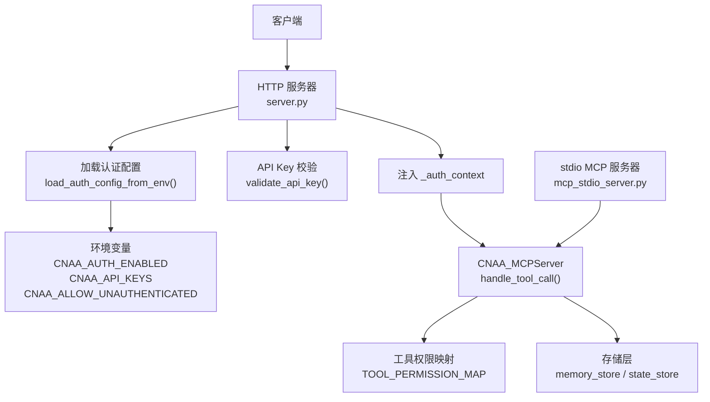
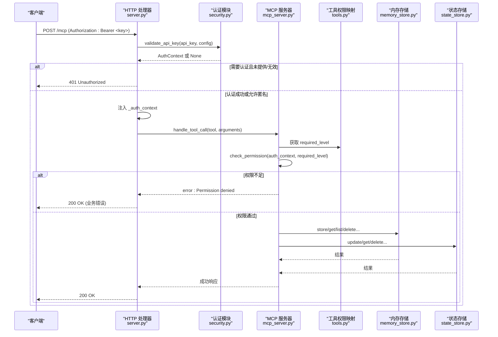
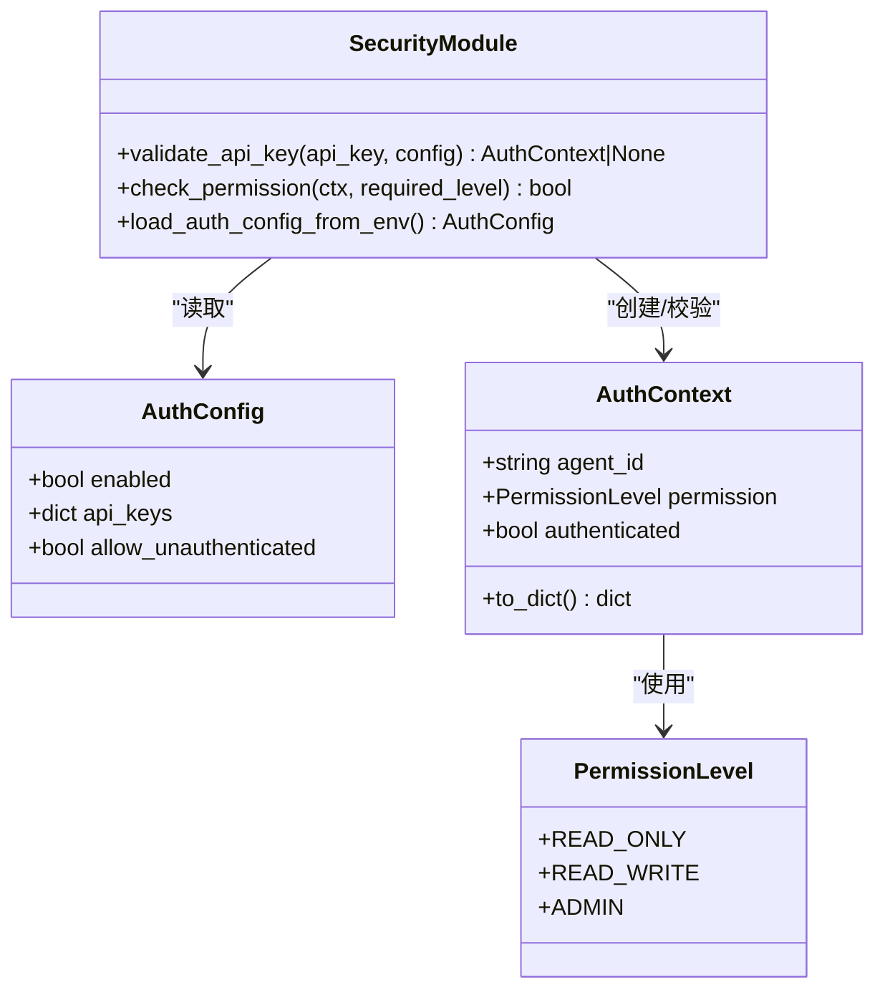
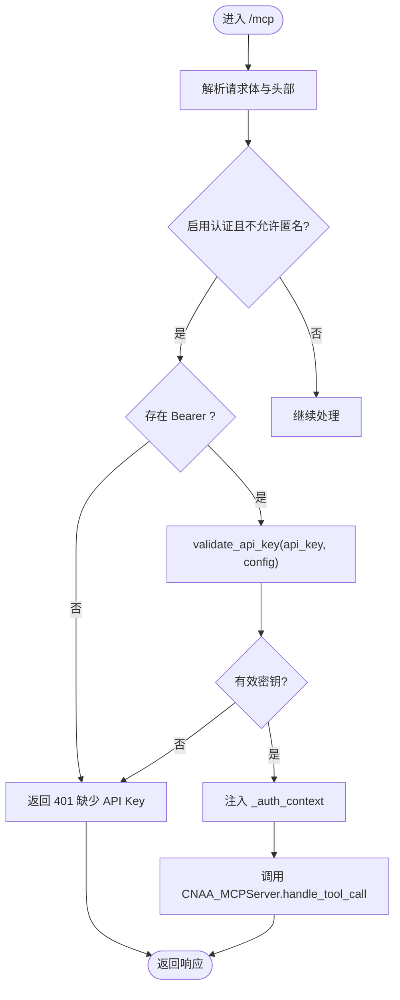
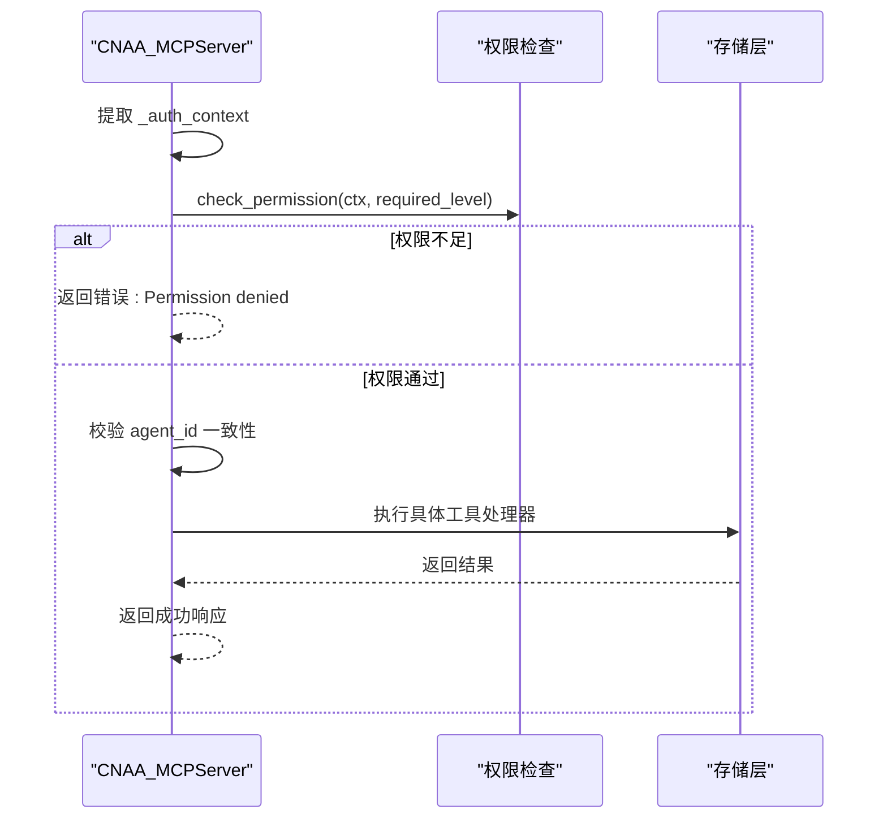
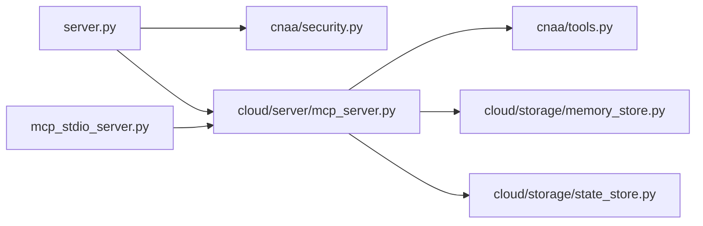

# 安全认证与授权

<cite>
**本文引用的文件**   
- [cnaa/security.py](file://cnaa/security.py)
- [server.py](file://server.py)
- [cloud/server/mcp_server.py](file://cloud/server/mcp_server.py)
- [cnaa/tools.py](file://cnaa/tools.py)
- [cloud/storage/memory_store.py](file://cloud/storage/memory_store.py)
- [cloud/storage/state_store.py](file://cloud/storage/state_store.py)
- [mcp_stdio_server.py](file://mcp_stdio_server.py)
- [tests/test_security.py](file://tests/test_security.py)
- [README.md](file://README.md)
</cite>

## 更新摘要
**所做更改**   
- 更新了环境变量配置部分，详细说明 CNAA_AUTH_ENABLED、CNAA_API_KEYS 和 CNAA_ALLOW_UNAUTHENTICATED 的完整支持
- 增强了认证配置加载机制的描述
- 更新了故障排查指南以包含新的环境变量检查
- 完善了附录中的环境变量说明

## 目录
1. [简介](#简介)
2. [项目结构](#项目结构)
3. [核心组件](#核心组件)
4. [架构总览](#架构总览)
5. [详细组件分析](#详细组件分析)
6. [依赖关系分析](#依赖关系分析)
7. [性能考量](#性能考量)
8. [故障排查指南](#故障排查指南)
9. [结论](#结论)
10. [附录](#附录)

## 简介
本文件聚焦 CNAA（云原生代理架构）中的"安全认证与授权"能力，涵盖 API Key 认证、基于权限的访问控制、HTTP 层鉴权注入、MCP 工具级权限校验以及存储层的 Agent ID 一致性校验。系统默认关闭认证以保证向后兼容，可通过三个关键环境变量灵活启用并配置：`CNAA_AUTH_ENABLED` 控制认证开关，`CNAA_API_KEYS` 定义 API Key 映射，`CNAA_ALLOW_UNAUTHENTICATED` 允许匿名访问策略。

## 项目结构
与安全相关的关键模块分布如下：
- 安全核心：cnaa/security.py
- HTTP 入口与鉴权注入：server.py
- MCP 服务与工具路由：cloud/server/mcp_server.py
- 工具定义与权限映射：cnaa/tools.py
- 存储层鉴权：cloud/storage/memory_store.py、cloud/storage/state_store.py
- stdio MCP 服务器（无内置鉴权）：mcp_stdio_server.py
- 测试用例：tests/test_security.py
- 文档说明：README.md

图表来源
- [server.py:118-179](file://server.py#L118-L179)
- [cnaa/security.py:169-208](file://cnaa/security.py#L169-L208)
- [cloud/server/mcp_server.py:105-168](file://cloud/server/mcp_server.py#L105-168)
- [cnaa/tools.py:227-247](file://cnaa/tools.py#L227-247)
- [cloud/storage/memory_store.py:42-86](file://cloud/storage/memory_store.py#L42-86)
- [cloud/storage/state_store.py:45-96](file://cloud/storage/state_store.py#L45-96)
- [mcp_stdio_server.py:193-218](file://mcp_stdio_server.py#L193-218)

章节来源
- [server.py:1-276](file://server.py#L1-276)
- [cnaa/security.py:1-208](file://cnaa/security.py#L1-208)
- [cloud/server/mcp_server.py:1-438](file://cloud/server/mcp_server.py#L1-438)
- [cnaa/tools.py:1-247](file://cnaa/tools.py#L1-247)
- [cloud/storage/memory_store.py:1-233](file://cloud/storage/memory_store.py#L1-233)
- [cloud/storage/state_store.py:1-276](file://cloud/storage/state_store.py#L1-276)
- [mcp_stdio_server.py:1-240](file://mcp_stdio_server.py#L1-240)
- [tests/test_security.py:1-501](file://tests/test_security.py#L1-501)
- [README.md:156-168](file://README.md#L156-168)

## 核心组件
- 权限级别枚举：read_only、read_write、admin
- 认证配置：是否启用、API Key 映射、是否允许未认证请求
- 认证上下文：agent_id、permission、authenticated
- API Key 校验：O(1) 字典查找，失败返回 None
- 权限检查：按 read/write 语义判定
- **环境变量配置加载**：CNAA_AUTH_ENABLED、CNAA_ALLOW_UNAUTHENTICATED、CNAA_API_KEYS
- HTTP 层鉴权注入：Authorization: Bearer <key> 解析并注入 _auth_context
- MCP 工具级权限校验：根据 TOOL_PERMISSION_MAP 判断 read/write
- 存储层 Agent ID 一致性校验：防止越权访问

章节来源
- [cnaa/security.py:31-133](file://cnaa/security.py#L31-133)
- [cnaa/security.py:169-208](file://cnaa/security.py#L169-208)
- [server.py:146-179](file://server.py#L146-179)
- [cloud/server/mcp_server.py:134-168](file://cloud/server/mcp_server.py#L34-168)
- [cnaa/tools.py:227-247](file://cnaa/tools.py#L227-247)
- [cloud/storage/memory_store.py:42-86](file://cloud/storage/memory_store.py#L42-86)
- [cloud/storage/state_store.py:45-96](file://cloud/storage/state_store.py#L45-96)

## 架构总览
下图展示从 HTTP 请求到存储层的完整鉴权与授权流程：

图表来源
- [server.py:118-179](file://server.py#L118-179)
- [cnaa/security.py:86-120](file://cnaa/security.py#L86-120)
- [cloud/server/mcp_server.py:105-168](file://cloud/server/mcp_server.py#L105-168)
- [cnaa/tools.py:227-247](file://cnaa/tools.py#L227-247)
- [cloud/storage/memory_store.py:42-86](file://cloud/storage/memory_store.py#L42-86)
- [cloud/storage/state_store.py:45-96](file://cloud/storage/state_store.py#L45-96)

## 详细组件分析

### 安全核心模块（cnaa/security.py）
- 设计要点
  - 默认关闭认证，保证向后兼容
  - O(1) 字典查找 API Key
  - 纯数据交换：仅凭证校验，不含业务逻辑
  - 标准库实现，零外部依赖
- 关键数据结构
  - PermissionLevel：read_only、read_write、admin
  - AuthConfig：enabled、api_keys、allow_unauthenticated
  - AuthContext：agent_id、permission、authenticated；to_dict() 序列化
- 关键函数
  - validate_api_key：校验 API Key，返回 AuthContext 或 None
  - check_permission：按 read/write 语义进行权限判定
  - load_auth_config_from_env：**从环境变量加载配置**

图表来源
- [cnaa/security.py:31-84](file://cnaa/security.py#L31-84)
- [cnaa/security.py:86-133](file://cnaa/security.py#L86-133)
- [cnaa/security.py:169-208](file://cnaa/security.py#L169-208)

章节来源
- [cnaa/security.py:1-208](file://cnaa/security.py#L1-208)

### HTTP 层鉴权与注入（server.py）
- 功能要点
  - 解析 Authorization: Bearer <key>
  - 当启用认证且不允许匿名时，缺失 Bearer 直接拒绝
  - 调用 validate_api_key 校验，失败返回 401
  - 将 AuthContext.to_dict() 注入为 arguments["_auth_context"]
- 错误处理
  - JSON 解析失败返回 400
  - 其他异常记录日志并返回 500

图表来源
- [server.py:118-179](file://server.py#L118-179)
- [cnaa/security.py:86-120](file://cnaa/security.py#L86-120)

章节来源
- [server.py:118-179](file://server.py#L118-179)

### MCP 服务器与工具级权限（cloud/server/mcp_server.py）
- 功能要点
  - 从 arguments 中取出 _auth_context
  - 根据 TOOL_PERMISSION_MAP 获取 required_level
  - 使用 check_permission 进行权限判定
  - 校验 request.agent_id 与 auth_context.agent_id 一致性
  - 将 _auth_context 再次注入供存储层使用
- 工具处理器
  - 记忆、状态、偏好、环境等 CRUD 操作均经过上述流程

图表来源
- [cloud/server/mcp_server.py:134-168](file://cloud/server/mcp_server.py#L134-168)
- [cnaa/tools.py:227-247](file://cnaa/tools.py#L227-247)

章节来源
- [cloud/server/mcp_server.py:105-168](file://cloud/server/mcp_server.py#L105-168)

### 工具定义与权限映射（cnaa/tools.py）
- 工具分类
  - 读操作：GET_MEMORY、LIST_MEMORIES、GET_STATE、GET_PREFERENCE、GET_ENVIRONMENT → "read"
  - 写操作：STORE_MEMORY、DELETE_MEMORY、TAG_SHORT_TERM、UPDATE_STATE、DELETE_STATE、UPDATE_PREFERENCE、DELETE_PREFERENCE、UPDATE_ENVIRONMENT → "write"
- 作用
  - 统一声明工具名称、描述与输入 Schema
  - 提供 TOOL_PERMISSION_MAP 用于权限判定

章节来源
- [cnaa/tools.py:72-186](file://cnaa/tools.py#L72-186)
- [cnaa/tools.py:227-247](file://cnaa/tools.py#L227-247)

### 存储层鉴权（memory_store.py、state_store.py）
- 设计要点
  - 所有写接口在存在 auth_context 时校验 agent_id 一致性，不一致返回错误
  - 读接口在存在 auth_context 时若 agent_id 不匹配则静默返回空结果（防信息泄露）
- 影响
  - 即使上层未做权限校验，存储层仍具备基础的数据隔离能力

章节来源
- [cloud/storage/memory_store.py:42-86](file://cloud/storage/memory_store.py#L42-86)
- [cloud/storage/memory_store.py:117-143](file://cloud/storage/memory_store.py#L117-143)
- [cloud/storage/memory_store.py:162-186](file://cloud/storage/memory_store.py#L162-186)
- [cloud/storage/state_store.py:45-96](file://cloud/storage/state_store.py#L45-96)
- [cloud/storage/state_store.py:126-152](file://cloud/storage/state_store.py#L126-152)
- [cloud/storage/state_store.py:207-245](file://cloud/storage/state_store.py#L207-245)

### stdio MCP 服务器（mcp_stdio_server.py）
- 现状
  - 当前实现未集成认证与授权逻辑
  - 适用于进程内调用场景，需由调用方负责鉴权或在网关层保护

章节来源
- [mcp_stdio_server.py:193-218](file://mcp_stdio_server.py#L193-218)

## 依赖关系分析
- 组件耦合
  - server.py 依赖 cnaa.security 进行认证，依赖 cloud.server.mcp_server 进行工具路由
  - mcp_server.py 依赖 cnaa.tools 获取工具定义与权限映射，依赖存储层完成数据操作
  - 存储层独立于认证模块，但可接受可选的 auth_context 参数进行二次校验
- 潜在循环依赖
  - 当前未发现循环导入；各模块职责清晰，单向依赖

图表来源
- [server.py:50-57](file://server.py#L50-57)
- [cloud/server/mcp_server.py:22-49](file://cloud/server/mcp_server.py#L22-49)
- [cnaa/tools.py:1-31](file://cnaa/tools.py#L1-31)

章节来源
- [server.py:50-57](file://server.py#L50-57)
- [cloud/server/mcp_server.py:22-49](file://cloud/server/mcp_server.py#L22-49)
- [cnaa/tools.py:1-31](file://cnaa/tools.py#L1-31)

## 性能考量
- 认证复杂度
  - validate_api_key 使用字典 O(1) 查找，开销极低
  - check_permission 为常量时间比较
  - load_auth_config_from_env 仅在启动时执行一次
- 存储层查询
  - list_memories 线性扫描 O(n)，适合小规模数据；生产环境建议引入索引或分页
- 扩展点
  - 可在 HTTP 层增加速率限制、请求大小限制、超时控制
  - 在 MCP 层增加参数校验、结果缓存（只读工具）

[本节为通用指导，无需特定文件引用]

## 故障排查指南
- 常见问题
  - 401 未授权：未提供 Bearer 或 API Key 无效
  - 权限不足：read_only 尝试写操作
  - Agent ID 不一致：请求 agent_id 与认证上下文不一致
  - 存储层返回空结果：auth_context 与目标 agent_id 不匹配（读操作静默失败）
- **定位步骤**
  - **检查环境变量 CNAA_AUTH_ENABLED、CNAA_ALLOW_UNAUTHENTICATED、CNAA_API_KEYS**
  - **验证 CNAA_API_KEYS 是否为有效的 JSON 格式**
  - **确认 Authorization 头格式正确**
  - **查看日志输出（server.py 与 mcp_server.py 的异常日志）**
  - **验证工具权限映射是否正确覆盖新增工具**

章节来源
- [server.py:146-179](file://server.py#L146-179)
- [cloud/server/mcp_server.py:134-168](file://cloud/server/mcp_server.py#L134-168)
- [tests/test_security.py:238-343](file://tests/test_security.py#L238-343)

## 结论
CNAA 的安全认证与授权体系以轻量、可扩展为核心目标：
- 默认关闭认证，确保向后兼容
- **通过三个关键环境变量灵活启用与配置**
- HTTP 层负责凭证校验与上下文注入
- MCP 层依据工具权限映射进行细粒度授权
- 存储层提供 Agent ID 一致性保障，作为最后一道防线
建议在生产环境中结合网关与审计机制，进一步增强安全性与可观测性。

[本节为总结性内容，无需特定文件引用]

## 附录
- **环境变量说明**
  - **CNAA_AUTH_ENABLED**：是否启用认证（默认 false），设置为 "true" 启用 API Key 认证
  - **CNAA_ALLOW_UNAUTHENTICATED**：启用认证后是否允许匿名（默认 true），设置为 "false" 强制要求 API Key
  - **CNAA_API_KEYS**：JSON 字符串，键为 API Key，值为包含 agent_id 与 permission 的元数据
    - 示例：`{"sk-key": {"agent_id": "agent-001", "permission": "read_write"}}`
    - 支持的权限值：read_only、read_write、admin
- **参考文档**
  - README 中关于安全配置的说明

章节来源
- [cnaa/security.py:169-208](file://cnaa/security.py#L169-208)
- [README.md:156-168](file://README.md#L156-168)