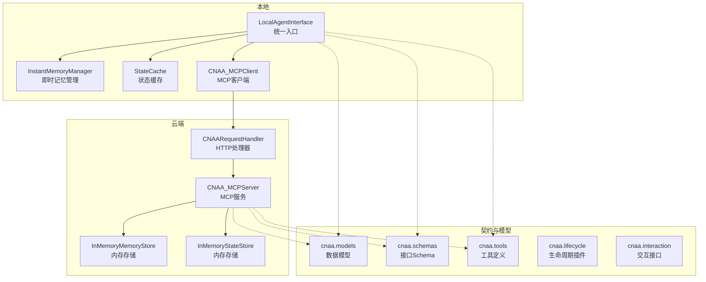
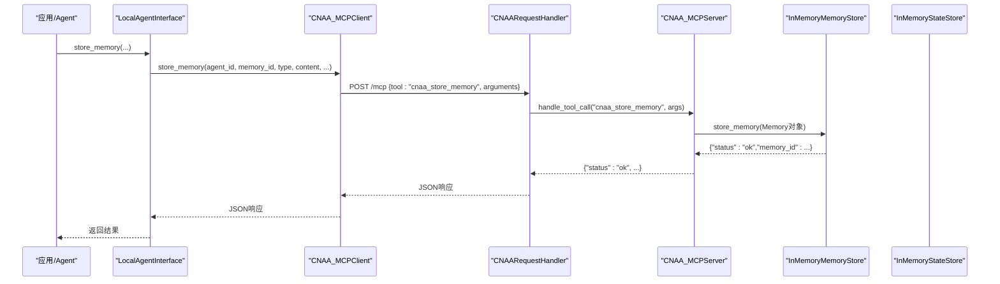
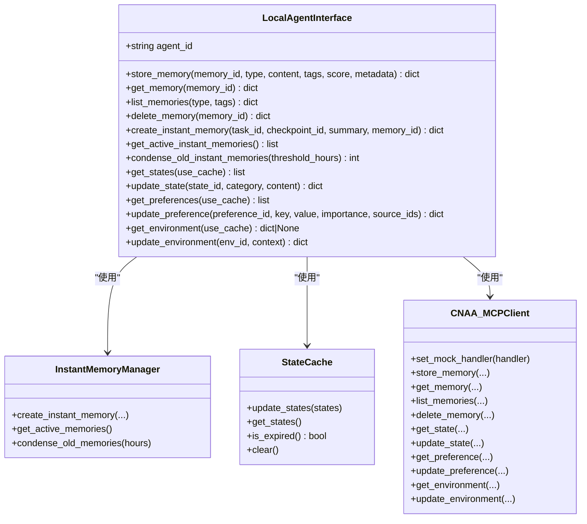
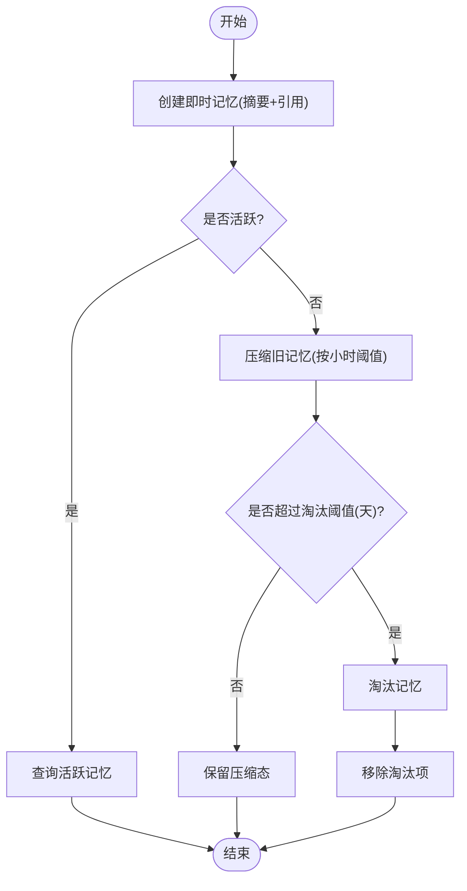
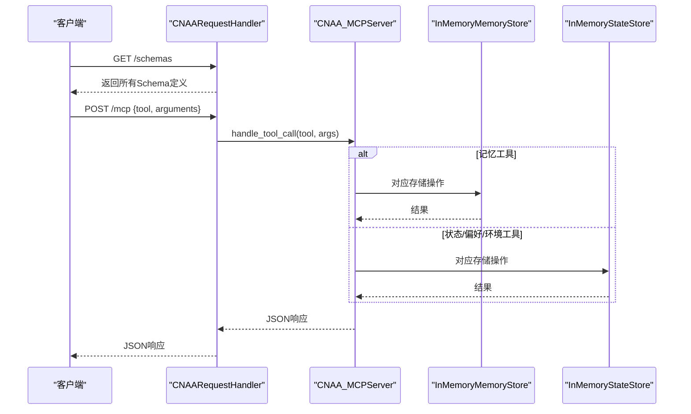
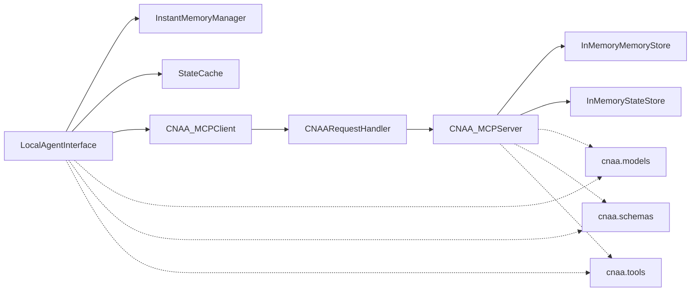

# 本地参考实现

<cite>
**本文引用的文件**   
- [README.md](file://README.md)
- [README_CN.md](file://README_CN.md)
- [pyproject.toml](file://pyproject.toml)
- [server.py](file://server.py)
- [local/agent.py](file://local/agent.py)
- [local/client/mcp_client.py](file://local/client/mcp_client.py)
- [local/memory/instant_memory.py](file://local/memory/instant_memory.py)
- [local/state/state_cache.py](file://local/state/state_cache.py)
- [cnaa/models.py](file://cnaa/models.py)
- [cnaa/schemas.py](file://cnaa/schemas.py)
- [cnaa/tools.py](file://cnaa/tools.py)
- [cnaa/lifecycle.py](file://cnaa/lifecycle.py)
- [cnaa/interaction.py](file://cnaa/interaction.py)
- [cloud/server/mcp_server.py](file://cloud/server/mcp_server.py)
- [cloud/storage/memory_store.py](file://cloud/storage/memory_store.py)
- [cloud/storage/state_store.py](file://cloud/storage/state_store.py)
</cite>

## 目录
1. [简介](#简介)
2. [项目结构](#项目结构)
3. [核心组件](#核心组件)
4. [架构总览](#架构总览)
5. [详细组件分析](#详细组件分析)
6. [依赖关系分析](#依赖关系分析)
7. [性能考量](#性能考量)
8. [故障排查指南](#故障排查指南)
9. [结论](#结论)
10. [附录](#附录)

## 简介
本仓库提供 CNAA（Cloud Native Agentic Architecture）的“经验记忆运行时框架”的参考实现，聚焦于“本地参考实现”。该实现通过“任务点分块 + 即时记忆沉淀 + 云端持久化”的模式，让 Agent 在不修改内部推理逻辑的前提下，实现经验的跨会话持久化、检索与复用。本地侧负责即时记忆管理与状态缓存，并通过 MCP 协议与云端服务交互；云端遵循“哑服务”原则，仅做 JSON 存取与路由。

## 项目结构
本地参考实现主要位于 local 目录，配合 cnaa 层的模型、接口与工具定义，以及 cloud 层的服务器与存储实现，形成清晰的三层正交架构：接口契约层（What）、运行时层（How）、生命周期层（When）。

图表来源 
- [server.py:40-127](file://server.py#L40-L127)
- [cloud/server/mcp_server.py:47-131](file://cloud/server/mcp_server.py#L47-L131)
- [cloud/storage/memory_store.py:14-139](file://cloud/storage/memory_store.py#L14-L139)
- [cloud/storage/state_store.py:13-176](file://cloud/storage/state_store.py#L13-L176)
- [local/agent.py:21-91](file://local/agent.py#L21-L91)
- [local/client/mcp_client.py:19-74](file://local/client/mcp_client.py#L19-L74)
- [local/memory/instant_memory.py:16-57](file://local/memory/instant_memory.py#L16-L57)
- [local/state/state_cache.py:15-56](file://local/state/state_cache.py#L15-L56)
- [cnaa/models.py:69-225](file://cnaa/models.py#L69-L225)
- [cnaa/schemas.py:23-116](file://cnaa/schemas.py#L23-L116)
- [cnaa/tools.py:57-171](file://cnaa/tools.py#L57-L171)

章节来源
- [README.md:52-104](file://README.md#L52-L104)
- [README_CN.md:52-99](file://README_CN.md#L52-L99)
- [pyproject.toml:1-33](file://pyproject.toml#L1-L33)

## 核心组件
- LocalAgentInterface：本地统一入口，聚合即时记忆、状态缓存与 MCP 客户端，对外暴露记忆、状态、偏好与环境等能力。
- InstantMemoryManager：本地即时记忆的生命周期管理（创建、活跃查询、压缩、淘汰、清理）。
- StateCache：对状态、偏好、环境的本地缓存，支持 TTL 过期控制与按类别过滤。
- CNAA_MCPClient：MCP 客户端封装，将本地调用转换为工具名与参数，通过 mock 或真实传输与云端交互。
- CNAARequestHandler / CNAA_MCPServer：云端 HTTP 入口与 MCP 工具路由，遵循“JSON 入、JSON 出”的哑服务原则。
- InMemoryMemoryStore / InMemoryStateStore：内存级存储实现，便于开发与测试。
- cnaa.models / cnaa.schemas / cnaa.tools / cnaa.lifecycle / cnaa.interaction：数据模型、接口 Schema、工具定义、生命周期插件与交互接口规范。

章节来源
- [local/agent.py:21-91](file://local/agent.py#L21-L91)
- [local/memory/instant_memory.py:16-57](file://local/memory/instant_memory.py#L16-L57)
- [local/state/state_cache.py:15-56](file://local/state/state_cache.py#L15-L56)
- [local/client/mcp_client.py:19-74](file://local/client/mcp_client.py#L19-L74)
- [server.py:40-127](file://server.py#L40-L127)
- [cloud/server/mcp_server.py:47-131](file://cloud/server/mcp_server.py#L47-L131)
- [cloud/storage/memory_store.py:14-139](file://cloud/storage/memory_store.py#L14-L139)
- [cloud/storage/state_store.py:13-176](file://cloud/storage/state_store.py#L13-L176)
- [cnaa/models.py:69-225](file://cnaa/models.py#L69-L225)
- [cnaa/schemas.py:23-116](file://cnaa/schemas.py#L23-L116)
- [cnaa/tools.py:57-171](file://cnaa/tools.py#L57-L171)
- [cnaa/lifecycle.py:74-214](file://cnaa/lifecycle.py#L74-L214)
- [cnaa/interaction.py:31-118](file://cnaa/interaction.py#L31-L118)

## 架构总览
本地参考实现采用“本地优先”的策略：即时记忆与状态缓存驻留本地，完整数据在云端持久化。Agent 通过 LocalAgentInterface 发起操作，MCP 客户端将请求转发至云端 MCP Server，由服务端路由到具体存储后端。

图表来源 
- [local/agent.py:94-124](file://local/agent.py#L94-L124)
- [local/client/mcp_client.py:103-138](file://local/client/mcp_client.py#L103-L138)
- [server.py:77-99](file://server.py#L77-L99)
- [cloud/server/mcp_server.py:95-122](file://cloud/server/mcp_server.py#L95-L122)
- [cloud/storage/memory_store.py:25-39](file://cloud/storage/memory_store.py#L25-L39)

## 详细组件分析

### LocalAgentInterface（本地统一入口）
- 职责：聚合即时记忆、状态缓存与 MCP 客户端，统一对外暴露记忆、状态、偏好与环境等操作。
- 关键流程：
  - 记忆写入：委托给 MCP 客户端进行云端持久化。
  - 即时记忆创建：在本地生成摘要并建立与云端的引用指针。
  - 状态读取：优先从本地缓存获取，未命中则拉取云端并回填缓存。
  - 偏好与环境：同样具备缓存与失效策略。
- 复杂度与优化：
  - 读路径使用缓存减少网络往返；写路径直接落盘云端并失效缓存保证一致性。
  - 时间维度上的过期控制（TTL）降低重复请求。

图表来源 
- [local/agent.py:21-91](file://local/agent.py#L21-L91)
- [local/memory/instant_memory.py:16-57](file://local/memory/instant_memory.py#L16-L57)
- [local/state/state_cache.py:15-56](file://local/state/state_cache.py#L15-L56)
- [local/client/mcp_client.py:19-74](file://local/client/mcp_client.py#L19-L74)

章节来源
- [local/agent.py:94-452](file://local/agent.py#L94-L452)

### InstantMemoryManager（即时记忆管理）
- 职责：维护本地即时记忆的创建、查询、压缩与淘汰，确保“小索引 → 大存储”模式。
- 生命周期：active → condensed → evicted，基于时间与状态阈值自动推进。
- 关键方法：
  - create_instant_memory：生成轻量摘要并设置 cnaa_ref 指向云端。
  - condense_old_memories：按小时阈值将旧记忆压缩为指针。
  - evict_old_memories：按天阈值淘汰已压缩的记忆。

图表来源 
- [local/memory/instant_memory.py:58-166](file://local/memory/instant_memory.py#L58-L166)
- [local/memory/instant_memory.py:168-226](file://local/memory/instant_memory.py#L168-L226)

章节来源
- [local/memory/instant_memory.py:16-263](file://local/memory/instant_memory.py#L16-L263)

### StateCache（状态缓存）
- 职责：缓存状态、偏好与环境，减少网络调用，提升读取性能。
- 特性：
  - TTL 过期控制，支持按类别过滤与 ID 查找。
  - 更新后标记更新时间，判断是否过期。
- 典型用法：LocalAgentInterface 在读取状态时先查缓存，未命中再拉取云端并回填。

章节来源
- [local/state/state_cache.py:15-180](file://local/state/state_cache.py#L15-L180)

### CNAA_MCPClient（MCP 客户端）
- 职责：封装 MCP 工具调用，将本地方法映射为工具名与参数，通过 mock 或真实传输与云端交互。
- 关键点：
  - set_mock_handler：用于测试时注入云端处理对象。
  - _call_tool：统一调用入口，生产环境替换为实际 MCP SDK。
  - 工具映射：store_memory、get_memory、list_memories、delete_memory、state/preference/environment 相关工具。

章节来源
- [local/client/mcp_client.py:19-351](file://local/client/mcp_client.py#L19-L351)

### CNAARequestHandler 与 CNAA_MCPServer（云端入口与路由）
- CNAARequestHandler：HTTP 处理器，暴露 /schemas、/health、/mcp 三个端点，解析请求并调用 MCP 服务。
- CNAA_MCPServer：注册所有 MCP 工具处理器，将调用路由到存储后端，遵循“JSON 入、JSON 出”的哑服务原则。
- 错误处理：未知工具、异常捕获与统一错误响应。

图表来源 
- [server.py:52-99](file://server.py#L52-L99)
- [cloud/server/mcp_server.py:95-131](file://cloud/server/mcp_server.py#L95-L131)
- [cloud/storage/memory_store.py:25-39](file://cloud/storage/memory_store.py#L25-L39)
- [cloud/storage/state_store.py:41-53](file://cloud/storage/state_store.py#L41-L53)

章节来源
- [server.py:40-127](file://server.py#L40-L127)
- [cloud/server/mcp_server.py:47-131](file://cloud/server/mcp_server.py#L47-L131)

### 数据模型与接口契约（cnaa.models / cnaa.schemas / cnaa.tools / cnaa.interaction）
- models：定义 Memory、TaskCheckpoint、State、Preference、Environment、InstantMemory、MemorySummary、SearchResult 等核心数据结构。
- schemas：集中管理所有请求/响应/数据 Schema，作为接口契约的唯一真相源。
- tools：定义 13 个 MCP 工具的名称、描述与输入 Schema。
- interaction：抽象 MemoryInterface 与 StateInterface，明确“WHAT”而非“HOW”。

章节来源
- [cnaa/models.py:69-225](file://cnaa/models.py#L69-L225)
- [cnaa/schemas.py:23-116](file://cnaa/schemas.py#L23-L116)
- [cnaa/tools.py:57-171](file://cnaa/tools.py#L57-L171)
- [cnaa/interaction.py:31-118](file://cnaa/interaction.py#L31-L118)

### 生命周期与插件（cnaa.lifecycle）
- 提供 MemoryLifecyclePlugin、RetrievalPlugin、StateEvolutionPlugin 等抽象接口，支持自定义压缩/淘汰/召回/演化策略。
- 默认实现 TimeBasedLifecyclePlugin 与 DefaultStateEvolutionPlugin，基于时间与规则驱动。

章节来源
- [cnaa/lifecycle.py:74-214](file://cnaa/lifecycle.py#L74-L214)
- [cnaa/lifecycle.py:385-430](file://cnaa/lifecycle.py#L385-L430)

## 依赖关系分析
- 本地依赖：
  - LocalAgentInterface 依赖 InstantMemoryManager、StateCache、CNAA_MCPClient。
  - CNAA_MCPClient 依赖云端 MCP 服务（通过 HTTP/MCP 传输）。
- 云端依赖：
  - CNAARequestHandler 依赖 CNAA_MCPServer。
  - CNAA_MCPServer 依赖 InMemoryMemoryStore 与 InMemoryStateStore。
- 契约与模型：
  - 所有模块共享 cnaa.models、cnaa.schemas、cnaa.tools、cnaa.interaction 与 cnaa.lifecycle 的定义。

图表来源 
- [local/agent.py:21-91](file://local/agent.py#L21-L91)
- [local/client/mcp_client.py:19-74](file://local/client/mcp_client.py#L19-L74)
- [server.py:40-127](file://server.py#L40-L127)
- [cloud/server/mcp_server.py:47-131](file://cloud/server/mcp_server.py#L47-L131)
- [cloud/storage/memory_store.py:14-139](file://cloud/storage/memory_store.py#L14-L139)
- [cloud/storage/state_store.py:13-176](file://cloud/storage/state_store.py#L13-L176)
- [cnaa/models.py:69-225](file://cnaa/models.py#L69-L225)
- [cnaa/schemas.py:23-116](file://cnaa/schemas.py#L23-L116)
- [cnaa/tools.py:57-171](file://cnaa/tools.py#L57-L171)

章节来源
- [pyproject.toml:1-33](file://pyproject.toml#L1-L33)

## 性能考量
- 本地优先：即时记忆与状态缓存驻留本地，显著降低网络延迟与带宽消耗。
- 缓存策略：TTL 过期控制避免频繁拉取；写操作后主动失效缓存保证一致性。
- 压缩与淘汰：按时间与状态阈值推进即时记忆生命周期，维持本地上下文轻量化。
- 存储后端：当前为内存实现，适合开发测试；生产可替换为持久化后端（如 SQLite、PostgreSQL、文件系统），需关注 I/O 与并发。

[本节为通用指导，不直接分析具体文件]

## 故障排查指南
- 常见错误：
  - JSON 解析失败：检查请求体是否为合法 JSON。
  - 未知工具：确认 tool_name 是否在工具定义中。
  - 连接问题：MCP 客户端未设置 mock 或未连接真实服务器。
- 定位步骤：
  - 查看日志输出（server.py 中的 logger）。
  - 使用 /health 端点验证服务健康。
  - 使用 /schemas 端点校验接口 Schema。
  - 在本地使用 set_mock_handler 注入云端处理对象进行断点调试。

章节来源
- [server.py:77-99](file://server.py#L77-L99)
- [cloud/server/mcp_server.py:95-122](file://cloud/server/mcp_server.py#L95-L122)
- [local/client/mcp_client.py:67-99](file://local/client/mcp_client.py#L67-L99)

## 结论
本地参考实现以“本地优先”和“哑服务”为核心设计原则，通过即时记忆与状态缓存提升本地访问效率，借助 MCP 协议与云端服务解耦，实现经验的跨会话持久化与复用。该实现具备良好的可扩展性与可定制性，便于后续引入更多存储与检索插件，支撑多 Agent 经验共享与知识演化。

[本节为总结性内容，不直接分析具体文件]

## 附录
- 运行方式：
  - 启动云端服务：python server.py --host 0.0.0.0 --port 8080
  - 本地集成：通过 LocalAgentInterface 初始化并调用相应方法。
- 扩展建议：
  - 替换存储后端：实现 MemoryInterface 与 StateInterface 的持久化版本。
  - 接入检索插件：实现 RetrievalPlugin，支持向量检索、BM25 或混合检索。
  - 自定义生命周期：实现 MemoryLifecyclePlugin 与 StateEvolutionPlugin，调整压缩/淘汰/演化策略。

[本节为补充信息，不直接分析具体文件]