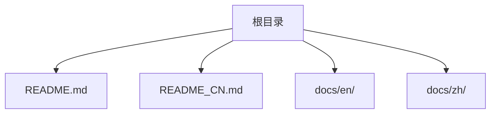
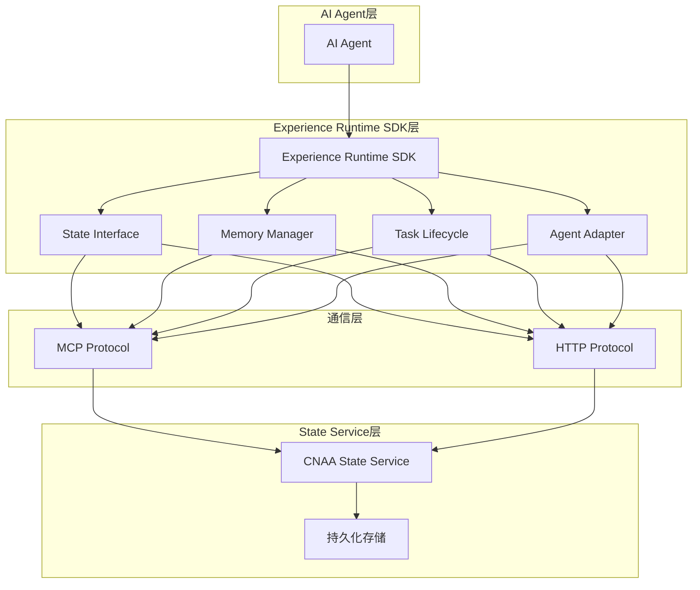
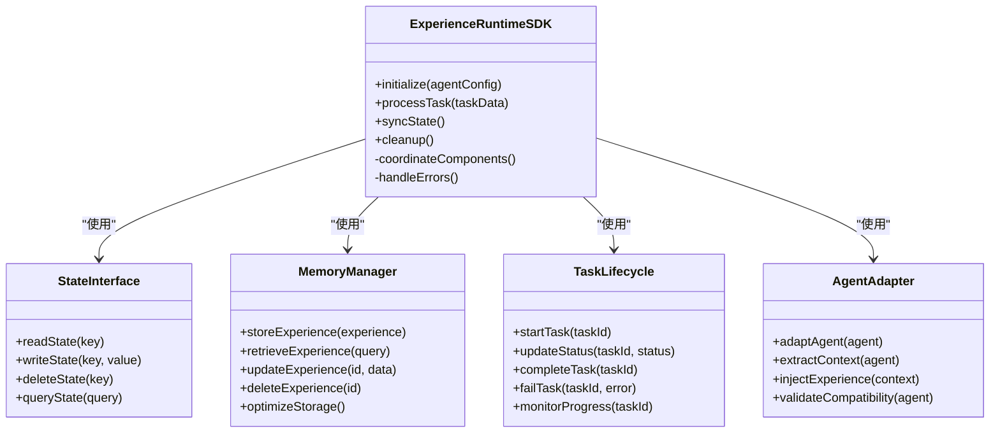
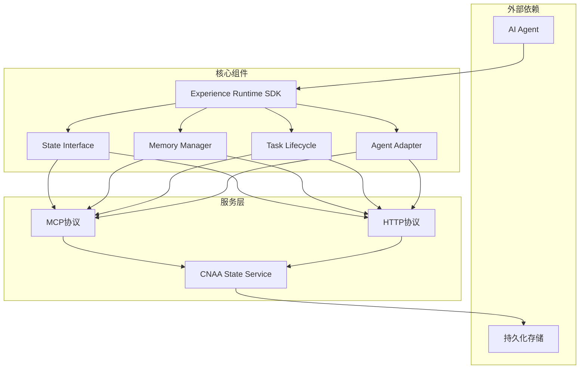
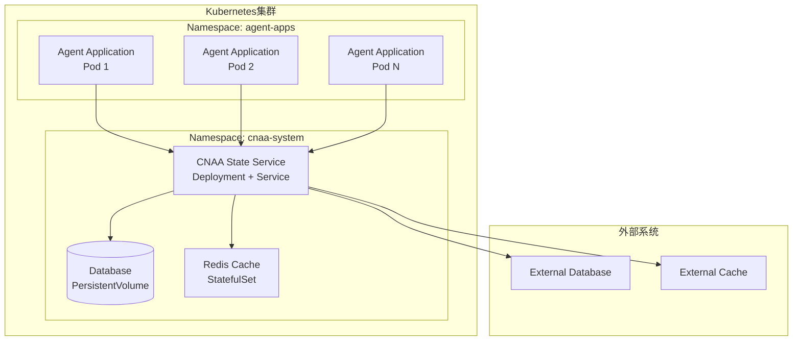

# 架构设计

<cite>
**本文档引用的文件**   
- [README.md](file://README.md)
- [README_CN.md](file://README_CN.md)
</cite>

## 目录
1. [简介](#简介)
2. [项目结构](#项目结构)
3. [核心组件](#核心组件)
4. [架构总览](#架构总览)
5. [详细组件分析](#详细组件分析)
6. [依赖关系分析](#依赖关系分析)
7. [性能与可扩展性](#性能与可扩展性)
8. [部署与云原生支持](#部署与云原生支持)
9. [故障排查指南](#故障排查指南)
10. [结论](#结论)
11. [附录](#附录)

## 简介
CNAA（Cloud Native Agentic Architecture）是一个面向AI Agent的持久化经验运行时框架。它不是Agent框架、工作流引擎或RAG实现，而是提供一套轻量级的Experience Runtime，使任何Agent在不修改内部推理逻辑的前提下，实现经验的沉淀、状态同步与持续记忆。其核心价值在于将“经验”从临时上下文提升为独立运行时资源，并通过统一的状态接口和MCP/HTTP通信协议，与CNAA State Service协同工作，形成可观测、可复用、可共享的经验体系。

## 项目结构
当前仓库包含中英文说明文档与架构概览，核心内容集中在两个README文件中：
- README.md：英文说明，包含架构图、特性、文档索引与路线图
- README_CN.md：中文说明，对应英文内容的本地化版本

**图表来源**
- [README.md:1-102](file://README.md#L1-L102)
- [README_CN.md:1-110](file://README_CN.md#L1-L110)

**章节来源**
- [README.md:1-102](file://README.md#L1-L102)
- [README_CN.md:1-110](file://README_CN.md#L1-L110)

## 核心组件
根据README中提供的架构图，CNAA由以下核心组件构成：
- Experience Runtime SDK：体验运行时SDK，作为Agent与持久化记忆之间的桥梁
- State Interface：统一状态接口，定义标准化的状态操作契约
- Memory Manager：记忆管理器，负责经验的存储、检索与生命周期管理
- Task Lifecycle：任务生命周期管理，跟踪任务的执行状态与经验沉淀时机
- Agent Adapter：Agent适配器，实现不同Agent框架的无缝集成
- CNAA State Service：状态服务，提供分布式状态管理与同步能力

这些组件通过MCP/HTTP协议与State Service进行通信，形成清晰的层次化架构。

**章节来源**
- [README.md:55-72](file://README.md#L55-L72)
- [README_CN.md:63-80](file://README_CN.md#L63-L80)

## 架构总览
CNAA采用分层架构设计，将Agent运行时与持久化记忆解耦，通过标准化接口实现松耦合集成。

**图表来源**
- [README.md:55-72](file://README.md#L55-L72)
- [README_CN.md:63-80](file://README_CN.md#L63-L80)

## 详细组件分析

### Experience Runtime SDK
Experience Runtime SDK是整个架构的核心编排器，负责协调各个子组件的工作流程。它提供统一的API供Agent调用，屏蔽底层复杂性。

主要职责：
- 协调State Interface、Memory Manager、Task Lifecycle和Agent Adapter的协作
- 提供标准化的SDK接口供Agent集成
- 处理错误恢复和重试机制
- 管理组件间的通信协议选择

**图表来源**
- [README.md:55-72](file://README.md#L55-L72)
- [README_CN.md:63-80](file://README_CN.md#L63-L80)

### State Interface
State Interface定义了统一的状态操作契约，确保不同Agent和存储后端的一致性访问。

关键特性：
- 抽象化的状态操作接口
- 支持多种数据类型的序列化/反序列化
- 事务性状态更新保证一致性
- 版本兼容性和向后兼容性

### Memory Manager
Memory Manager专注于经验的存储、检索和优化，是持久化记忆的核心实现。

核心功能：
- 多策略存储后端支持（内存、文件系统、数据库）
- 智能缓存和预取机制
- 压缩和去重优化存储空间
- 增量同步和冲突解决

### Task Lifecycle
Task Lifecycle管理任务的完整生命周期，确保经验在正确的时机被沉淀和同步。

生命周期阶段：
- 初始化：任务准备和资源分配
- 执行：任务运行和状态监控
- 完成：结果处理和经验提取
- 清理：资源释放和状态归档

### Agent Adapter
Agent Adapter实现不同Agent框架的适配层，确保CNAA可以无缝集成各种Agent实现。

适配策略：
- 插件式架构支持新Agent类型扩展
- 自动检测和配置Agent能力
- 标准化输入输出格式转换
- 错误处理和降级策略

**章节来源**
- [README.md:55-72](file://README.md#L55-L72)
- [README_CN.md:63-80](file://README_CN.md#L63-L80)

## 依赖关系分析
CNAA各组件之间存在清晰的依赖关系，体现了良好的模块化设计原则。

**图表来源**
- [README.md:55-72](file://README.md#L55-L72)
- [README_CN.md:63-80](file://README_CN.md#L63-L80)

**章节来源**
- [README.md:55-72](file://README.md#L55-L72)
- [README_CN.md:63-80](file://README_CN.md#L63-L80)

## 性能与可扩展性

### 性能特征
- **低延迟**：通过本地缓存和异步处理减少网络开销
- **高吞吐**：支持批量操作和并行处理
- **弹性伸缩**：无状态设计支持水平扩展
- **资源优化**：智能缓存和内存管理

### 可扩展性设计
- **插件架构**：支持新的Agent类型和存储后端
- **协议抽象**：MCP/HTTP协议的可插拔实现
- **配置驱动**：运行时配置热更新
- **微服务化**：State Service可独立部署和扩展

### 约束条件
- 需要稳定的网络连接用于状态同步
- 存储后端需要具备持久化能力
- 内存使用受限于可用资源
- 网络延迟影响状态同步实时性

## 部署与云原生支持

### 部署拓扑
CNAA支持多种部署模式，适应不同的使用场景：

### Kubernetes容器化部署
- **State Service**：无状态Deployment，支持HPA自动扩缩容
- **存储层**：使用PVC持久化数据，支持多种存储后端
- **缓存层**：Redis集群提供高性能缓存
- **网络**：Service暴露内部API，Ingress暴露外部访问

### 基础设施需求
- **计算资源**：根据Agent数量和并发量规划CPU和内存
- **存储资源**：根据经验数据量和保留策略规划存储空间
- **网络带宽**：确保State Service与Agent间的高带宽连接
- **监控日志**：集成Prometheus和ELK栈进行可观测性

### 云原生特性
- **声明式API**：使用Kubernetes YAML进行资源配置
- **健康检查**：探针确保服务可用性
- **滚动更新**：零停机部署和回滚
- **资源限制**：CPU和内存配额管理
- **安全加固**：RBAC权限控制和网络策略

**章节来源**
- [README.md:51-52](file://README.md#L51-L52)
- [README_CN.md:59](file://README_CN.md#L59)

## 故障排查指南

### 常见问题诊断
1. **连接问题**：检查State Service可达性和网络策略
2. **状态同步失败**：验证MCP/HTTP协议配置和认证
3. **性能问题**：监控内存使用和GC频率
4. **数据不一致**：检查事务日志和冲突解决机制

### 监控指标
- **应用指标**：请求延迟、吞吐量、错误率
- **系统指标**：CPU使用率、内存占用、磁盘IO
- **业务指标**：经验沉淀数量、状态同步成功率

### 日志分析
- **结构化日志**：统一的日志格式和级别
- **链路追踪**：跨服务的请求追踪
- **告警规则**：基于阈值的异常检测

## 结论
CNAA通过清晰的分层架构和标准化的接口设计，成功实现了AI Agent经验持久化的目标。其云原生设计理念确保了系统的可扩展性和可靠性，而MCP/HTTP协议的采用提供了灵活的集成方式。未来可以通过更多的Agent适配器和存储后端支持，进一步丰富生态系统。

## 附录

### 技术选型决策
- **语言选择**：根据性能和生态选择合适的编程语言
- **协议标准**：MCP提供标准化的Agent通信协议
- **存储策略**：多后端支持满足不同场景需求
- **部署模式**：容器化部署便于云环境集成

### 架构权衡
- **一致性 vs 可用性**：最终一致性保证高可用性
- **性能 vs 复杂度**：简化接口降低集成成本
- **灵活性 vs 稳定性**：插件架构平衡扩展性和稳定性

### 扩展点设计
- **Agent适配器接口**：支持新的Agent框架集成
- **存储后端接口**：支持新的存储解决方案
- **协议处理器**：支持新的通信协议
- **中间件链**：支持横切关注点扩展