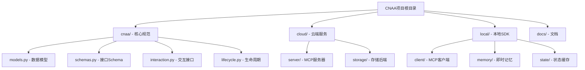
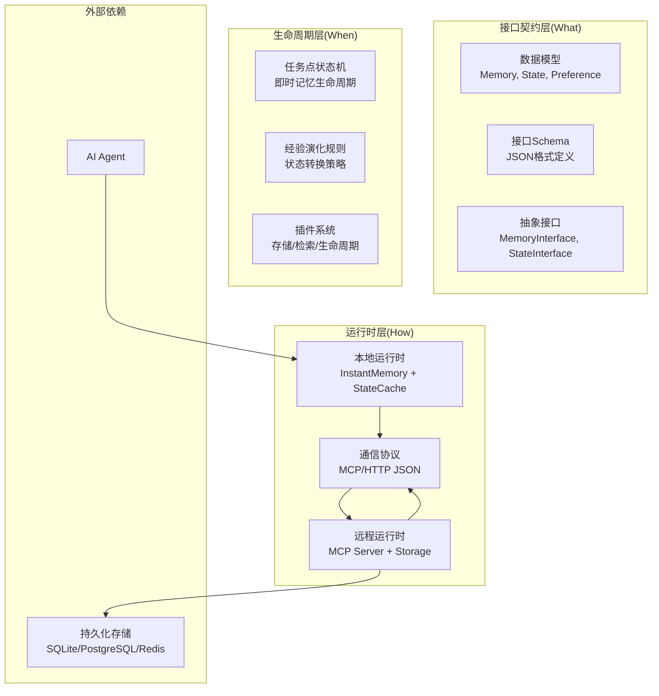
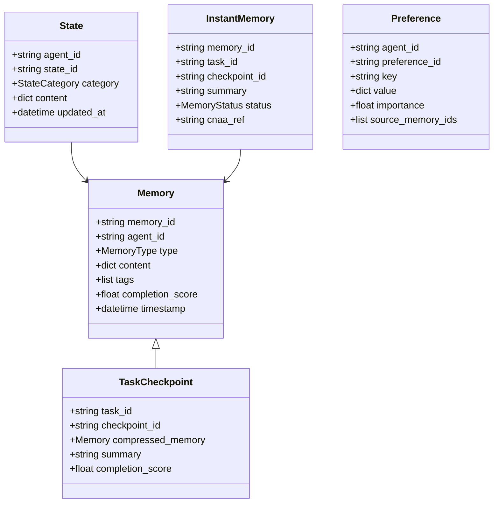
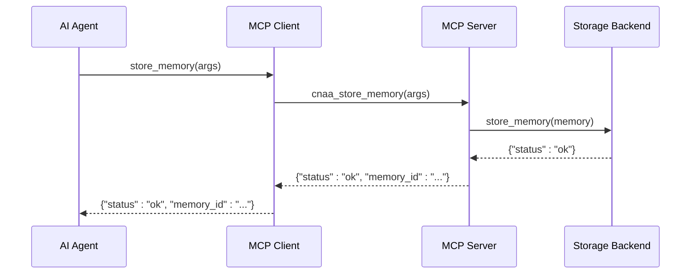
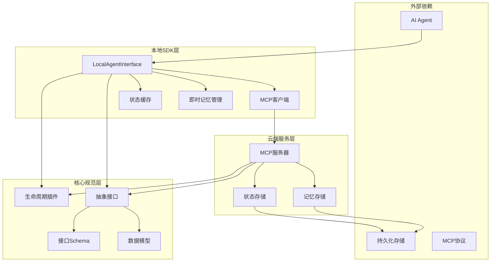
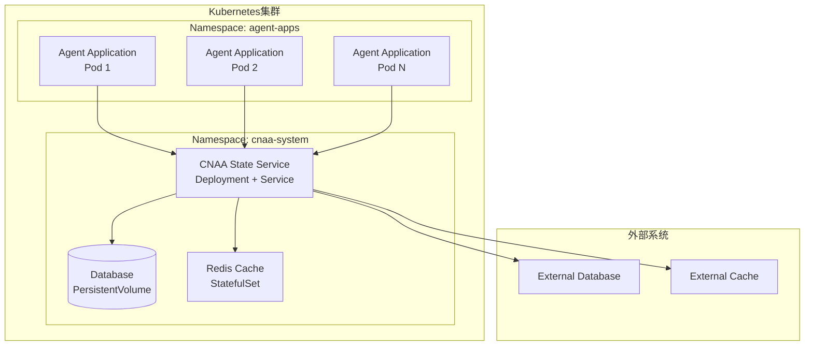

# 架构设计

<cite>
**本文档引用的文件**
- [README.md](file://README.md)
- [README_CN.md](file://README_CN.md)
- [pyproject.toml](file://pyproject.toml)
- [cnaa/__init__.py](file://cnaa/__init__.py)
- [cnaa/models.py](file://cnaa/models.py)
- [cnaa/schemas.py](file://cnaa/schemas.py)
- [cnaa/interaction.py](file://cnaa/interaction.py)
- [cnaa/lifecycle.py](file://cnaa/lifecycle.py)
- [cloud/server/mcp_server.py](file://cloud/server/mcp_server.py)
- [cloud/storage/memory_store.py](file://cloud/storage/memory_store.py)
- [local/agent.py](file://local/agent.py)
- [local/client/mcp_client.py](file://local/client/mcp_client.py)
- [local/memory/instant_memory.py](file://local/memory/instant_memory.py)
</cite>

## 更新摘要
**所做更改**
- 新增完整的架构图与组件设计说明，包括CNAA规范、插件系统、存储抽象等
- 更新了核心数据模型和接口契约的详细分析
- 新增了MCP通信协议的具体实现细节
- 完善了云原生部署支持和Kubernetes容器化方案
- 增强了依赖关系分析和扩展点设计说明

## 目录
1. [简介](#简介)
2. [项目结构](#项目结构)
3. [核心组件](#核心组件)
4. [架构总览](#架构总览)
5. [详细组件分析](#详细组件分析)
6. [依赖关系分析](#依赖关系分析)
7. [性能与可扩展性](#性能与可扩展性)
8. [部署与云原生支持](#部署与云原生支持)
9. [故障排查指南](#故障排查指南)
10. [结论](#结论)
11. [附录](#附录)

## 简介
CNAA（Cloud Native Agentic Architecture）是一个面向AI Agent的持久化经验运行时框架。它不是Agent框架、工作流引擎或RAG实现，而是提供一套轻量级的Experience Runtime，使任何Agent在不修改内部推理逻辑的前提下，实现经验的沉淀、状态同步与持续记忆。其核心价值在于将"经验"从临时上下文提升为独立运行时资源，并通过统一的状态接口和MCP/HTTP通信协议，与CNAA State Service协同工作，形成可观测、可复用、可共享的经验体系。

## 项目结构
当前仓库采用模块化设计，包含核心规范定义、云端服务实现和本地SDK实现：

**图表来源**
- [README.md:1-174](file://README.md#L1-L174)
- [README_CN.md:1-164](file://README_CN.md#L1-L164)

**章节来源**
- [README.md:1-174](file://README.md#L1-L174)
- [README_CN.md:1-164](file://README_CN.md#L1-L164)

## 核心组件
根据最新的代码实现，CNAA由以下核心组件构成：

### 核心规范层 (cnaa/)
- **数据模型**: Memory、State、Preference、Environment、InstantMemory等核心实体
- **接口契约**: MemoryInterface和StateInterface定义标准化操作
- **生命周期管理**: 插件化的内存和状态演化机制
- **Schema定义**: 统一的JSON Schema确保接口一致性

### 云端服务层 (cloud/)
- **MCP服务器**: 基于Model Context Protocol的RESTful API
- **存储抽象**: 支持多种存储后端的插件化设计
- **工具路由**: 13个标准MCP工具的完整实现

### 本地SDK层 (local/)
- **Agent接口**: LocalAgentInterface提供统一集成入口
- **即时记忆**: InstantMemoryManager管理本地短期记忆
- **状态缓存**: StateCache优化频繁访问的数据
- **MCP客户端**: CNAA_MCPClient处理云端通信

**章节来源**
- [cnaa/__init__.py:1-112](file://cnaa/__init__.py#L1-L112)
- [cnaa/models.py:1-225](file://cnaa/models.py#L1-L225)
- [cnaa/interaction.py:1-255](file://cnaa/interaction.py#L1-L255)

## 架构总览
CNAA采用三层正交架构设计，每层回答不同维度的问题且可独立修改：

**图表来源**
- [README.md:52-96](file://README.md#L52-L96)
- [README_CN.md:52-91](file://README_CN.md#L52-L91)

## 详细组件分析

### 数据模型层 (cnaa/models.py)
定义了CNAA的核心数据结构，包括：

**图表来源**
- [cnaa/models.py:69-225](file://cnaa/models.py#L69-L225)

### 接口契约层 (cnaa/interaction.py)
定义了标准化的操作接口：

**MemoryInterface** - 记忆操作契约：
- `store_memory()`: 存储记忆（长期/短期）
- `get_memory()`: 按ID获取记忆
- `list_memories()`: 列出记忆并支持过滤
- `tag_short_term()`: 标记短期记忆
- `delete_memory()`: 删除记忆

**StateInterface** - 状态操作契约：
- `get_state()/update_state()/delete_state()`: 知识状态管理
- `get_preference()/update_preference()/delete_preference()`: 偏好管理
- `get_environment()/update_environment()`: 环境上下文管理

**章节来源**
- [cnaa/interaction.py:31-255](file://cnaa/interaction.py#L31-L255)

### MCP通信协议 (cloud/server/mcp_server.py)
实现了完整的MCP服务器，支持13个标准工具：

**图表来源**
- [cloud/server/mcp_server.py:95-123](file://cloud/server/mcp_server.py#L95-L123)

### 本地Agent接口 (local/agent.py)
提供统一的Agent集成入口：

**主要功能**：
- 记忆操作：`store_memory()`, `get_memory()`, `list_memories()`
- 即时记忆：`create_instant_memory()`, `get_active_instant_memories()`
- 状态管理：`get_states()`, `update_state()`, `get_preferences()`
- 环境上下文：`get_environment()`, `update_environment()`

**缓存策略**：
- 状态缓存：可配置的TTL缓存机制
- 即时记忆：本地短期记忆管理
- 自动失效：过期数据的自动清理

**章节来源**
- [local/agent.py:21-452](file://local/agent.py#L21-L452)

### 即时记忆管理 (local/memory/instant_memory.py)
管理Agent本地的短期记忆：

**生命周期状态**：
- `ACTIVE`: 活跃状态，完整摘要可用
- `CONDENSED`: 已压缩，仅保留索引指针
- `EVICTED`: 已驱逐，从本地移除

**核心操作**：
- 创建即时记忆：`create_instant_memory()`
- 记忆压缩：`condense_old_memories()`
- 记忆驱逐：`evict_old_memories()`
- 清理回收：`remove_evicted_memories()`

**章节来源**
- [local/memory/instant_memory.py:16-263](file://local/memory/instant_memory.py#L16-L263)

### 插件系统 (cnaa/lifecycle.py)
提供了高度可扩展的插件架构：

**MemoryLifecyclePlugin** - 内存生命周期插件：
- 时间基策略：`TimeBasedLifecyclePlugin`
- 使用频率策略：基于访问频率的决策
- 重要性策略：基于重要性的优先级

**RetrievalPlugin** - 检索插件：
- 向量检索：`VectorRetrievalPlugin`
- 全文检索：`BM25RetrievalPlugin`
- 混合检索：`HybridRetrievalPlugin`

**StateEvolutionPlugin** - 状态演化插件：
- 频率演化：基于使用频率的演化
- 相关性演化：基于使用相关性的演化
- 图结构演化：基于知识图谱关系的演化

**章节来源**
- [cnaa/lifecycle.py:74-478](file://cnaa/lifecycle.py#L74-L478)

## 依赖关系分析
CNAA各组件之间存在清晰的依赖关系，体现了良好的模块化设计原则：

**图表来源**
- [cnaa/__init__.py:1-112](file://cnaa/__init__.py#L1-L112)
- [cloud/server/mcp_server.py:1-299](file://cloud/server/mcp_server.py#L1-L299)
- [local/agent.py:1-452](file://local/agent.py#L1-L452)

**章节来源**
- [pyproject.toml:1-33](file://pyproject.toml#L1-L33)

## 性能与可扩展性

### 性能特征
- **低延迟**：通过本地缓存和异步处理减少网络开销
- **高吞吐**：支持批量操作和并行处理
- **弹性伸缩**：无状态设计支持水平扩展
- **资源优化**：智能缓存和内存管理

### 可扩展性设计
- **插件架构**：支持新的Agent类型和存储后端
- **协议抽象**：MCP/HTTP协议的可插拔实现
- **配置驱动**：运行时配置热更新
- **微服务化**：State Service可独立部署和扩展

### 约束条件
- 需要稳定的网络连接用于状态同步
- 存储后端需要具备持久化能力
- 内存使用受限于可用资源
- 网络延迟影响状态同步实时性

## 部署与云原生支持

### 部署拓扑
CNAA支持多种部署模式，适应不同的使用场景：

### Kubernetes容器化部署
- **State Service**：无状态Deployment，支持HPA自动扩缩容
- **存储层**：使用PVC持久化数据，支持多种存储后端
- **缓存层**：Redis集群提供高性能缓存
- **网络**：Service暴露内部API，Ingress暴露外部访问

### 基础设施需求
- **计算资源**：根据Agent数量和并发量规划CPU和内存
- **存储资源**：根据经验数据量和保留策略规划存储空间
- **网络带宽**：确保State Service与Agent间的高带宽连接
- **监控日志**：集成Prometheus和ELK栈进行可观测性

### 云原生特性
- **声明式API**：使用Kubernetes YAML进行资源配置
- **健康检查**：探针确保服务可用性
- **滚动更新**：零停机部署和回滚
- **资源限制**：CPU和内存配额管理
- **安全加固**：RBAC权限控制和网络策略

**章节来源**
- [README.md:129-154](file://README.md#L129-L154)
- [README_CN.md:122-144](file://README_CN.md#L122-L144)

## 故障排查指南

### 常见问题诊断
1. **连接问题**：检查State Service可达性和网络策略
2. **状态同步失败**：验证MCP/HTTP协议配置和认证
3. **性能问题**：监控内存使用和GC频率
4. **数据不一致**：检查事务日志和冲突解决机制

### 监控指标
- **应用指标**：请求延迟、吞吐量、错误率
- **系统指标**：CPU使用率、内存占用、磁盘IO
- **业务指标**：经验沉淀数量、状态同步成功率

### 日志分析
- **结构化日志**：统一的日志格式和级别
- **链路追踪**：跨服务的请求追踪
- **告警规则**：基于阈值的异常检测

## 结论
CNAA通过清晰的分层架构和标准化的接口设计，成功实现了AI Agent经验持久化的目标。其云原生设计理念确保了系统的可扩展性和可靠性，而MCP/HTTP协议的采用提供了灵活的集成方式。未来可以通过更多的Agent适配器和存储后端支持，进一步丰富生态系统。

## 附录

### 技术选型决策
- **语言选择**：Python 3.11+，平衡性能和生态
- **协议标准**：MCP提供标准化的Agent通信协议
- **存储策略**：多后端支持满足不同场景需求
- **部署模式**：容器化部署便于云环境集成

### 架构权衡
- **一致性 vs 可用性**：最终一致性保证高可用性
- **性能 vs 复杂度**：简化接口降低集成成本
- **灵活性 vs 稳定性**：插件架构平衡扩展性和稳定性

### 扩展点设计
- **Agent适配器接口**：支持新的Agent框架集成
- **存储后端接口**：支持新的存储解决方案
- **协议处理器**：支持新的通信协议
- **中间件链**：支持横切关注点扩展

### 版本路线图
- **v0.1**：架构规范、接口契约、MCP工具定义
- **v0.2**：检索插件、即时记忆策略、多种存储后端
- **v0.3**：多Agent经验共享、经验关联与演化、云端部署方案

**章节来源**
- [README.md:129-154](file://README.md#L129-L154)
- [README_CN.md:122-144](file://README_CN.md#L122-L144)
- [pyproject.toml:1-33](file://pyproject.toml#L1-L33)