# Agent Adapter

<cite>
**本文档引用的文件**   
- [README.md](file://README.md)
- [README_CN.md](file://README_CN.md)
</cite>

## 目录
1. [简介](#简介)
2. [项目结构](#项目结构)
3. [核心组件](#核心组件)
4. [架构总览](#架构总览)
5. [详细组件分析](#详细组件分析)
6. [依赖关系分析](#依赖关系分析)
7. [性能考虑](#性能考虑)
8. [故障排查指南](#故障排查指南)
9. [结论](#结论)
10. [附录](#附录)

## 简介
本文件围绕 CNAA（Cloud Native Agentic Architecture）中的“Agent Adapter（Agent 适配器）”进行系统化文档化。CNAA 定位为面向 AI Agent 的持久化经验运行时框架，强调在不侵入 Agent 推理逻辑的前提下，提供统一的经验沉淀、状态同步与记忆能力。根据仓库提供的架构图，Experience Runtime SDK 内部包含“Agent Adapter”，并通过 MCP/HTTP 等协议与“CNAA State Service”交互。

由于当前仓库仅包含 README 与空文档目录，未包含具体代码实现，本文基于仓库已披露的架构信息进行设计级说明，并给出适配层的设计原则、接口约定、事件模型、通信协议适配、注册发现与生命周期管理、插件化扩展、测试策略、性能优化与故障隔离等实践建议。所有涉及具体实现细节的内容均以概念性方案呈现，避免对不存在代码的臆测。

**章节来源**
- [README.md:55-86](file://README.md#L55-L86)
- [README_CN.md:63-94](file://README_CN.md#L63-L94)

## 项目结构
当前仓库为概念与文档占位阶段，核心信息集中在 README 中。仓库结构如下：
- docs/en：英文文档目录（当前为空）
- docs/zh：中文文档目录（当前为空）
- README.md / README_CN.md：项目概述、特性、架构与路线图

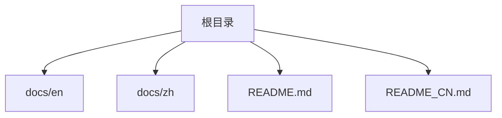

**图表来源**
- [README.md:1-102](file://README.md#L1-L102)
- [README_CN.md:1-110](file://README_CN.md#L1-L110)

**章节来源**
- [README.md:1-102](file://README.md#L1-L102)
- [README_CN.md:1-110](file://README_CN.md#L1-L110)

## 核心组件
根据架构图，Experience Runtime SDK 由以下子模块组成：
- 状态接口（State Interface）
- 记忆管理器（Memory Manager）
- 任务生命周期（Task Lifecycle）
- Agent 适配器（Agent Adapter）

其中，“Agent Adapter”负责将不同 Agent 的能力与 CNAA 的状态服务进行解耦对接，屏蔽底层差异，统一暴露给上层运行时使用。

**章节来源**
- [README.md:55-86](file://README.md#L55-L86)
- [README_CN.md:63-94](file://README_CN.md#L63-L94)

## 架构总览
下图展示了 Agent Adapter 在整体架构中的位置与职责边界：
- 上层：AI Agent（任意类型）
- 中间层：Experience Runtime SDK（含 Agent Adapter）
- 传输层：MCP / HTTP
- 后端：CNAA State Service

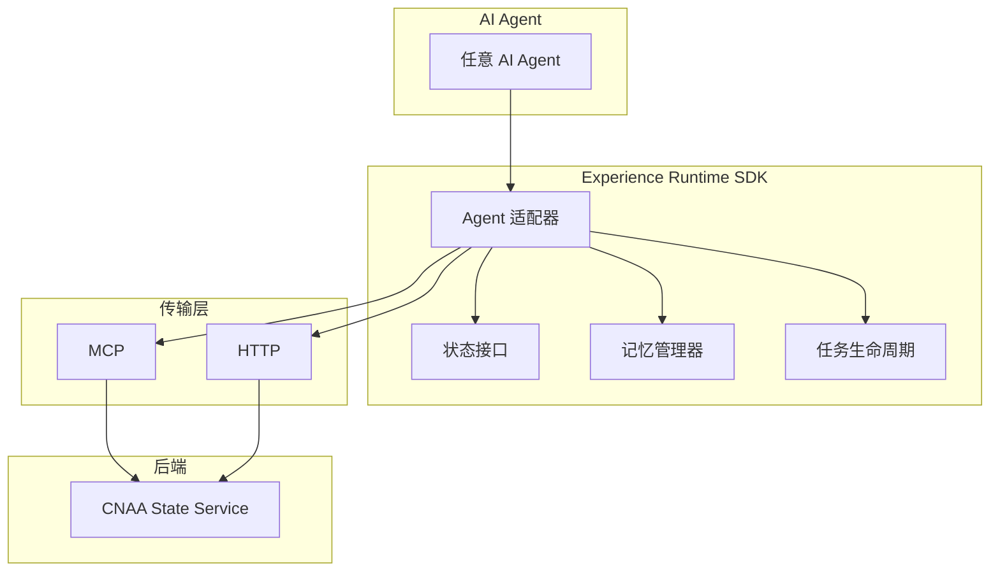

**图表来源**
- [README.md:55-86](file://README.md#L55-L86)
- [README_CN.md:63-94](file://README_CN.md#L63-L94)

## 详细组件分析

### 适配器模式与 Agent Adapter 设计原理
- 设计目标
  - 将不同 Agent 的差异（调用方式、事件模型、错误语义）抽象为统一接口，使 Experience Runtime 无需感知具体 Agent 实现。
  - 通过适配器桥接 MCP/HTTP 等协议，向上提供一致的状态读写与事件订阅能力。
- 关键职责
  - 统一 Agent 能力封装：初始化、连接、会话管理、状态读写、事件监听。
  - 协议适配：将底层 MCP/HTTP 请求转换为 SDK 内部统一的数据结构与错误码。
  - 生命周期管理：注册、发现、启动、健康检查、优雅关闭。
  - 插件化扩展：支持以插件形式新增 Agent 类型或协议实现。

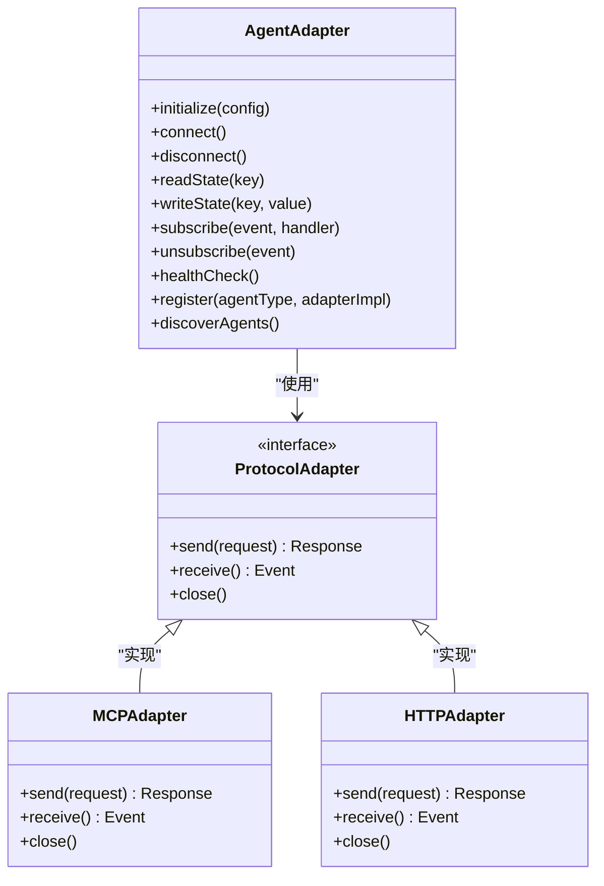

**图表来源**
- [README.md:55-86](file://README.md#L55-L86)
- [README_CN.md:63-94](file://README_CN.md#L63-L94)

**章节来源**
- [README.md:55-86](file://README.md#L55-L86)
- [README_CN.md:63-94](file://README_CN.md#L63-L94)

### 不同 Agent 类型的适配接口
- 统一接口要点
  - 初始化参数：包括 Agent 类型、连接信息、超时、重试策略等。
  - 连接与会话：建立连接、维持心跳、异常重连。
  - 状态操作：读/写/批量更新/事务（可选）。
  - 事件模型：订阅/取消订阅、事件过滤、去抖与合并。
  - 健康检查：探测存活、指标上报、降级策略。
- 典型 Agent 类型示例（概念）
  - 对话型 Agent：侧重消息流式处理与上下文维护。
  - 工具调用型 Agent：侧重函数签名映射与参数校验。
  - 多模态 Agent：侧重资源引用与异步回调。

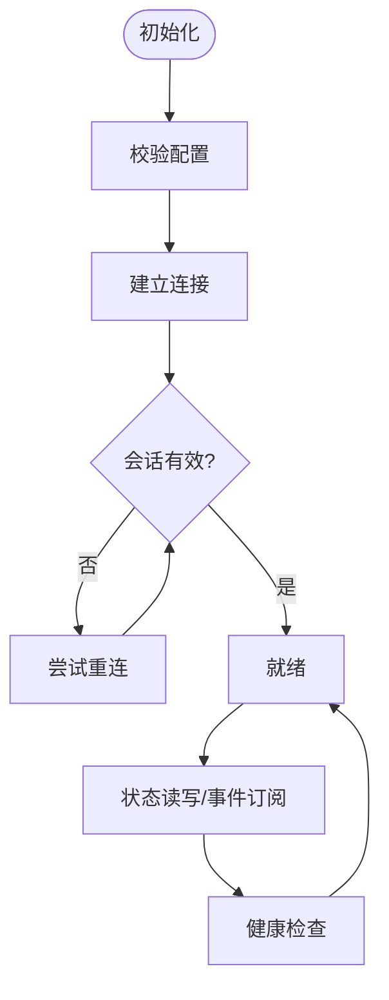

**图表来源**
- [README.md:55-86](file://README.md#L55-L86)
- [README_CN.md:63-94](file://README_CN.md#L63-L94)

**章节来源**
- [README.md:55-86](file://README.md#L55-L86)
- [README_CN.md:63-94](file://README_CN.md#L63-L94)

### 事件监听与处理逻辑
- 事件模型
  - 事件源：Agent 运行过程中产生的状态变更、工具调用结果、错误告警等。
  - 事件通道：基于内存队列或消息总线，保证顺序性与幂等性。
  - 处理器：可插拔的事件处理链，支持过滤、转换、聚合与落盘。
- 处理流程
  - 订阅：指定事件类型与过滤器。
  - 消费：按序拉取/推送，失败重试与死信队列。
  - 确认：成功确认后清理，确保至少一次语义。

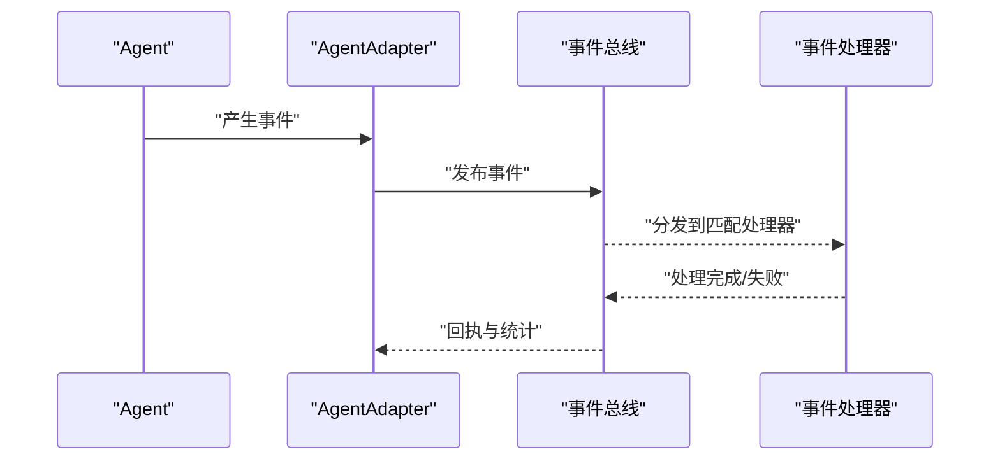

**图表来源**
- [README.md:55-86](file://README.md#L55-L86)
- [README_CN.md:63-94](file://README_CN.md#L63-L94)

**章节来源**
- [README.md:55-86](file://README.md#L55-L86)
- [README_CN.md:63-94](file://README_CN.md#L63-L94)

### 通信协议的适配层设计（MCP、HTTP 与自定义协议）
- 协议抽象
  - 定义统一的发送/接收/关闭接口，屏蔽具体协议差异。
  - 请求/响应与事件流均映射为 SDK 内部标准数据结构。
- MCP 适配
  - 用于结构化消息传递与工具调用，适合强类型交互场景。
- HTTP 适配
  - 通用 REST/JSON 或 gRPC 风格，便于快速集成现有服务。
- 自定义协议
  - 通过实现协议接口接入，如 WebSocket、MQTT、gRPC-Web 等。

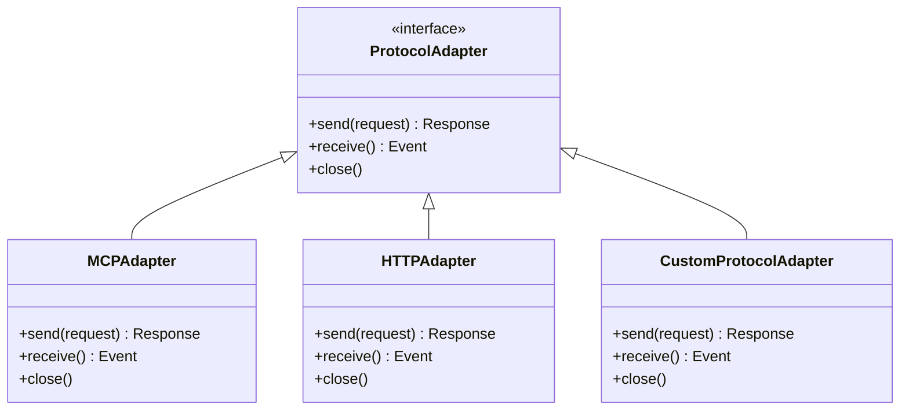

**图表来源**
- [README.md:55-86](file://README.md#L55-L86)
- [README_CN.md:63-94](file://README_CN.md#L63-L94)

**章节来源**
- [README.md:55-86](file://README.md#L55-L86)
- [README_CN.md:63-94](file://README_CN.md#L63-L94)

### Agent 注册、发现与生命周期管理
- 注册机制
  - 静态注册：启动时加载已知 Agent 类型与适配器实现。
  - 动态注册：运行时通过插件 API 注册新类型。
- 发现机制
  - 本地注册表：内存字典维护类型到实现的映射。
  - 远程发现：与服务端元数据服务交互获取可用 Agent 列表。
- 生命周期
  - 初始化：参数校验、依赖注入、连接池准备。
  - 启动：建立连接、预热缓存、订阅事件。
  - 运行：健康检查、指标采集、限流与熔断。
  - 关闭：优雅退出、资源释放、状态持久化。

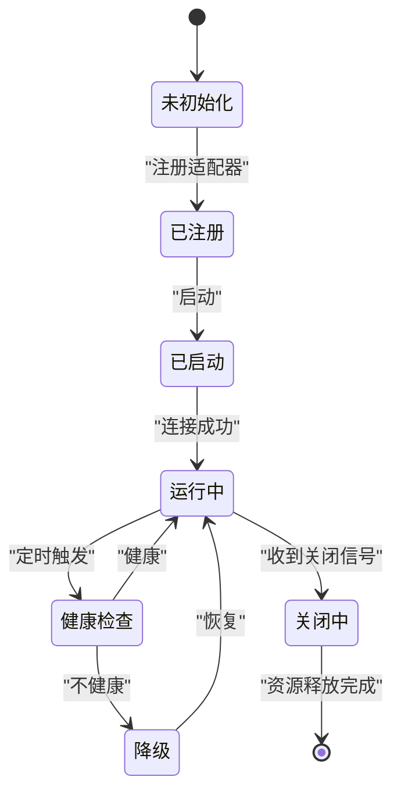

**图表来源**
- [README.md:55-86](file://README.md#L55-L86)
- [README_CN.md:63-94](file://README_CN.md#L63-L94)

**章节来源**
- [README.md:55-86](file://README.md#L55-L86)
- [README_CN.md:63-94](file://README_CN.md#L63-L94)

### 插件化架构与自定义适配器开发指南
- 插件规范
  - 提供统一的插件描述元数据（名称、版本、依赖、能力声明）。
  - 遵循 SDK 暴露的扩展点（适配器接口、事件处理器、状态转换器）。
- 开发步骤
  - 实现协议适配器或 Agent 适配器接口。
  - 编写配置解析器与校验器。
  - 注册到插件管理器，支持热加载。
  - 提供单元测试与集成测试用例。
- 最佳实践
  - 最小权限原则：仅暴露必要能力。
  - 错误隔离：插件崩溃不影响主进程。
  - 可观测性：埋点日志、指标与追踪。

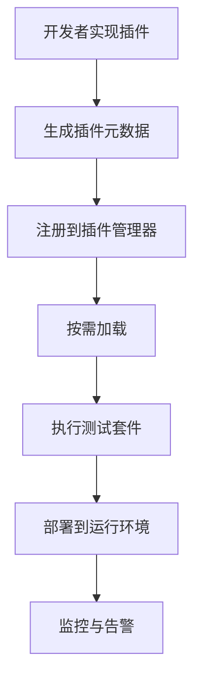

**图表来源**
- [README.md:55-86](file://README.md#L55-L86)
- [README_CN.md:63-94](file://README_CN.md#L63-L94)

**章节来源**
- [README.md:55-86](file://README.md#L55-L86)
- [README_CN.md:63-94](file://README_CN.md#L63-L94)

### 适配器测试策略
- 单元测试
  - 针对适配器方法的行为验证，模拟协议层返回。
  - 覆盖正常路径、异常路径与边界条件。
- 集成测试
  - 与真实或 Mock 的 MCP/HTTP 服务联调。
  - 验证端到端的状态读写与事件流转。
- 稳定性测试
  - 压力测试：高并发下的吞吐与延迟。
  - 故障注入：网络抖动、服务不可用、超时与重试。
- 回归测试
  - 版本升级后确保兼容性。

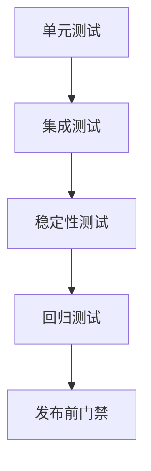

**图表来源**
- [README.md:55-86](file://README.md#L55-L86)
- [README_CN.md:63-94](file://README_CN.md#L63-L94)

**章节来源**
- [README.md:55-86](file://README.md#L55-L86)
- [README_CN.md:63-94](file://README_CN.md#L63-L94)

### 性能优化与故障隔离机制
- 性能优化
  - 连接复用与连接池：减少握手开销。
  - 批处理与合并：批量写入与事件聚合。
  - 缓存策略：热点状态本地缓存与失效策略。
  - 异步化：非阻塞 I/O 与背压控制。
- 故障隔离
  - 熔断与降级：保护下游服务，快速失败。
  - 超时与重试：合理退避与幂等保障。
  - 资源限制：线程池、内存上限与配额。
  - 隔离域：按 Agent 类型或租户隔离运行环境。

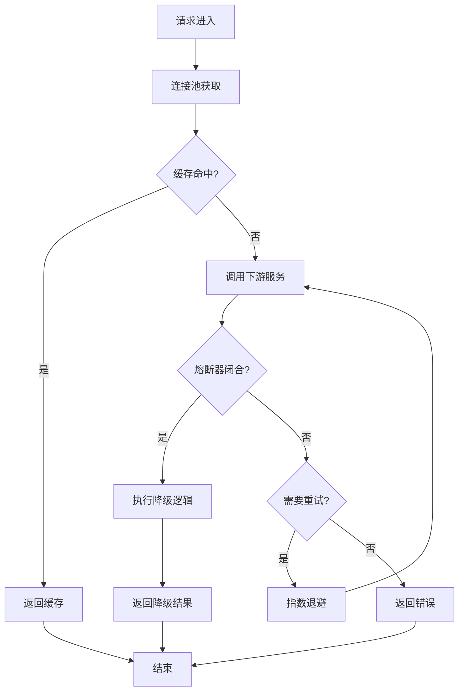

**图表来源**
- [README.md:55-86](file://README.md#L55-L86)
- [README_CN.md:63-94](file://README_CN.md#L63-L94)

**章节来源**
- [README.md:55-86](file://README.md#L55-L86)
- [README_CN.md:63-94](file://README_CN.md#L63-L94)

### 具体 Adapter 实现示例与集成最佳实践
- 示例一：HTTP 适配器
  - 适用场景：与现有 REST API 集成。
  - 关键点：URL 模板、参数映射、错误码转换、重试策略。
- 示例二：MCP 适配器
  - 适用场景：结构化工具调用与强类型交互。
  - 关键点：Schema 校验、序列化/反序列化、流式响应。
- 示例三：自定义协议适配器
  - 适用场景：私有协议或高性能场景。
  - 关键点：二进制编解码、零拷贝、内存池。
- 集成最佳实践
  - 配置外置：环境变量或配置文件集中管理。
  - 安全加固：鉴权、加密与审计。
  - 可观测性：日志、指标、链路追踪。
  - 灰度发布：逐步放量与回滚策略。

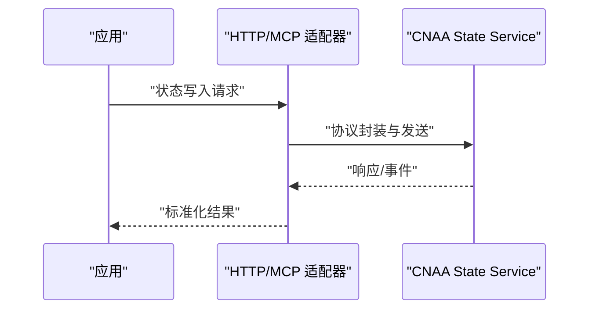

**图表来源**
- [README.md:55-86](file://README.md#L55-L86)
- [README_CN.md:63-94](file://README_CN.md#L63-L94)

**章节来源**
- [README.md:55-86](file://README.md#L55-L86)
- [README_CN.md:63-94](file://README_CN.md#L63-L94)

## 依赖关系分析
- 组件耦合
  - Agent Adapter 依赖协议适配器（MCP/HTTP/自定义），与状态接口、记忆管理器、任务生命周期松耦合。
- 外部依赖
  - 网络库、序列化库、日志与指标库。
- 潜在循环依赖
  - 通过接口抽象与依赖注入避免循环。
- 接口契约
  - 协议适配器与事件模型的稳定契约是扩展性的关键。

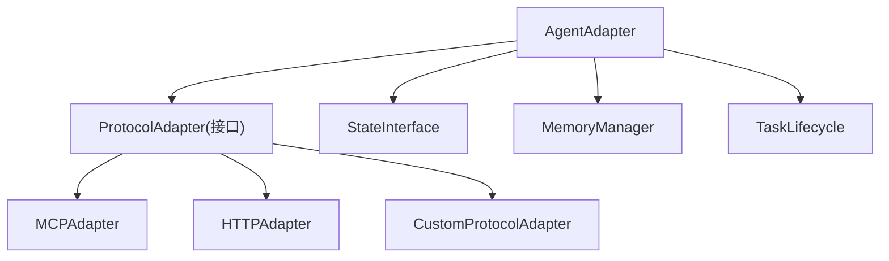

**图表来源**
- [README.md:55-86](file://README.md#L55-L86)
- [README_CN.md:63-94](file://README_CN.md#L63-L94)

**章节来源**
- [README.md:55-86](file://README.md#L55-L86)
- [README_CN.md:63-94](file://README_CN.md#L63-L94)

## 性能考虑
- 连接与并发
  - 连接池大小与并发度需根据下游服务容量调优。
- 序列化与编解码
  - 选择高效序列化格式，避免频繁 GC。
- 缓存与一致性
  - 热点数据缓存，结合失效策略与版本号保证一致性。
- 背压与限流
  - 防止上游过载，保障系统稳定性。

[本节为通用指导，不涉及具体文件分析]

## 故障排查指南
- 常见问题
  - 连接失败：检查网络、认证、端口与防火墙。
  - 超时与重试：调整超时阈值与重试次数，关注幂等性。
  - 事件丢失：检查事件总线与消费者消费能力。
  - 内存泄漏：定位未释放的资源与长生命周期对象。
- 诊断手段
  - 启用详细日志与链路追踪。
  - 收集指标：QPS、延迟、错误率、资源使用。
  - 故障注入演练：验证容错与恢复能力。

[本节为通用指导，不涉及具体文件分析]

## 结论
Agent Adapter 作为 CNAA Experience Runtime SDK 的关键组件，承担了对不同 Agent 类型与通信协议的统一适配职责。通过清晰的接口抽象、插件化扩展机制与完善的测试与运维体系，能够在不侵入 Agent 推理逻辑的前提下，实现稳定的经验沉淀与状态同步。随着后续代码与文档的完善，可进一步细化实现细节与最佳实践。

[本节为总结性内容，不涉及具体文件分析]

## 附录
- 术语表
  - Agent：执行任务的智能体。
  - 适配器：将不同接口统一为一致接口的模式。
  - 协议：通信规则与数据格式。
  - 事件：运行时产生的状态变更或通知。
- 参考链接
  - 快速开始、持久化记忆、状态接口、运行时 SDK、状态服务、MCP 接入、Agent 接入、整体架构等文档可在 README 中查阅。

[本节为补充信息，不涉及具体文件分析]