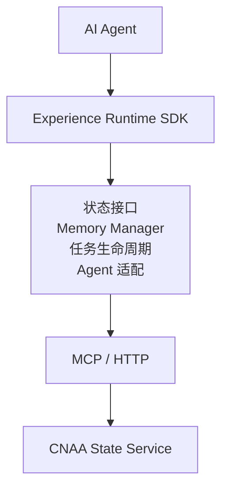
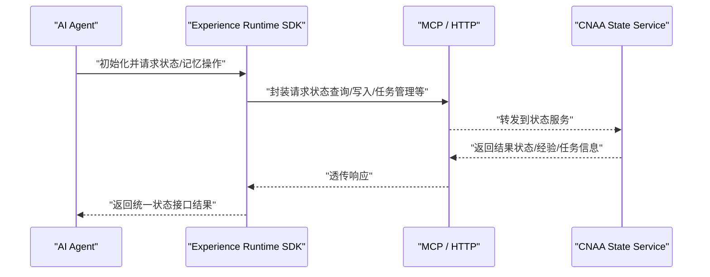
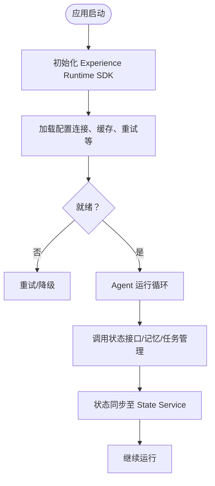
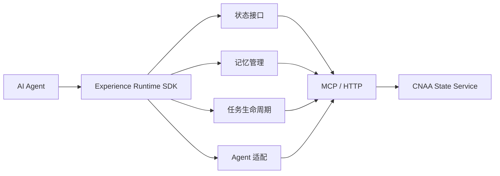

# Experience Runtime SDK

<cite>
**本文引用的文件**   
- [README.md](file://README.md)
- [README_CN.md](file://README_CN.md)
</cite>

## 目录
1. [简介](#简介)
2. [项目结构](#项目结构)
3. [核心组件](#核心组件)
4. [架构总览](#架构总览)
5. [详细组件分析](#详细组件分析)
6. [依赖关系分析](#依赖关系分析)
7. [性能考虑](#性能考虑)
8. [故障排查指南](#故障排查指南)
9. [结论](#结论)
10. [附录](#附录)

## 简介
本仓库为 CNAA（Cloud Native Agentic Architecture）的文档与说明，聚焦于“Experience Runtime SDK”的定位、能力与集成方式。CNAA 并非 Agent 框架、工作流引擎或 RAG 实现，而是提供一套轻量级的经验运行时，使任意 AI Agent 在不修改内部推理逻辑的前提下，持续沉淀、同步与复用任务经验，将经验从临时提示上下文提升为独立运行时资源。

## 项目结构
当前仓库以文档为主，包含中英文 README 与指向各专题文档的链接（如快速开始、持久化记忆、状态接口、Experience Runtime SDK、State Service、MCP 接入、Agent 接入、整体架构等）。SDK 的具体实现代码未在本仓库中提供，本文档基于现有说明进行体系化梳理与指导。

图表来源 
- [README.md:55-72](file://README.md#L55-L72)
- [README_CN.md:63-80](file://README_CN.md#L63-L80)

章节来源
- [README.md:1-102](file://README.md#L1-L102)
- [README_CN.md:1-110](file://README_CN.md#L1-L110)

## 核心组件
根据仓库提供的架构图与特性描述，Experience Runtime SDK 的核心职责包括：
- 状态接口：统一对外暴露的状态访问与变更能力
- 记忆管理：经验的持久化、检索与更新
- 任务生命周期：任务的创建、推进、完成与清理
- Agent 适配：与不同 Agent 框架的桥接与集成

这些组件共同支撑“无需修改推理过程”的经验沉淀与同步目标。

章节来源
- [README.md:45-72](file://README.md#L45-L72)
- [README_CN.md:53-80](file://README_CN.md#L53-L80)

## 架构总览
下图展示了 Agent、Experience Runtime SDK 与 CNAA State Service 之间的交互关系，以及通过 MCP/HTTP 协议进行的通信路径。

图表来源 
- [README.md:55-72](file://README.md#L55-L72)
- [README_CN.md:63-80](file://README_CN.md#L63-L80)

## 详细组件分析

### 状态接口（State Interface）
- 职责：为上层 Agent 提供一致的状态读写与查询能力，屏蔽底层存储与网络细节
- 设计要点：
  - 抽象出统一的读/写/查询方法，便于替换后端实现
  - 支持幂等与一致性语义，确保跨进程/跨实例的状态一致性
  - 错误码与异常映射，便于上层处理

章节来源
- [README.md:63-72](file://README.md#L63-L72)
- [README_CN.md:71-80](file://README_CN.md#L71-L80)

### 记忆管理（Memory Manager）
- 职责：负责经验的持久化、版本化、检索与合并
- 设计要点：
  - 经验条目结构化（如任务上下文、结果、元数据）
  - 增量写入与冲突解决策略
  - 索引与检索优化（按任务、时间、标签等维度）

章节来源
- [README.md:63-72](file://README.md#L63-L72)
- [README_CN.md:71-80](file://README_CN.md#L71-L80)

### 任务生命周期（Task Lifecycle）
- 职责：管理任务从创建到完成的完整生命周期
- 设计要点：
  - 状态机驱动（新建、进行中、成功、失败、重试等）
  - 事件回调与监听，便于与外部系统联动
  - 超时与重试策略，保障可靠性

章节来源
- [README.md:63-72](file://README.md#L63-L72)
- [README_CN.md:71-80](file://README_CN.md#L71-L80)

### Agent 适配（Agent Adapter）
- 职责：对接不同 Agent 框架，屏蔽差异，提供统一集成体验
- 设计要点：
  - 插件式适配器接口，支持按需扩展
  - 生命周期钩子（启动、运行、停止）
  - 配置项与能力探测，动态适配

章节来源
- [README.md:63-72](file://README.md#L63-L72)
- [README_CN.md:71-80](file://README_CN.md#L71-L80)

### 概念性概览
下图给出一个概念性的集成流程，帮助理解 SDK 在 Agent 中的角色与位置。

[本图为概念流程图，不直接对应具体源码文件]

## 依赖关系分析
- 外部依赖：MCP/HTTP 协议用于与 CNAA State Service 通信
- 内部耦合：SDK 内部模块围绕状态接口解耦，降低与具体存储实现的耦合度
- 可扩展点：适配器与中间件通过插件机制注入，避免硬编码

图表来源 
- [README.md:55-72](file://README.md#L55-L72)
- [README_CN.md:63-80](file://README_CN.md#L63-L80)

章节来源
- [README.md:55-72](file://README.md#L55-L72)
- [README_CN.md:63-80](file://README_CN.md#L63-L80)

## 性能考虑
- 连接与并发：合理设置连接池大小与并发上限，避免阻塞 Agent 主线程
- 缓存策略：对热点状态与经验条目启用本地缓存，减少远程调用
- 批处理与合并：批量写入与合并更新，降低网络开销
- 超时与重试：配置合理的超时与退避策略，提高鲁棒性
- 序列化与压缩：选择高效的序列化格式，必要时启用压缩

[本节为通用建议，不直接分析具体文件]

## 故障排查指南
- 连接问题：检查 MCP/HTTP 端点可达性与鉴权配置
- 状态不一致：确认幂等性与事务边界，核对版本号与冲突解决策略
- 任务卡住：查看任务状态机流转与超时/重试配置
- 日志与追踪：开启关键路径日志，结合链路追踪定位瓶颈

[本节为通用建议，不直接分析具体文件]

## 结论
Experience Runtime SDK 通过统一状态接口、记忆管理、任务生命周期与 Agent 适配四大组件，为任意 AI Agent 提供轻量而强大的经验运行时能力。借助 CNAA State Service 与 MCP/HTTP 通信，SDK 实现了经验沉淀、状态同步与持续记忆的闭环，使 Agent 能够在不改动推理逻辑的情况下获得更强的长期能力。

[本节为总结性内容，不直接分析具体文件]

## 附录
- 相关文档入口（英文）：
  - [Getting Started](docs/en/getting-started.md)
  - [Persistent Memory](docs/en/memory.md)
  - [State Interface](docs/en/state-interface.md)
  - [Experience Runtime SDK](docs/en/runtime.md)
  - [CNAA State Service](docs/en/state-service.md)
  - [MCP Integration](docs/en/mcp.md)
  - [Agent Integration](docs/en/integration.md)
  - [Architecture](docs/en/architecture.md)
- 相关文档入口（中文）：
  - [快速开始](docs/zh/getting-started.md)
  - [持久化记忆](docs/zh/memory.md)
  - [State Interface](docs/zh/state-interface.md)
  - [Experience Runtime SDK](docs/zh/runtime.md)
  - [CNAA State Service](docs/zh/state-service.md)
  - [MCP 接入](docs/zh/mcp.md)
  - [Agent 接入](docs/zh/integration.md)
  - [整体架构](docs/zh/architecture.md)

章节来源
- [README.md:76-85](file://README.md#L76-L85)
- [README_CN.md:84-93](file://README_CN.md#L84-L93)