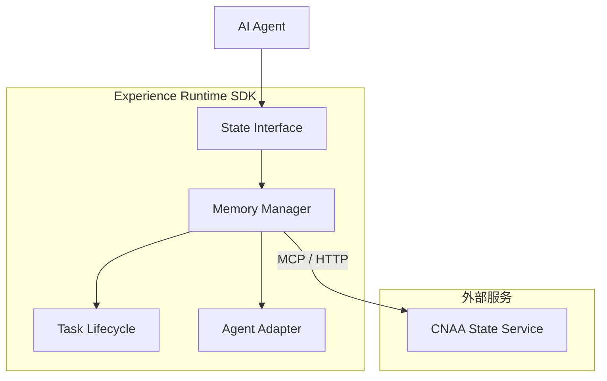
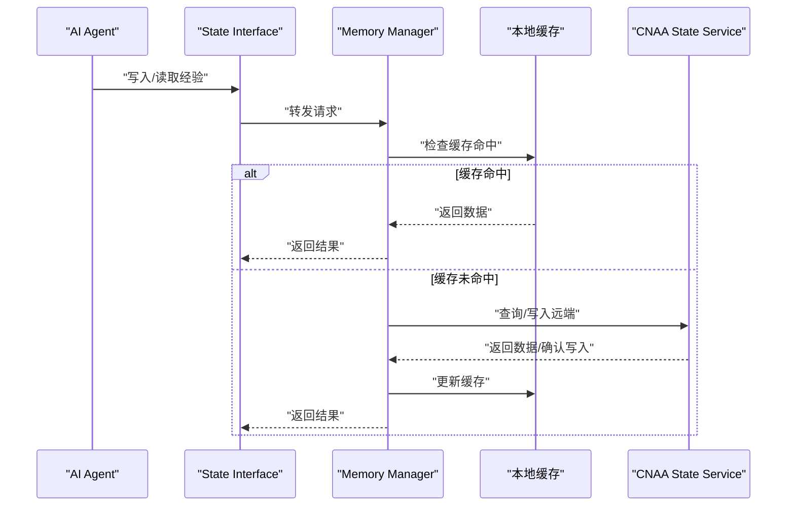
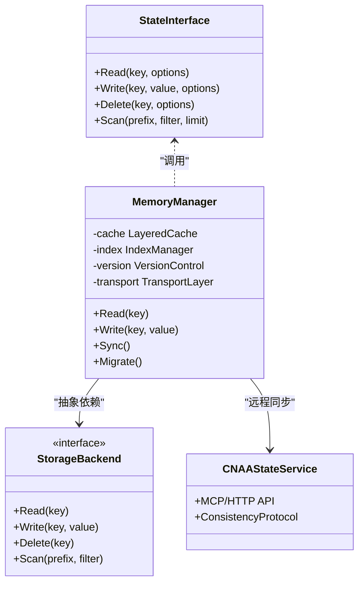

# Memory Manager 详细文档

<cite>
**本文档中引用的文件**   
- [README.md](file://README.md)
- [README_CN.md](file://README_CN.md)
</cite>

## 目录
1. [简介](#简介)
2. [项目结构](#项目结构)
3. [核心组件](#核心组件)
4. [架构总览](#架构总览)
5. [详细组件分析](#详细组件分析)
6. [依赖关系分析](#依赖关系分析)
7. [性能考量](#性能考量)
8. [故障排查指南](#故障排查指南)
9. [结论](#结论)
10. [附录](#附录)

## 简介
本文件围绕 CNAA 中的 Memory Manager（记忆管理）进行系统化说明，聚焦以下目标：
- 持久化记忆管理的核心算法、存储策略与缓存机制
- 经验数据的组织结构、索引设计与检索优化
- 数据版本控制、增量更新与冲突解决策略
- 存储后端抽象接口设计，支持多种数据库与文件系统实现
- 内存缓存策略、数据压缩与传输优化技术
- 数据迁移工具、备份恢复机制与监控指标
- 配置示例与性能调优建议

CNAA 定位为“面向 AI Agent 的持久化记忆运行时框架”，强调将“经验”沉淀为独立于 Prompt 的持久资源，并通过统一的 State Interface 暴露给上层 Experience Runtime SDK。

章节来源
- [README.md:11-41](file://README.md#L11-L41)
- [README_CN.md:11-49](file://README_CN.md#L11-L49)

## 项目结构
当前仓库以 README 为主，docs 目录为空，表明该项目处于早期规划阶段。从架构描述可知，Memory Manager 位于 Experience Runtime SDK 内部，向上对接 Agent，向下通过 MCP/HTTP 访问 CNAA State Service，负责经验的持久化、同步与生命周期管理。

图表来源
- [README.md:55-72](file://README.md#L55-L72)
- [README_CN.md:63-80](file://README_CN.md#L63-L80)

章节来源
- [README.md:55-72](file://README.md#L55-L72)
- [README_CN.md:63-80](file://README_CN.md#L63-L80)

## 核心组件
- State Interface：统一状态读写接口，屏蔽底层存储差异
- Memory Manager：经验数据的组织、索引、缓存、版本与同步
- Task Lifecycle：任务级上下文与经验的生命周期绑定
- Agent Adapter：适配不同 Agent 的经验写入/读取协议
- CNAA State Service：集中式状态服务，提供跨进程/跨实例的状态同步

章节来源
- [README.md:61-72](file://README.md#L61-L72)
- [README_CN.md:69-80](file://README_CN.md#L69-L80)

## 架构总览
Memory Manager 在整体架构中的职责包括：
- 接收来自 State Interface 的读写请求
- 对经验数据进行结构化组织与索引构建
- 维护本地内存缓存与远端一致性
- 处理版本控制、增量更新与冲突合并
- 通过 MCP/HTTP 与 CNAA State Service 交互，完成持久化与同步

图表来源
- [README.md:55-72](file://README.md#L55-L72)
- [README_CN.md:63-80](file://README_CN.md#L63-L80)

## 详细组件分析

### 经验数据结构与索引设计
- 经验实体模型
  - 标识：全局唯一 ID（如 UUID），用于去重与定位
  - 元数据：时间戳、来源 Agent、任务 ID、标签、权重等
  - 内容：结构化片段（键值、向量嵌入、文本摘要等）
  - 版本：版本号或哈希，支持增量与回滚
- 索引策略
  - 主键索引：按经验 ID 快速定位
  - 复合索引：按任务 ID + 时间戳排序，便于时序检索
  - 语义索引：向量嵌入索引，支持相似度检索
  - 标签索引：按标签聚合，支持过滤与分组
- 检索优化
  - 预取与分页：热点经验预加载，避免大结果集
  - 近似最近邻（ANN）：向量检索加速
  - 缓存分层：热数据 L1（内存）、温数据 L2（本地磁盘）、冷数据 L3（远端）

章节来源
- [README.md:19-41](file://README.md#L19-L41)
- [README_CN.md:19-49](file://README_CN.md#L19-L49)

### 存储策略与后端抽象
- 存储后端抽象接口
  - Read(key, options): 读取指定键的数据
  - Write(key, value, options): 写入数据并返回结果
  - Delete(key, options): 删除数据
  - Scan(prefix, filter, limit): 范围扫描与过滤
  - Batch(ops): 批量操作事务
  - Versioning(key, version): 版本管理与冲突检测
- 支持的实现
  - 关系型数据库：MySQL/PostgreSQL（强一致、事务）
  - NoSQL：Redis/Memcached（低延迟缓存）、MongoDB（文档存储）
  - 对象存储：S3/OSS（冷数据归档）
  - 文件系统：本地磁盘（轻量部署）
- 选择策略
  - 热路径优先使用内存缓存与 KV 存储
  - 写放大场景采用 WAL 与异步落盘
  - 读多写少场景启用多级缓存与只读副本

章节来源
- [README.md:55-72](file://README.md#L55-L72)
- [README_CN.md:63-80](file://README_CN.md#L63-L80)

### 缓存机制与内存管理
- 缓存层级
  - L1：进程内缓存（LRU/LFU 淘汰策略）
  - L2：本地磁盘缓存（页式存储，按需加载）
  - L3：远端服务缓存（分布式缓存集群）
- 一致性策略
  - 写穿（Write-through）：写入同时更新缓存
  - 写回（Write-back）：延迟落盘，提升吞吐
  - 失效策略：TTL、事件驱动失效、版本号校验
- 内存控制
  - 容量上限与软限制
  - 自动分片与冷热分离
  - 背压与限流保护

章节来源
- [README.md:55-72](file://README.md#L55-L72)
- [README_CN.md:63-80](file://README_CN.md#L63-L80)

### 数据版本控制、增量更新与冲突解决
- 版本模型
  - 乐观锁：基于版本号或 ETag 的并发控制
  - 向量差分：仅传输变更部分
  - 快照与增量日志：WAL 记录变更轨迹
- 冲突解决
  - 最后写入获胜（LWW）：适用于非关键数据
  - 自定义合并策略：按权重、时间、来源优先级
  - 人工仲裁：冲突标记与审计日志
- 回滚与恢复
  - 时间点恢复（PITR）
  - 分支合并与回溯

章节来源
- [README.md:19-41](file://README.md#L19-L41)
- [README_CN.md:19-49](file://README_CN.md#L19-L49)

### 数据压缩与传输优化
- 压缩策略
  - 文本：ZSTD/LZ4 高压缩比与低延迟
  - 向量：量化（INT8/FP16）与稀疏编码
  - 元数据：Protobuf/MessagePack 二进制序列化
- 传输优化
  - 增量同步：仅传输变更块
  - 批处理：合并小请求，降低网络开销
  - 流式传输：大对象分块上传/下载

章节来源
- [README.md:55-72](file://README.md#L55-L72)
- [README_CN.md:63-80](file://README_CN.md#L63-L80)

### 数据迁移工具、备份恢复与监控指标
- 迁移工具
  - Schema 演进：向后兼容字段映射
  - 数据清洗：去重、格式标准化
  - 灰度切换：双写与流量切分
- 备份恢复
  - 全量快照：定期导出冷数据
  - 增量备份：基于 WAL 的连续备份
  - 恢复演练：自动化验证与回滚
- 监控指标
  - 命中率：L1/L2/L3 缓存命中率
  - 延迟：P95/P99 读写延迟
  - 吞吐：QPS、带宽占用
  - 错误率：超时、重试、失败比例
  - 一致性：版本冲突次数、合并成功率

章节来源
- [README.md:55-72](file://README.md#L55-L72)
- [README_CN.md:63-80](file://README_CN.md#L63-L80)

### 配置示例与性能调优建议
- 配置项建议
  - 缓存大小：L1=256MB~2GB，L2=10GB+，L3 按集群规模
  - TTL：热数据 5~30min，温数据 1~6h，冷数据 7d+
  - 并发：读写线程池、连接池大小
  - 压缩：默认开启 ZSTD，向量量化 INT8
  - 一致性：默认乐观锁，关键数据可降级为强一致
- 调优建议
  - 热点数据预热：启动时加载高频键
  - 索引优化：合理设置复合索引与向量维度
  - 批处理合并：提高吞吐，降低锁竞争
  - 监控告警：阈值触发扩容与降级

章节来源
- [README.md:55-72](file://README.md#L55-L72)
- [README_CN.md:63-80](file://README_CN.md#L63-L80)

## 依赖关系分析
Memory Manager 依赖 State Interface 提供的统一能力，并与 CNAA State Service 通信。其内部模块耦合度较低，职责清晰：
- 对外：State Interface
- 对内：缓存层、索引层、版本层、传输层
- 下游：存储后端抽象（DB/KV/FS/S3）

图表来源
- [README.md:55-72](file://README.md#L55-L72)
- [README_CN.md:63-80](file://README_CN.md#L63-L80)

章节来源
- [README.md:55-72](file://README.md#L55-L72)
- [README_CN.md:63-80](file://README_CN.md#L63-L80)

## 性能考量
- 读写路径优化
  - 短路径：缓存命中直接返回
  - 长路径：远端同步与落盘
- 并发与锁
  - 无锁数据结构（ConcurrentHashMap）
  - 细粒度锁与分段锁
- I/O 与网络
  - 异步 I/O 与零拷贝
  - 连接复用与超时控制
- 资源隔离
  - 多租户配额与隔离
  - 动态扩缩容

[本节为通用指导，不直接分析具体文件]

## 故障排查指南
- 常见问题
  - 缓存穿透：空值缓存与布隆过滤器
  - 缓存雪崩：随机 TTL 与熔断
  - 数据不一致：版本冲突与补偿事务
  - 性能抖动：慢查询与索引缺失
- 诊断手段
  - 日志追踪：请求链路 ID
  - 指标采集：Prometheus/Grafana
  - 采样分析：APM 与火焰图
- 恢复流程
  - 回滚到稳定版本
  - 重建索引与缓存
  - 数据校验与修复

[本节为通用指导，不直接分析具体文件]

## 结论
Memory Manager 作为 CNAA 的核心组件，承担经验数据的持久化、同步与生命周期管理职责。通过抽象存储后端、多级缓存、版本控制与冲突解决，能够在保证一致性的前提下提供高性能与可扩展性。建议在落地时结合业务特征选择合适的存储与缓存策略，并完善监控与运维体系。

[本节为总结，不直接分析具体文件]

## 附录
- 术语表
  - 经验（Experience）：任务执行过程中沉淀的可复用知识
  - 状态（State）：Agent 运行时的上下文与记忆集合
  - 版本控制（Versioning）：数据变更的版本管理与冲突处理
- 参考链接
  - 文档导航见 README 中的文档列表

[本节为补充信息，不直接分析具体文件]