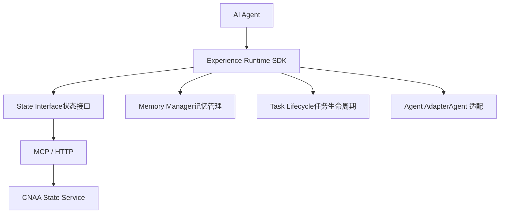
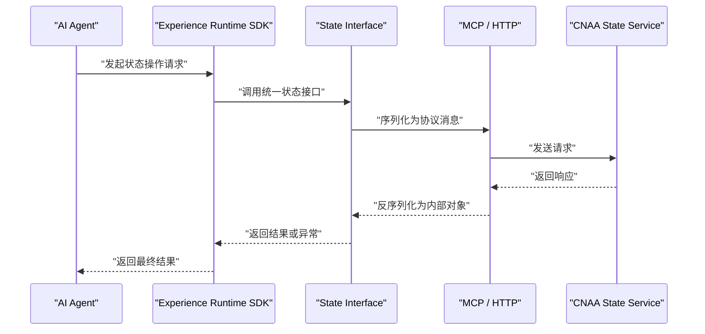
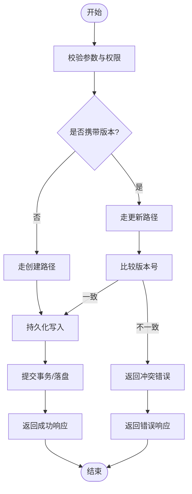
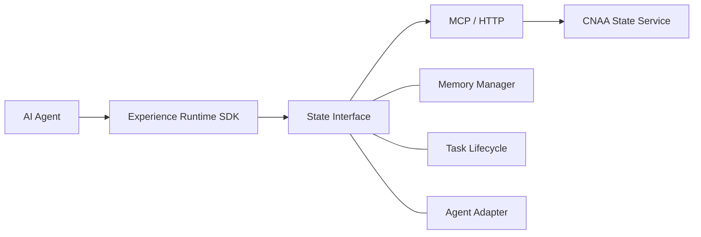

# State Interface

<cite>
**本文档引用的文件**   
- [README.md](file://README.md)
- [README_CN.md](file://README_CN.md)
</cite>

## 目录
1. [简介](#简介)
2. [项目结构](#项目结构)
3. [核心组件](#核心组件)
4. [架构总览](#架构总览)
5. [详细组件分析](#详细组件分析)
6. [依赖关系分析](#依赖关系分析)
7. [性能考虑](#性能考虑)
8. [故障排除指南](#故障排除指南)
9. [结论](#结论)
10. [附录](#附录)

## 简介
本文件面向“State Interface（统一状态接口）”的规范与实现说明，目标是帮助读者理解 CNAA 中经验运行时如何通过统一的状态接口进行持久化、同步与复用。根据仓库信息，CNAA 提供轻量级 Experience Runtime，使 Agent 在不修改推理逻辑的前提下实现经验的沉淀、同步与复用；其架构中包含 State Interface、Memory Manager、Task Lifecycle、Agent Adapter，并通过 MCP/HTTP 与 CNAA State Service 交互。

需要特别说明：当前仓库仅包含 README 文档，未包含具体代码实现或 API 定义文件。因此，本文档在“详细组件分析”“API 参考”等章节将基于仓库已披露的架构信息进行概念性说明，并明确标注哪些内容为概念性描述，避免对未实现的细节做出断言。

**章节来源**
- [README.md:55-72](file://README.md#L55-L72)
- [README_CN.md:63-80](file://README_CN.md#L63-L80)

## 项目结构
仓库目前包含英文与中文 README，以及 docs/en 与 docs/zh 两个文档目录（当前为空）。从 README 可知，State Interface 是 Experience Runtime SDK 的核心模块之一，位于 Agent 与 CNAA State Service 之间，通过 MCP/HTTP 协议进行通信。

**图表来源**
- [README.md:55-72](file://README.md#L55-L72)
- [README_CN.md:63-80](file://README_CN.md#L63-L80)

**章节来源**
- [README.md:76-85](file://README.md#L76-L85)
- [README_CN.md:84-93](file://README_CN.md#L84-L93)

## 核心组件
- State Interface（统一状态接口）
  - 职责：为上层 Experience Runtime SDK 暴露一致的状态操作能力，屏蔽底层存储与传输差异。
  - 关键能力：CRUD 操作、版本控制、冲突解决、事务支持、并发控制、序列化/反序列化、错误处理。
- Memory Manager（记忆管理）
  - 职责：负责经验的持久化、检索、清理与生命周期管理。
- Task Lifecycle（任务生命周期）
  - 职责：管理与任务相关的状态流转、阶段划分与资源回收。
- Agent Adapter（Agent 适配）
  - 职责：对接不同 Agent 框架，统一调用入口与上下文传递。
- CNAA State Service（状态服务）
  - 职责：对外提供状态读写、版本与一致性保障、跨进程/跨节点同步。

上述组件的职责边界由仓库架构图给出，具体实现细节需待后续代码与文档完善。

**章节来源**
- [README.md:55-72](file://README.md#L55-L72)
- [README_CN.md:63-80](file://README_CN.md#L63-L80)

## 架构总览
下图展示了从 AI Agent 到 CNAA State Service 的整体交互路径，State Interface 作为统一入口，向上屏蔽实现差异，向下通过 MCP/HTTP 访问状态服务。

**图表来源**
- [README.md:55-72](file://README.md#L55-L72)
- [README_CN.md:63-80](file://README_CN.md#L63-L80)

## 详细组件分析
### State Interface（统一状态接口）
- 设计目标
  - 统一 CRUD：对状态的创建、读取、更新、删除提供一致的方法签名与语义。
  - 版本控制：为状态引入版本号，支持乐观锁与冲突检测。
  - 事务支持：在必要时提供原子性操作，保证多步状态变更的一致性。
  - 并发控制：通过版本号、锁或幂等键避免竞态条件。
  - 序列化机制：定义消息格式与编码策略，确保跨语言/跨进程兼容。
  - 错误处理：标准化错误码与错误体，便于上层定位问题。

- 数据模型（概念性）
  - 状态实体：包含唯一标识、业务数据、元数据（如创建时间、更新时间、版本）、扩展字段等。
  - 版本信息：版本号、变更摘要、冲突标记等。
  - 事务上下文：事务 ID、操作集合、回滚快照等。

- 操作方法（概念性）
  - Create：创建新状态，返回状态 ID 与初始版本。
  - Read：按 ID 或查询条件读取状态，支持版本过滤。
  - Update：带版本号的更新，失败时返回冲突信息。
  - Delete：软删除或硬删除，记录审计信息。
  - Batch：批量操作，支持事务包裹。
  - Snapshot：生成状态快照，用于回滚或审计。

- 协议适配层（MCP/HTTP）
  - 消息格式：定义统一的请求/响应结构，包含方法名、参数、版本、追踪 ID、错误码等。
  - 序列化：JSON/Protobuf 等，要求可演进、向后兼容。
  - 错误映射：将服务侧错误映射为统一错误体，包含 code、message、details。

- 并发与一致性
  - 乐观锁：基于版本号比较，失败则提示重试或合并策略。
  - 幂等性：通过幂等键避免重复提交导致的不一致。
  - 事务边界：短事务优先，长事务拆分，避免锁竞争。

- 示例调用流程（概念性）

**图表来源**
- [README.md:55-72](file://README.md#L55-L72)
- [README_CN.md:63-80](file://README_CN.md#L63-L80)

**章节来源**
- [README.md:55-72](file://README.md#L55-L72)
- [README_CN.md:63-80](file://README_CN.md#L63-L80)

### 其他组件（概念性概述）
- Memory Manager
  - 负责经验数据的索引、分片、压缩与归档，提供高效检索与冷热分层。
- Task Lifecycle
  - 定义任务状态机（如新建、运行、完成、失败），与状态接口联动，确保状态与任务阶段一致。
- Agent Adapter
  - 抽象不同 Agent 的调用方式，统一上下文注入、日志与监控埋点。
- CNAA State Service
  - 提供高可用、可扩展的状态存储与同步能力，支持多副本、一致性协议与容错恢复。

[本节为概念性内容，不直接分析具体文件]

## 依赖关系分析
State Interface 依赖 Experience Runtime SDK 提供的上下文与工具，同时依赖 MCP/HTTP 协议栈与 CNAA State Service。Memory Manager、Task Lifecycle、Agent Adapter 与 State Interface 协作，共同完成状态的生命周期管理。

**图表来源**
- [README.md:55-72](file://README.md#L55-L72)
- [README_CN.md:63-80](file://README_CN.md#L63-L80)

**章节来源**
- [README.md:55-72](file://README.md#L55-L72)
- [README_CN.md:63-80](file://README_CN.md#L63-L80)

## 性能考虑
- 批处理与分页：批量操作减少网络往返，分页查询避免大结果集阻塞。
- 缓存策略：热点状态本地缓存，结合失效与一致性校验。
- 连接池与超时：合理设置连接池大小、超时与重试策略。
- 序列化开销：选择高效的序列化方案，避免不必要的字段传输。
- 事务粒度：尽量缩短事务范围，降低锁竞争与死锁风险。

[本节为通用性能建议，不直接分析具体文件]

## 故障排除指南
- 常见错误类型
  - 版本冲突：更新时版本号不一致，需重试或合并策略。
  - 参数校验失败：必填字段缺失、类型不匹配、长度越界等。
  - 网络超时/重试：检查网络连通性与服务端负载。
  - 权限不足：确认调用方身份与访问策略。
- 排查步骤
  - 查看错误码与错误体，定位问题维度。
  - 检查请求参数与版本信息是否正确。
  - 启用调试日志，追踪请求链路。
  - 与服务端联调，确认状态服务健康与一致性。
- 恢复策略
  - 幂等重试：使用幂等键避免重复提交。
  - 补偿操作：对部分失败的操作进行补偿。
  - 回滚快照：利用快照恢复到稳定状态。

[本节为通用故障排除建议，不直接分析具体文件]

## 结论
State Interface 作为 CNAA 的统一状态入口，旨在屏蔽底层实现差异，提供一致的 CRUD、版本控制、事务与并发控制能力。当前仓库尚未包含具体代码与 API 定义，本文档基于 README 中的架构信息进行概念性说明。后续应补充详细的 API 规范、数据模型定义、错误码表与示例，以便开发者快速集成与排障。

[本节为总结性内容，不直接分析具体文件]

## 附录
- 术语表
  - 状态（State）：Agent 任务经验与上下文的持久化表示。
  - 版本（Version）：用于乐观锁与冲突检测的版本号。
  - 事务（Transaction）：一组操作的原子执行单元。
  - 幂等（Idempotent）：多次执行与单次执行结果一致。
- 参考链接
  - 文档导航见 README 中的“Documentation”部分，包含 State Interface、MCP、State Service 等专题文档链接。

[本节为补充信息，不直接分析具体文件]