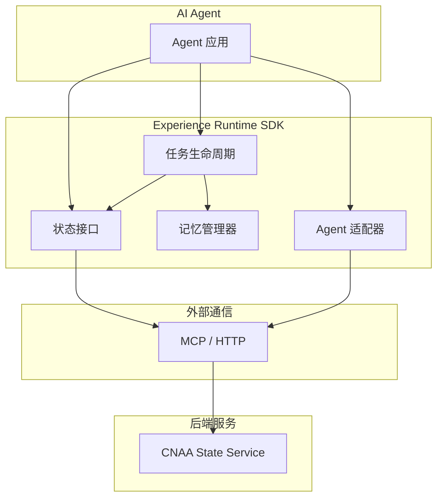
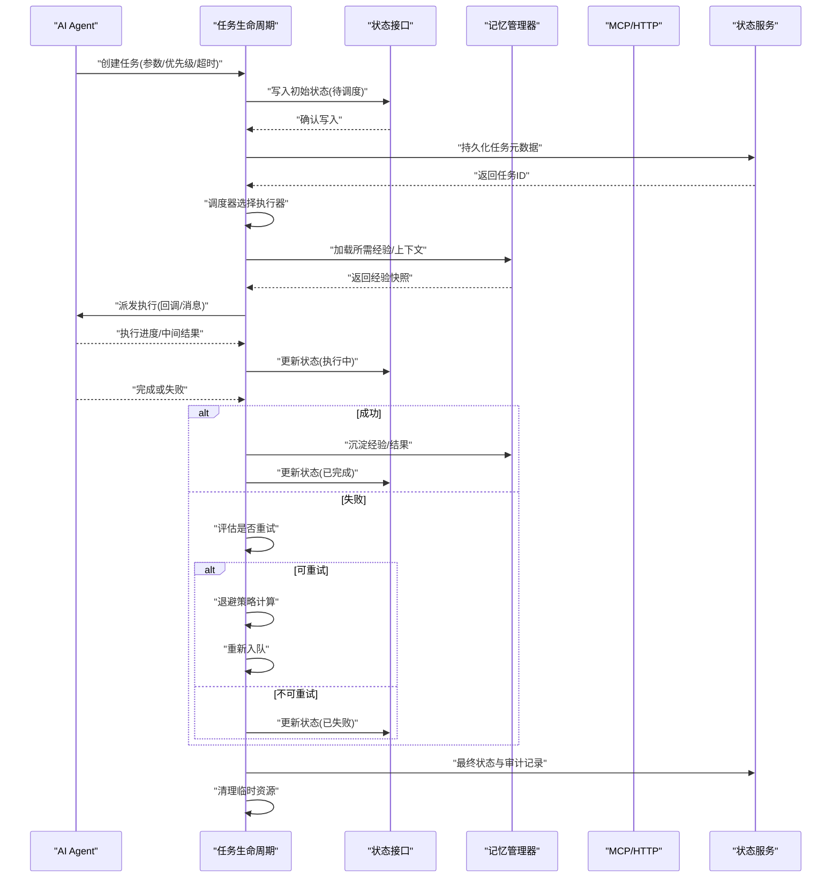
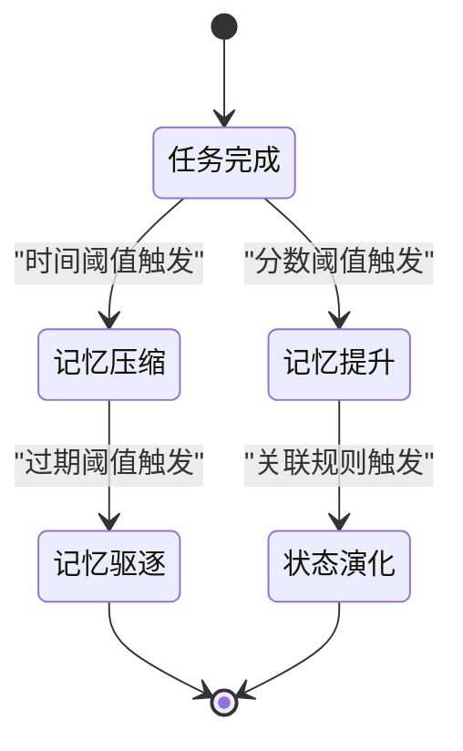
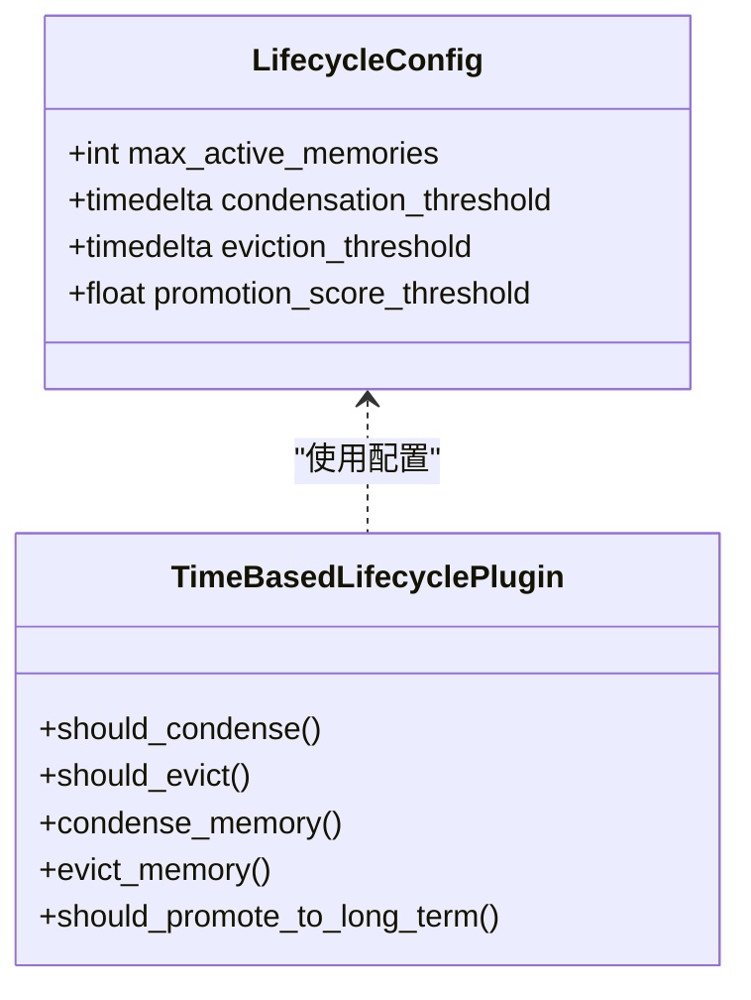
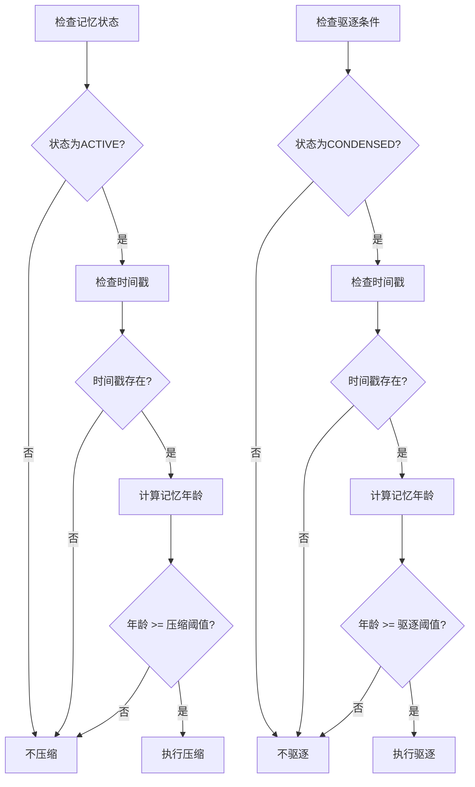
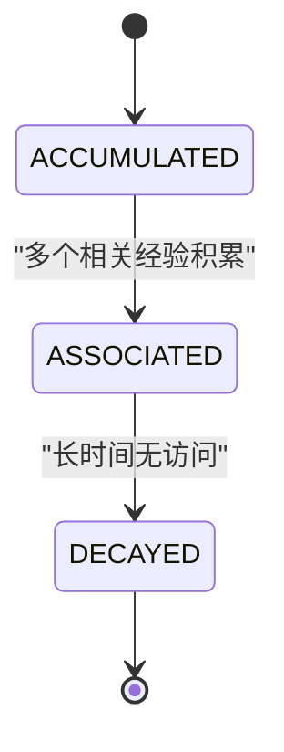
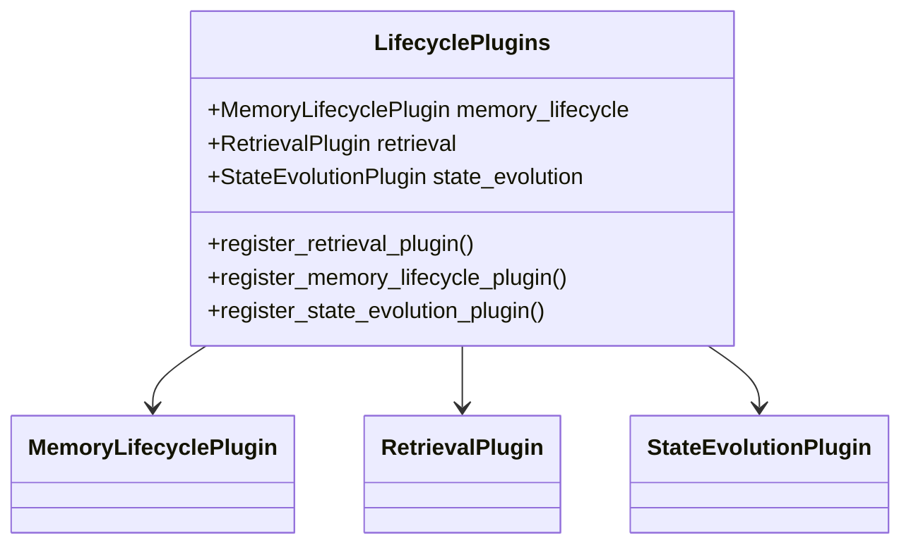
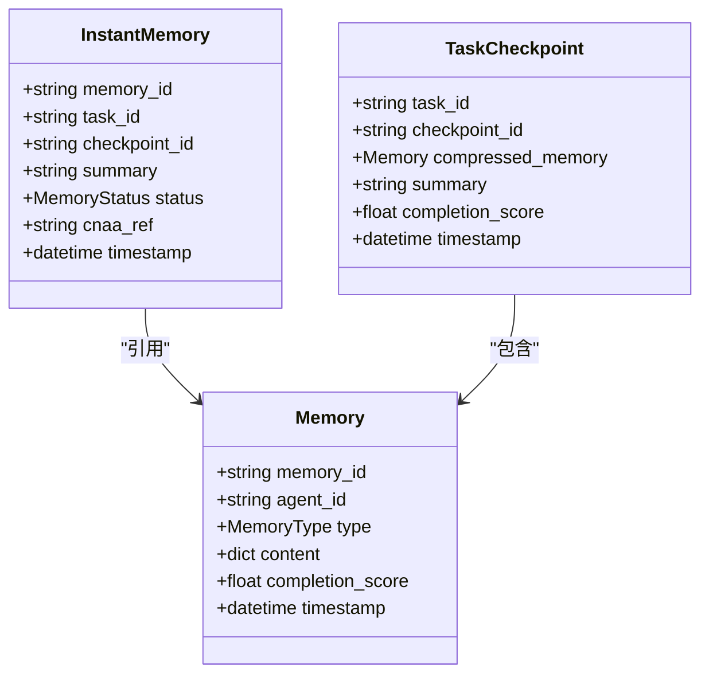
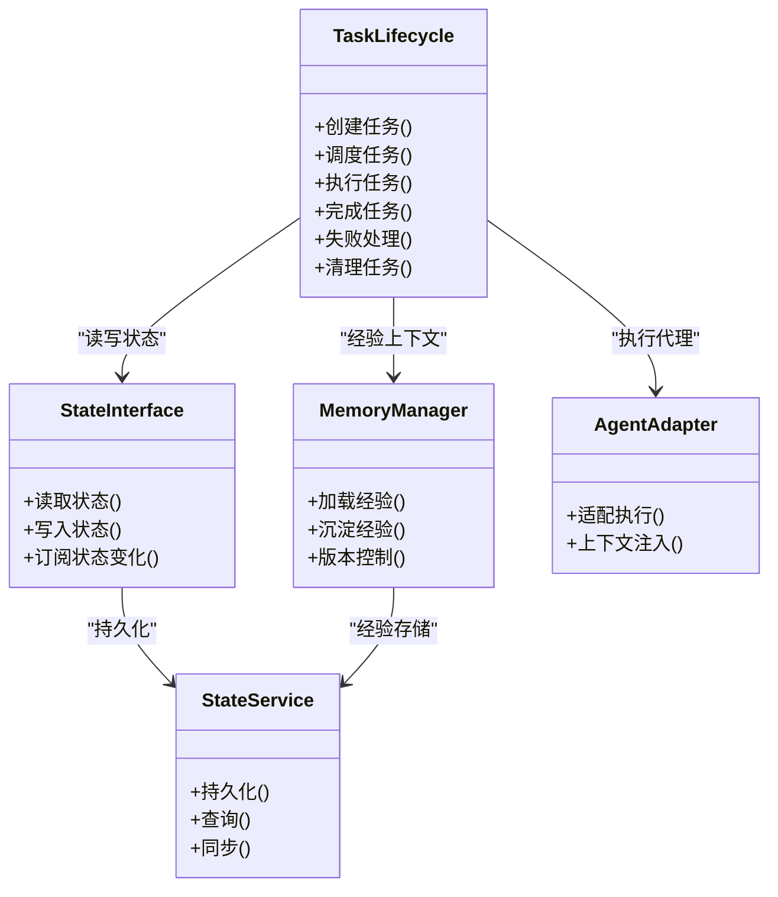

# 任务生命周期（Task Lifecycle）

<cite>
**本文档引用的文件**
- [lifecycle.py](file://cnaa/lifecycle.py)
- [models.py](file://cnaa/models.py)
- [test_lifecycle.py](file://tests/test_lifecycle.py)
- [README.md](file://README.md)
- [README_CN.md](file://README_CN.md)
</cite>

## 更新摘要
**变更内容**
- 基于全面的测试覆盖更新了生命周期模块文档
- 新增了 TimeBasedLifecyclePlugin 的详细实现说明
- 补充了状态演化规则和插件注册功能
- 增强了配置选项和生命周期行为的验证
- 添加了实际的代码示例和使用模式

## 目录
1. [简介](#简介)
2. [项目结构](#项目结构)
3. [核心组件](#核心组件)
4. [架构总览](#架构总览)
5. [详细组件分析](#详细组件分析)
6. [依赖关系分析](#依赖关系分析)
7. [性能考量](#性能考量)
8. [故障排查指南](#故障排查指南)
9. [结论](#结论)
10. [附录](#附录)

## 简介
本文件面向 CNAA（Cloud Native Agentic Architecture）中的"任务生命周期"能力，系统性阐述任务的创建、调度、执行、完成与清理流程，以及异步处理、重试机制、错误恢复、优先级管理、资源分配与负载均衡、监控日志审计、模板设计、批量处理与分布式协调等关键主题。当前仓库已实现完整的生命周期模块，包括时间基生命周期插件、状态演化规则和插件注册功能，为 AI Agent 提供稳定可靠的经验沉淀与复用能力。

## 项目结构
从 README 的架构图中可知，CNAA 的核心由 Experience Runtime SDK 组成，其中包含状态接口、记忆管理、任务生命周期与 Agent 适配等模块，并通过 MCP/HTTP 与 CNAA State Service 交互。任务生命周期作为运行时的重要子模块，贯穿任务从创建到销毁的全程，并与状态服务进行持久化同步。

**图表来源**
- [README.md:55-72](file://README.md#L55-L72)
- [README_CN.md:63-80](file://README_CN.md#L63-80)

章节来源
- [README.md:55-72](file://README.md#L55-L72)
- [README_CN.md:63-80](file://README_CN.md#L63-80)

## 核心组件
- **生命周期事件（LifecycleEvent）**：定义5种生命周期转换事件，包括任务完成、记忆压缩、记忆驱逐、记忆提升和状态演化。
- **生命周期配置（LifecycleConfig）**：可配置的阈值控制，包括最大活动记忆数、压缩阈值、驱逐阈值和提升分数阈值。
- **内存生命周期插件（MemoryLifecyclePlugin）**：抽象接口定义5个核心方法，支持自定义记忆压缩、驱逐和提升策略。
- **时间基生命周期插件（TimeBasedLifecyclePlugin）**：默认的时间基实现，基于时间阈值进行压缩和驱逐。
- **检索插件（RetrievalPlugin）**：抽象接口定义4个核心方法，支持向量搜索、全文搜索和混合检索。
- **状态演化插件（StateEvolutionPlugin）**：抽象接口定义3个核心方法，支持自定义状态演化规则。
- **默认状态演化插件（DefaultStateEvolutionPlugin）**：默认无操作实现，提供两条基础演化规则。
- **生命周期插件注册表（LifecyclePlugins）**：插件持有者，包含注册方法和默认工厂。

章节来源
- [lifecycle.py:52-60](file://cnaa/lifecycle.py#L52-L60)
- [lifecycle.py:66-85](file://cnaa/lifecycle.py#L66-L85)
- [lifecycle.py:91-182](file://cnaa/lifecycle.py#L91-L182)
- [lifecycle.py:188-256](file://cnaa/lifecycle.py#L188-L256)
- [lifecycle.py:262-351](file://cnaa/lifecycle.py#L262-L351)
- [lifecycle.py:376-446](file://cnaa/lifecycle.py#L376-L446)
- [lifecycle.py:452-509](file://cnaa/lifecycle.py#L452-L509)
- [lifecycle.py:515-568](file://cnaa/lifecycle.py#L515-L568)

## 架构总览
下图展示了任务在 Experience Runtime 与 State Service 之间的交互路径，涵盖创建、调度、执行、完成与清理的关键环节。

**图表来源**
- [README.md:55-72](file://README.md#L55-L72)
- [README_CN.md:63-80](file://README_CN.md#L63-80)

## 详细组件分析

### 生命周期事件系统
生命周期事件系统定义了5种核心事件类型，用于追踪任务生命周期的各个阶段：

- **TASK_COMPLETED**：任务完成事件
- **MEMORY_CONDENSED**：记忆压缩事件
- **MEMORY_EVICTED**：记忆驱逐事件  
- **MEMORY_PROMOTED**：记忆提升事件（短期→长期）
- **STATE_EVOLVED**：状态演化事件

**图表来源**
- [lifecycle.py:52-60](file://cnaa/lifecycle.py#L52-L60)

章节来源
- [lifecycle.py:52-60](file://cnaa/lifecycle.py#L52-L60)

### 生命周期配置管理
LifecycleConfig 提供了灵活的生命周期配置选项：

- **max_active_memories**：最大活动记忆数量（默认20）
- **condensation_threshold**：压缩时间阈值（默认1小时）
- **eviction_threshold**：驱逐时间阈值（默认7天）
- **promotion_score_threshold**：提升分数阈值（默认0.5）

**图表来源**
- [lifecycle.py:66-85](file://cnaa/lifecycle.py#L66-L85)
- [lifecycle.py:188-256](file://cnaa/lifecycle.py#L188-L256)

章节来源
- [lifecycle.py:66-85](file://cnaa/lifecycle.py#L66-L85)

### 时间基生命周期插件（TimeBasedLifecyclePlugin）
TimeBasedLifecyclePlugin 是默认的内存生命周期管理实现，基于时间阈值进行智能管理：

#### 压缩逻辑（should_condense）
- 检查记忆状态是否为 ACTIVE
- 验证时间戳是否存在
- 计算记忆年龄是否超过压缩阈值
- 复杂度：O(1)

#### 驱逐逻辑（should_evict）
- 检查记忆状态是否为 CONDENSED
- 验证时间戳是否存在
- 计算记忆年龄是否超过驱逐阈值
- 复杂度：O(1)

#### 提升逻辑（should_promote_to_long_term）
- 检查记忆类型是否为 SHORT_TERM
- 比较 completion_score 与提升阈值
- 支持自定义阈值配置

**图表来源**
- [lifecycle.py:208-256](file://cnaa/lifecycle.py#L208-L256)

章节来源
- [lifecycle.py:188-256](file://cnaa/lifecycle.py#L188-L256)

### 状态演化系统
状态演化系统定义了三种演化阶段和相应的演化规则：

#### 演化阶段（StateEvolutionPhase）
- **ACCUMULATED**：经验数据持续写入阶段
- **ASSOCIATED**：跨任务经验建立关联阶段
- **DECAYED**：长期未使用的经验降低优先级阶段

#### 演化规则（StateEvolutionRule）
- **from_phase**：源阶段
- **to_phase**：目标阶段
- **condition**：人类可读的条件描述
- **trigger_fn**：可选的程序化触发函数

#### 默认演化规则
DefaultStateEvolutionPlugin 提供两条基础规则：
1. ACCUMULATED → ASSOCIATED：多个相关经验积累后建立关联
2. ASSOCIATED → DECAYED：长时间无访问后进入衰减阶段

**图表来源**
- [lifecycle.py:358-364](file://cnaa/lifecycle.py#L358-364)
- [lifecycle.py:467-479](file://cnaa/lifecycle.py#L467-479)

章节来源
- [lifecycle.py:358-364](file://cnaa/lifecycle.py#L358-364)
- [lifecycle.py:452-509](file://cnaa/lifecycle.py#L452-L509)

### 插件注册与管理
LifecyclePlugins 提供了统一的插件注册和管理机制：

#### 默认插件配置
- **memory_lifecycle**：默认为 TimeBasedLifecyclePlugin
- **retrieval**：默认为 None（需要手动注册）
- **state_evolution**：默认为 DefaultStateEvolutionPlugin

#### 注册方法
- **register_retrieval_plugin()**：注册检索插件
- **register_memory_lifecycle_plugin()**：注册内存生命周期插件
- **register_state_evolution_plugin()**：注册状态演化插件

**图表来源**
- [lifecycle.py:515-568](file://cnaa/lifecycle.py#L515-L568)

章节来源
- [lifecycle.py:515-568](file://cnaa/lifecycle.py#L515-L568)

### 数据模型集成
生命周期系统与核心数据模型紧密集成：

#### 记忆状态管理
- **MemoryStatus**：ACTIVE → CONDENSED → EVICTED
- **MemoryType**：SHORT_TERM ↔ LONG_TERM
- **InstantMemory**：本地短期记忆，包含云引用指针

#### 任务检查点
- **TaskCheckpoint**：压缩的任务检查点，包含完整记忆和摘要
- 支持任务进度跟踪和断点续传

**图表来源**
- [models.py:218-253](file://cnaa/models.py#L218-L253)
- [models.py:84-121](file://cnaa/models.py#L84-L121)
- [models.py:124-155](file://cnaa/models.py#L124-L155)

章节来源
- [models.py:218-253](file://cnaa/models.py#L218-L253)
- [models.py:84-121](file://cnaa/models.py#L84-L121)
- [models.py:124-155](file://cnaa/models.py#L124-L155)

### 任务创建与入队
- **输入校验**：参数完整性、类型与范围检查
- **优先级策略**：支持静态优先级与动态权重（如 SLA、拥塞度）
- **去重与幂等**：基于业务键或指纹避免重复入队
- **初始状态**：写入"待调度"，并生成唯一任务 ID
- **持久化**：将任务元数据与初始状态写入状态服务

章节来源
- [lifecycle.py:66-85](file://cnaa/lifecycle.py#L66-L85)
- [models.py:218-253](file://cnaa/models.py#L218-L253)

### 调度与执行
- **调度器**：按优先级队列、资源约束与负载情况选择执行器
- **执行器**：无状态 Worker，支持水平扩展；具备健康检查与自动摘流
- **上下文注入**：从记忆管理器加载经验快照，注入执行环境
- **进度上报**：周期性回传执行进度与中间结果，便于监控与中断

章节来源
- [lifecycle.py:188-256](file://cnaa/lifecycle.py#L188-L256)
- [models.py:124-155](file://cnaa/models.py#L124-L155)

### 完成与失败处理
- **成功路径**：沉淀经验、更新状态为"已完成"、触发下游钩子
- **失败路径**：根据错误类型判定是否可重试；支持指数退避与抖动
- **补偿与回滚**：对副作用操作提供补偿逻辑，保证一致性
- **死信队列**：超过最大重试次数进入死信，供人工干预或离线分析

章节来源
- [lifecycle.py:52-60](file://cnaa/lifecycle.py#L52-L60)
- [lifecycle.py:452-509](file://cnaa/lifecycle.py#L452-L509)

### 清理与归档
- **资源释放**：关闭连接、删除临时文件、回收内存
- **审计归档**：将审计事件与结果归档至冷存储
- **状态清理**：标记"已清理"，允许 GC 回收历史状态

章节来源
- [lifecycle.py:188-256](file://cnaa/lifecycle.py#L188-L256)
- [models.py:218-253](file://cnaa/models.py#L218-L253)

### 异步任务处理
- **消息驱动**：通过消息队列解耦生产者与消费者，提升吞吐
- **背压与限流**：基于队列长度与系统负载动态调整入队速率
- **分区与顺序**：对有序任务使用分区键保证局部顺序

章节来源
- [lifecycle.py:262-351](file://cnaa/lifecycle.py#L262-L351)

### 重试机制与错误恢复
- **重试策略**：固定间隔、指数退避、随机抖动、上限次数
- **错误分类**：网络错误、业务异常、资源不足等差异化处理
- **恢复策略**：断点续跑、幂等写入、补偿事务

章节来源
- [lifecycle.py:52-60](file://cnaa/lifecycle.py#L52-L60)
- [lifecycle.py:452-509](file://cnaa/lifecycle.py#L452-L509)

### 优先级管理与资源分配
- **优先级队列**：多队列或多权重策略，保障高优任务低延迟
- **资源配额**：CPU/内存/GPU 配额与隔离，防止资源争用
- **抢占与迁移**：支持紧急任务抢占与长任务迁移

章节来源
- [lifecycle.py:66-85](file://cnaa/lifecycle.py#L66-L85)

### 负载均衡与弹性伸缩
- **负载均衡**：基于 CPU、内存、队列深度与亲和性策略分发
- **弹性伸缩**：根据队列积压与延迟指标自动扩缩容
- **健康探测**：定期探针与快速失败，剔除异常节点

章节来源
- [lifecycle.py:515-568](file://cnaa/lifecycle.py#L515-L568)

### 监控、日志与审计
- **指标采集**：QPS、延迟、成功率、队列长度、重试率
- **结构化日志**：任务 ID、状态、耗时、错误码、堆栈摘要
- **审计追踪**：全链路审计事件，支持回溯与合规

章节来源
- [lifecycle.py:52-60](file://cnaa/lifecycle.py#L52-L60)

### 任务模板与批量处理
- **模板引擎**：参数化任务定义，支持变量替换与默认值
- **批量模式**：批大小、批超时、分批失败重试
- **幂等批次**：基于批次 ID 的去重与精确一次语义

章节来源
- [lifecycle.py:262-351](file://cnaa/lifecycle.py#L262-L351)

### 分布式协调与一致性
- **分布式锁**：基于状态服务的细粒度锁，避免重复执行
- **共识与选举**：主节点选举与领导权转移
- **数据一致性**：最终一致与冲突解决策略

章节来源
- [lifecycle.py:515-568](file://cnaa/lifecycle.py#L515-L568)

### 任务定义示例与生命周期管理要点
- **任务定义要素**：名称、版本、参数 schema、超时、重试策略、优先级、标签
- **生命周期管理要点**：幂等创建、状态机约束、审计事件、资源清理
- **集成方式**：通过状态接口与记忆管理器访问，经 MCP/HTTP 与状态服务交互

章节来源
- [lifecycle.py:188-256](file://cnaa/lifecycle.py#L188-L256)
- [models.py:218-253](file://cnaa/models.py#L218-L253)

## 依赖关系分析
- 任务生命周期依赖状态接口进行状态读写，依赖记忆管理器获取经验上下文
- 通过 MCP/HTTP 与状态服务通信，确保状态与经验的持久化与同步
- Agent 适配器屏蔽差异，使任务生命周期与具体 Agent 实现解耦

**图表来源**
- [lifecycle.py:188-256](file://cnaa/lifecycle.py#L188-L256)
- [models.py:218-253](file://cnaa/models.py#L218-L253)

章节来源
- [lifecycle.py:188-256](file://cnaa/lifecycle.py#L188-L256)
- [models.py:218-253](file://cnaa/models.py#L218-L253)

## 性能考量
- **队列与调度**：优先使用有界队列与背压，避免雪崩
- **执行器池**：合理设置并发度与线程池大小，减少上下文切换
- **缓存与预热**：经验快照缓存，热点任务预加载
- **批处理**：合并小任务，降低 I/O 与序列化开销
- **监控与告警**：基于延迟与错误率的实时告警，快速定位瓶颈

## 故障排查指南
- **常见问题**
  - 任务堆积：检查调度器与执行器健康、资源配额与限流配置
  - 频繁重试：分析错误类型与退避策略，必要时引入熔断
  - 状态不一致：核对幂等性与事务边界，检查审计事件
  - 经验缺失：验证记忆管理器加载逻辑与版本一致性
- **诊断手段**
  - 指标看板：QPS、延迟、成功率、队列长度、重试率
  - 日志聚合：按任务 ID 关联全链路日志
  - 审计回放：基于审计事件重建执行轨迹

章节来源
- [test_lifecycle.py:84-198](file://tests/test_lifecycle.py#L84-L198)
- [test_lifecycle.py:200-238](file://tests/test_lifecycle.py#L200-L238)
- [test_lifecycle.py:240-293](file://tests/test_lifecycle.py#L240-L293)

## 结论
CNAA 的任务生命周期围绕"状态接口—记忆管理器—任务生命周期—Agent 适配器—状态服务"的清晰分层展开，强调幂等、可观测与可扩展。通过明确的状态机、完善的重试与恢复策略、灵活的优先级与资源管理、以及全面的监控审计，可为 AI Agent 提供稳定可靠的经验沉淀与复用能力。当前的实现已经包含了完整的时间基生命周期管理、状态演化规则和插件注册机制，为后续的功能扩展奠定了坚实基础。

## 附录
- **术语表**
  - **经验**：任务执行过程中产生的可复用知识与结果
  - **状态接口**：统一的读写契约，屏蔽底层存储差异
  - **状态服务**：提供高可用、强一致或最终一致的存储服务
  - **即时记忆**：本地短期记忆，包含云引用指针
  - **记忆压缩**：将完整记忆压缩为索引指针的过程
  - **记忆驱逐**：将压缩后的记忆从本地上下文中移除
  - **记忆提升**：将短期记忆提升到长期存储的过程
- **参考链接**
  - 架构概览与模块划分参见 README 中的架构图
  - 完整的 API 规范参见 API Reference 文档

章节来源
- [lifecycle.py:52-60](file://cnaa/lifecycle.py#L52-L60)
- [lifecycle.py:66-85](file://cnaa/lifecycle.py#L66-L85)
- [models.py:218-253](file://cnaa/models.py#L218-L253)
- [README.md:55-72](file://README.md#L55-L72)
- [README_CN.md:63-80](file://README_CN.md#L63-80)