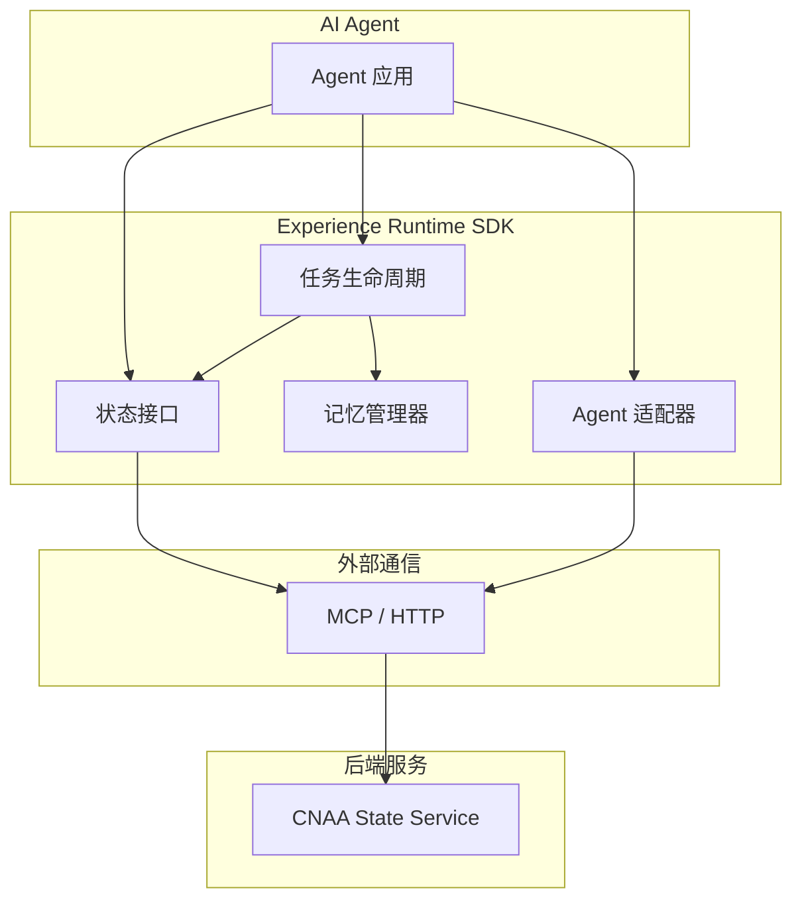
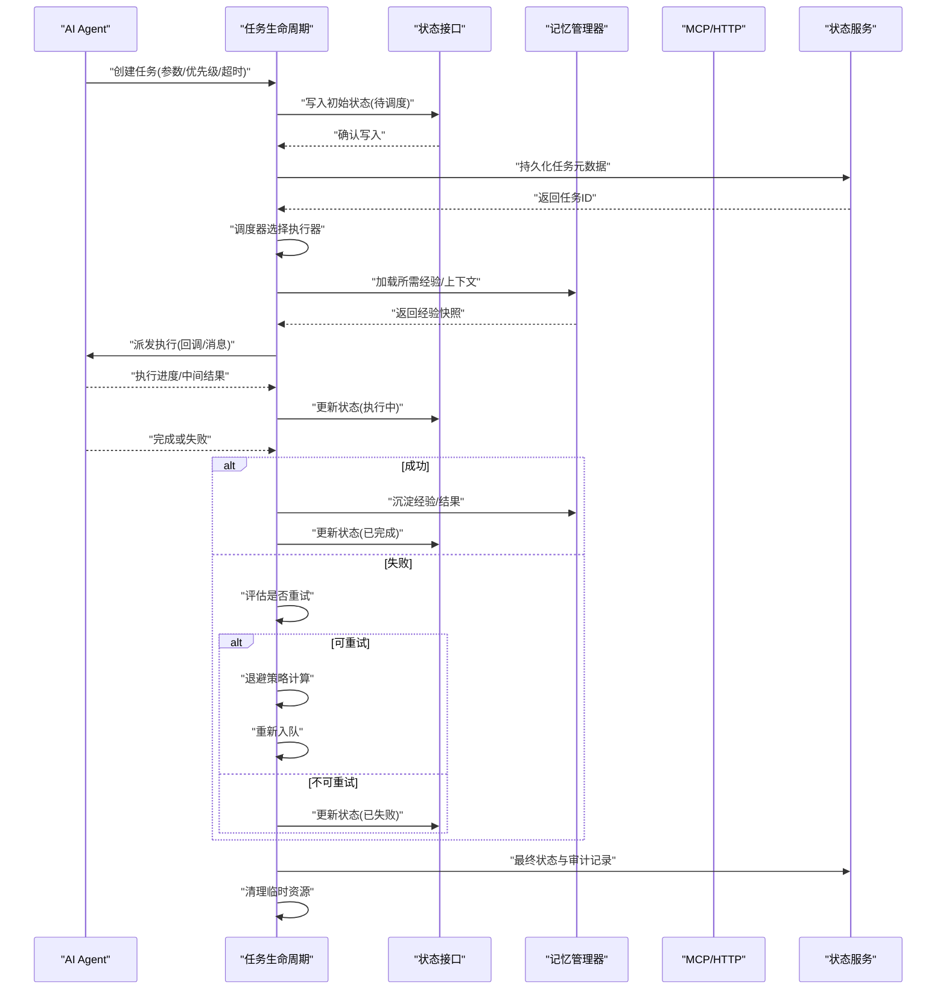
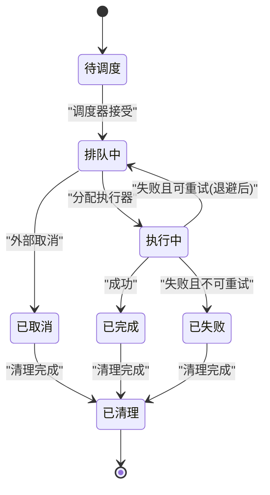
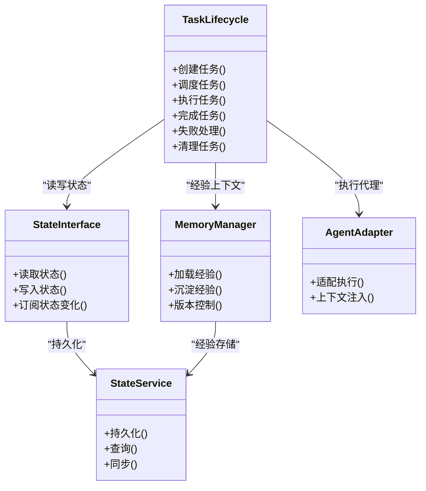

# 任务生命周期（Task Lifecycle）

<cite>
**本文档引用的文件**
- [README.md](file://README.md)
- [README_CN.md](file://README_CN.md)
</cite>

## 目录
1. [简介](#简介)
2. [项目结构](#项目结构)
3. [核心组件](#核心组件)
4. [架构总览](#架构总览)
5. [详细组件分析](#详细组件分析)
6. [依赖关系分析](#依赖关系分析)
7. [性能考量](#性能考量)
8. [故障排查指南](#故障排查指南)
9. [结论](#结论)
10. [附录](#附录)

## 简介
本文件面向 CNAA（Cloud Native Agentic Architecture）中的“任务生命周期”能力，系统性阐述任务的创建、调度、执行、完成与清理流程，以及异步处理、重试机制、错误恢复、优先级管理、资源分配与负载均衡、监控日志审计、模板设计、批量处理与分布式协调等关键主题。需要特别说明的是：当前仓库为概念性说明阶段，尚未包含具体实现代码；本文以架构描述为依据，给出可落地的设计与最佳实践建议，便于后续工程化落地。

## 项目结构
从 README 的架构图中可知，CNAA 的核心由 Experience Runtime SDK 组成，其中包含状态接口、记忆管理、任务生命周期与 Agent 适配等模块，并通过 MCP/HTTP 与 CNAA State Service 交互。任务生命周期作为运行时的重要子模块，贯穿任务从创建到销毁的全程，并与状态服务进行持久化同步。

图表来源
- [README.md:55-72](file://README.md#L55-L72)
- [README_CN.md:63-80](file://README_CN.md#L63-L80)

章节来源
- [README.md:55-72](file://README.md#L55-L72)
- [README_CN.md:63-80](file://README_CN.md#L63-L80)

## 核心组件
- 状态接口（State Interface）：定义任务与经验的状态读写契约，确保跨进程/跨节点的一致性。
- 记忆管理器（Memory Manager）：负责经验的持久化、检索与版本控制，支撑任务结果沉淀与复用。
- 任务生命周期（Task Lifecycle）：负责任务全生命周期的编排，包括创建、入队、调度、执行、完成、失败重试与清理。
- Agent 适配器（Agent Adapter）：屏蔽不同 Agent 的差异，统一接入体验运行时。
- 状态服务（CNAA State Service）：提供高可用的状态与经验存储、同步与查询能力。

章节来源
- [README.md:55-72](file://README.md#L55-L72)
- [README_CN.md:63-80](file://README_CN.md#L63-L80)

## 架构总览
下图展示了任务在 Experience Runtime 与 State Service 之间的交互路径，涵盖创建、调度、执行、完成与清理的关键环节。

图表来源
- [README.md:55-72](file://README.md#L55-L72)
- [README_CN.md:63-80](file://README_CN.md#L63-L80)

## 详细组件分析

### 任务生命周期状态机
任务生命周期采用明确的状态机模型，保证状态转换的可追溯性与幂等性。典型状态包括：待调度、排队中、执行中、已完成、已失败、已取消、已清理。

- 幂等性：所有状态变更需支持重复调用不改变最终结果。
- 原子性：状态更新与审计记录在同一事务内提交。
- 可观测性：每次状态转换均产生审计事件。

章节来源
- [README.md:55-72](file://README.md#L55-L72)
- [README_CN.md:63-80](file://README_CN.md#L63-L80)

### 任务创建与入队
- 输入校验：参数完整性、类型与范围检查。
- 优先级策略：支持静态优先级与动态权重（如 SLA、拥塞度）。
- 去重与幂等：基于业务键或指纹避免重复入队。
- 初始状态：写入“待调度”，并生成唯一任务 ID。
- 持久化：将任务元数据与初始状态写入状态服务。

章节来源
- [README.md:55-72](file://README.md#L55-L72)
- [README_CN.md:63-80](file://README_CN.md#L63-L80)

### 调度与执行
- 调度器：按优先级队列、资源约束与负载情况选择执行器。
- 执行器：无状态 Worker，支持水平扩展；具备健康检查与自动摘流。
- 上下文注入：从记忆管理器加载经验快照，注入执行环境。
- 进度上报：周期性回传执行进度与中间结果，便于监控与中断。

章节来源
- [README.md:55-72](file://README.md#L55-L72)
- [README_CN.md:63-80](file://README_CN.md#L63-L80)

### 完成与失败处理
- 成功路径：沉淀经验、更新状态为“已完成”、触发下游钩子。
- 失败路径：根据错误类型判定是否可重试；支持指数退避与抖动。
- 补偿与回滚：对副作用操作提供补偿逻辑，保证一致性。
- 死信队列：超过最大重试次数进入死信，供人工干预或离线分析。

章节来源
- [README.md:55-72](file://README.md#L55-L72)
- [README_CN.md:63-80](file://README_CN.md#L63-L80)

### 清理与归档
- 资源释放：关闭连接、删除临时文件、回收内存。
- 审计归档：将审计事件与结果归档至冷存储。
- 状态清理：标记“已清理”，允许 GC 回收历史状态。

章节来源
- [README.md:55-72](file://README.md#L55-L72)
- [README_CN.md:63-80](file://README_CN.md#L63-L80)

### 异步任务处理
- 消息驱动：通过消息队列解耦生产者与消费者，提升吞吐。
- 背压与限流：基于队列长度与系统负载动态调整入队速率。
- 分区与顺序：对有序任务使用分区键保证局部顺序。

章节来源
- [README.md:55-72](file://README.md#L55-L72)
- [README_CN.md:63-80](file://README_CN.md#L63-L80)

### 重试机制与错误恢复
- 重试策略：固定间隔、指数退避、随机抖动、上限次数。
- 错误分类：网络错误、业务异常、资源不足等差异化处理。
- 恢复策略：断点续跑、幂等写入、补偿事务。

章节来源
- [README.md:55-72](file://README.md#L55-L72)
- [README_CN.md:63-80](file://README_CN.md#L63-L80)

### 优先级管理与资源分配
- 优先级队列：多队列或多权重策略，保障高优任务低延迟。
- 资源配额：CPU/内存/GPU 配额与隔离，防止资源争用。
- 抢占与迁移：支持紧急任务抢占与长任务迁移。

章节来源
- [README.md:55-72](file://README.md#L55-L72)
- [README_CN.md:63-80](file://README_CN.md#L63-L80)

### 负载均衡与弹性伸缩
- 负载均衡：基于 CPU、内存、队列深度与亲和性策略分发。
- 弹性伸缩：根据队列积压与延迟指标自动扩缩容。
- 健康探测：定期探针与快速失败，剔除异常节点。

章节来源
- [README.md:55-72](file://README.md#L55-L72)
- [README_CN.md:63-80](file://README_CN.md#L63-L80)

### 监控、日志与审计
- 指标采集：QPS、延迟、成功率、队列长度、重试率。
- 结构化日志：任务 ID、状态、耗时、错误码、堆栈摘要。
- 审计追踪：全链路审计事件，支持回溯与合规。

章节来源
- [README.md:55-72](file://README.md#L55-L72)
- [README_CN.md:63-80](file://README_CN.md#L63-L80)

### 任务模板与批量处理
- 模板引擎：参数化任务定义，支持变量替换与默认值。
- 批量模式：批大小、批超时、分批失败重试。
- 幂等批次：基于批次 ID 的去重与精确一次语义。

章节来源
- [README.md:55-72](file://README.md#L55-L72)
- [README_CN.md:63-80](file://README_CN.md#L63-L80)

### 分布式协调与一致性
- 分布式锁：基于状态服务的细粒度锁，避免重复执行。
- 共识与选举：主节点选举与领导权转移。
- 数据一致性：最终一致与冲突解决策略。

章节来源
- [README.md:55-72](file://README.md#L55-L72)
- [README_CN.md:63-80](file://README_CN.md#L63-L80)

### 任务定义示例与生命周期管理要点
- 任务定义要素：名称、版本、参数 schema、超时、重试策略、优先级、标签。
- 生命周期管理要点：幂等创建、状态机约束、审计事件、资源清理。
- 集成方式：通过状态接口与记忆管理器访问，经 MCP/HTTP 与状态服务交互。

章节来源
- [README.md:55-72](file://README.md#L55-L72)
- [README_CN.md:63-80](file://README_CN.md#L63-L80)

## 依赖关系分析
- 任务生命周期依赖状态接口进行状态读写，依赖记忆管理器获取经验上下文。
- 通过 MCP/HTTP 与状态服务通信，确保状态与经验的持久化与同步。
- Agent 适配器屏蔽差异，使任务生命周期与具体 Agent 实现解耦。

图表来源
- [README.md:55-72](file://README.md#L55-L72)
- [README_CN.md:63-80](file://README_CN.md#L63-L80)

章节来源
- [README.md:55-72](file://README.md#L55-L72)
- [README_CN.md:63-80](file://README_CN.md#L63-L80)

## 性能考量
- 队列与调度：优先使用有界队列与背压，避免雪崩。
- 执行器池：合理设置并发度与线程池大小，减少上下文切换。
- 缓存与预热：经验快照缓存，热点任务预加载。
- 批处理：合并小任务，降低 I/O 与序列化开销。
- 监控与告警：基于延迟与错误率的实时告警，快速定位瓶颈。

[本节为通用指导，无需特定文件引用]

## 故障排查指南
- 常见问题
  - 任务堆积：检查调度器与执行器健康、资源配额与限流配置。
  - 频繁重试：分析错误类型与退避策略，必要时引入熔断。
  - 状态不一致：核对幂等性与事务边界，检查审计事件。
  - 经验缺失：验证记忆管理器加载逻辑与版本一致性。
- 诊断手段
  - 指标看板：QPS、延迟、成功率、队列长度、重试率。
  - 日志聚合：按任务 ID 关联全链路日志。
  - 审计回放：基于审计事件重建执行轨迹。

章节来源
- [README.md:55-72](file://README.md#L55-L72)
- [README_CN.md:63-80](file://README_CN.md#L63-L80)

## 结论
CNAA 的任务生命周期围绕“状态接口—记忆管理器—任务生命周期—Agent 适配器—状态服务”的清晰分层展开，强调幂等、可观测与可扩展。通过明确的状态机、完善的重试与恢复策略、灵活的优先级与资源管理、以及全面的监控审计，可为 AI Agent 提供稳定可靠的经验沉淀与复用能力。

[本节为总结性内容，无需特定文件引用]

## 附录
- 术语表
  - 经验：任务执行过程中产生的可复用知识与结果。
  - 状态接口：统一的读写契约，屏蔽底层存储差异。
  - 状态服务：提供高可用、强一致或最终一致的存储服务。
- 参考链接
  - 架构概览与模块划分参见 README 中的架构图。

章节来源
- [README.md:55-72](file://README.md#L55-L72)
- [README_CN.md:63-80](file://README_CN.md#L63-L80)