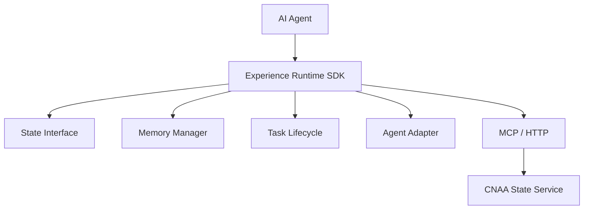
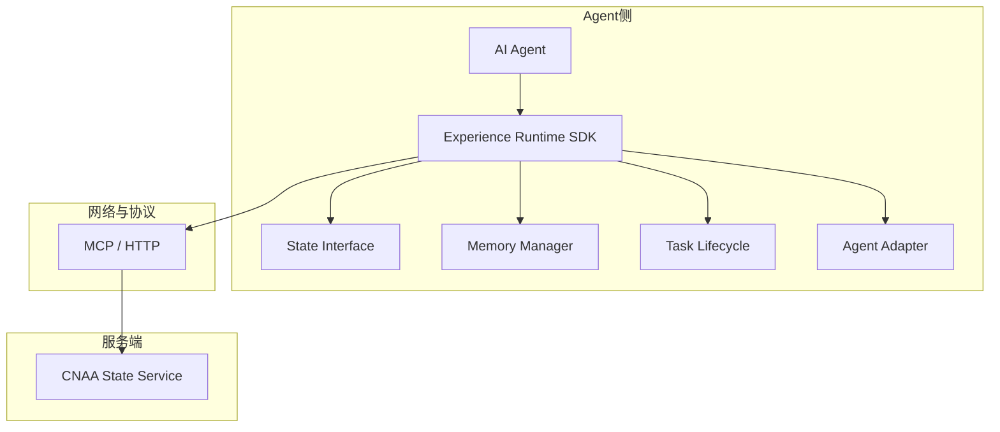
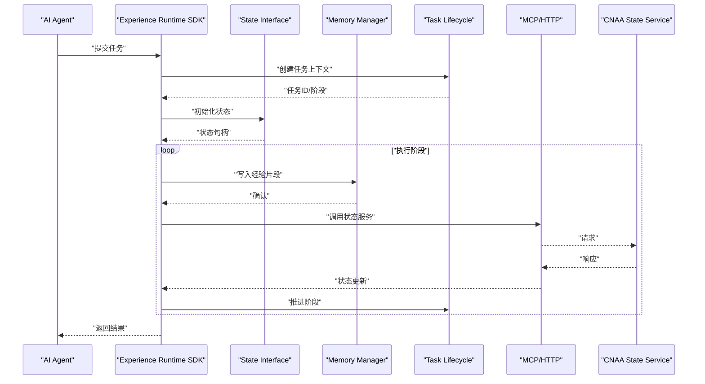
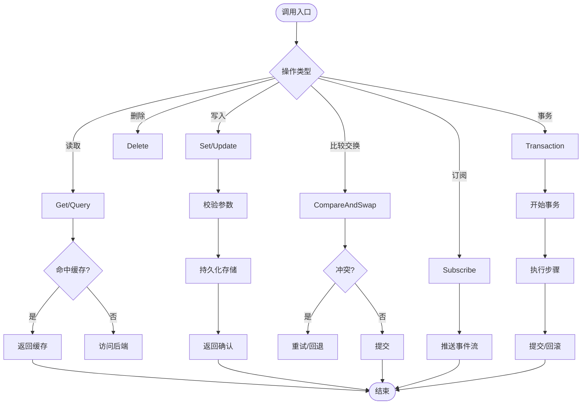
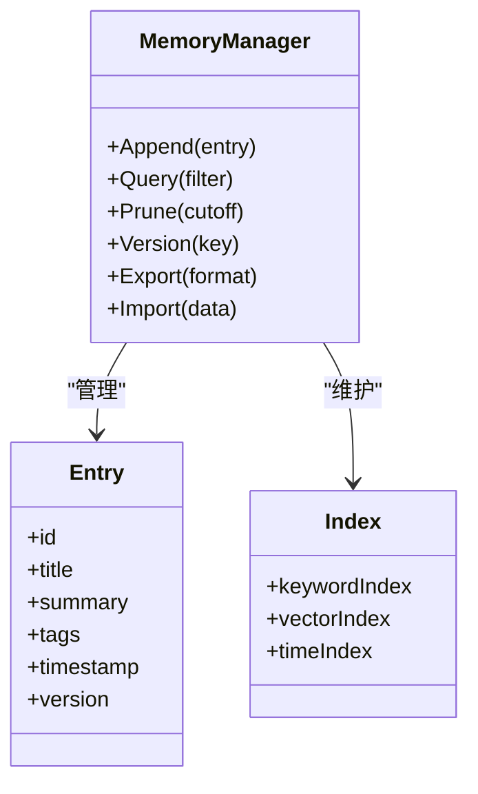
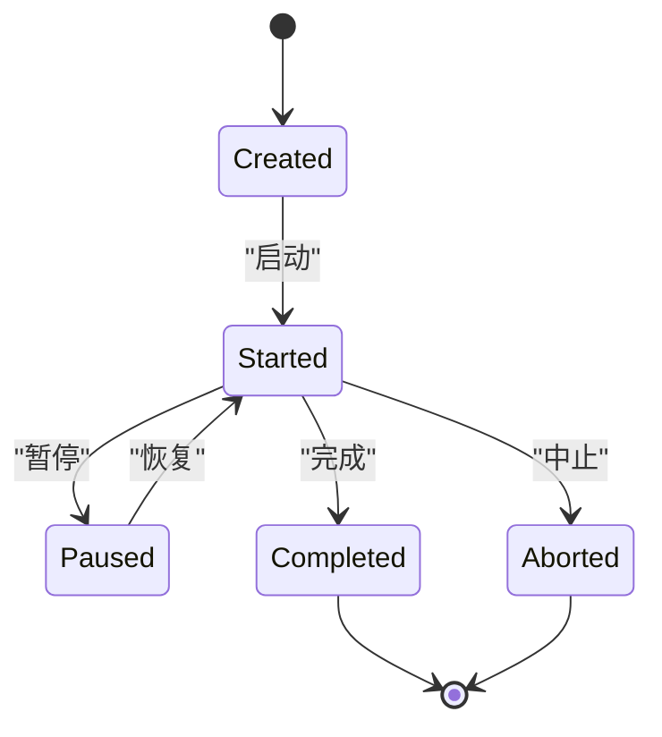
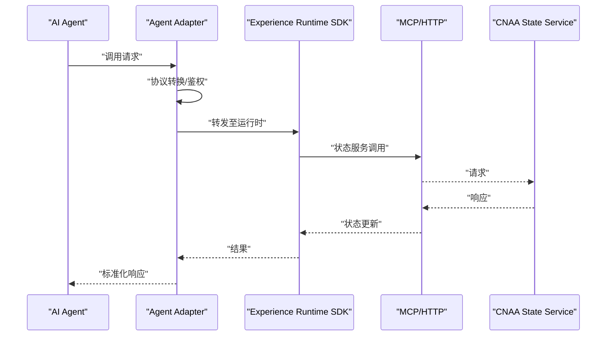
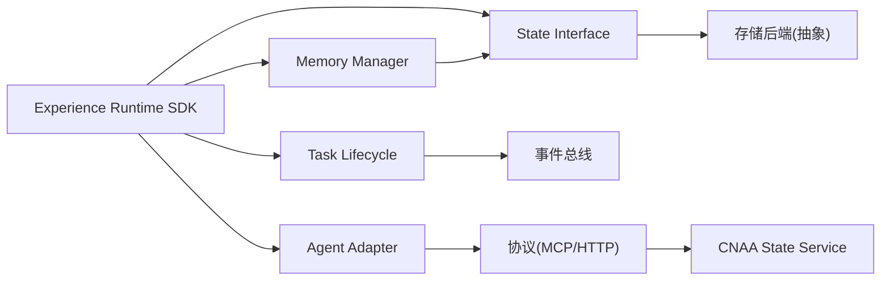

# 核心组件设计

<cite>
**本文档中引用的文件**
- [README.md](file://README.md)
- [README_CN.md](file://README_CN.md)
</cite>

## 目录
1. [简介](#简介)
2. [项目结构](#项目结构)
3. [核心组件](#核心组件)
4. [架构总览](#架构总览)
5. [详细组件分析](#详细组件分析)
6. [依赖关系分析](#依赖关系分析)
7. [性能考虑](#性能考虑)
8. [故障排查指南](#故障排查指南)
9. [结论](#结论)
10. [附录](#附录)

## 简介
本文件面向“云原生智能体架构（CNAA）”的核心组件设计，聚焦以下目标与范围：
- Experience Runtime SDK：为任意AI Agent提供轻量级经验运行时，使经验沉淀、状态同步与复用无需修改Agent内部推理逻辑。
- State Interface：统一的状态抽象接口，屏蔽底层存储差异，提供一致的状态读写语义。
- Memory Manager：持久化经验记忆的管理器，负责经验的增删改查、版本化、一致性保障与生命周期管理。
- Task Lifecycle：任务生命周期管理，定义任务的创建、执行、挂起、恢复、完成与清理等阶段及事件。
- Agent Adapter：Agent适配层，将不同Agent的调用约定与CNAA运行时对接，屏蔽异构差异。

此外，文档还涵盖组件间通信机制、事件处理流程、状态同步策略、错误处理机制、性能优化建议以及扩展与自定义模式。

## 项目结构
当前仓库以架构说明为主，核心内容集中在README文档中，描述了整体架构与组件划分。后续实现可按如下组织方式演进：
- docs/zh、docs/en：中英文文档目录（当前为空，待填充）
- README.md、README_CN.md：项目概述、特性、架构与路线图

图表来源
- [README.md:55-72](file://README.md#L55-L72)

章节来源
- [README.md:1-102](file://README.md#L1-L102)
- [README_CN.md:1-110](file://README_CN.md#L1-L110)

## 核心组件
本节对五大核心组件的职责边界、接口定义、数据结构与实现模式进行系统化阐述，并给出扩展与自定义的实践建议。

- Experience Runtime SDK
  - 职责边界：对外暴露统一的SDK API，协调State Interface、Memory Manager、Task Lifecycle与Agent Adapter；提供事件总线、上下文传播、重试与幂等控制。
  - 接口定义：任务提交、状态查询、事件订阅、配置注入、插件扩展点。
  - 数据结构：任务上下文、状态快照、事件模型、配置对象。
  - 实现模式：适配器模式（对接Agent）、观察者模式（事件驱动）、工厂模式（资源创建）、责任链（拦截与增强）。
  - 通信机制：通过事件总线与状态服务交互，支持同步与异步两种模式。
  - 错误处理：异常分类、降级策略、重试与补偿、审计日志。
  - 性能优化：缓存热点状态、批量写入、连接池、背压与限流。
  - 扩展点：自定义事件处理器、状态序列化器、存储后端、调度策略。

- State Interface
  - 职责边界：定义状态读写的统一契约，屏蔽底层存储实现差异；保证事务性与一致性语义。
  - 接口定义：Get/Set/Delete/CompareAndSwap/Subscribe/Transaction等。
  - 数据结构：状态键空间、值类型、元数据（版本、时间戳、标签）。
  - 实现模式：策略模式（多后端）、乐观锁（CAS）、事件溯源（可选）。
  - 通信机制：本地内存、远程服务（HTTP/MCP）、消息队列（可选）。
  - 错误处理：冲突检测、重试与退避、回滚与补偿。
  - 性能优化：索引与分片、读写分离、增量同步、压缩与编码。
  - 扩展点：新增存储后端、自定义序列化器、权限与审计钩子。

- Memory Manager
  - 职责边界：管理经验的持久化与生命周期，包括经验条目、版本、检索与聚合。
  - 接口定义：Append/Query/Prune/Version/Export/Import等。
  - 数据结构：经验条目（标题、摘要、向量/关键词、关联任务ID、时间戳）、版本树、索引表。
  - 实现模式：B+树/倒排索引、向量检索（可选）、合并与压缩。
  - 通信机制：与State Interface协作，必要时直连存储服务。
  - 错误处理：写入失败重试、数据校验、损坏修复。
  - 性能优化：批处理、预取与懒加载、冷热分层、压缩。
  - 扩展点：自定义索引策略、相似度算法、归档策略。

- Task Lifecycle
  - 职责边界：定义任务从创建到销毁的全生命周期，确保状态一致与可观测性。
  - 接口定义：Create/Start/Pause/Resume/Complete/Abort/Cleanup等。
  - 数据结构：任务元数据、阶段状态机、事件日志、依赖图。
  - 实现模式：状态机、工作单元（Unit of Work）、Saga（长事务编排，可选）。
  - 通信机制：事件驱动，发布任务状态变更事件。
  - 错误处理：阶段回滚、补偿动作、死信队列。
  - 性能优化：并行阶段、超时与心跳、检查点。
  - 扩展点：自定义阶段、监听器、调度策略。

- Agent Adapter
  - 职责边界：将不同Agent的调用协议与CNAA运行时对接，统一输入输出格式。
  - 接口定义：Invoke/Stream/Callback/HealthCheck等。
  - 数据结构：请求封装、响应映射、错误码映射。
  - 实现模式：适配器模式、桥接模式、装饰器（鉴权、限流、审计）。
  - 通信机制：HTTP/MCP/gRPC等，支持双向流式。
  - 错误处理：协议转换、重试、熔断与降级。
  - 性能优化：连接复用、缓冲与批处理、超时控制。
  - 扩展点：新增Agent类型、协议转换器、中间件。

章节来源
- [README.md:55-72](file://README.md#L55-L72)
- [README_CN.md:63-80](file://README_CN.md#L63-L80)

## 架构总览
下图展示了AI Agent通过Experience Runtime SDK与State Interface、Memory Manager、Task Lifecycle、Agent Adapter协同工作，并通过MCP/HTTP与CNAA State Service交互的整体架构。

图表来源
- [README.md:55-72](file://README.md#L55-L72)

## 详细组件分析

### Experience Runtime SDK
- 职责边界：作为运行时入口，协调各子系统，提供统一的API与事件能力。
- 关键流程：任务提交→状态初始化→经验写入→事件广播→结果返回。
- 事件处理：基于事件总线，支持订阅/发布、过滤与顺序保证。
- 状态同步：与State Interface协作，采用最终一致性或强一致性策略（可配置）。
- 错误处理：分类异常、重试策略、降级路径、审计追踪。
- 性能优化：缓存、批处理、连接池、背压。
- 扩展点：插件体系（拦截器、处理器、序列化器）。

图表来源
- [README.md:55-72](file://README.md#L55-L72)

章节来源
- [README.md:19-21](file://README.md#L19-L21)
- [README_CN.md:19-21](file://README_CN.md#L19-L21)

### State Interface
- 职责边界：统一状态读写契约，屏蔽存储差异，保证一致性与可扩展性。
- 关键操作：Get/Set/Delete/CAS/Subscribe/Transaction。
- 数据结构：键空间、值类型、元数据（版本、时间戳、标签）。
- 一致性模型：最终一致性（默认）、强一致性（可选）。
- 错误处理：冲突检测、重试与退避、回滚与补偿。
- 性能优化：索引、分片、读写分离、增量同步。
- 扩展点：新增存储后端、自定义序列化器、权限与审计钩子。

图表来源
- [README.md:55-72](file://README.md#L55-L72)

章节来源
- [README.md:45-51](file://README.md#L45-L51)
- [README_CN.md:53-60](file://README_CN.md#L53-L60)

### Memory Manager
- 职责边界：管理经验的持久化、版本化、检索与聚合。
- 关键操作：Append/Query/Prune/Version/Export/Import。
- 数据结构：经验条目、版本树、索引表。
- 一致性模型：写前日志（WAL）、合并与压缩。
- 错误处理：写入失败重试、数据校验、损坏修复。
- 性能优化：批处理、预取与懒加载、冷热分层、压缩。
- 扩展点：自定义索引策略、相似度算法、归档策略。

图表来源
- [README.md:55-72](file://README.md#L55-L72)

章节来源
- [README.md:45-51](file://README.md#L45-L51)
- [README_CN.md:53-60](file://README_CN.md#L53-L60)

### Task Lifecycle
- 职责边界：定义任务全生命周期，确保状态一致与可观测性。
- 关键阶段：Create/Start/Pause/Resume/Complete/Abort/Cleanup。
- 数据结构：任务元数据、阶段状态机、事件日志、依赖图。
- 一致性模型：状态机驱动、检查点与恢复。
- 错误处理：阶段回滚、补偿动作、死信队列。
- 性能优化：并行阶段、超时与心跳、检查点。
- 扩展点：自定义阶段、监听器、调度策略。

图表来源
- [README.md:55-72](file://README.md#L55-L72)

章节来源
- [README.md:55-72](file://README.md#L55-L72)
- [README_CN.md:63-80](file://README_CN.md#L63-L80)

### Agent Adapter
- 职责边界：将不同Agent的调用协议与CNAA运行时对接，统一输入输出格式。
- 关键操作：Invoke/Stream/Callback/HealthCheck。
- 数据结构：请求封装、响应映射、错误码映射。
- 一致性模型：幂等调用、重试与熔断。
- 错误处理：协议转换、重试、降级。
- 性能优化：连接复用、缓冲与批处理、超时控制。
- 扩展点：新增Agent类型、协议转换器、中间件。

图表来源
- [README.md:55-72](file://README.md#L55-L72)

章节来源
- [README.md:55-72](file://README.md#L55-L72)
- [README_CN.md:63-80](file://README_CN.md#L63-L80)

## 依赖关系分析
- 组件耦合：
  - Experience Runtime SDK依赖State Interface、Memory Manager、Task Lifecycle、Agent Adapter。
  - State Interface与Memory Manager通过统一接口协作。
  - Task Lifecycle与Event Bus解耦，通过事件驱动。
  - Agent Adapter与外部Agent松耦合，通过适配器模式隔离差异。
- 外部依赖：
  - MCP/HTTP用于与CNAA State Service通信。
  - 存储后端（由State Interface抽象）可替换。
- 潜在循环依赖：
  - 避免SDK直接依赖具体存储实现，应通过State Interface间接访问。
  - 事件总线与处理器之间保持单向依赖。

图表来源
- [README.md:55-72](file://README.md#L55-L72)

章节来源
- [README.md:55-72](file://README.md#L55-L72)
- [README_CN.md:63-80](file://README_CN.md#L63-L80)

## 性能考虑
- 缓存策略：热点状态缓存、经验片段预取、惰性加载。
- 批处理与合并：批量写入经验、合并小文件、压缩存储。
- 连接与并发：连接池、线程池、背压与限流。
- 一致性权衡：最终一致性优先，强一致性按需启用。
- 监控与可观测性：指标采集、链路追踪、审计日志。

[本节为通用指导，不直接分析具体文件]

## 故障排查指南
- 常见问题定位：
  - 状态不一致：检查CAS冲突、重试与回滚策略。
  - 经验丢失：验证WAL与备份恢复流程。
  - 任务卡住：查看状态机与检查点、超时设置。
  - 协议错误：核对Agent Adapter的映射与错误码。
- 诊断手段：
  - 启用详细日志与链路追踪。
  - 使用健康检查与探针。
  - 回放事件日志定位问题。

[本节为通用指导，不直接分析具体文件]

## 结论
CNAA通过Experience Runtime SDK将State Interface、Memory Manager、Task Lifecycle与Agent Adapter有机整合，为任意AI Agent提供轻量、可扩展且与Agent无关的经验运行时。其核心在于统一状态接口、持久化经验记忆、任务生命周期管理与协议适配，从而实现经验的持续积累、同步与复用。

[本节为总结性内容，不直接分析具体文件]

## 附录
- 术语表：
  - 经验：任务执行过程中产生的可复用知识片段。
  - 状态：运行时可变数据的抽象表示。
  - 事件：系统内状态变化的通知。
- 扩展清单：
  - 新增存储后端（State Interface）
  - 自定义索引策略（Memory Manager）
  - 新增Agent协议（Agent Adapter）
  - 自定义任务阶段（Task Lifecycle）

[本节为补充信息，不直接分析具体文件]