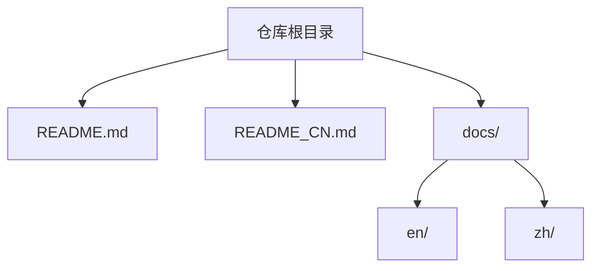
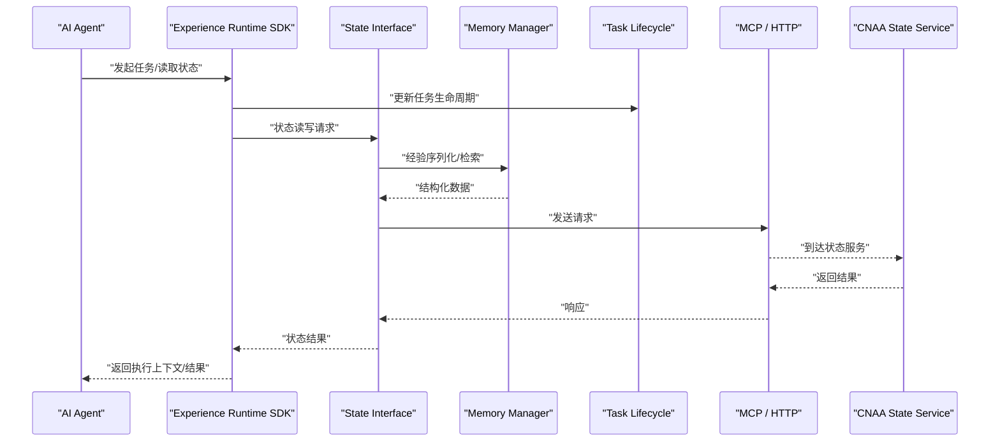
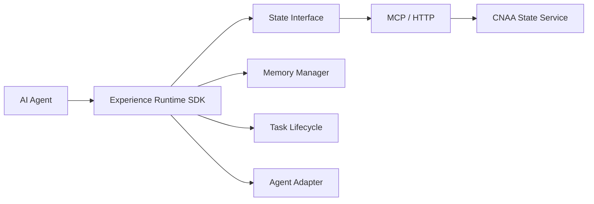
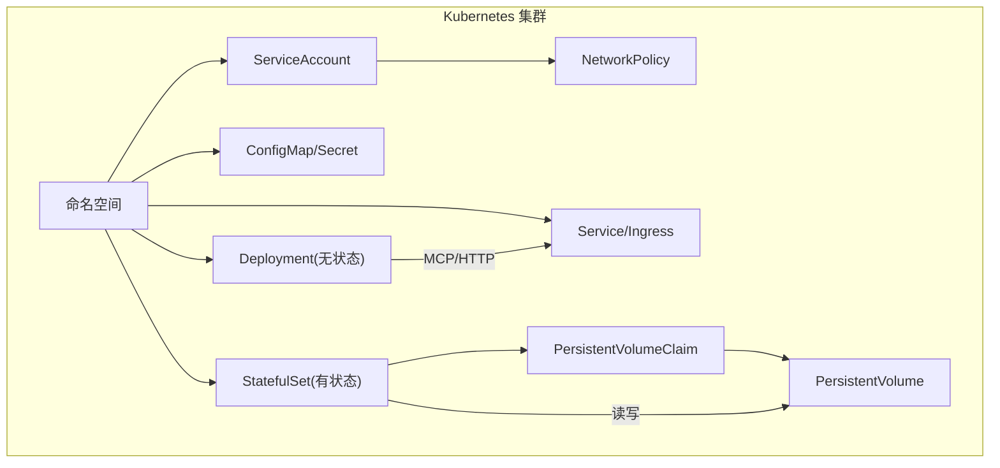

# 系统架构概览

<cite>
**本文引用的文件**   
- [README.md](file://README.md)
- [README_CN.md](file://README_CN.md)
</cite>

## 目录
1. [简介](#简介)
2. [项目结构](#项目结构)
3. [核心组件](#核心组件)
4. [架构总览](#架构总览)
5. [详细组件分析](#详细组件分析)
6. [依赖关系分析](#依赖关系分析)
7. [性能与可扩展性](#性能与可扩展性)
8. [部署与云原生支持](#部署与云原生支持)
9. [故障排查指南](#故障排查指南)
10. [结论](#结论)
11. [附录](#附录)

## 简介
CNAA（Cloud Native Agentic Architecture）是一个面向 AI Agent 的“经验运行时”框架，目标是在不修改 Agent 内部推理逻辑的前提下，为任意 Agent 提供持久化经验记忆、状态同步与跨任务复用能力。它不是 Agent 框架、工作流引擎或 RAG 实现，而是将“经验”从临时上下文提升为独立运行时资源，并通过统一的状态接口和轻量 SDK 与外部服务交互。

本概览文档聚焦高层架构设计：AI Agent、Experience Runtime SDK、State Interface、Memory Manager、Task Lifecycle、Agent Adapter 的职责与协作；MCP/HTTP 通信协议的使用方式；CNAA State Service 的服务架构；以及云原生部署（Kubernetes）的总体思路与基础设施需求。

**章节来源**
- [README.md:9-21](file://README.md#L9-L21)
- [README_CN.md:9-21](file://README_CN.md#L9-L21)

## 项目结构
当前仓库以说明性文档为主，包含中英文 README 与 docs 目录（示例占位）。整体结构简洁，便于后续扩展代码与文档。

**图表来源**
- [README.md:1-10](file://README.md#L1-L10)
- [README_CN.md:1-10](file://README_CN.md#L1-L10)

**章节来源**
- [README.md:1-10](file://README.md#L1-L10)
- [README_CN.md:1-10](file://README_CN.md#L1-L10)

## 核心组件
根据仓库中的架构图示，系统由以下核心组件构成：
- AI Agent：业务智能体，负责任务推理与执行。
- Experience Runtime SDK：嵌入到 Agent 侧的轻量运行时，提供状态读写、任务生命周期管理、记忆管理等能力。
- State Interface：统一状态抽象，屏蔽底层存储差异，对外暴露一致的状态操作语义。
- Memory Manager：负责经验的序列化、版本化、检索与同步策略。
- Task Lifecycle：定义任务的创建、推进、完成、失败等阶段及钩子。
- Agent Adapter：适配不同 Agent 的实现细节，将其接入统一的运行时。
- CNAA State Service：云端/本地可部署的状态服务，提供持久化与多实例同步能力。
- 通信层：通过 MCP/HTTP 与 State Service 交互。

这些组件共同构成“Agent → 运行时 → 状态服务”的分层架构，使经验成为独立于 Agent 的可共享、可复用的运行时资源。

**章节来源**
- [README.md:55-72](file://README.md#L55-L72)
- [README_CN.md:63-80](file://README_CN.md#L63-L80)

## 架构总览
下图展示了端到端的数据与控制流：Agent 通过 Experience Runtime SDK 调用统一状态接口，SDK 经 MCP/HTTP 与 CNAA State Service 通信，实现状态的持久化与同步。

**图表来源**
- [README.md:55-72](file://README.md#L55-L72)
- [README_CN.md:63-80](file://README_CN.md#L63-L80)

## 详细组件分析

### AI Agent
- 职责：承载领域知识与推理逻辑，调用 SDK 进行状态读写与任务推进。
- 约束：不应直接耦合底层存储或网络细节，保持与运行时解耦。
- 交互：通过 SDK 提供的 API 访问状态接口与生命周期管理。

**章节来源**
- [README.md:55-72](file://README.md#L55-L72)
- [README_CN.md:63-80](file://README_CN.md#L63-L80)

### Experience Runtime SDK
- 职责：封装状态接口、记忆管理、任务生命周期与 Agent 适配，向 Agent 暴露简洁 API。
- 关键点：屏蔽 MCP/HTTP 细节，提供重试、超时、幂等与错误映射。
- 扩展点：可插拔的适配器与中间件，便于接入不同 Agent 与存储后端。

**章节来源**
- [README.md:55-72](file://README.md#L55-L72)
- [README_CN.md:63-80](file://README_CN.md#L63-L80)

### State Interface（状态接口）
- 职责：定义一致的读写语义（如键值、文档、图结构等），对上层屏蔽存储实现。
- 特性：版本控制、冲突解决、一致性模型（最终一致/强一致可选）。
- 集成：与 Memory Manager 协作，完成经验的序列化与检索。

**章节来源**
- [README.md:55-72](file://README.md#L55-L72)
- [README_CN.md:63-80](file://README_CN.md#L63-L80)

### Memory Manager（记忆管理）
- 职责：经验的编码、压缩、索引、检索与同步策略（增量/全量）。
- 优化：缓存热点经验、异步写入、批量提交。
- 可靠性：校验与回滚机制，保证经验一致性。

**章节来源**
- [README.md:55-72](file://README.md#L55-L72)
- [README_CN.md:63-80](file://README_CN.md#L63-L80)

### Task Lifecycle（任务生命周期）
- 阶段：创建、运行中、完成、失败、取消等。
- 钩子：在关键阶段触发事件，用于审计、监控与补偿。
- 状态机：确保状态转换合法，避免并发冲突。

**章节来源**
- [README.md:55-72](file://README.md#L55-L72)
- [README_CN.md:63-80](file://README_CN.md#L63-L80)

### Agent Adapter（Agent 适配）
- 职责：桥接不同 Agent 框架/语言，将通用运行时能力适配到具体实现。
- 配置：连接参数、认证、超时、重试策略。
- 扩展：插件式适配，支持新 Agent 快速接入。

**章节来源**
- [README.md:55-72](file://README.md#L55-L72)
- [README_CN.md:63-80](file://README_CN.md#L63-L80)

### CNAA State Service（状态服务）
- 职责：提供高可用的状态存取、经验持久化、多实例同步与查询。
- 能力：水平扩展、分片/副本、备份恢复、鉴权与限流。
- 部署：容器化部署，支持 Kubernetes 编排。

**章节来源**
- [README.md:55-72](file://README.md#L55-L72)
- [README_CN.md:63-80](file://README_CN.md#L63-L80)

### 通信协议（MCP/HTTP）
- 角色：SDK 与 State Service 之间的传输通道。
- 特点：HTTP 作为通用传输，MCP 作为可能的消息协议（按需启用）。
- 安全：TLS、鉴权、签名、速率限制。

**章节来源**
- [README.md:55-72](file://README.md#L55-L72)
- [README_CN.md:63-80](file://README_CN.md#L63-L80)

## 依赖关系分析
- 组件内聚与耦合：SDK 对内聚合 SI/MM/TL/Adapter，对外仅暴露必要 API；与 State Service 通过 MCP/HTTP 松耦合。
- 外部依赖：网络库、序列化库、存储驱动（由 SI 抽象）、日志与监控。
- 潜在循环依赖：应避免 SDK 与 State Service 的直接双向依赖，通过接口与消息契约解耦。

**图表来源**
- [README.md:55-72](file://README.md#L55-L72)
- [README_CN.md:63-80](file://README_CN.md#L63-L80)

**章节来源**
- [README.md:55-72](file://README.md#L55-L72)
- [README_CN.md:63-80](file://README_CN.md#L63-L80)

## 性能与可扩展性
- 批处理与异步：Memory Manager 支持批量写入与异步落盘，降低网络与 IO 开销。
- 缓存策略：热点经验本地缓存，结合失效与一致性校验。
- 水平扩展：State Service 无状态化 + 外部存储，支持弹性扩缩容。
- 一致性权衡：默认最终一致，关键路径可切换强一致模式。
- 观测性：指标、链路追踪、审计日志，支撑容量规划与问题定位。

[本节为通用指导，无需特定文件引用]

## 部署与云原生支持
- 容器化：各组件打包为镜像，遵循最小权限与只读根文件系统原则。
- Kubernetes 编排：
  - Deployment/StatefulSet：State Service 使用有状态集，SDK/Adapter 使用无状态部署。
  - Service/Ingress：暴露内部服务与外部入口，支持 TLS 终止。
  - ConfigMap/Secret：集中化管理配置与密钥。
  - HPA/VPA：基于 CPU/内存与自定义指标自动扩缩容。
  - StorageClass：持久卷绑定数据库/对象存储。
- 网络与安全：
  - mTLS、RBAC、网络策略隔离命名空间。
  - 限流与熔断，保障服务稳定性。
- 运维：
  - 健康检查、就绪探针、优雅关闭。
  - 备份与灾难恢复策略。

[本图为概念性拓扑，未直接映射具体源码文件，故不提供图表来源]

## 故障排查指南
- 常见问题：
  - 连接失败：检查网络策略、证书、端口与代理设置。
  - 状态不一致：核对版本号与冲突解决策略，查看审计日志。
  - 性能抖动：观察缓存命中率、队列积压与 GC 情况。
- 诊断手段：
  - 启用调试日志与分布式追踪。
  - 使用健康检查与探针收集运行态信息。
  - 回放关键请求，定位断点。
- 恢复策略：
  - 回滚至稳定版本，清理脏数据后重试。
  - 扩容 State Service 并重新均衡负载。

[本节为通用指导，无需特定文件引用]

## 结论
CNAA 通过“经验运行时 + 统一状态接口 + 持久化状态服务”的分层设计，将经验沉淀为独立资源，使任意 Agent 在不侵入推理逻辑的情况下获得持续记忆与跨任务复用能力。其云原生友好的架构与清晰的扩展点，为大规模、高可用的 Agent 应用提供了坚实基础。

[本节为总结性内容，无需特定文件引用]

## 附录
- 术语表：
  - 经验：任务执行过程中产生的可复用知识或上下文片段。
  - 状态：运行时可见且可持久化的数据结构。
  - 生命周期：任务从创建到终结的阶段集合。
- 参考文档链接（仓库内导航）：
  - 快速开始、持久化记忆、状态接口、运行时 SDK、状态服务、MCP 接入、Agent 接入、整体架构等。

**章节来源**
- [README.md:76-86](file://README.md#L76-L86)
- [README_CN.md:84-94](file://README_CN.md#L84-L94)