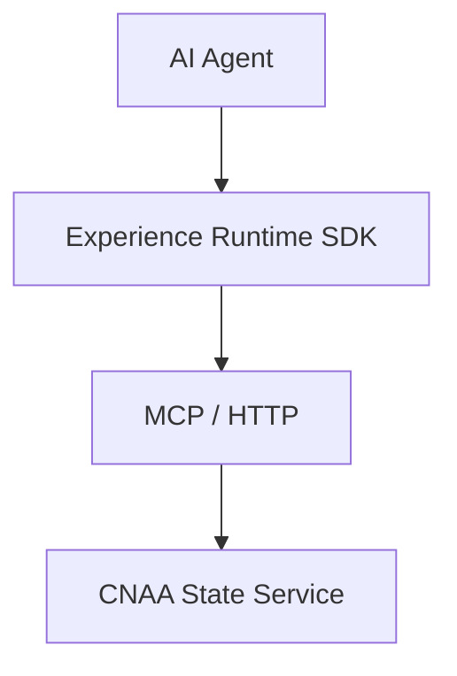
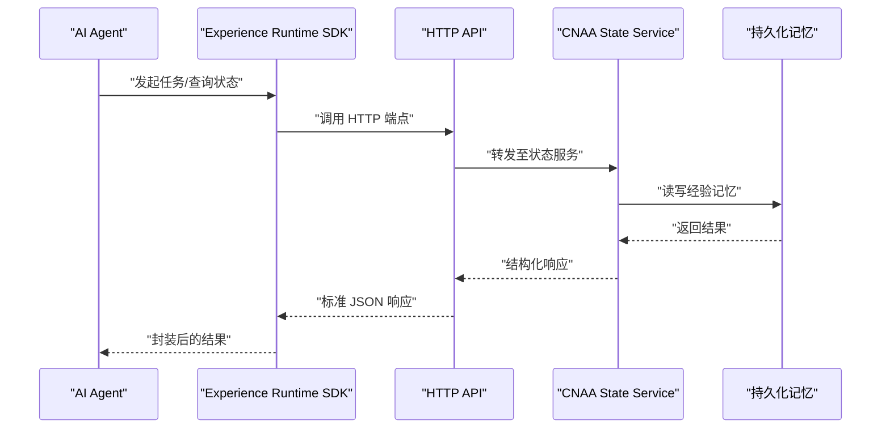
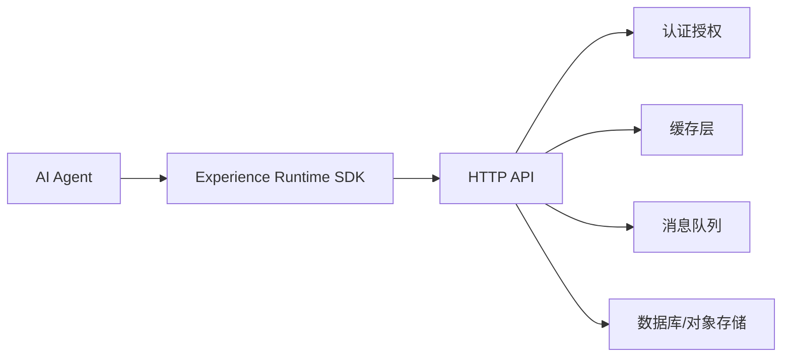

# HTTP API规范

<cite>
**本文引用的文件**   
- [README.md](file://README.md)
- [README_CN.md](file://README_CN.md)
</cite>

## 目录
1. [简介](#简介)
2. [项目结构](#项目结构)
3. [核心组件](#核心组件)
4. [架构总览](#架构总览)
5. [详细组件分析](#详细组件分析)
6. [依赖关系分析](#依赖关系分析)
7. [性能考虑](#性能考虑)
8. [故障排查指南](#故障排查指南)
9. [结论](#结论)
10. [附录](#附录)

## 简介
本规范面向 CNAA（Cloud Native Agentic Architecture）的 HTTP RESTful API，目标是帮助开发者快速理解并集成“经验运行时”与“持久化记忆”能力。根据仓库信息，CNAA 提供轻量级 Experience Runtime，使任意 AI Agent 在不修改推理逻辑的前提下实现经验的沉淀、同步与复用；并通过 MCP/HTTP 与 CNAA State Service 交互。当前仓库未包含具体代码实现与接口定义文档，因此本节给出基于仓库信息的总体说明与后续落地建议。

## 项目结构
仓库目前仅包含 README 中英文版本以及空的 docs 目录。API 相关的具体实现与接口契约尚未在仓库中提供。建议在后续迭代中补充如下内容：
- docs/zh/state-service.md：状态服务与 HTTP API 的详细规范
- docs/en/state-service.md：英文对照版
- 示例请求/响应与错误码表
- 鉴权与限流策略说明

图表来源 
- [README.md:55-72](file://README.md#L55-L72)
- [README_CN.md:63-80](file://README_CN.md#L63-L80)

章节来源
- [README.md:55-72](file://README.md#L55-L72)
- [README_CN.md:63-80](file://README_CN.md#L63-L80)

## 核心组件
依据仓库描述，系统由以下关键部分组成：
- AI Agent：业务智能体，调用体验运行时进行任务经验管理
- Experience Runtime SDK：为 Agent 提供统一的状态接口、记忆管理与任务生命周期管理能力
- MCP / HTTP：Agent 与状态服务之间的通信协议通道
- CNAA State Service：提供持久化经验记忆的运行时服务

这些组件共同构成“Agent 无关”的设计，支持云端或本地部署。

章节来源
- [README.md:55-72](file://README.md#L55-L72)
- [README_CN.md:63-80](file://README_CN.md#L63-L80)

## 架构总览
下图展示了从 Agent 到状态服务的整体交互路径，强调通过 MCP/HTTP 暴露的 API 边界。

图表来源 
- [README.md:55-72](file://README.md#L55-L72)
- [README_CN.md:63-80](file://README_CN.md#L63-L80)

## 详细组件分析
由于仓库未包含具体的 HTTP 端点定义与实现代码，本节以概念性方式说明未来应覆盖的 API 范围与最佳实践，便于后续设计与实现时参考。

### 状态接口（State Interface）
- 目标：提供统一的资源访问入口，屏蔽底层存储差异
- 典型能力：获取/更新会话状态、查询任务上下文、拉取经验片段
- 设计要点：幂等性、一致性、可观测性

### 记忆管理（Memory Manager）
- 目标：对经验进行增删改查、版本控制与检索
- 典型能力：写入经验条目、按维度检索、合并冲突、清理过期数据
- 设计要点：高吞吐写入、低延迟读取、索引优化

### 任务生命周期（Task Lifecycle）
- 目标：贯穿任务的创建、执行、完成、失败与归档
- 典型能力：创建任务、推进状态、记录日志、触发回调
- 设计要点：状态机清晰、事件驱动、可重试

### Agent 适配（Agent Adapter）
- 目标：将不同 Agent 的能力与 CNAA 状态接口对接
- 典型能力：协议转换、参数映射、错误归一化
- 设计要点：插件化、可扩展、最小侵入

[本节为概念性说明，不直接分析具体文件]

## 依赖关系分析
当前仓库未包含代码依赖清单。建议后续在实现阶段明确：
- HTTP 框架与路由库
- 认证授权中间件（如 JWT/OAuth2）
- 缓存层（Redis/Memcached）
- 消息队列（用于异步任务与事件）
- 数据库与对象存储（持久化记忆）

[本图为概念性依赖图，不映射具体源码文件]

## 性能考虑
- 连接与并发：使用连接池与异步 I/O，避免阻塞
- 缓存策略：热点经验与状态读多写少场景优先缓存
- 分页与过滤：列表接口默认分页，支持按时间/标签过滤
- 压缩与传输：启用 gzip/br 压缩，减少带宽占用
- 幂等与重试：客户端侧幂等键，服务端去重处理
- 监控与追踪：全链路埋点，指标上报与告警

[本节为通用指导，不直接分析具体文件]

## 故障排查指南
- 常见问题定位：检查鉴权头、请求体格式、超时与限流
- 日志与追踪：确保每个请求具备唯一 traceId
- 降级与熔断：依赖服务不可用时快速失败
- 回滚与补偿：事务性操作需具备补偿机制

[本节为通用指导，不直接分析具体文件]

## 结论
当前仓库提供了 CNAA 的高层理念与架构方向，但尚未包含具体的 HTTP API 实现与接口契约。建议在后续迭代中补齐状态服务与 HTTP API 的详细规范、鉴权与限流策略、错误码定义、测试用例与示例，以便开发者高效集成。

[本节为总结性内容，不直接分析具体文件]

## 附录
- 版本管理建议：采用 URL 前缀或请求头版本控制，保持向后兼容
- 错误码体系：统一错误码分类（客户端错误、服务端错误、业务错误）
- 安全建议：强制 HTTPS、最小权限原则、敏感字段脱敏
- 测试方法：单元测试、契约测试、端到端测试与压测

[本节为通用指导，不直接分析具体文件]