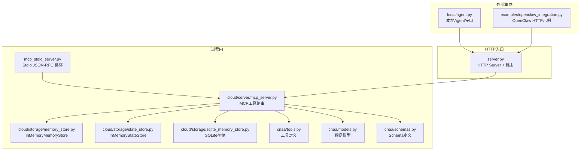
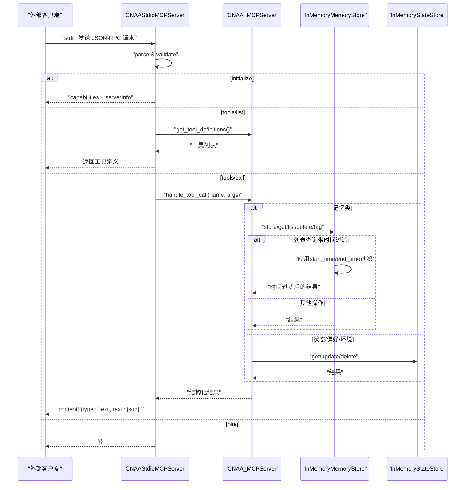
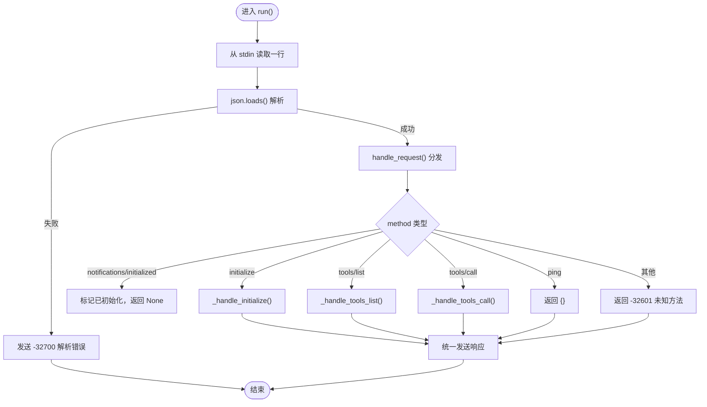
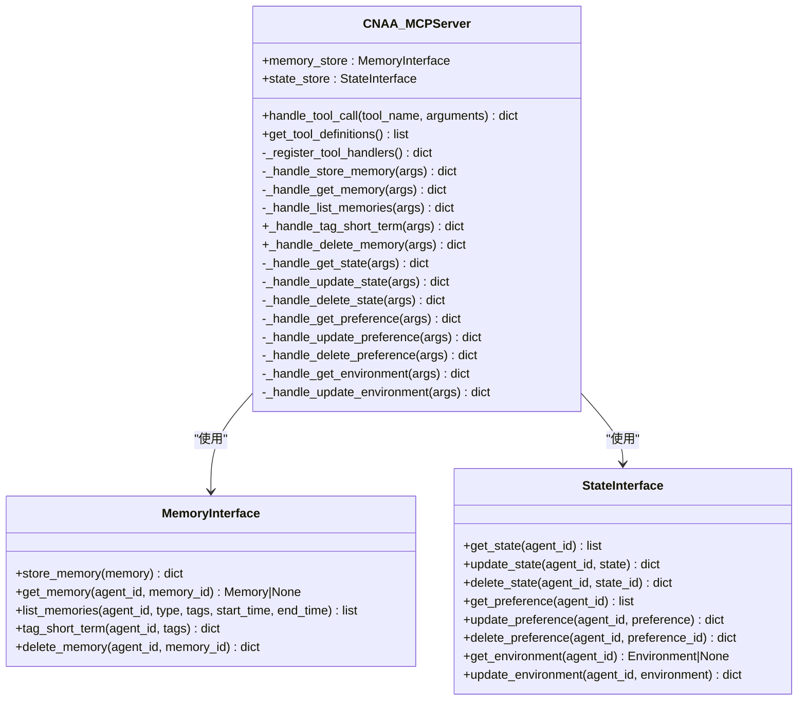
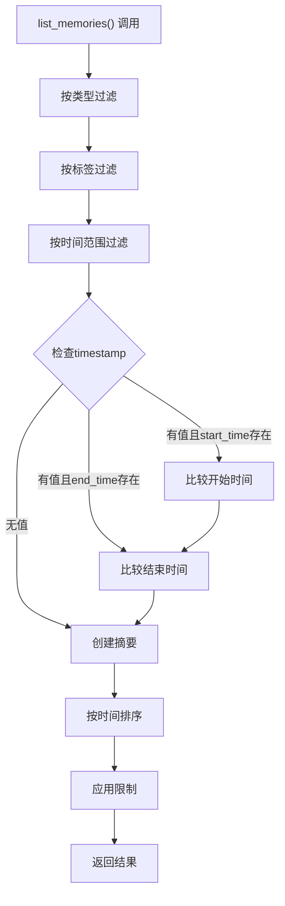
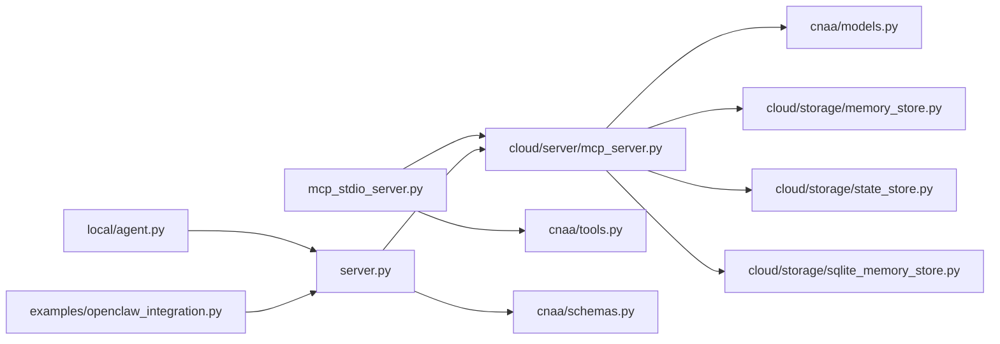

# MCP Stdio服务器

<cite>
**本文引用的文件**   
- [mcp_stdio_server.py](file://mcp_stdio_server.py)
- [server.py](file://server.py)
- [cloud/server/mcp_server.py](file://cloud/server/mcp_server.py)
- [cnaa/tools.py](file://cnaa/tools.py)
- [cnaa/models.py](file://cnaa/models.py)
- [cnaa/schemas.py](file://cnaa/schemas.py)
- [cloud/storage/memory_store.py](file://cloud/storage/memory_store.py)
- [cloud/storage/state_store.py](file://cloud/storage/state_store.py)
- [cloud/storage/sqlite_memory_store.py](file://cloud/storage/sqlite_memory_store.py)
- [tests/test_mcp_stdio_server.py](file://tests/test_mcp_stdio_server.py)
- [local/agent.py](file://local/agent.py)
- [examples/openclaw_integration.py](file://examples/openclaw_integration.py)
- [pyproject.toml](file://pyproject.toml)
- [README.md](file://README.md)
</cite>

## 更新摘要
**变更内容**   
- 增强了MCP服务器的时间过滤功能，新增start_time和end_time参数支持
- 更新了记忆列表查询的时间范围过滤逻辑
- 完善了存储后端的时序查询能力
- 扩展了工具调用参数的灵活性

## 目录
1. [简介](#简介)
2. [项目结构](#项目结构)
3. [核心组件](#核心组件)
4. [架构总览](#架构总览)
5. [详细组件分析](#详细组件分析)
6. [依赖关系分析](#依赖关系分析)
7. [性能与扩展性](#性能与扩展性)
8. [故障排查指南](#故障排查指南)
9. [结论](#结论)
10. [附录：工具清单与调用约定](#附录工具清单与调用约定)

## 简介
本仓库实现了一个基于标准输入/输出（stdio）的MCP（Model Context Protocol）服务器，用于将CNAA的经验持久化能力暴露给外部智能体框架（如OpenClaw）。该Stdio服务器遵循JSON-RPC 2.0协议，通过"一行一消息"的方式在stdin/stdout上收发请求与响应。同时，仓库还包含一个HTTP入口服务、MCP核心路由层、内存与状态存储后端、以及本地Agent接口和示例集成代码。

**更新** 增强了时间过滤功能，支持按时间范围查询记忆数据，提供更灵活的检索能力。

## 项目结构
- 顶层入口
  - mcp_stdio_server.py：Stdio模式的MCP服务器，负责解析JSON-RPC消息并路由到工具处理逻辑
  - server.py：HTTP模式的服务入口，提供/schemas、/mcp、/health三个端点
- 核心逻辑
  - cloud/server/mcp_server.py：MCP工具注册与路由、参数校验与结果封装
  - cnaa/tools.py：13个MCP工具的声明与描述
  - cnaa/models.py：数据模型定义（Memory、State、Preference、Environment等）
  - cnaa/schemas.py：统一的JSON Schema定义（请求/响应/数据）
- 存储后端
  - cloud/storage/memory_store.py：内存式记忆存储（InMemoryMemoryStore）
  - cloud/storage/state_store.py：内存式状态/偏好/环境存储（InMemoryStateStore）
  - cloud/storage/sqlite_memory_store.py：SQLite持久化存储实现
- 客户端与集成
  - local/agent.py：本地Agent接口，组合即时记忆、状态缓存与MCP客户端
  - examples/openclaw_integration.py：OpenClaw与CNAA的HTTP集成示例
- 测试与配置
  - tests/test_mcp_stdio_server.py：对Stdio服务器的单元测试
  - pyproject.toml：项目元数据与依赖
  - README.md：项目说明与架构概览

图表来源
- [mcp_stdio_server.py:1-240](file://mcp_stdio_server.py#L1-L240)
- [server.py:1-229](file://server.py#L1-L229)
- [cloud/server/mcp_server.py:1-438](file://cloud/server/mcp_server.py#L1-L438)
- [cloud/storage/memory_store.py:1-233](file://cloud/storage/memory_store.py#L1-L233)
- [cloud/storage/state_store.py:1-212](file://cloud/storage/state_store.py#L1-L212)
- [cloud/storage/sqlite_memory_store.py:1-286](file://cloud/storage/sqlite_memory_store.py#L1-L286)
- [cnaa/tools.py:1-247](file://cnaa/tools.py#L1-L247)
- [cnaa/models.py:1-274](file://cnaa/models.py#L1-L274)
- [cnaa/schemas.py:1-479](file://cnaa/schemas.py#L1-L479)
- [local/agent.py:1-491](file://local/agent.py#L1-L491)
- [examples/openclaw_integration.py:1-341](file://examples/openclaw_integration.py#L1-L341)

章节来源
- [README.md:1-174](file://README.md#L1-L174)
- [pyproject.toml:1-33](file://pyproject.toml#L1-L33)

## 核心组件
- CNAAStdioMCPServer：Stdio主循环，逐行读取JSON-RPC请求，分发到handle_request，支持initialize、notifications/initialized、tools/list、tools/call、ping等方法；错误与通知处理完善。
- CNAA_MCPServer：MCP工具路由中心，维护工具名到处理器的映射，统一异常包装与错误返回，提供get_tool_definitions。
- InMemoryMemoryStore / InMemoryStateStore：内存级CRUD实现，O(1)单条操作，O(n)列表扫描，适合开发与测试。
- SQLiteMemoryStore：SQLite持久化存储实现，支持索引优化和时间范围查询。
- cnaa.tools：集中定义13个MCP工具的名称、描述与输入Schema。
- cnaa.models：核心数据模型（Memory、State、Preference、Environment、InstantMemory等），含枚举与自动时间戳。
- cnaa.schemas：单一真相源（Single Source of Truth）的JSON Schema集合，供服务端与客户端共享。

**更新** 增强了时间过滤功能，支持start_time和end_time参数进行精确的时间范围查询。

章节来源
- [mcp_stdio_server.py:44-230](file://mcp_stdio_server.py#L44-L230)
- [cloud/server/mcp_server.py:56-145](file://cloud/server/mcp_server.py#L56-L145)
- [cloud/storage/memory_store.py:17-168](file://cloud/storage/memory_store.py#L17-L168)
- [cloud/storage/state_store.py:18-212](file://cloud/storage/state_store.py#L18-L212)
- [cloud/storage/sqlite_memory_store.py:19-286](file://cloud/storage/sqlite_memory_store.py#L19-L286)
- [cnaa/tools.py:72-186](file://cnaa/tools.py#L72-L186)
- [cnaa/models.py:42-274](file://cnaa/models.py#L42-L274)
- [cnaa/schemas.py:388-479](file://cnaa/schemas.py#L388-L479)

## 架构总览
系统采用"协议适配层 + 业务路由层 + 存储后端"的分层设计：
- 协议适配层：Stdio或HTTP两种接入方式，均遵循MCP工具调用约定
- 业务路由层：按工具名分派到具体处理器，构造/反序列化模型，调用存储
- 存储后端：当前为内存实现，可替换为持久化后端（SQLite/PostgreSQL等）

**更新** 增强了时间过滤功能，支持按时间范围查询记忆数据，提供更灵活的检索能力。

图表来源
- [mcp_stdio_server.py:65-230](file://mcp_stdio_server.py#L65-L230)
- [cloud/server/mcp_server.py:100-145](file://cloud/server/mcp_server.py#L100-L145)
- [cloud/storage/memory_store.py:42-168](file://cloud/storage/memory_store.py#L42-L168)
- [cloud/storage/state_store.py:45-212](file://cloud/storage/state_store.py#L45-L212)

## 详细组件分析

### Stdio服务器（CNAAStdioMCPServer）
- 功能要点
  - 逐行读取stdin，解析JSON-RPC 2.0消息
  - 支持initialize握手、notifications/initialized无响应、tools/list、tools/call、ping
  - 错误码符合JSON-RPC规范（-32700解析错误、-32601未知方法、-32603内部错误）
  - 所有响应以"一行一JSON"写入stdout并flush
- 关键流程
  - handle_request根据method分派
  - _handle_tools_call将结果包装为MCP content格式
  - _send_response统一序列化输出

图表来源
- [mcp_stdio_server.py:65-230](file://mcp_stdio_server.py#L65-L230)

章节来源
- [mcp_stdio_server.py:44-230](file://mcp_stdio_server.py#L44-L230)
- [tests/test_mcp_stdio_server.py:29-299](file://tests/test_mcp_stdio_server.py#L29-L299)

### HTTP服务器（server.py）
- 功能要点
  - 使用Python stdlib http.server，提供/schemas、/mcp、/health
  - /mcp接收{tool, arguments}，路由到CNAA_MCPServer.handle_tool_call
  - 统一错误响应与日志记录
- 启动方式
  - 命令行参数host/port，默认localhost:8080

章节来源
- [server.py:61-175](file://server.py#L61-L175)
- [server.py:177-229](file://server.py#L177-L229)

### MCP路由与服务（CNAA_MCPServer）
- 功能要点
  - 维护工具名到处理器的映射字典，O(1)路由
  - 统一异常捕获，返回status/message
  - 提供get_tool_definitions复用cnaa.tools
- 处理器分类
  - 记忆：store/get/list/tag/delete
  - 状态：get/update/delete
  - 偏好：get/update/delete
  - 环境：get/update

**更新** 增强了时间过滤功能，在_handle_list_memories方法中新增了对start_time和end_time参数的处理，支持ISO格式的时间字符串解析。

图表来源
- [cloud/server/mcp_server.py:56-438](file://cloud/server/mcp_server.py#L56-L438)
- [cloud/storage/memory_store.py:17-233](file://cloud/storage/memory_store.py#L17-L233)
- [cloud/storage/state_store.py:18-212](file://cloud/storage/state_store.py#L18-L212)

章节来源
- [cloud/server/mcp_server.py:78-145](file://cloud/server/mcp_server.py#L78-L145)

### 工具定义与Schema（cnaa.tools与cnaa.schemas）
- cnaa.tools：集中定义13个工具名称、描述与inputSchema，便于客户端发现与校验
- cnaa.schemas：单一真相源的JSON Schema集合，涵盖数据模型、请求、响应三类，并提供查询API

**更新** LIST_MEMORIES_REQUEST需要扩展以支持时间过滤参数，包括start_time和end_time字段。

章节来源
- [cnaa/tools.py:72-186](file://cnaa/tools.py#L72-L186)
- [cnaa/schemas.py:388-479](file://cnaa/schemas.py#L388-L479)

### 数据模型（cnaa.models）
- 枚举：MemoryType、MemoryStatus、StateCategory
- 数据类：Memory、TaskCheckpoint、State、Preference、Environment、InstantMemory、MemorySummary、SearchResult
- 特性：自动时间戳、开放JSON内容字段、复合标识键（agent_id, id）

章节来源
- [cnaa/models.py:42-274](file://cnaa/models.py#L42-L274)

### 存储后端（内存实现与SQLite实现）
- InMemoryMemoryStore：dict[(agent_id, memory_id)] -> Memory，线性扫描过滤type/tags，**新增时间范围过滤支持**
- InMemoryStateStore：三张表分别存State/Preference/Environment，按agent_id过滤
- SQLiteMemoryStore：SQLite持久化存储，支持索引优化和时间范围查询

**更新** 增强了时间过滤功能，InMemoryMemoryStore的list_memories方法现在支持start_time和end_time参数，实现精确的时间范围查询。

图表来源
- [cloud/storage/memory_store.py:77-155](file://cloud/storage/memory_store.py#L77-L155)

章节来源
- [cloud/storage/memory_store.py:77-155](file://cloud/storage/memory_store.py#L77-L155)
- [cloud/storage/state_store.py:45-212](file://cloud/storage/state_store.py#L45-L212)
- [cloud/storage/sqlite_memory_store.py:121-171](file://cloud/storage/sqlite_memory_store.py#L121-L171)

### 本地Agent接口与示例集成
- local/agent.py：组合即时记忆管理、状态缓存与MCP客户端，提供统一API
- examples/openclaw_integration.py：演示OpenClaw通过HTTP调用CNAA的/mcp端点

章节来源
- [local/agent.py:35-491](file://local/agent.py#L35-L491)
- [examples/openclaw_integration.py:16-341](file://examples/openclaw_integration.py#L16-L341)

## 依赖关系分析
- 模块耦合
  - mcp_stdio_server.py 依赖 cloud/server/mcp_server.py 与 cnaa/tools.py
  - server.py 依赖 cloud/server/mcp_server.py 与 cnaa/schemas.py
  - cloud/server/mcp_server.py 依赖 cnaa/models.py、cnaa/tools.py 与两个存储后端
  - 存储后端依赖 cnaa.models 与交互接口（interaction.py未在本仓库中展示）
- 外部依赖
  - pyproject.toml声明mcp>=1.0.0作为运行时依赖
- 潜在循环依赖
  - 当前未发现循环导入；各层职责清晰，单向依赖

**更新** 存储后端增强了对时间过滤的支持，增加了datetime类型的依赖处理。

图表来源
- [mcp_stdio_server.py:32-34](file://mcp_stdio_server.py#L32-L34)
- [server.py:50-52](file://server.py#L50-L52)
- [cloud/server/mcp_server.py:22-48](file://cloud/server/mcp_server.py#L22-L48)
- [pyproject.toml:12-14](file://pyproject.toml#L12-L14)

章节来源
- [pyproject.toml:1-33](file://pyproject.toml#L1-L33)

## 性能与扩展性
- 复杂度
  - 工具路由：O(1)字典查找
  - 记忆列表：O(n)线性扫描（可按需引入索引）
  - 状态/偏好列表：O(n)线性扫描（可按需引入索引）
  - **时间过滤：O(n)额外开销，但可通过数据库索引优化**
- 可扩展点
  - 存储后端替换：将InMemory*替换为SQLite/PostgreSQL实现
  - 批量与流式：TODO中提出批处理、流式进度通知
  - 缓存与限流：可在路由层增加请求级限流与只读缓存
  - 认证与鉴权：HTTP层可增加JWT/API Key校验
  - **时间索引优化：为timestamp字段建立数据库索引提升查询性能**
- 建议优化
  - 为agent_id和timestamp建立复合索引，提升列表查询性能
  - 对大payload进行分帧与压缩
  - 连接健康监控与优雅关闭

**更新** 时间过滤功能的加入为性能优化提供了新的方向，建议在大规模数据场景下考虑时间索引的优化。

章节来源
- [cloud/storage/memory_store.py:77-155](file://cloud/storage/memory_store.py#L77-L155)
- [cloud/storage/state_store.py:45-212](file://cloud/storage/state_store.py#L45-L212)
- [cloud/storage/sqlite_memory_store.py:56-59](file://cloud/storage/sqlite_memory_store.py#L56-L59)
- [server.py:27-39](file://server.py#L27-L39)
- [mcp_stdio_server.py:16-20](file://mcp_stdio_server.py#L16-L20)

## 故障排查指南
- 常见错误
  - JSON解析失败：-32700，检查stdin输入是否为合法JSON且每行一条
  - 未知方法：-32601，确认method为initialize、notifications/initialized、tools/list、tools/call或ping
  - 内部错误：-32603，查看stderr日志定位异常堆栈
  - **时间格式错误：start_time/end_time参数格式不正确导致解析失败**
- 调试步骤
  - 启用logging至stderr，观察请求处理过程
  - 使用tests/test_mcp_stdio_server.py中的用例模拟请求，验证响应格式
  - 对于HTTP模式，检查Content-Length与JSON字段是否完整
  - **验证时间参数格式是否符合ISO 8601标准**
- 典型问题
  - 工具不存在：返回status:error，message包含"Unknown tool"
  - 资源未找到：如get_memory返回not_found
  - **时间过滤无效：检查timestamp字段是否存在且格式正确**

**更新** 新增了时间过滤相关的故障排查指导，帮助开发者快速定位时间参数相关的问题。

章节来源
- [mcp_stdio_server.py:93-105](file://mcp_stdio_server.py#L93-L105)
- [mcp_stdio_server.py:144-154](file://mcp_stdio_server.py#L144-L154)
- [cloud/server/mcp_server.py:122-136](file://cloud/server/mcp_server.py#L122-L136)
- [cloud/server/mcp_server.py:269-279](file://cloud/server/mcp_server.py#L269-L279)
- [tests/test_mcp_stdio_server.py:176-209](file://tests/test_mcp_stdio_server.py#L176-L209)

## 结论
该MCP Stdio服务器以极简的协议适配层实现了CNAA经验持久化的标准化访问，结合清晰的工具定义与Schema，使外部智能体框架能够以一致的方式存取记忆、状态、偏好与环境上下文。**最新增强**的时间过滤功能进一步提升了数据检索的灵活性和精确度，支持按时间范围查询记忆数据。当前内存存储满足开发测试需求，后续可通过替换存储后端、增加索引与缓存、引入认证与限流等手段提升生产可用性。

## 附录：工具清单与调用约定
- 工具类别
  - 记忆：cnaa_store_memory、cnaa_get_memory、cnaa_list_memories、cnaa_tag_short_term、cnaa_delete_memory
  - 状态：cnaa_get_state、cnaa_update_state、cnaa_delete_state
  - 偏好：cnaa_get_preference、cnaa_update_preference、cnaa_delete_preference
  - 环境：cnaa_get_environment、cnaa_update_environment
- 调用约定
  - Stdio：JSON-RPC 2.0，一行一消息，tools/call的参数name与arguments
  - HTTP：POST /mcp，body为{tool, arguments}
  - 响应：tools/call返回content数组，其中包含文本形式的JSON结果
  - **时间过滤：cnaa_list_memories支持start_time和end_time参数，格式为ISO 8601字符串**

**更新** 新增了时间过滤参数的使用说明，cnaa_list_memories工具现在支持start_time和end_time参数进行精确的时间范围查询。

章节来源
- [cnaa/tools.py:83-186](file://cnaa/tools.py#L83-L186)
- [server.py:111-148](file://server.py#L111-L148)
- [mcp_stdio_server.py:193-218](file://mcp_stdio_server.py#L193-L218)
- [cloud/server/mcp_server.py:258-302](file://cloud/server/mcp_server.py#L258-L302)
- [cloud/storage/memory_store.py:77-155](file://cloud/storage/memory_store.py#L77-L155)