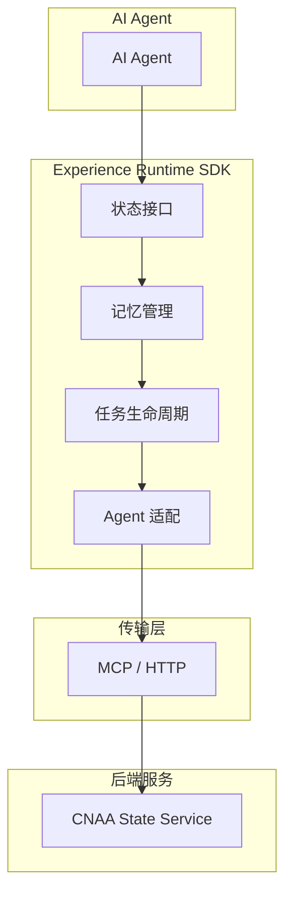
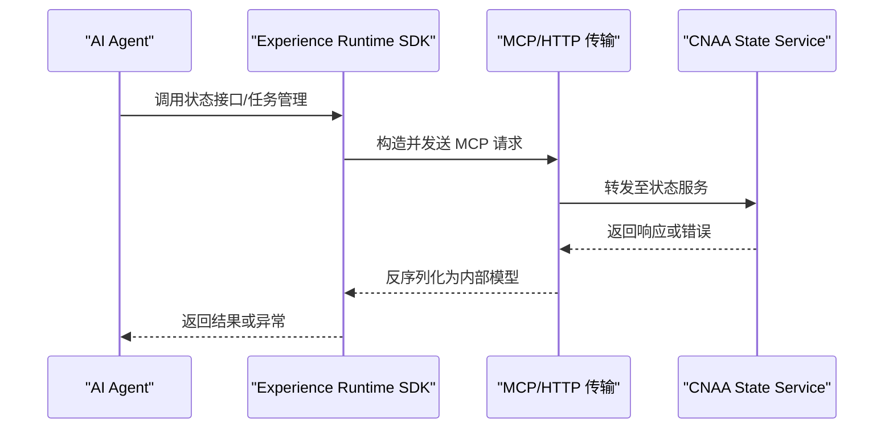

# MCP协议规范

<cite>
**本文引用的文件**   
- [README.md](file://README.md)
- [README_CN.md](file://README_CN.md)
</cite>

## 目录
1. [简介](#简介)
2. [项目结构](#项目结构)
3. [核心组件](#核心组件)
4. [架构总览](#架构总览)
5. [详细组件分析](#详细组件分析)
6. [依赖分析](#依赖分析)
7. [性能考虑](#性能考虑)
8. [故障排查指南](#故障排查指南)
9. [结论](#结论)
10. [附录](#附录)

## 简介
本规范面向 CNAA（Cloud Native Agentic Architecture）中的 MCP（Model Context Protocol）协议，旨在为开发者提供关于消息格式、请求/响应模式、连接建立与断开机制、安全与认证授权、错误处理策略、调用示例、版本兼容与扩展机制以及调试方法的系统化说明。当前仓库处于早期阶段，MCP 的具体实现尚未落地，本文基于仓库中已披露的架构与文档索引进行规范化设计，确保后续实现有据可依。

## 项目结构
仓库目前包含中英文 README，其中明确了 CNAA 的整体架构与文档索引，包括“MCP 接入”相关文档链接。MCP 在架构图中作为 Experience Runtime SDK 与 CNAA State Service 之间的通信通道之一出现，与 HTTP 并列。

图表来源 
- [README.md:55-73](file://README.md#L55-L73)
- [README_CN.md:63-80](file://README_CN.md#L63-L80)

章节来源
- [README.md:55-86](file://README.md#L55-L86)
- [README_CN.md:63-94](file://README_CN.md#L63-94)

## 核心组件
- 经验运行时（Experience Runtime）：提供状态接口、记忆管理、任务生命周期与 Agent 适配能力，是 MCP 的上层使用者。
- 传输通道（MCP / HTTP）：承载 MCP 消息，负责连接建立、会话管理与消息路由。
- 状态服务（CNAA State Service）：持久化经验与状态，对外暴露统一的状态接口。

章节来源
- [README.md:55-73](file://README.md#L55-L73)
- [README_CN.md:63-80](file://README_CN.md#L63-80)

## 架构总览
下图展示了 MCP 在 CNAA 中的位置与交互关系。Experience Runtime SDK 通过 MCP/HTTP 与 CNAA State Service 通信，完成状态的读取、写入与任务管理。

图表来源 
- [README.md:55-73](file://README.md#L55-L73)
- [README_CN.md:63-80](file://README_CN.md#L63-80)

## 详细组件分析

### 消息格式与编解码
- 建议采用 JSON-RPC 风格的消息体，包含 id、method、params、result/error 等字段，便于跨语言与版本演进。
- 支持批量请求与流式响应，满足高吞吐与低延迟场景。
- 定义统一的错误码与错误信息结构，便于客户端快速定位问题。

章节来源
- [README.md:55-73](file://README.md#L55-L73)
- [README_CN.md:63-80](file://README_CN.md#L63-80)

### 请求/响应模式
- 同步请求/响应：适用于状态查询、简单写入等操作。
- 异步任务：适用于耗时操作（如经验沉淀、批量同步），通过任务 ID 跟踪进度。
- 事件推送：服务端可主动推送状态变更事件，客户端订阅后实时响应。

章节来源
- [README.md:55-73](file://README.md#L55-L73)
- [README_CN.md:63-80](file://README_CN.md#L63-80)

### 连接建立与断开
- 建立：客户端发起握手，携带协议版本、能力协商与可选的身份令牌。
- 保活：心跳检测与超时重连，保障长连接稳定性。
- 断开：优雅关闭流程，确保未完成任务的补偿与资源释放。

章节来源
- [README.md:55-73](file://README.md#L55-L73)
- [README_CN.md:63-80](file://README_CN.md#L63-80)

### 安全性与认证授权
- 传输安全：强制 TLS 加密，证书校验与双向认证可选。
- 身份认证：支持 Token、JWT 或 mTLS 等方式，服务端验证并注入上下文。
- 授权控制：基于角色或资源的访问控制，细粒度到经验条目与任务级别。
- 审计与限流：记录关键操作日志，实施速率限制与配额管理。

章节来源
- [README.md:55-73](file://README.md#L55-L73)
- [README_CN.md:63-80](file://README_CN.md#L63-80)

### 错误处理策略
- 分类：网络错误、鉴权失败、业务校验失败、服务不可用等。
- 重试与退避：对幂等操作启用指数退避重试，非幂等操作避免自动重试。
- 降级与熔断：服务异常时返回缓存或默认值，保护上游与下游。
- 诊断信息：结构化错误码、错误消息与追踪 ID，便于排障。

章节来源
- [README.md:55-73](file://README.md#L55-L73)
- [README_CN.md:63-80](file://README_CN.md#L63-80)

### 常见调用示例
- 状态查询：获取指定经验或任务的状态快照。
- 经验保存：提交新的经验片段或更新现有经验。
- 任务管理：创建、查询、取消与轮询任务进度。
- 事件订阅：订阅状态变更事件，实现实时联动。

章节来源
- [README.md:55-73](file://README.md#L55-L73)
- [README_CN.md:63-80](file://README_CN.md#L63-80)

### 版本兼容与扩展机制
- 版本协商：握手阶段声明支持的协议版本，服务端按兼容性选择实现。
- 向后兼容：新增字段需默认值，废弃字段保留过渡期。
- 扩展点：预留 method 命名空间与自定义参数扩展，避免破坏既有契约。

章节来源
- [README.md:55-73](file://README.md#L55-L73)
- [README_CN.md:63-80](file://README_CN.md#L63-80)

### 调试方法与常见问题
- 调试方法：开启详细日志、启用追踪 ID、使用抓包工具观察握手与消息体。
- 常见问题：握手失败、鉴权错误、超时与重试风暴、序列化不一致。
- 解决方案：核对版本与能力协商、检查证书与令牌、调整超时与并发、统一序列化库。

章节来源
- [README.md:55-73](file://README.md#L55-L73)
- [README_CN.md:63-80](file://README_CN.md#L63-80)

## 依赖分析
MCP 依赖 Experience Runtime SDK 提供的状态接口与任务抽象，并通过传输层与 CNAA State Service 交互。该依赖关系清晰且内聚性良好，有利于独立演进与测试。

图表来源 
- [README.md:55-73](file://README.md#L55-L73)
- [README_CN.md:63-80](file://README_CN.md#L63-80)

章节来源
- [README.md:55-73](file://README.md#L55-L73)
- [README_CN.md:63-80](file://README_CN.md#L63-80)

## 性能考虑
- 连接复用与池化：减少握手开销，提升吞吐。
- 批处理与压缩：合并小消息，降低网络往返。
- 异步与非阻塞：避免阻塞主线程，提高并发能力。
- 缓存与本地状态：热点数据就近读取，降低远端压力。

[本节为通用指导，不直接分析具体文件]

## 故障排查指南
- 连接问题：检查网络连通性与防火墙策略，确认 TLS 配置正确。
- 认证失败：核验令牌有效期、权限范围与服务端配置。
- 超时与重试：合理设置超时阈值与重试次数，避免雪崩。
- 数据一致性：核对事务边界与幂等键，确保最终一致。

章节来源
- [README.md:55-73](file://README.md#L55-L73)
- [README_CN.md:63-80](file://README_CN.md#L63-80)

## 结论
MCP 作为 CNAA 中 Experience Runtime 与 State Service 的关键通信协议，承担着状态与经验的可靠传输职责。本文从消息格式、交互模式、连接管理、安全与错误处理、版本兼容与扩展等方面进行了系统化设计，为后续实现提供了清晰的规范基础。随着仓库中 MCP 实现的完善，可据此逐步落地与验证。

[本节为总结性内容，不直接分析具体文件]

## 附录
- 术语表：MCP、Experience Runtime、State Service、Agent 等。
- 参考文档：仓库中列出的“MCP 接入”与“整体架构”文档索引，待实现后补充细节。

章节来源
- [README.md:76-86](file://README.md#L76-L86)
- [README_CN.md:84-94](file://README_CN.md#L84-94)