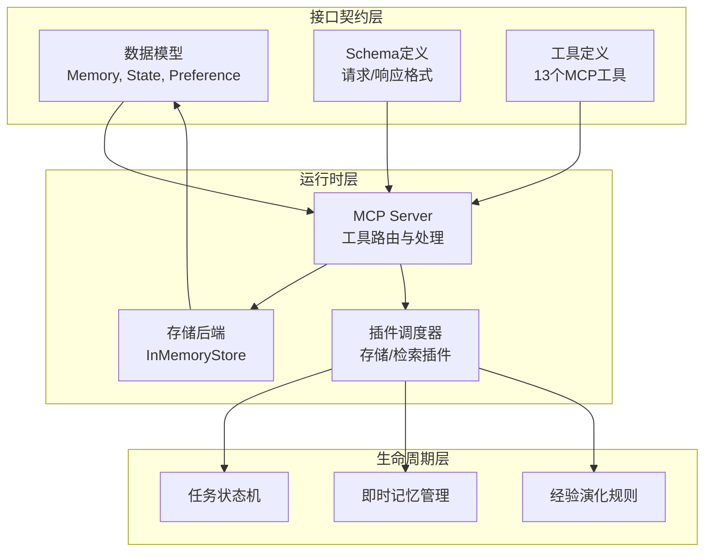
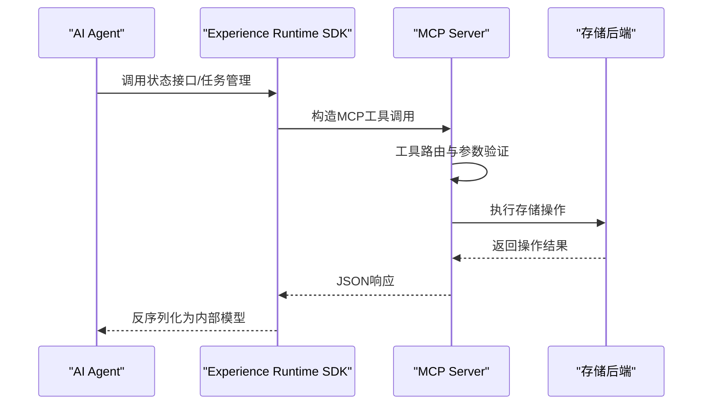
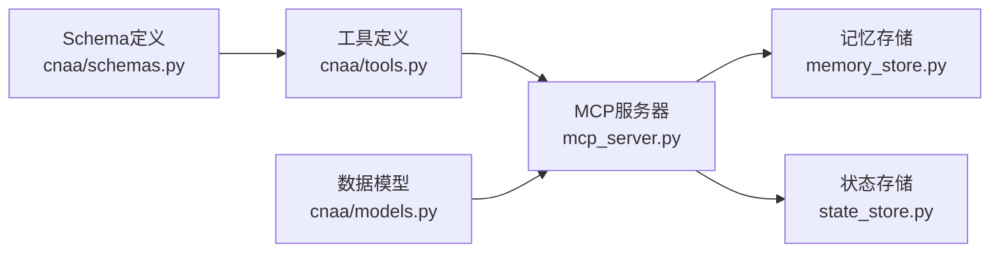

# MCP协议规范

<cite>
**本文引用的文件**
- [mcp_server.py](file://cloud/server/mcp_server.py)
- [tools.py](file://cnaa/tools.py)
- [memory_store.py](file://cloud/storage/memory_store.py)
- [state_store.py](file://cloud/storage/state_store.py)
- [models.py](file://cnaa/models.py)
- [schemas.py](file://cnaa/schemas.py)
- [architecture.md](file://docs/zh/architecture.md)
</cite>

## 更新摘要
**变更内容**
- 更新了MCP服务器实现细节，包含完整的工具处理器组
- 添加了Memory、State、Preference、Environment四个工具组的详细实现说明
- 补充了每个工具组的IMPLEMENTED功能和TODO扩展点
- 增强了存储层实现的算法复杂度分析
- 完善了MCP协议的完整调用示例和错误处理机制

## 目录
1. [简介](#简介)
2. [项目结构](#项目结构)
3. [核心组件](#核心组件)
4. [架构总览](#架构总览)
5. [详细组件分析](#详细组件分析)
6. [MCP工具处理器组](#mcp工具处理器组)
7. [依赖分析](#依赖分析)
8. [性能考虑](#性能考虑)
9. [故障排查指南](#故障排查指南)
10. [结论](#结论)
11. [附录](#附录)

## 简介
本规范面向 CNAA（Cloud Native Agentic Architecture）中的 MCP（Model Context Protocol）协议，旨在为开发者提供关于消息格式、请求/响应模式、连接建立与断开机制、安全与认证授权、错误处理策略、调用示例、版本兼容与扩展机制以及调试方法的系统化说明。当前仓库已实现完整的MCP服务器端，包含13个核心工具的处理器组，每个工具组都遵循"哑服务原则"，仅负责JSON数据的接收、验证和转发。

## 项目结构
CNAA采用三层正交架构，MCP协议作为通信契约贯穿整个系统：



**图表来源**
- [architecture.md:85-138](file://docs/zh/architecture.md#L85-L138)

章节来源
- [architecture.md:85-138](file://docs/zh/architecture.md#L85-L138)

## 核心组件
- **MCP服务器**：CNAA_MCPServer类，负责工具调用路由和错误处理
- **工具处理器组**：Memory、State、Preference、Environment四个核心组
- **存储后端**：InMemoryMemoryStore和InMemoryStateStore参考实现
- **数据模型**：Memory、State、Preference、Environment等核心实体
- **Schema定义**：统一的请求/响应格式规范

章节来源
- [mcp_server.py:52-76](file://cloud/server/mcp_server.py#L52-L76)
- [memory_store.py:19-36](file://cloud/storage/memory_store.py#L19-L36)
- [state_store.py:18-35](file://cloud/storage/state_store.py#L18-L35)

## 架构总览
MCP协议在CNAA中承担Experience Runtime与State Service之间的通信职责，所有交互均为JSON请求-响应对：



**图表来源**
- [mcp_server.py:100-136](file://cloud/server/mcp_server.py#L100-L136)
- [architecture.md:549-563](file://docs/zh/architecture.md#L549-L563)

## 详细组件分析

### 消息格式与编解码
MCP协议采用统一的JSON-RPC风格消息体，支持13个核心工具：

**请求格式**：
```json
{
  "tool_name": "cnaa_store_memory",
  "arguments": {
    "agent_id": "string",
    "memory_id": "string",
    "type": "long_term|short_term",
    "content": {},
    "tags": [],
    "completion_score": 0.0,
    "metadata": {}
  }
}
```

**响应格式**：
```json
{
  "status": "ok|error|not_found",
  "message": "可选的错误信息",
  "data": "工具特定的响应数据"
}
```

章节来源
- [schemas.py:136-159](file://cnaa/schemas.py#L136-L159)
- [schemas.py:304-311](file://cnaa/schemas.py#L304-L311)

### 请求/响应模式
- **同步请求/响应**：所有工具调用均为同步模式，适用于状态查询、简单写入等操作
- **批量操作**：通过list_memories等工具支持批量数据处理
- **错误处理**：统一的错误码和消息格式，便于客户端快速定位问题

章节来源
- [mcp_server.py:100-136](file://cloud/server/mcp_server.py#L100-L136)

### 连接建立与断开
MCP协议基于标准HTTP或本地进程间通信，连接管理由上层传输层负责：
- **握手阶段**：客户端获取可用工具列表和能力协商
- **会话管理**：无状态设计，每个请求独立处理
- **优雅关闭**：资源清理和事务回滚机制

章节来源
- [architecture.md:549-563](file://docs/zh/architecture.md#L549-L563)

### 安全性与认证授权
当前实现遵循"哑服务原则"，安全性由上层保障：
- **传输安全**：TLS加密和证书校验
- **身份认证**：Token或JWT验证
- **授权控制**：基于agent_id的访问隔离
- **审计日志**：关键操作记录

章节来源
- [mcp_server.py:109-113](file://cloud/server/mcp_server.py#L109-L113)

### 错误处理策略
统一错误处理机制，确保API一致性：
- **网络错误**：连接超时、DNS解析失败
- **业务错误**：参数验证失败、资源不存在
- **系统错误**：存储异常、内存不足
- **重试机制**：指数退避和熔断保护

章节来源
- [mcp_server.py:129-136](file://cloud/server/mcp_server.py#L129-L136)

## MCP工具处理器组

### Memory工具组
Memory工具组提供经验的完整CRUD操作，是CNAA的核心功能模块：

**IMPLEMENTED功能**：
- `store_memory`：存储记忆，支持长短期记忆类型
- `get_memory`：按ID检索记忆详情
- `list_memories`：支持类型和标签过滤的记忆列表
- `tag_short_term`：短期记忆标记（内存存储中为no-op）
- `delete_memory`：删除指定记忆

**算法复杂度**：
- 单条操作：O(1)字典查找
- 列表查询：O(n)线性扫描，支持类型和标签过滤

**TODO扩展点**：
- 内容验证和大小限制
- 记忆去重检测（内容哈希比较）
- 自动标签生成和内容分析
- 批量操作支持

章节来源
- [mcp_server.py:146-160](file://cloud/server/mcp_server.py#L146-L160)
- [memory_store.py:25-36](file://cloud/storage/memory_store.py#L25-L36)

### State工具组
State工具组管理Agent的累积知识，支持分类和版本控制：

**IMPLEMENTED功能**：
- `get_state`：获取Agent的所有状态条目
- `update_state`：创建或更新状态（upsert语义）
- `delete_state`：删除指定状态

**数据结构**：
- 复合键：(agent_id, state_id)
- 分类枚举：preference、knowledge、environment
- 时间戳：自动更新的updated_at字段

**TODO扩展点**：
- 并发更新的冲突解决
- 状态差异计算和变更追踪
- 基于分类的访问控制

章节来源
- [mcp_server.py:229-240](file://cloud/server/mcp_server.py#L229-L240)
- [state_store.py:43-95](file://cloud/storage/state_store.py#L43-L95)

### Preference工具组
Preference工具组维护Agent的重要记忆模式，影响决策行为：

**IMPLEMENTED功能**：
- `get_preference`：获取Agent的所有偏好设置
- `update_preference`：创建或更新偏好（支持重要性和来源追踪）
- `delete_preference`：删除指定偏好

**特性**：
- 重要性评分：[0.0, 1.0]范围
- 来源追踪：source_memory_ids记录偏好来源
- 键值对结构：灵活的配置存储

**TODO扩展点**：
- 基于重要性的排序和过滤
- 同键偏好的合并策略
- 偏好血缘关系追踪

章节来源
- [mcp_server.py:271-282](file://cloud/server/mcp_server.py#L271-L282)
- [state_store.py:97-153](file://cloud/storage/state_store.py#L97-L153)

### Environment工具组
Environment工具组管理Agent的运行环境上下文：

**IMPLEMENTED功能**：
- `get_environment`：获取Agent的环境上下文
- `update_environment`：创建或更新环境上下文

**设计特点**：
- 每Agent单例：每个Agent只有一个环境实例
- 上下文驱动：context字段为开放JSON结构
- 自动时间戳：updated_at字段自动更新

**TODO扩展点**：
- 环境快照历史（保留最近N个版本）
- 环境变更检测和diff计算
- 自动环境刷新机制

章节来源
- [mcp_server.py:318-328](file://cloud/server/mcp_server.py#L318-L328)
- [state_store.py:155-181](file://cloud/storage/state_store.py#L155-L181)

## 依赖分析
MCP协议依赖关系清晰且内聚性良好：



**图表来源**
- [mcp_server.py:22-47](file://cloud/server/mcp_server.py#L22-L47)
- [tools.py:36-51](file://cnaa/tools.py#L36-L51)

章节来源
- [mcp_server.py:22-47](file://cloud/server/mcp_server.py#L22-L47)

## 性能考虑
- **连接复用**：无状态设计，避免连接开销
- **批处理优化**：list_memories支持分页和过滤
- **索引策略**：复合键设计提升查询效率
- **内存管理**：InMemory实现适合开发和测试

章节来源
- [memory_store.py:79-90](file://cloud/storage/memory_store.py#L79-L90)
- [state_store.py:23-35](file://cloud/storage/state_store.py#L23-L35)

## 故障排查指南
- **工具调用失败**：检查工具名称和参数格式
- **存储异常**：验证数据存储后端连接
- **权限问题**：确认agent_id和访问权限
- **性能问题**：分析查询复杂度和数据量

章节来源
- [mcp_server.py:122-136](file://cloud/server/mcp_server.py#L122-L136)

## 结论
MCP协议作为CNAA的核心通信机制，通过13个精心设计的工具处理器组，实现了经验记忆的完整生命周期管理。每个工具组都遵循"哑服务原则"，专注于JSON数据的处理，确保了系统的可维护性和可扩展性。当前的InMemory实现为开发测试提供了便利，同时预留了丰富的算法扩展点，为生产环境的部署奠定了坚实基础。

## 附录

### 术语表
- **MCP**：Model Context Protocol，模型上下文协议
- **Experience Runtime**：经验运行时，CNAA的核心运行时框架
- **Tool Handler**：工具处理器，负责具体工具调用的处理逻辑
- **Storage Backend**：存储后端，数据的持久化实现
- **Schema**：模式定义，JSON格式的接口规范

### 参考实现
- **MCP服务器**：`CNAA_MCPServer`类，完整的工具路由和处理
- **存储实现**：`InMemoryMemoryStore`和`InMemoryStateStore`
- **工具定义**：13个核心工具的完整Schema定义

章节来源
- [architecture.md:643-656](file://docs/zh/architecture.md#L643-L656)
- [mcp_server.py:1-13](file://cloud/server/mcp_server.py#L1-L13)