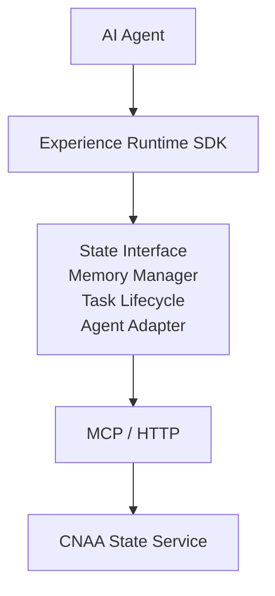
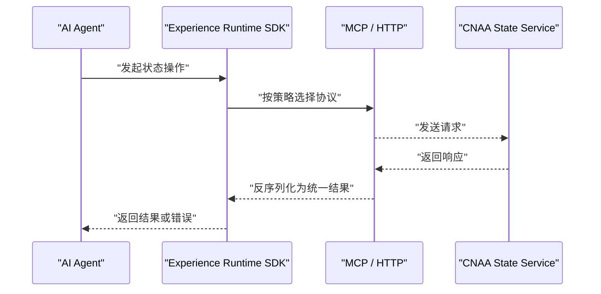
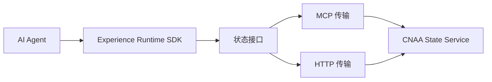

# 协议选择指南

<cite>
**本文档引用的文件**   
- [README.md](file://README.md)
- [README_CN.md](file://README_CN.md)
</cite>

## 目录
1. [简介](#简介)
2. [项目结构](#项目结构)
3. [核心组件](#核心组件)
4. [架构总览](#架构总览)
5. [详细组件分析](#详细组件分析)
6. [依赖关系分析](#依赖关系分析)
7. [性能考量与基准测试建议](#性能考量与基准测试建议)
8. [故障排查与监控指标](#故障排查与监控指标)
9. [结论与最佳实践](#结论与最佳实践)
10. [附录：配置与迁移步骤](#附录配置与迁移步骤)

## 简介
本指南聚焦于 CNAA 中“MCP”与“HTTP”两种协议的选型与实践，帮助你在不同部署环境与业务场景下做出合理选择。CNAA 提供轻量级 Experience Runtime，使 Agent 在不修改推理逻辑的前提下实现经验沉淀、状态同步与持续记忆；其运行时通过统一状态接口与后端 State Service 通信，支持 MCP/HTTP 两种传输方式。

## 项目结构
当前仓库为精简结构，包含中英文 README 与 docs 目录（待填充）。README 明确展示了整体架构：AI Agent → Experience Runtime SDK → MCP/HTTP → CNAA State Service。

图表来源
- [README.md:55-72](file://README.md#L55-L72)
- [README_CN.md:63-80](file://README_CN.md#L63-L80)

章节来源
- [README.md:55-72](file://README.md#L55-L72)
- [README_CN.md:63-80](file://README_CN.md#L63-L80)

## 核心组件
- AI Agent：业务智能体，调用 Experience Runtime SDK 完成状态读写与任务生命周期管理。
- Experience Runtime SDK：封装状态接口、记忆管理、任务生命周期与 Agent 适配，屏蔽底层协议差异。
- 状态接口层：对外暴露统一的状态访问能力，内部路由到具体协议实现。
- 传输层（MCP/HTTP）：负责将状态请求序列化并发送至 State Service。
- CNAA State Service：持久化与同步经验状态的后台服务。

章节来源
- [README.md:55-72](file://README.md#L55-L72)
- [README_CN.md:63-80](file://README_CN.md#L63-L80)

## 架构总览
下图展示从 Agent 到 State Service 的端到端交互路径，以及 MCP/HTTP 在其中的位置。

图表来源
- [README.md:55-72](file://README.md#L55-L72)
- [README_CN.md:63-80](file://README_CN.md#L63-L80)

## 详细组件分析

### 协议对比与适用场景
- MCP（面向消息/事件驱动）
  - 特点：适合低延迟、双向通信、流式数据与实时推送场景；天然契合事件驱动与长连接。
  - 适用场景：实时通信、增量状态同步、流式更新、交互式会话。
  - 优势：低时延、高吞吐、资源占用更友好（长连接复用）。
  - 注意：需要服务端具备事件分发与连接管理能力；对网络稳定性要求较高。
- HTTP（请求-响应）
  - 特点：简单通用、易于代理与缓存、便于批量处理与幂等设计。
  - 适用场景：批量操作、离线批处理、跨域集成、传统网关/负载均衡环境。
  - 优势：生态成熟、可观测性强、易于水平扩展与灰度发布。
  - 注意：短连接开销较大，不适合高频小包的实时场景。

章节来源
- [README.md:55-72](file://README.md#L55-L72)
- [README_CN.md:63-80](file://README_CN.md#L63-L80)

### 部署环境下的协议选择策略
- 云原生环境（Kubernetes、Service Mesh、Serverless）
  - 优先评估 MCP：若存在大量实时交互与流式状态更新，MCP 能降低握手开销与时延。
  - 使用 HTTP：当以批处理为主、需借助 API Gateway/Ingress 做限流与熔断时，HTTP 更易治理。
- 本地部署（单机/容器化开发调试）
  - 快速验证可用 HTTP，简化链路；稳定后根据负载特征切换至 MCP。
- 混合部署
  - 推荐“读多写少 + 实时推送”场景采用 HTTP 读取 + MCP 推送的组合，兼顾一致性与时效性。

章节来源
- [README.md:55-72](file://README.md#L55-L72)
- [README_CN.md:63-80](file://README_CN.md#L63-L80)

### 协议切换与迁移步骤
- 目标
  - 在不改动 Agent 推理逻辑的前提下，平滑切换底层传输协议。
- 关键要点
  - 通过 Experience Runtime SDK 的“状态接口”屏蔽协议差异，仅调整传输层配置。
  - 保持接口契约不变，确保向后兼容。
- 迁移流程（概念性步骤）
  1) 准备：确认 State Service 同时支持 MCP/HTTP 接入点。
  2) 配置：在 SDK 侧设置默认协议与回退策略（如 HTTP→MCP 或反之）。
  3) 灰度：先以小流量切至新协议，观察错误率与时延分布。
  4) 放量：逐步扩大比例，直至全量切换。
  5) 回滚：出现异常时立即切回原协议，保留审计日志与指标。
- 注意事项
  - 幂等与重试：HTTP 更适合显式幂等控制；MCP 需在应用层保证去重。
  - 超时与背压：MCP 长连接需关注心跳与背压；HTTP 需合理设置超时与并发上限。
  - 可观测性：统一埋点与追踪，确保跨协议可比对。

章节来源
- [README.md:55-72](file://README.md#L55-L72)
- [README_CN.md:63-80](file://README_CN.md#L63-L80)

### 使用场景推荐
- 实时通信：优先 MCP（低时延、流式、双向）。
- 批量操作：优先 HTTP（易并行、幂等、易治理）。
- 跨系统对接：优先 HTTP（标准 REST/JSON，生态完善）。
- 事件驱动：优先 MCP（事件总线、订阅发布）。

章节来源
- [README.md:55-72](file://README.md#L55-L72)
- [README_CN.md:63-80](file://README_CN.md#L63-L80)

### 混合使用的架构设计与最佳实践
- 架构模式
  - “HTTP 查询 + MCP 推送”：查询走 HTTP，变更通过 MCP 推送，减少轮询。
  - “HTTP 批处理 + MCP 实时反馈”：批任务提交走 HTTP，进度与结果通过 MCP 回调。
- 最佳实践
  - 统一状态接口：SDK 层抽象，屏蔽协议细节。
  - 统一错误模型：跨协议一致的错误码与语义。
  - 统一可观测性：指标、日志、追踪三件套对齐。
  - 安全与鉴权：统一认证方案（如 mTLS/JWT），避免双栈不一致。

章节来源
- [README.md:55-72](file://README.md#L55-L72)
- [README_CN.md:63-80](file://README_CN.md#L63-L80)

## 依赖关系分析
- 耦合与内聚
  - SDK 与 State Service 通过“状态接口”解耦，协议实现位于传输层，内聚良好。
- 外部依赖
  - 网络栈（TCP/HTTP）、可能的消息中间件（MCP 服务端）、网关/负载均衡（HTTP）。
- 潜在风险
  - 协议不兼容升级、连接池与线程模型不当导致拥塞、跨协议一致性保障不足。

图表来源
- [README.md:55-72](file://README.md#L55-L72)
- [README_CN.md:63-80](file://README_CN.md#L63-L80)

## 性能考量与基准测试建议
- 关键指标
  - 时延：P50/P95/P99 延迟、首字节时延（MCP 流式）。
  - 吞吐：QPS/TPS、并发连接数、CPU/内存占用。
  - 可靠性：错误率、重试成功率、超时率、连接中断率。
- 测试方法
  - 构造典型工作负载：实时流式 vs 批量写入。
  - 固定数据集与网络拓扑，分别跑通 MCP/HTTP 基线。
  - 引入压力峰值与抖动，观察弹性与恢复时间。
- 优化建议
  - MCP：连接池与心跳调优、背压与限流、零拷贝与高效序列化。
  - HTTP：连接复用、压缩、分页与批量合并、缓存与 CDN（只读路径）。
  - 通用：异步 I/O、无锁队列、热点键分片、读写分离。

[本节为通用指导，无需特定文件引用]

## 故障排查与监控指标
- 常见问题
  - 连接失败/频繁断连（MCP）：检查网络、证书、防火墙与连接池上限。
  - 超时与重试风暴（HTTP）：核对超时阈值、重试退避策略与幂等性。
  - 数据不一致：检查事务边界、幂等与冲突解决策略。
- 监控指标
  - 传输层：连接数、握手耗时、重传次数、丢包率。
  - 应用层：请求/响应大小、序列化/反序列化耗时、错误码分布。
  - 服务层：CPU/内存/GC、磁盘 IO、数据库慢查询。
- 排障流程
  - 定位问题阶段（接入层/传输层/服务层/存储层）→ 采集指标与日志 → 复现最小用例 → 修复与回归验证。

[本节为通用指导，无需特定文件引用]

## 结论与最佳实践
- 选择原则
  - 实时与流式优先 MCP；批量与标准化优先 HTTP。
  - 云原生环境结合 Service Mesh 与 API Gateway 进行治理。
- 演进路线
  - 先用 HTTP 快速上线，再根据负载特征迁移至 MCP 或混合架构。
- 工程化保障
  - 统一接口、统一错误模型、统一可观测性；灰度发布与快速回滚。

[本节为总结性内容，无需特定文件引用]

## 附录：配置与迁移步骤
- 配置要点（概念性）
  - 传输层开关：启用/禁用 MCP 或 HTTP。
  - 默认协议与回退策略：主用协议失败时自动降级。
  - 连接参数：超时、重试、并发、缓冲大小。
  - 安全参数：mTLS、鉴权令牌、域名与端口。
- 迁移清单
  - 接口契约校验 → 协议配置切换 → 灰度放量 → 指标对比 → 全量切换 → 归档与复盘。
- 回滚预案
  - 一键回滚脚本、快照与审计日志保留、告警阈值与通知通道。

[本节为通用指导，无需特定文件引用]