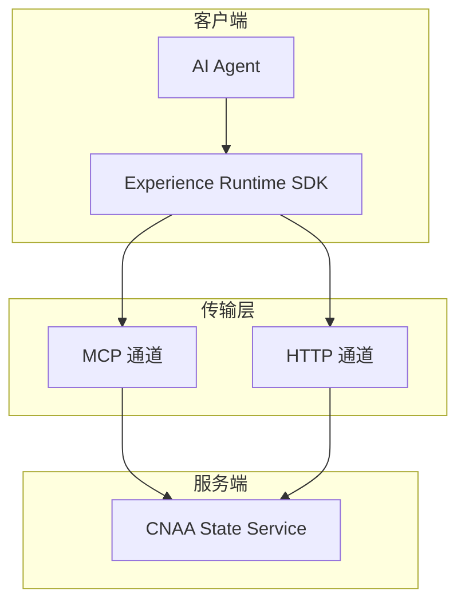
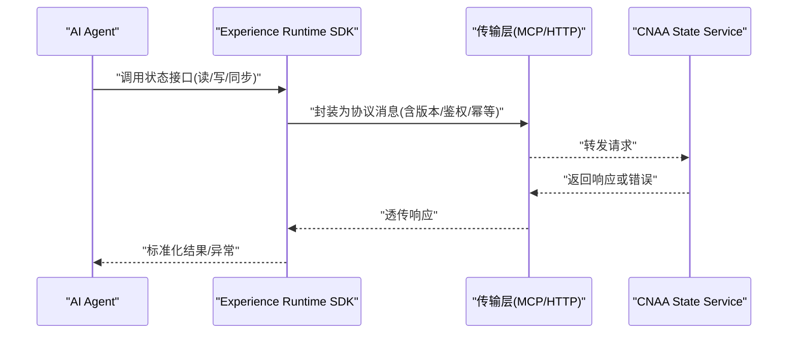
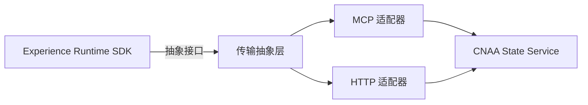

# 通信协议设计

<cite>
**本文引用的文件**   
- [README.md](file://README.md)
- [README_CN.md](file://README_CN.md)
</cite>

## 目录
1. [简介](#简介)
2. [项目结构](#项目结构)
3. [核心组件](#核心组件)
4. [架构总览](#架构总览)
5. [详细组件分析](#详细组件分析)
6. [依赖关系分析](#依赖关系分析)
7. [性能考虑](#性能考虑)
8. [故障排查指南](#故障排查指南)
9. [结论](#结论)
10. [附录](#附录)

## 简介
本文件面向 CNAA（Cloud Native Agentic Architecture）的通信协议设计，重点阐述 MCP（Model Context Protocol）与 HTTP 两种传输方式在经验运行时中的角色、消息格式、请求/响应模式、错误处理机制、版本兼容性策略，以及安全、认证授权与性能优化要点。同时给出可扩展新协议的指导方法与调试建议。由于当前仓库仅包含顶层说明文档，未提供具体实现代码，本文基于仓库中明确提及的“MCP / HTTP”作为 Experience Runtime SDK 与 CNAA State Service 之间的传输通道进行设计与规范说明，确保后续实现有据可依。

## 项目结构
仓库目前包含中英文 README 与空文档目录，表明该项目处于早期阶段，核心概念与架构已在 README 中概述：Experience Runtime SDK 通过 MCP 或 HTTP 与 CNAA State Service 交互，以完成状态同步与持久化记忆。

图表来源 
- [README.md:55-73](file://README.md#L55-L73)
- [README_CN.md:63-80](file://README_CN.md#L63-L80)

章节来源
- [README.md:55-73](file://README.md#L55-L73)
- [README_CN.md:63-80](file://README_CN.md#L63-L80)

## 核心组件
- 经验运行时 SDK：为 Agent 提供统一的状态接口、记忆管理与任务生命周期管理，屏蔽底层传输差异（MCP/HTTP）。
- 传输通道：
  - MCP：面向模型上下文的高内聚、低耦合的消息协议，适合结构化上下文交换与工具调用场景。
  - HTTP：通用 RESTful API 通道，便于跨语言、跨平台集成与快速接入。
- CNAA State Service：提供统一的持久化经验存储与状态同步能力，对外暴露 MCP/HTTP 接口。

章节来源
- [README.md:55-73](file://README.md#L55-L73)
- [README_CN.md:63-80](file://README_CN.md#L63-L80)

## 架构总览
下图展示从 Agent 到 State Service 的端到端数据流，SDK 负责封装协议细节，State Service 负责状态与记忆的持久化。

图表来源 
- [README.md:55-73](file://README.md#L55-L73)
- [README_CN.md:63-80](file://README_CN.md#L63-L80)

## 详细组件分析

### 传输协议选择策略与适用场景
- 选择原则
  - 优先使用 MCP：当需要强上下文关联、工具调用、结构化消息与高内聚语义时。
  - 优先使用 HTTP：当需要广泛兼容、简单 REST 风格、跨团队快速对接时。
- 适用场景
  - MCP：Agent 内部工具编排、上下文丰富的推理链路、细粒度状态事件流。
  - HTTP：外部系统集成、监控与运维接口、批量状态查询与导出。

章节来源
- [README.md:55-73](file://README.md#L55-L73)
- [README_CN.md:63-80](file://README_CN.md#L63-L80)

### 消息格式规范（MCP 与 HTTP）
- 公共字段（适用于 MCP 与 HTTP 消息体）
  - 版本标识：用于协议版本协商与向后兼容。
  - 请求 ID：用于追踪与幂等控制。
  - 时间戳：用于超时与重试策略。
  - 操作类型：如 read/write/sync/list/delete 等。
  - 资源标识：目标状态或记忆资源的唯一键。
  - 负载数据：业务相关的数据载荷。
  - 元数据：扩展字段（租户、环境、优先级等）。
- MCP 消息特点
  - 结构化上下文：强调上下文与工具的绑定。
  - 事件驱动：支持订阅与推送，适合实时状态同步。
- HTTP 消息特点
  - RESTful 风格：GET/POST/PUT/DELETE 对应不同操作。
  - 无状态：每次请求携带必要上下文与鉴权信息。

章节来源
- [README.md:55-73](file://README.md#L55-L73)
- [README_CN.md:63-80](file://README_CN.md#L63-L80)

### 请求/响应模式
- 请求/响应
  - 同步调用：适用于读写状态、创建/更新资源。
  - 异步回调：适用于耗时任务完成后通知。
- 事件流
  - 订阅/发布：适用于状态变更广播与多消费者场景。
- 幂等性
  - 通过请求 ID 与去重表保证重复请求不产生副作用。

章节来源
- [README.md:55-73](file://README.md#L55-L73)
- [README_CN.md:63-80](file://README_CN.md#L63-L80)

### 错误处理机制
- 错误分类
  - 客户端错误：参数校验失败、权限不足、资源不存在。
  - 服务端错误：内部异常、依赖服务不可用、资源冲突。
  - 网络错误：超时、连接中断、重试触发。
- 错误码与消息
  - 统一错误码体系，区分业务与系统错误。
  - 附带可诊断信息（traceId、请求ID、时间戳）。
- 重试与退避
  - 指数退避与抖动策略，避免雪崩。
  - 最大重试次数与熔断阈值。

章节来源
- [README.md:55-73](file://README.md#L55-L73)
- [README_CN.md:63-80](file://README_CN.md#L63-L80)

### 版本兼容性策略
- 版本协商
  - 客户端声明支持的协议版本范围，服务端选择最优匹配。
- 向后兼容
  - 新增字段默认忽略，删除字段需废弃期过渡。
- 灰度与回滚
  - 按租户或流量比例灰度新版本，支持快速回滚。

章节来源
- [README.md:55-73](file://README.md#L55-L73)
- [README_CN.md:63-80](file://README_CN.md#L63-L80)

### 安全性与认证授权
- 传输安全
  - 强制 TLS 加密，禁用弱密码套件。
- 身份认证
  - 推荐 OAuth2/OIDC 或 mTLS 双向认证。
- 授权控制
  - 基于角色的访问控制（RBAC）或基于属性的访问控制（ABAC）。
- 审计与合规
  - 记录关键操作的审计日志，满足合规要求。

章节来源
- [README.md:55-73](file://README.md#L55-L73)
- [README_CN.md:63-80](file://README_CN.md#L63-L80)

### 性能优化策略
- 连接复用
  - 长连接与连接池，减少握手开销。
- 缓存与批处理
  - 热点数据本地缓存，批量写入降低 I/O 压力。
- 压缩与分片
  - 大消息压缩传输，分片上传提升稳定性。
- 限流与背压
  - 服务端限流保护，客户端自适应降速。

章节来源
- [README.md:55-73](file://README.md#L55-L73)
- [README_CN.md:63-80](file://README_CN.md#L63-L80)

### 协议调用示例（示意）
- MCP 调用
  - 步骤：构造上下文消息 -> 设置版本与鉴权头 -> 发送请求 -> 接收响应 -> 解析结果。
- HTTP 调用
  - 步骤：组装 REST 请求 -> 附加鉴权令牌 -> 发送请求 -> 处理响应与错误。

章节来源
- [README.md:55-73](file://README.md#L55-L73)
- [README_CN.md:63-80](file://README_CN.md#L63-L80)

### 调试方法
- 日志与追踪
  - 开启请求级 traceId，记录关键路径日志。
- 抓包与模拟
  - 使用抓包工具验证报文结构与顺序。
  - 使用 Mock 服务验证边界条件与错误分支。
- 健康检查
  - 暴露健康与就绪探针，便于自动化巡检。

章节来源
- [README.md:55-73](file://README.md#L55-L73)
- [README_CN.md:63-80](file://README_CN.md#L63-L80)

### 扩展新协议支持
- 抽象传输接口
  - 定义统一的 send/receive/subscribe 接口，屏蔽协议差异。
- 适配器模式
  - 为每种协议实现适配器，注册到 SDK 路由。
- 配置与发现
  - 通过配置切换默认协议，支持动态加载。
- 测试与回归
  - 为新增协议编写契约测试与兼容性用例。

章节来源
- [README.md:55-73](file://README.md#L55-L73)
- [README_CN.md:63-80](file://README_CN.md#L63-L80)

## 依赖关系分析
- 组件耦合
  - SDK 与传输层解耦，通过抽象接口隔离协议实现。
  - State Service 对上层透明，支持多协议接入。
- 外部依赖
  - 认证服务、密钥管理、日志与监控系统。
- 潜在风险
  - 协议升级导致的不兼容；需严格版本协商与灰度策略。

图表来源 
- [README.md:55-73](file://README.md#L55-L73)
- [README_CN.md:63-80](file://README_CN.md#L63-L80)

章节来源
- [README.md:55-73](file://README.md#L55-L73)
- [README_CN.md:63-80](file://README_CN.md#L63-L80)

## 性能考虑
- 延迟敏感场景优先 MCP 的事件流能力，结合连接复用与压缩。
- 吞吐优先场景采用 HTTP 批量接口与并行请求。
- 引入缓存与异步化，降低主链路压力。
- 监控关键指标：QPS、P99 延迟、错误率、重试率。

[本节为通用指导，无需引用具体文件]

## 故障排查指南
- 常见问题定位
  - 鉴权失败：检查令牌有效期与权限范围。
  - 超时与重试：确认服务端处理能力与网络质量。
  - 版本不兼容：核对客户端与服务端版本协商结果。
- 诊断手段
  - 启用详细日志与分布式追踪。
  - 使用健康检查与告警规则。
  - 回放请求与对比期望响应。

章节来源
- [README.md:55-73](file://README.md#L55-L73)
- [README_CN.md:63-80](file://README_CN.md#L63-L80)

## 结论
CNAA 的经验运行时通过 MCP 与 HTTP 双通道与 State Service 交互，既满足复杂上下文与工具调用的需求，又保持与生态系统的广泛兼容。通过统一的抽象接口、严格的版本协商与安全策略，可在演进过程中保持向后兼容与稳定交付。后续实现应围绕本文规范展开，确保各组件职责清晰、接口稳定、可观测与可维护。

[本节为总结性内容，无需引用具体文件]

## 附录
- 术语表
  - MCP：Model Context Protocol，面向模型上下文的协议。
  - HTTP：超文本传输协议，通用 Web 协议。
  - State Service：状态服务，提供持久化记忆与状态同步。
- 参考链接
  - 中文文档入口见 README_CN.md 的文档列表。
  - 英文文档入口见 README.md 的文档列表。

章节来源
- [README.md:76-86](file://README.md#L76-L86)
- [README_CN.md:84-94](file://README_CN.md#L84-L94)