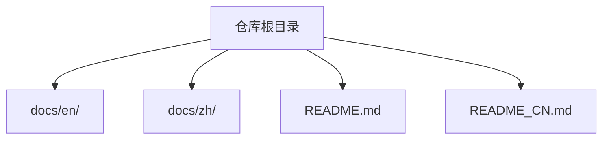
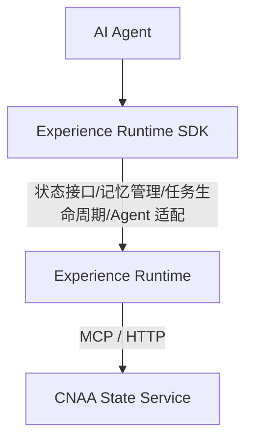
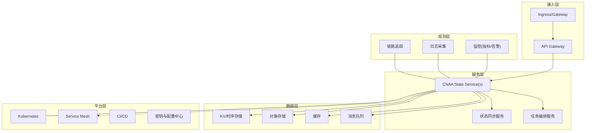
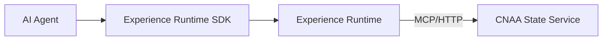

# 部署架构设计

<cite>
**本文引用的文件**   
- [README.md](file://README.md)
- [README_CN.md](file://README_CN.md)
</cite>

## 目录
1. [简介](#简介)
2. [项目结构](#项目结构)
3. [核心组件](#核心组件)
4. [架构总览](#架构总览)
5. [详细组件分析](#详细组件分析)
6. [依赖关系分析](#依赖关系分析)
7. [性能考虑](#性能考虑)
8. [故障排查指南](#故障排查指南)
9. [结论](#结论)
10. [附录](#附录)

## 简介
本文件面向 CNAA（Cloud Native Agentic Architecture）的“云原生部署架构设计”，聚焦以下目标：
- 给出基于 Kubernetes 的容器化与微服务部署方案
- 明确 CNAA State Service 的部署配置要点、存储后端选择与负载均衡策略
- 对比本地部署与云端部署的差异与配置选项
- 设计监控告警、日志收集、备份恢复等运维能力
- 提供扩缩容策略与高可用保障机制
- 给出可落地的编排与配置文件清单（以路径引用为主，不直接粘贴代码内容）

说明：当前仓库为概念与文档索引阶段，尚未包含具体源码与编排文件。本文在严格遵循“仅依据仓库现有信息”的前提下，结合云原生最佳实践，给出可操作的架构设计与落地建议，并在需要时标注“概念性设计”。

章节来源
- [README.md:1-102](file://README.md#L1-L102)
- [README_CN.md:1-110](file://README_CN.md#L1-L110)

## 项目结构
仓库当前结构简洁，主要包含多语言 README 与文档索引目录：
- docs/en/ 与 docs/zh/：英文与中文文档目录（当前为空，后续用于沉淀架构、状态接口、运行时 SDK、State Service、MCP 集成等文档）
- README.md / README_CN.md：项目定位、特性、架构图与文档导航

图表来源
- [README.md:76-86](file://README.md#L76-L86)
- [README_CN.md:84-94](file://README_CN.md#L84-L94)

章节来源
- [README.md:76-86](file://README.md#L76-L86)
- [README_CN.md:84-94](file://README_CN.md#L84-L94)

## 核心组件
根据仓库提供的架构图与描述，CNAA 的核心由三部分构成：
- AI Agent：业务智能体，调用 Experience Runtime 进行经验读写与同步
- Experience Runtime SDK：封装状态接口、记忆管理、任务生命周期与 Agent 适配
- CNAA State Service：对外暴露统一的状态接口，负责持久化与同步

图表来源
- [README.md:55-72](file://README.md#L55-L72)
- [README_CN.md:63-80](file://README_CN.md#L63-L80)

章节来源
- [README.md:55-72](file://README.md#L55-L72)
- [README_CN.md:63-80](file://README_CN.md#L63-L80)

## 架构总览
从云原生视角，推荐采用如下分层与职责划分：
- 接入层：Ingress/Gateway + API Gateway，统一入口、鉴权、限流、灰度
- 服务层：CNAA State Service（无状态或会话外置），按功能拆分为状态读写、事件同步、任务编排等微服务
- 数据层：对象存储/分布式数据库/缓存/消息队列，支撑持久化与高吞吐
- 平台层：Kubernetes 集群、Service Mesh、CI/CD、密钥与配置中心
- 观测层：指标、日志、链路追踪、告警与审计

[本图为概念性架构示意，不直接映射到具体源码文件]

## 详细组件分析

### CNAA State Service 部署与配置
- 部署形态
  - 容器化：镜像构建、健康检查、资源限制、滚动更新
  - 编排：Deployment/StatefulSet（有状态场景）、Service、HPA/VPA、PodDisruptionBudget
  - 网络：ClusterIP/NodePort/LoadBalancer，配合 Ingress/Gateway 暴露
- 配置项（示例维度）
  - 运行参数：端口、并发、超时、重试、熔断、降级
  - 存储后端：对象存储（S3/OSS/COS）、分布式数据库（PostgreSQL/TiDB）、缓存（Redis）、消息队列（Kafka/Pulsar）
  - 安全：TLS 终止、mTLS、RBAC、审计日志
  - 可观测：指标导出、结构化日志、链路上报
- 高可用
  - 多副本+反亲和、跨可用区部署、PDB 保护
  - 读多写少场景下启用只读副本与缓存加速
- 扩缩容
  - HPA 基于 CPU/内存/自定义指标（QPS、延迟、队列深度）
  - VPA 自动调整资源请求/限制
  - 水平分片与一致性哈希路由

章节来源
- [README.md:55-72](file://README.md#L55-L72)
- [README_CN.md:63-80](file://README_CN.md#L63-L80)

### 存储后端选择
- 对象存储：适合大对象与归档，具备高耐久与低成本
- 分布式数据库：强一致事务、复杂查询与聚合
- 缓存：热点数据加速、会话与中间态
- 消息队列：异步解耦、削峰填谷、事件溯源

选型建议
- 读多写少且数据量大：对象存储 + 缓存
- 强一致与事务：分布式数据库
- 高吞吐与事件驱动：消息队列

[本节为通用选型指导，未直接分析具体文件]

### 负载均衡策略
- 四层/七层 LB：TCP/UDP 与 HTTP 协议支持
- 算法：轮询、最少连接、加权、一致性哈希（会话绑定）
- 健康检查：主动探测、失败回退、优雅关闭
- 流量治理：限流、熔断、降级、灰度发布

[本节为通用策略说明，未直接分析具体文件]

### 本地部署 vs 云端部署
- 本地部署
  - 单机或小型集群（Kind/k3s/minikube）
  - 存储使用本地卷或轻量对象存储
  - 简化网络与安全策略，便于调试
- 云端部署
  - 托管 Kubernetes（EKS/AKS/GKE/ACK 等）
  - 使用云厂商对象存储、托管数据库、托管缓存与 MQ
  - 引入企业级安全、合规与审计能力

差异点
- 网络拓扑与访问控制
- 存储与数据库的托管程度
- 弹性伸缩与成本优化策略
- 可观测性与告警体系完备性

章节来源
- [README.md:45-52](file://README.md#L45-L52)
- [README_CN.md:53-60](file://README_CN.md#L53-L60)

### 监控告警、日志收集与备份恢复
- 监控告警
  - 指标：Prometheus + Grafana，定义关键 SLO/SLI
  - 告警：阈值、复合规则、降噪与升级
- 日志收集
  - 结构化日志、集中式采集（Fluent Bit/Vector）、检索与分析（ELK/Loki）
- 链路追踪
  - OpenTelemetry 探针、分布式追踪与采样
- 备份恢复
  - 定期快照、增量备份、演练恢复、RPO/RTO 目标

[本节为通用运维设计，未直接分析具体文件]

### 扩缩容策略与高可用保障
- 扩缩容
  - HPA 基于 QPS、延迟、队列深度等自定义指标
  - VPA 动态调优资源请求/限制
  - 分片与分区：按租户/键空间拆分，降低热点
- 高可用
  - 多副本、跨 AZ、PDB、优雅关闭
  - 幂等写入、重试与补偿、死信队列
  - 故障转移与脑裂防护

[本节为通用策略说明，未直接分析具体文件]

### 编排与配置文件清单（路径引用）
以下为建议的编排与配置清单（占位路径，待仓库补充后替换为真实文件）：
- 容器镜像与基础镜像
  - Dockerfile（应用镜像）
  - Dockerfile（基础镜像）
- Kubernetes 编排
  - deployment.yaml（State Service 部署）
  - service.yaml（内部服务发现）
  - ingress.yaml（外部入口）
  - hpa.yaml（水平扩缩容）
  - pdb.yaml（中断预算）
  - configmap.yaml（运行配置）
  - secret.yaml（密钥与证书）
  - storageclass.yaml 与 pvc.yaml（持久化存储）
- 可观测性
  - prometheus-servicemonitor.yaml
  - fluent-bit-daemonset.yaml
  - otel-collector-config.yaml
- CI/CD
  - .github/workflows/ci.yml 或 GitLab CI 配置
  - helm-values.yaml（Helm Chart 值）

[本节为清单指引，未直接分析具体文件]

## 依赖关系分析
从仓库提供的架构图可知，Experience Runtime 通过 MCP/HTTP 与 CNAA State Service 交互；State Service 作为独立运行时资源，承载持久化与同步。

图表来源
- [README.md:55-72](file://README.md#L55-L72)
- [README_CN.md:63-80](file://README_CN.md#L63-L80)

章节来源
- [README.md:55-72](file://README.md#L55-L72)
- [README_CN.md:63-80](file://README_CN.md#L63-L80)

## 性能考虑
- 连接池与线程模型：合理设置 I/O 并发与线程池大小
- 缓存与预取：热点数据缓存、批量读取与合并
- 序列化与压缩：高效编解码与传输压缩
- 存储优化：分片、索引、冷热分层、归档
- 网络优化：KeepAlive、连接复用、就近路由

[本节为通用性能建议，未直接分析具体文件]

## 故障排查指南
- 常见问题定位
  - 启动失败：检查健康端点、环境变量与密钥挂载
  - 连接异常：核对网络策略、DNS、证书与 TLS 配置
  - 性能退化：观察指标（CPU/内存/IO/网络）、慢查询与锁竞争
  - 数据不一致：核对幂等性、重试与补偿逻辑
- 工具与流程
  - 日志聚合与检索、指标看板、链路追踪
  - 压测与混沌工程演练

[本节为通用排障建议，未直接分析具体文件]

## 结论
CNAA 定位为“面向 AI Agent 的持久化经验运行时框架”，其云原生部署应围绕“无状态服务 + 可靠数据层 + 完善观测与自动化”展开。通过合理的存储选型、负载均衡、扩缩容与高可用设计，可在本地与云端环境稳定交付。随着仓库中 docs 与源码逐步完善，可将本文中的占位配置与流程图替换为真实实现。

[本节为总结性内容，未直接分析具体文件]

## 附录
- 术语
  - CNAA：Cloud Native Agentic Architecture
  - State Service：状态服务，提供统一的经验状态接口
  - Experience Runtime：经验运行时，封装状态接口、记忆管理与任务生命周期
- 参考文档导航（仓库内链接）
  - 快速开始、持久化记忆、状态接口、运行时 SDK、State Service、MCP 集成、Agent 集成、整体架构

章节来源
- [README.md:76-86](file://README.md#L76-L86)
- [README_CN.md:84-94](file://README_CN.md#L84-L94)