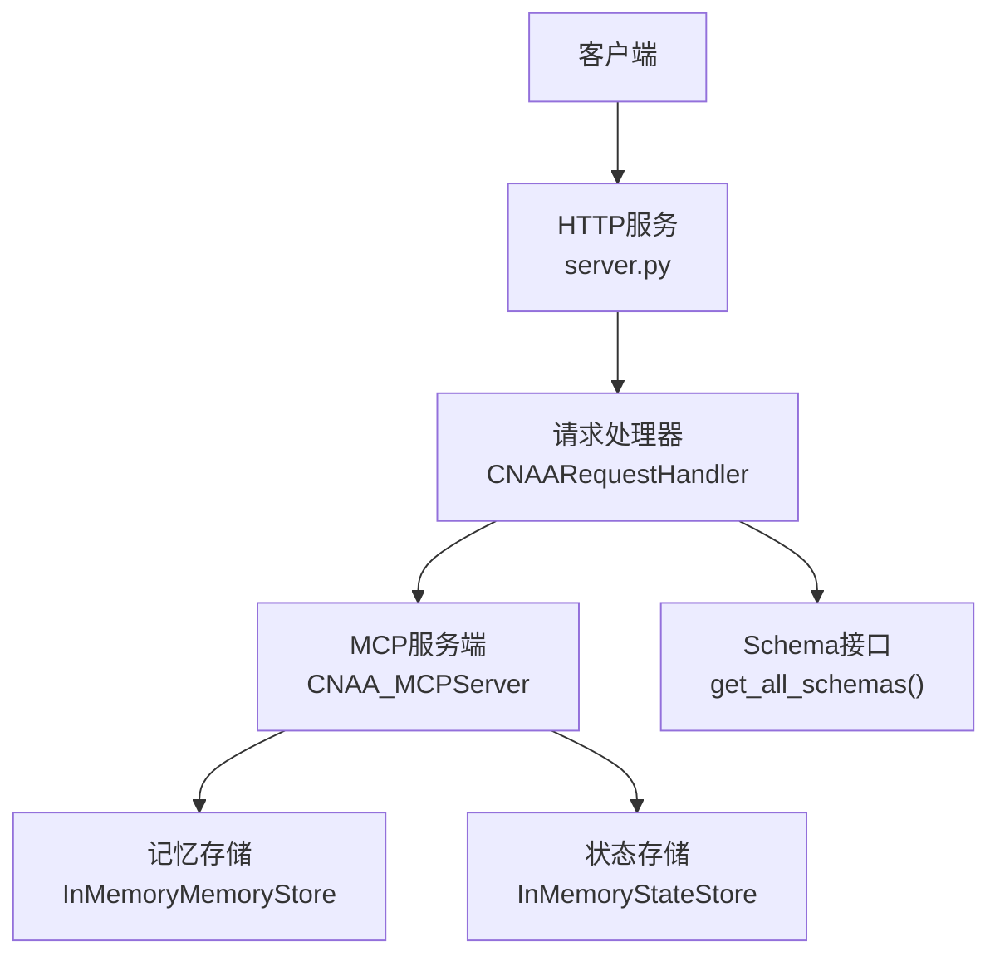
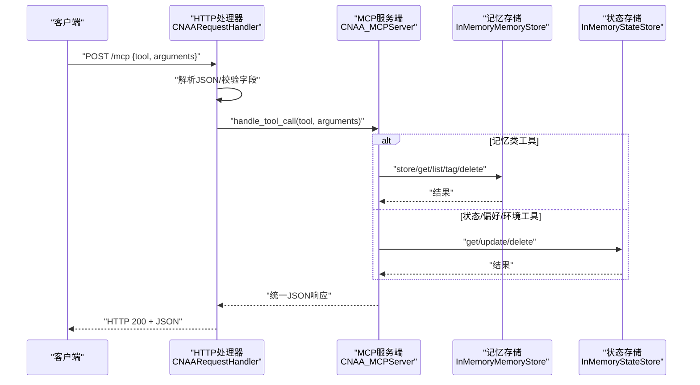
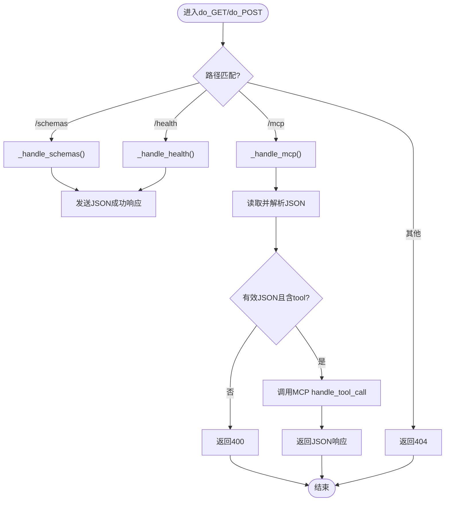
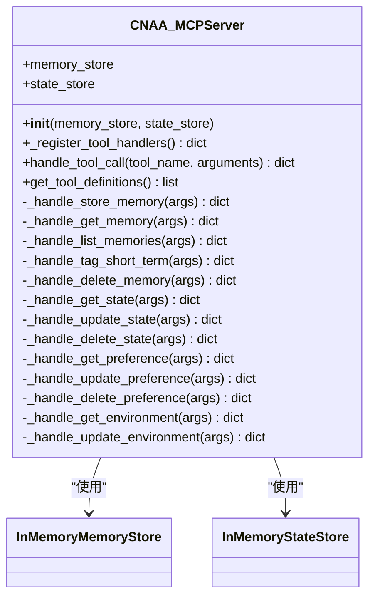
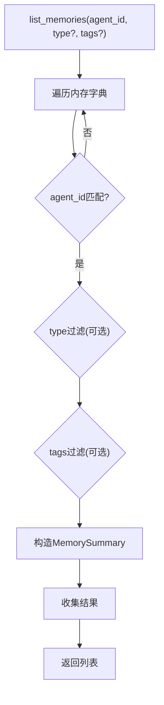
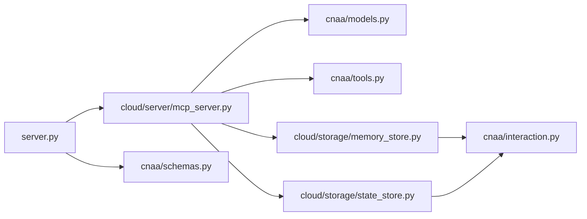

# HTTP服务入口

<cite>
**本文引用的文件**   
- [server.py](file://server.py)
- [cloud/server/mcp_server.py](file://cloud/server/mcp_server.py)
- [cnaa/schemas.py](file://cnaa/schemas.py)
- [cnaa/tools.py](file://cnaa/tools.py)
- [cloud/storage/memory_store.py](file://cloud/storage/memory_store.py)
- [cloud/storage/state_store.py](file://cloud/storage/state_store.py)
- [cnaa/models.py](file://cnaa/models.py)
- [cnaa/interaction.py](file://cnaa/interaction.py)
- [pyproject.toml](file://pyproject.toml)
</cite>

## 更新摘要
**所做更改**   
- 更新了CNAARequestHandler类的详细文档说明
- 增强了_handle_mcp方法的JSON请求体解析和错误处理描述
- 完善了HTTP端点（/schemas、/mcp、/health）的文档说明
- 改进了错误响应格式和状态码处理的描述
- 添加了完整的实现细节和TODO扩展点说明

## 目录
1. [简介](#简介)
2. [项目结构](#项目结构)
3. [核心组件](#核心组件)
4. [架构总览](#架构总览)
5. [详细组件分析](#详细组件分析)
6. [依赖关系分析](#依赖关系分析)
7. [性能考量](#性能考量)
8. [故障排查指南](#故障排查指南)
9. [结论](#结论)

## 简介
本文件聚焦于CNAA项目的HTTP服务入口，说明其如何以标准库HTTP服务器暴露MCP工具调用、接口Schema查询与健康检查能力。该入口采用"JSON入、JSON出"的哑服务原则，将HTTP请求路由到MCP服务端，再由MCP服务端调度存储后端完成记忆与状态管理。

**更新** server.py文件现已包含全面的类级文档和方法级文档，详细说明了HTTP端点的功能、实现细节和扩展点。

## 项目结构
- 入口脚本：server.py 提供HTTP服务启动、请求处理与路由。
- MCP服务端：cloud/server/mcp_server.py 实现工具注册、参数校验与存储后端调用。
- 存储后端：cloud/storage/memory_store.py 与 cloud/storage/state_store.py 提供内存实现的CRUD。
- 接口契约：cnaa/schemas.py 定义所有请求/响应/数据Schema；cnaa/tools.py 集中定义MCP工具名与描述。
- 数据模型：cnaa/models.py 定义Memory/State/Preference/Environment等核心数据结构。
- 交互接口：cnaa/interaction.py 抽象MemoryInterface与StateInterface，约束云/本地实现。
- 依赖声明：pyproject.toml 声明Python版本与运行时依赖。

图表来源
- [server.py:61-175](file://server.py#L61-L175)
- [cloud/server/mcp_server.py:52-131](file://cloud/server/mcp_server.py#L52-L131)
- [cloud/storage/memory_store.py:19-156](file://cloud/storage/memory_store.py#L19-L156)
- [cloud/storage/state_store.py:13-176](file://cloud/storage/state_store.py#L13-L176)
- [cnaa/schemas.py:388-425](file://cnaa/schemas.py#L388-L425)

章节来源
- [server.py:1-229](file://server.py#L1-L229)
- [cloud/server/mcp_server.py:1-355](file://cloud/server/mcp_server.py#L1-L355)
- [cnaa/schemas.py:1-479](file://cnaa/schemas.py#L1-L479)
- [cnaa/tools.py:1-210](file://cnaa/tools.py#L1-L210)
- [cloud/storage/memory_store.py:1-156](file://cloud/storage/memory_store.py#L1-L156)
- [cloud/storage/state_store.py:1-176](file://cloud/storage/state_store.py#L1-L176)
- [cnaa/models.py:1-225](file://cnaa/models.py#L1-L225)
- [cnaa/interaction.py:1-255](file://cnaa/interaction.py#L1-L255)
- [pyproject.toml:1-33](file://pyproject.toml#L1-L33)

## 核心组件
- HTTP入口与路由
  - 使用标准库HTTPServer与自定义BaseHTTPRequestHandler子类处理请求。
  - 支持GET /schemas（返回全部接口Schema）、GET /health（健康检查）、POST /mcp（MCP工具调用）。
- CNAARequestHandler类
  - **新增** 完整的类级文档说明，包含端点列表、实现细节和扩展点。
  - 路径分发：do_GET/do_POST方法根据路径路由到相应的处理方法。
  - JSON处理：统一的请求体解析和响应序列化。
  - 错误处理：完善的异常捕获和状态码返回。
- MCP服务端
  - 集中注册并分发13个MCP工具，分别覆盖记忆、状态、偏好与环境操作。
  - 通过handle_tool_call进行统一路由与异常封装。
- 存储后端
  - InMemoryMemoryStore：基于字典的内存存储，支持按agent_id过滤、标签与类型筛选。
  - InMemoryStateStore：基于字典的内存存储，支持state/preference/environment三类数据的CRUD。
- Schema与工具定义
  - cnaa/schemas.py：集中维护所有请求/响应/数据Schema，供客户端动态发现。
  - cnaa/tools.py：集中定义工具名称、描述与输入Schema引用。

**更新** CNAARequestHandler类现在包含详细的文档注释，明确说明了三个HTTP端点的功能和实现方式。

章节来源
- [server.py:61-175](file://server.py#L61-L175)
- [cloud/server/mcp_server.py:73-131](file://cloud/server/mcp_server.py#L73-L131)
- [cloud/storage/memory_store.py:19-156](file://cloud/storage/memory_store.py#L19-L156)
- [cloud/storage/state_store.py:13-176](file://cloud/storage/state_store.py#L13-L176)
- [cnaa/schemas.py:388-425](file://cnaa/schemas.py#L388-L425)
- [cnaa/tools.py:57-171](file://cnaa/tools.py#L57-L171)

## 架构总览
下图展示从HTTP请求到存储后端的完整调用链，体现"HTTP入口 → 请求处理器 → MCP服务端 → 存储后端"的分层设计。

图表来源
- [server.py:111-148](file://server.py#L111-L148)
- [cloud/server/mcp_server.py:100-136](file://cloud/server/mcp_server.py#L100-L136)
- [cloud/storage/memory_store.py:30-143](file://cloud/storage/memory_store.py#L30-L143)
- [cloud/storage/state_store.py:41-145](file://cloud/storage/state_store.py#L41-L145)

## 详细组件分析

### HTTP请求处理器 CNAARequestHandler
- 职责
  - 路由：根据路径分发到不同处理方法。
  - 协议：统一JSON编解码与错误封装。
  - 日志：重写log_message输出结构化日志。
- 关键方法
  - do_GET/do_POST：路由到_handle_schemas/_handle_health/_handle_mcp。
  - _send_json/_send_error：统一响应格式。
  - log_message：接入logging模块。
- 错误处理
  - JSON解析失败返回400。
  - 未知路径返回404。
  - 其他异常捕获并返回500。

**更新** _handle_mcp方法现在包含详细的文档注释，说明了JSON请求体解析、MCP工具提取和错误响应格式的完整流程。

图表来源
- [server.py:86-148](file://server.py#L86-L148)

章节来源
- [server.py:61-175](file://server.py#L61-L175)

### MCP服务端 CNAA_MCPServer
- 职责
  - 工具注册：将工具名映射到具体处理方法。
  - 路由分发：handle_tool_call根据工具名选择处理器。
  - 存储解耦：通过MemoryInterface与StateInterface对接存储后端。
- 工具分类
  - 记忆：cnaa_store_memory、cnaa_get_memory、cnaa_list_memories、cnaa_tag_short_term、cnaa_delete_memory。
  - 状态：cnaa_get_state、cnaa_update_state、cnaa_delete_state。
  - 偏好：cnaa_get_preference、cnaa_update_preference、cnaa_delete_preference。
  - 环境：cnaa_get_environment、cnaa_update_environment。
- 错误处理
  - 未知工具返回错误信息。
  - 处理器异常统一捕获并返回错误消息。

图表来源
- [cloud/server/mcp_server.py:52-131](file://cloud/server/mcp_server.py#L52-L131)
- [cloud/storage/memory_store.py:19-156](file://cloud/storage/memory_store.py#L19-L156)
- [cloud/storage/state_store.py:13-176](file://cloud/storage/state_store.py#L13-L176)

章节来源
- [cloud/server/mcp_server.py:73-131](file://cloud/server/mcp_server.py#L73-L131)
- [cloud/server/mcp_server.py:132-355](file://cloud/server/mcp_server.py#L132-L355)

### 存储后端
- InMemoryMemoryStore
  - 数据结构：dict[(agent_id, memory_id), Memory]。
  - 列表查询：线性扫描，支持type与tags过滤，时间复杂度O(n)。
  - 扩展点：索引优化、分页、排序等。
- InMemoryStateStore
  - 数据结构：三个独立字典分别存储State/Preference/Environment。
  - 查询：按agent_id过滤返回列表或单个对象。
  - 更新：按(agent_id, id)键写入或覆盖。

图表来源
- [cloud/storage/memory_store.py:59-111](file://cloud/storage/memory_store.py#L59-L111)

章节来源
- [cloud/storage/memory_store.py:19-156](file://cloud/storage/memory_store.py#L19-L156)
- [cloud/storage/state_store.py:13-176](file://cloud/storage/state_store.py#L13-L176)

### Schema与工具定义
- cnaa/schemas.py
  - 集中定义数据Schema、请求Schema与响应Schema。
  - get_all_schemas() 返回全量Schema，供GET /schemas端点使用。
- cnaa/tools.py
  - 集中定义13个工具的名称、描述与输入Schema引用。
  - get_tool_definitions() 供MCP服务端获取工具元数据。

章节来源
- [cnaa/schemas.py:388-425](file://cnaa/schemas.py#L388-L425)
- [cnaa/tools.py:57-171](file://cnaa/tools.py#L57-L171)

### 数据模型与交互接口
- cnaa/models.py
  - 定义Memory、TaskCheckpoint、State、Preference、Environment、InstantMemory、MemorySummary、SearchResult等核心数据结构。
- cnaa/interaction.py
  - 定义MemoryInterface与StateInterface，约束云/本地实现必须遵循的契约。

章节来源
- [cnaa/models.py:1-225](file://cnaa/models.py#L1-L225)
- [cnaa/interaction.py:1-255](file://cnaa/interaction.py#L1-L255)

## 依赖关系分析
- 入口依赖
  - server.py 依赖 cloud.server.mcp_server.CNAA_MCPServer 与 cnaa.schemas.get_all_schemas。
- MCP服务端依赖
  - cnaa.models.* 用于构建与序列化实体。
  - cnaa.tools.* 用于工具名与定义。
  - cloud.storage.memory_store.InMemoryMemoryStore 与 cloud.storage.state_store.InMemoryStateStore 作为默认存储后端。
- 存储后端依赖
  - cnaa.models.* 与 cnaa.interaction.* 接口约束。

图表来源
- [server.py:50-51](file://server.py#L50-L51)
- [cloud/server/mcp_server.py:22-47](file://cloud/server/mcp_server.py#L22-L47)
- [cloud/storage/memory_store.py:15-16](file://cloud/storage/memory_store.py#L15-L16)
- [cloud/storage/state_store.py:9-10](file://cloud/storage/state_store.py#L9-L10)

章节来源
- [server.py:50-51](file://server.py#L50-L51)
- [cloud/server/mcp_server.py:22-47](file://cloud/server/mcp_server.py#L22-L47)
- [cloud/storage/memory_store.py:15-16](file://cloud/storage/memory_store.py#L15-L16)
- [cloud/storage/state_store.py:9-10](file://cloud/storage/state_store.py#L9-L10)

## 性能考量
- HTTP层
  - 使用标准库HTTPServer，适合轻量部署与开发测试；生产场景可考虑异步框架或反向代理缓存。
- 路由与解析
  - JSON解析与字段校验在处理器中完成，开销较小；建议对高频路径增加限流与超时控制。
- 存储后端
  - 当前为内存实现，查询为线性扫描，时间复杂度O(n)，适用于小规模数据；生产应替换为持久化存储并引入索引与分页。
- 可扩展性
  - 通过MemoryInterface与StateInterface可无缝替换存储实现，便于水平扩展与多后端切换。

**更新** server.py文件包含了详细的TODO注释，指出了生产环境的改进方向，包括认证、CORS、请求日志中间件等。

[本节为通用指导，不直接分析具体文件]

## 故障排查指南
- 常见问题
  - 404 Not Found：请求路径非/schemas、/health、/mcp之一。
  - 400 Bad Request：POST /mcp的JSON无效或缺少tool字段。
  - 500 Internal Server Error：工具处理器抛出未捕获异常。
- 定位步骤
  - 查看日志输出（已启用logging），确认请求路径与参数。
  - 检查MCP工具名是否在工具定义中。
  - 验证存储后端是否可用（内存实现无持久化，重启后数据丢失）。
- 恢复建议
  - 修正请求体结构与字段命名。
  - 确保工具名与cnaa/tools.py一致。
  - 生产环境替换为持久化存储并添加重试与降级策略。

**更新** 错误处理现在更加完善，包括JSON解析错误的专门处理和详细的异常日志记录。

章节来源
- [server.py:111-148](file://server.py#L111-L148)
- [cloud/server/mcp_server.py:100-136](file://cloud/server/mcp_server.py#L100-L136)

## 结论
HTTP服务入口以简洁清晰的分层设计实现了MCP工具的标准化访问：HTTP层负责路由与协议转换，MCP层负责工具分发与业务编排，存储层提供可插拔的数据持久化。通过集中化的Schema与工具定义，系统具备良好的可发现性与扩展性。

**更新** server.py文件现在包含全面的文档注释和改进的错误处理机制，为后续开发和生产部署提供了清晰的指导。后续可在生产环境中替换存储后端、增强并发与监控能力，以满足更高负载与稳定性要求。