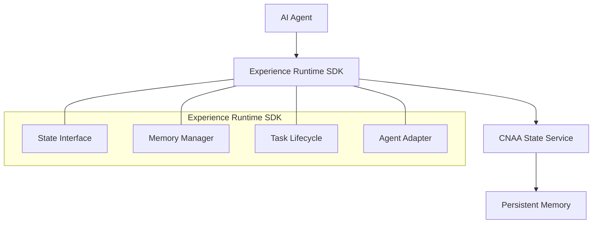
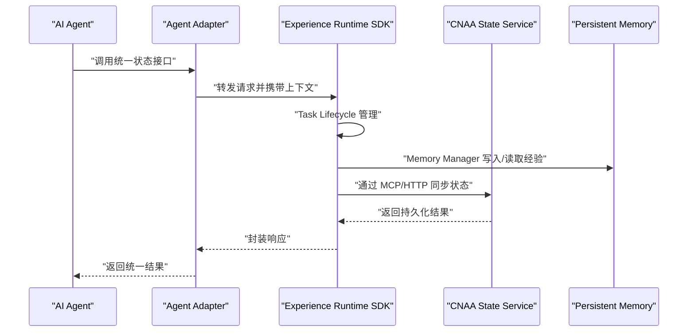
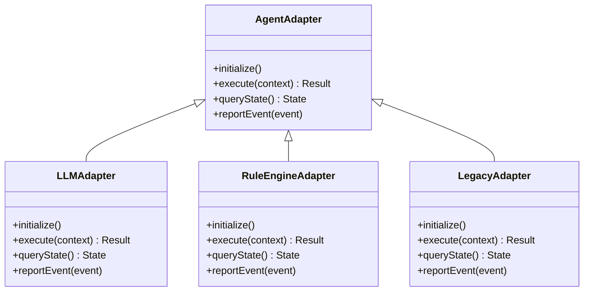
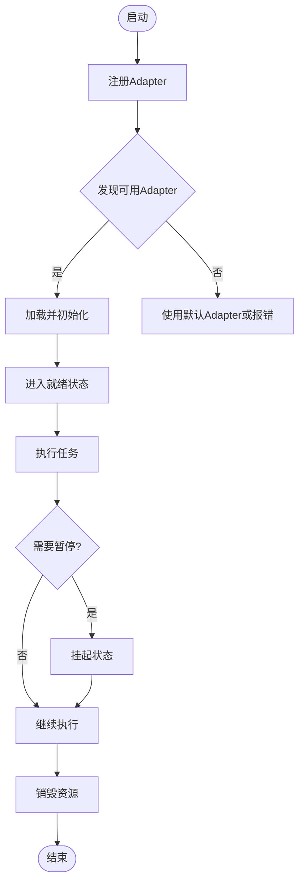
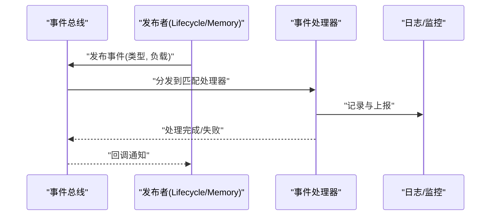
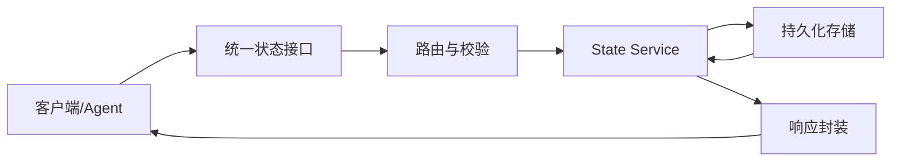
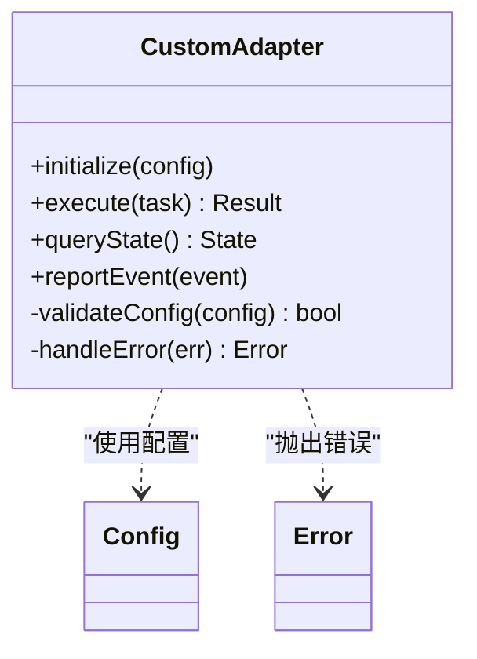
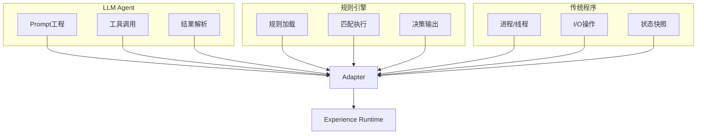
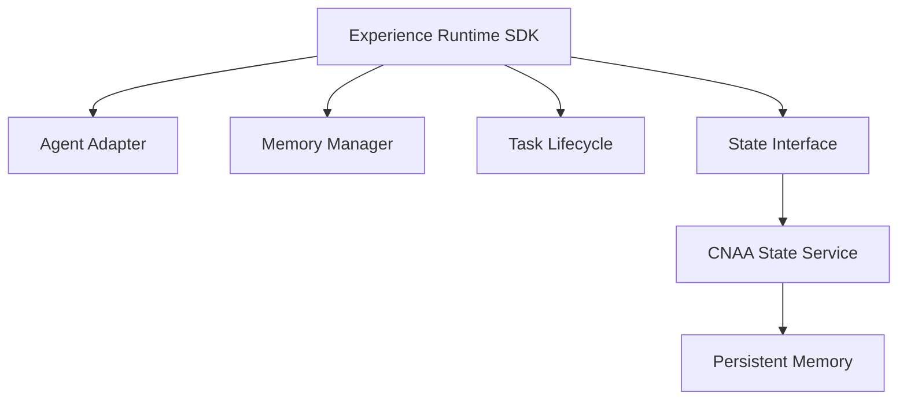

# Agent-Agnostic Design（Agent无关设计）

<cite>
**本文档引用的文件**   
- [README.md](file://README.md)
- [README_CN.md](file://README_CN.md)
</cite>

## 目录
1. [简介](#简介)
2. [项目结构](#项目结构)
3. [核心组件](#核心组件)
4. [架构总览](#架构总览)
5. [详细组件分析](#详细组件分析)
6. [依赖关系分析](#依赖关系分析)
7. [性能与资源管理](#性能与资源管理)
8. [故障排查指南](#故障排查指南)
9. [结论](#结论)
10. [附录：扩展点与最佳实践](#附录扩展点与最佳实践)

## 简介
本架构文档围绕“Agent-Agnostic Design（Agent无关设计）”展开，目标是阐述如何通过插件化架构与适配器模式，将多种不同来源的AI Agent（如LLM Agent、规则引擎、传统程序等）统一接入到一个轻量级的经验运行时框架中，实现跨Agent的经验沉淀、状态同步与持久化记忆。该设计强调：
- 不侵入Agent内部推理逻辑
- 通过统一的状态接口与消息协议进行交互
- 以插件化方式注册、发现与管理Agent生命周期
- 提供可扩展的事件监听与处理机制
- 支持云端/本地部署与多Agent经验共享

上述目标与能力来源于项目README中对Experience Runtime与Persistent Experience Memory的定位与特性说明。

**章节来源**
- [README.md:1-102](file://README.md#L1-L102)
- [README_CN.md:1-110](file://README_CN.md#L1-L110)

## 项目结构
从README可知，整体架构由三层组成：
- AI Agent层：各类具体Agent的实现（LLM、规则引擎、传统程序等）
- Experience Runtime SDK层：包含State Interface、Memory Manager、Task Lifecycle、Agent Adapter等核心模块
- CNAA State Service层：提供持久化状态服务，通过MCP/HTTP与SDK通信

**图表来源**
- [README.md:55-72](file://README.md#L55-L72)
- [README_CN.md:63-80](file://README_CN.md#L63-L80)

**章节来源**
- [README.md:55-72](file://README.md#L55-L72)
- [README_CN.md:63-80](file://README_CN.md#L63-L80)

## 核心组件
根据README中的架构描述，Experience Runtime SDK包含以下关键组件：
- State Interface（状态接口）：为所有Agent提供统一的状态读写与同步语义
- Memory Manager（记忆管理）：负责经验的采集、存储、检索与复用
- Task Lifecycle（任务生命周期）：定义任务的启动、执行、挂起、恢复与结束流程
- Agent Adapter（Agent适配）：通过适配器模式屏蔽不同Agent的差异，使其可被统一接入

这些组件共同构成“无侵入式”的Agent集成方案，使任何Agent在不修改自身推理逻辑的前提下，获得持续记忆与状态同步能力。

**章节来源**
- [README.md:55-72](file://README.md#L55-L72)
- [README_CN.md:63-80](file://README_CN.md#L63-L80)

## 架构总览
下图展示了从Agent到持久化记忆的端到端数据流与控制流，包括事件监听、状态同步与消息传递的关键路径。

**图表来源**
- [README.md:55-72](file://README.md#L55-L72)
- [README_CN.md:63-80](file://README_CN.md#L63-L80)

**章节来源**
- [README.md:55-72](file://README.md#L55-L72)
- [README_CN.md:63-80](file://README_CN.md#L63-L80)

## 详细组件分析

### 适配器模式与插件化架构
- 设计理念：通过统一的Agent Adapter抽象，屏蔽不同Agent在输入输出、状态模型、通信协议上的差异，使上层SDK无需关心具体实现细节
- 插件化机制：Adapter作为插件单元，支持动态注册与发现；SDK在启动时扫描可用Adapter，按需加载
- 扩展点识别：Adapter需实现标准接口（如初始化、执行、状态查询、事件上报），以便被框架自动识别与编排

**图表来源**
- [README.md:55-72](file://README.md#L55-L72)
- [README_CN.md:63-80](file://README_CN.md#L63-L80)

**章节来源**
- [README.md:55-72](file://README.md#L55-L72)
- [README_CN.md:63-80](file://README_CN.md#L63-L80)

### Agent生命周期管理与注册/发现机制
- 生命周期阶段：初始化、就绪、运行、暂停、恢复、销毁
- 注册机制：Adapter在启动时向Registry注册自身元数据（类型、版本、能力标签）
- 发现机制：SDK通过Registry按能力或标签筛选并加载对应Adapter
- 状态同步：每个阶段的变更通过事件总线广播，供其他组件订阅

**图表来源**
- [README.md:55-72](file://README.md#L55-L72)
- [README_CN.md:63-80](file://README_CN.md#L63-L80)

**章节来源**
- [README.md:55-72](file://README.md#L55-L72)
- [README_CN.md:63-80](file://README_CN.md#L63-L80)

### 事件监听与处理机制
- 事件源：Task Lifecycle、Memory Manager、Adapter状态变更
- 事件总线：基于发布-订阅模型，支持异步处理与重试
- 监听器：可插拔的事件处理器，用于日志、监控、审计、副作用触发
- 消息协议：定义事件结构（类型、时间戳、负载、追踪ID），确保跨组件一致性

**图表来源**
- [README.md:55-72](file://README.md#L55-L72)
- [README_CN.md:63-80](file://README_CN.md#L63-L80)

**章节来源**
- [README.md:55-72](file://README.md#L55-L72)
- [README_CN.md:63-80](file://README_CN.md#L63-L80)

### 消息传递协议设计
- 统一状态接口：所有Agent通过State Interface进行状态读写，避免直接访问底层存储
- 消息格式：采用结构化消息体，包含操作类型、目标实体、参数、上下文与追踪信息
- 传输协议：通过MCP或HTTP与State Service通信，支持RESTful或RPC风格
- 幂等性：关键操作需支持幂等，防止重复执行导致状态不一致

**图表来源**
- [README.md:55-72](file://README.md#L55-L72)
- [README_CN.md:63-80](file://README_CN.md#L63-L80)

**章节来源**
- [README.md:55-72](file://README.md#L55-L72)
- [README_CN.md:63-80](file://README_CN.md#L63-L80)

### 自定义Agent适配器开发指南
- 接口规范：实现标准Adapter接口（初始化、执行、状态查询、事件上报）
- 配置项：定义连接参数、超时、重试策略、缓存开关等
- 错误处理：捕获并转换异常为统一错误码，便于上层处理
- 测试建议：提供Mock Adapter用于单元测试与集成测试

**图表来源**
- [README.md:55-72](file://README.md#L55-L72)
- [README_CN.md:63-80](file://README_CN.md#L63-L80)

**章节来源**
- [README.md:55-72](file://README.md#L55-L72)
- [README_CN.md:63-80](file://README_CN.md#L63-L80)

### 不同Agent类型的集成示例
- LLM Agent：通过HTTP调用大模型API，将对话历史与工具调用结果作为经验写入Memory
- 规则引擎：将规则匹配过程与决策依据序列化后存入持久化存储，支持后续回溯
- 传统程序：通过命令行或库调用封装，捕获输入输出与中间状态，转化为标准事件

**图表来源**
- [README.md:55-72](file://README.md#L55-L72)
- [README_CN.md:63-80](file://README_CN.md#L63-L80)

**章节来源**
- [README.md:55-72](file://README.md#L55-L72)
- [README_CN.md:63-80](file://README_CN.md#L63-L80)

## 依赖关系分析
- 松耦合：Adapter与Runtime之间通过接口解耦，便于替换与升级
- 内聚性：Memory Manager与State Service职责清晰，专注状态与经验管理
- 外部依赖：MCP/HTTP用于与State Service通信，需考虑网络稳定性与重试策略

**图表来源**
- [README.md:55-72](file://README.md#L55-L72)
- [README_CN.md:63-80](file://README_CN.md#L63-L80)

**章节来源**
- [README.md:55-72](file://README.md#L55-L72)
- [README_CN.md:63-80](file://README_CN.md#L63-L80)

## 性能与资源管理
- 缓存策略：对频繁读取的经验数据进行本地缓存，减少远程调用开销
- 批处理：批量写入经验与状态更新，降低网络与存储压力
- 异步处理：事件处理与状态同步采用异步队列，避免阻塞主流程
- 资源限制：为每个Adapter设置最大并发数、内存上限与超时阈值
- 监控指标：暴露QPS、延迟、错误率、缓存命中率等关键指标

[本节为通用指导，不直接分析具体文件]

## 故障排查指南
- 常见问题：
  - Adapter初始化失败：检查配置项与依赖服务可用性
  - 状态同步超时：确认网络连通性与State Service健康状态
  - 事件丢失：验证事件总线是否正常运行，检查消费者消费能力
- 诊断手段：
  - 启用详细日志，记录关键路径的输入输出
  - 使用追踪ID贯穿整个调用链，便于定位问题
  - 定期巡检Adapter注册表与事件队列长度

[本节为通用指导，不直接分析具体文件]

## 结论
本架构通过Agent无关设计与插件化适配器模式，实现了多类型Agent的统一接入与经验持久化。其核心价值在于：
- 不侵入Agent内部逻辑，降低集成成本
- 提供统一状态接口与事件机制，增强系统可观测性与可控性
- 支持灵活扩展与高可用部署，适应多样化业务场景

未来可进一步探索多Agent经验共享、智能路由与自适应学习等高级能力。

[本节为总结性内容，不直接分析具体文件]

## 附录：扩展点与最佳实践
- 扩展点识别：
  - Adapter接口：标准化Agent接入点
  - 事件总线：扩展新的事件处理器
  - 状态接口：扩展新的状态操作或聚合视图
- 最佳实践：
  - 保持Adapter轻量，复杂逻辑下沉至Service层
  - 使用配置中心管理动态参数，支持热更新
  - 实施灰度发布与A/B测试，逐步扩大影响范围
  - 建立完善的测试套件，覆盖单元测试、集成测试与混沌工程

[本节为通用指导，不直接分析具体文件]